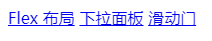
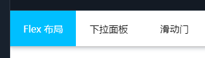

CSS 实例系列 - 01 - Tab 滑动门
===

> Create by **jsliang** on **2023-01-12 22:13:03**  
> Recently revised in **2023-01-12 22:34:01**

Hello 小伙伴们早上、中午、下午、晚上和深夜好，这里是 **jsliang**~

本 CSS 系列文章：

1. **主推学以致用**。结合面试题和工作实例，让小伙伴们深入体验 61 个工作常见的 CSS 属性和各种 CSS 知识。
2. **主推纯 CSS**。尽可能使用 HTML + CSS 完成学习目的，但仍然有 “一小部分” 功能需要用到 JavaScript 知识，**适合新人学习 + 大佬复习**。

如果文章在一些细节上没写清楚或者误导读者，欢迎评论/吐槽/批判，**你的点赞、收藏和关注是我更新的动力 ❤**

* 更多知识分享文章可见：[jsliang 的文档库](https://github.com/LiangJunrong/document-library)
* 本系列知识点代码可见：[Demo —— all for one](https://github.com/LiangJunrong/all-for-one/tree/master/038-CSS%20系列)

## 一 前言

**本篇文章目的**：

* [x] 通过 HTML + CSS，以及简单 JS，实现 Tab 滑动门


线上代码地址：

https://code.juejin.cn/pen/7187769814675357700

**再次强烈推荐**：

代码是用来敲的，不是观摩的，哪怕我代码结构非常清晰，注释写得天花乱坠，只要你不动键盘，这些知识你都不能彻底掌握！

## 二 实现步骤

在 `code` 文件夹中，新建 `tab` 文件夹。

> code 文件夹

```diff
+ tab            —— 案例：Tab 滑动门
+  index.js
+  index.html
+  index.css
index.html       —— 导航页
```

### 2.1 代码主体讲解

> code/tab/index.html

```html
<div class="tab">
  <a class="tab-item active" href="#">Flex 布局</a>
  <a class="tab-item" href="#">下拉面板</a>
  <a class="tab-item" href="#">滑动门</a>
  <!-- 滑动门 -->
  <div class="tab-active"></div>
</div>
```

HTML 结构如上，它渲染如下。



因为是第一个实例，咱们主要讲讲这个 Tab 滑动门咋耍起来的吧：

**首先** 通过一个 `div` 包裹各个 Tab 项，**然后** 使用 Flex 布局，做出横向的 Tab 或者纵向的 Tab，**最重要的是**，我们利用 `tab-active` 来做滑动门的要素。

在 `tab-active` 上，我们使用了 `absolute` + `left` 进行定位，以区分不同选项的位置，并通过 `transition` 制造动画效果，让活跃态（背景色）的切换，看起来像是划过去的。

So~

下面加上 CSS：

> code/tab/index.css

```css
/* 公共样式 */
html, body {
  margin: 0;
  padding: 0;
}
a {
  text-decoration: none;
  color: #000;
}

/* 滑动门 */
.tab {
  position: relative;
  display: flex;
  justify-content: flex-start;
  align-items: center;
  width: 100vw;
  height: 60px;
  border-bottom: 2px solid #ccc;
  box-shadow: 0px 2px 6px 0px rgba(9, 23, 49, 0.21);
}
.tab-item {
  z-index: 2;
  display: flex;
  justify-content: center;
  align-items: center;
  height: 100%;
  width: 90px;
  padding: 0 10px;
}

/* 活跃样式 - 鼠标 hover 到指定 Item 后，需要添加 .active 来切换活跃项 */
.active {
  color: #FFFFFF;
  transition: color .4s; /* 针对 color 来实现动画 */
}

/* 滑动门 - 鼠标 hover 到 .active 对应的元素后，滑动门也需要跟着切换位置 */
.tab-active {
  z-index: 1;
  position: absolute;
  bottom: 0;
  width: 110px;
  height: 100%;
  display: inline-block;
  background: deepskyblue;
  transition: left .4s; /* 针对 left 变动来实现动画 */
}
```



最后，再来 “亿点点” JavaScript：

> code/tab/index.js

```js
window.onload = () => {
  /**
   * @name 移动切换活跃态
   * 1、获取所有元素
   * 2、移除上一个元素的 active class
   * 3、添加当前 hover 元素的 active class
   * 4、切换滑动门的 left 位置
  */
  // 上一个元素索引
  let activeTabIndex = 0;
  // 所有目录项
  const tabItems = document.querySelectorAll('.tab-item');
  // 滑动门
  const tabActive = document.querySelector('.tab-active');
  tabItems.forEach((item, index) => {
    item.onmouseover = (e) => {
      tabItems[activeTabIndex].classList.remove('active');
      e.target.classList.add('active');
      // 切换活跃元素索引
      activeTabIndex = index;
      // 切换 left 以作滑动门
      tabActive.style.left = `${index * 110}px`;
    };
  });
};
```

这样，我们就完成了 Tab 滑动门的实现，详细代码可以前往仓库进行查看。


## 三 小结

小伙伴们看下来有没觉得 “过于简单”，所以这 2 天也是在纠结这样发出来好不好。

但是没关系，哪怕这篇文章砸了也没关系，毕竟，我会出手~

后面的例子会逐渐难起来，并且趋于 “不好讲解” 程度，因为过于 “细节” 了！

冲吧 2023~


## 四 参考文献

* [CSDN - sunly_ - css：transition tab切换 动态滑动效果](https://blog.csdn.net/qq_40745143/article/details/123348361)

---

**不折腾的前端，和咸鱼有什么区别！**

觉得文章不错的小伙伴欢迎点赞/点 Star。

如果小伙伴需要联系 **jsliang**：

* [Github](https://github.com/LiangJunrong/document-library)
* [掘金](https://juejin.im/user/3403743728515246)

个人联系方式存放在 Github 首页，欢迎一起折腾~

争取打造自己成为一个充满探索欲，喜欢折腾，乐于扩展自己知识面的终身学习斜杠程序员。

> jsliang 的文档库由 [梁峻荣](https://github.com/LiangJunrong) 采用 [知识共享 署名-非商业性使用-相同方式共享 4.0 国际 许可协议](http://creativecommons.org/licenses/by-nc-sa/4.0/) 进行许可。<br/>基于 [https://github.com/LiangJunrong/document-library](https://github.com/LiangJunrong/document-library) 上的作品创作。<br/>本许可协议授权之外的使用权限可以从 [https://creativecommons.org/licenses/by-nc-sa/2.5/cn/](https://creativecommons.org/licenses/by-nc-sa/2.5/cn/) 处获得。
