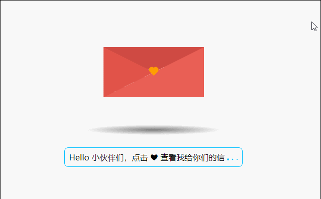
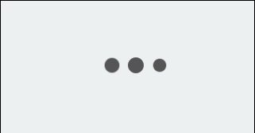
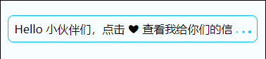
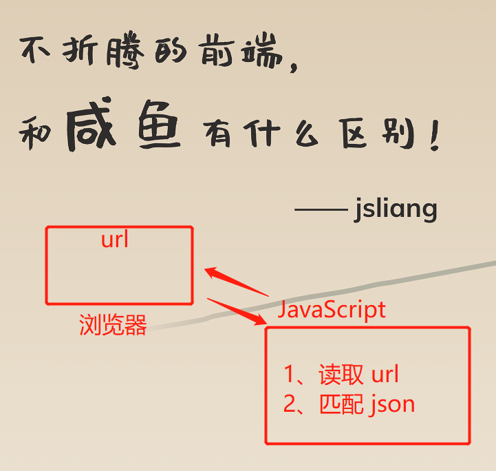
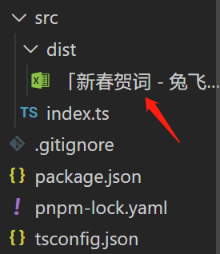

CSS 实例系列 - 02 - 2023 兔年祝福
===

> Create by **jsliang** on **2023-01-14 19:55:25**  
> Recently revised in **2023-01-15 19:51:34**

Hello 小伙伴们早上、中午、下午、晚上和深夜好，这里是 **jsliang**~

新年新气象，让我们耍一个兔飞猛进的祝福吧：



这个是一个完整的线上小实例，小伙伴们可以填写数据，服务器会用 Node.js 定期读取数据：

* 填写数据：https://kdocs.cn/l/cbmawranzvNL
* 效果查看：https://liangjunrong.github.io/

> 例如你填的用户名称是：`abab`，那么你的链接就是：`https://liangjunrong.github.io?username=abab`

本期将和小伙伴们探讨：

* [x] 如何通过 HTML + 海量 CSS + 简单 JS，完成这个兔年祝福实例
* [x] 如何通过 Node.js，开启无头浏览器读取「金山文档」的数据，同步到 GitHub Page 上

本实例的代码地址：

* [Demo —— all for one](https://github.com/LiangJunrong/all-for-one/tree/master/038-CSS%20系列)
* [码上掘金 - 02 - 2023 兔年祝福](https://code.juejin.cn/pen/7188888587281104957)

## 一 前言

本 CSS 系列文章：

1. **主推学以致用**。结合面试题和工作实例，让小伙伴们深入体验 61 个工作常见的 CSS 属性和各种 CSS 知识。
2. **主推纯 CSS**。尽可能使用 HTML + CSS 完成学习目的，但仍然有 “一小部分” 功能需要用到 JavaScript 知识，**适合新人学习 + 大佬复习**。

如果文章在一些细节上没写清楚或者误导读者，欢迎评论/吐槽/批判，**你的点赞、收藏和关注是我更新的动力 ❤**

* 更多知识分享文章可见：[jsliang 的文档库](https://github.com/LiangJunrong/document-library)

## 二 前端实现

本实例的一些创意，参考自 Jamie Juviler 提供的 24 个 CSS 动画，从中得到启发创作了这封信，在此表示非常感谢：

* [24 Creative and Unique CSS Animation Examples to Inspire Your Own](https://blog.hubspot.com/website/css-animation-examples)

**参考效果**：

* 鼠标 hover 文本效果：《CSS Mouse Hover Transition Effect》


* 三个点：《Three Dots Loading》



* 信封：《Opening Envelope》


OK，那么咱们对着文件划分以及最终渲染实例，「简明扼要」讲讲界面是如何实现的：

```
- 02 - 2023 兔飞猛进
  - css                   —— 样式表
    - heart.css           —— 心脏样式
    - index.css           —— 主要样式
    - letter-content.css  —— 信封样式
    - letter-image.css    —— 信件样式
    - tips.css            —— 下方提示样式
  - js                    —— JS
    - index.js            —— 主要引用 JS
index.html                —— 首页 HTML
```


### 2.1 跳动的心脏

如何通过一个简单的 `<div>` 实现跳动的心脏？

```html
<div class="heart"></div>
```

其实很简单：


1. 先实现一个 200*200 大小的正方形，并旋转 45°
2. 通过 `::before`，实现一个 100*200 的矩形，并通过 `border-radius` 设置圆角，做成左边的半圆，最后通过 `position` 定位
3. 通过 `::after`，实现一个 200*300 的矩形（反过来），并通过 `border-radius` 设置圆角，做成右边的长方形半圆，最后通过 `position` 定位
4. 添加动画，让它循环跳动起来

```css
.heart {
  position: relative;
  width: 200px;
  height: 200px;
  background: deeppink;
  transform: rotate(45deg);

  /* 关键动画：让心跳动起来 */
  /* animation: 动画名称 | 动画时间 | 动画是否反向播放 | 动画运行的次数 */
  animation: heartjump 0.5s alternate infinite;
}
@keyframes heartjump {
  0% {
    transform: rotate(45deg) scale(0.5);
  }
  100% {
    transform: rotate(45deg) scale(1);
  }
}
.heart::before, .heart::after {
  position: absolute;
  content: '';
  background: deeppink;
}
.heart::before {
  left: -99px;
  width: 100px;
  height: 200px;
  border-radius: 100px 0 0 100px;
}
.heart::after {
  top: -99px;
  width: 200px;
  height: 300px;
  border-radius: 100px 100px 0 0;

  /* 关键阴影：让爱心有立体感 */
  /* box-shadow: x 偏移量 | y 轴偏移量 | 阴影模糊半径 | 阴影扩散半径 | 阴影颜色 */
  box-shadow: 10px -5px 10px 0 #ccc;
}
```

这样，中间的心就实现啦：


### 2.2 滑动的文字

那么，底部的含滑动效果的文字如何实现呢？



其实也不难：

```html
<p class="tips">
  <!-- 提示文本 -->
  <span class="tips-info">
    <!-- TODO: 提示 - 用户填充 -->
  </span>
  <!-- 三个点 -->
  <span class="three-dots">
    <span class="three-dots-element"></span>
    <span class="three-dots-element"></span>
    <span class="three-dots-element"></span>
  </span>
</p>
```

这里看关键 CSS 的实现：

```css
.tips {
  margin-top: 50px;
  position: relative;
  padding: 8px;
  border-radius: 8px;
  border: 1px solid deepskyblue;
  color: #000;
  cursor: pointer;

  /* 关键动画：颜色的改变 */
  transition: color .3s;
}
.tips:hover {
  color: #fff;
}
.tips:hover::before {
  /* 关键动画 - 从左下开始 */
  transform: scaleX(1);
  transform-origin: bottom left;
}
.tips::before {
  content: ' ';
  display: block;
  position: absolute;
  /* https://developer.mozilla.org/en-US/docs/Web/CSS/inset */
  inset: 0 0 0 0;
  background: deepskyblue;
  border-radius: 8px;
  z-index: -1;
  
  /* 关键动画 - 从右下开始 */
  transition: transform 1s ease;
  transform: scaleX(0);
  transform-origin: bottom right;
}
```

看完是不是豁然开朗：

* 原来只要通过 `::before` 设置好蓝色背景，然后添加 `transition`，让它从左往右「跑」起来

### 2.3 其他

其他效果就不一一介绍了。

感兴趣的小伙伴可自行前往代码仓库查看效果喔：

* [Demo —— all for one](https://github.com/LiangJunrong/all-for-one/tree/master/038-CSS%20系列)
* [码上掘金 - 02 - 2023 兔年祝福](https://code.juejin.cn/pen/7188888587281104957)

## 三 服务端实现

OK，那么界面实现后，我们如何让数据「动」起来呢？

1. 通过 `data.json` 存储数据
2. 通过 `index.js`，读取 `url` 参数，并匹配 `json` 上的数据
3. 将数据渲染到界面



这样，我们是不是就能够动态更换数据了？

### 3.1 前后端数据对接

假设我们有个 `json` 文件来存储数据：

> data.json

```json
[
  {
    "username": "jsliang",
    "tipsInfo": "Hello 小伙伴们，点击 ❤ 查看我给你们的信",
    "letterContentTitle": "给 2022 的你们",
    "letterContentMain": "☆ 2022 随风飘逝，2023，我们来啦！\n☆ 在新春佳节到来之际，祝您全家身体健康，万事如意！\n☆ 兔年的祝福短信飞雪迎春到，玉兔捧福来。\n☆ 除夕的钟声扣响你快乐的心扉，新年礼炮奏响你幸福华章，缤纷焰火编织你闪亮生活，八仙给力保你万事胜意。\n☆ 祝您一帆风顺，四季平安，八方进财！\n☆ 兔年祝愿天下朋友：工作舒心，薪水合心，被窝暖心，朋友知心，爱人同心，一切都顺心，永远都开心，事事都称心！\n",
    "letterContentButton": "加油 2023！"
  }
]
```

在 `index.js` 上进行读取，看用户输入了什么：

```js
// 获取节点
const tipsInfo = document.querySelector('.tips-info');
const letterContentTitle = document.querySelector('.letter-content-title');
const letterContentMain = document.querySelector('.letter-content-main');
const letterContentButton = document.querySelector('.letter-content-button');

// 获取 URL 参数
let query;
const getQuery = (info) => {
  if (query) {
    return query.get(info);
  }
  query = new URLSearchParams(window.location.search);
  return query.get(info);
};

// 读取 JSON 数据
const data = await fetch('./data.json');
const userinfo = await data.json();
console.log('data: ', userinfo);

const username = getQuery('username') || 'jsliang';

// 匹配并渲染数据
for (let i = 0; i < userinfo.length; i++) {
  const item = userinfo[i];
  if (item.username === username) {
    tipsInfo.innerText = item.tipsInfo;
    letterContentTitle.innerText = item.letterContentTitle;
    letterContentMain.innerText = item.letterContentMain;
    letterContentButton.innerText = item.letterContentButton;
    break;
  }
}
```

这样，我们基础数据构思就完成了！

接下来只需要通过 Node.js，将数据填充到 `data.json` 即可，简简单单~

### 3.2 Node.js 服务搭建

OK，接下来我们需要考虑的是，从哪里 ~~白嫖~~ 做免费的数据存储，并且能够抓下来。

这次我们考虑的是使用「金山文档」的线上「表格」，因为它不仅可以满足 **用户共享填写数据**，并且方便我们 **通过无头浏览器抓取数据**。

这里就需要利用 Node.js + Puppeteer 来下载数据了。

当然，前置知识点是存在的，但是篇幅有限，「孩子没娘，说来话长」，**jsliang** 推荐小伙伴看之前的文章：

* [jsliang - Node 工具库](https://github.com/LiangJunrong/document-library/tree/master/%E7%B3%BB%E5%88%97-%E5%89%8D%E7%AB%AF%E8%B5%84%E6%96%99/Node/Node%20%E5%B7%A5%E5%85%B7%E5%BA%93)

下面是逐步搭建步骤，详细的解释可以在上面工具库系列文章查看，这里就不一一介绍啦：

* [x] 下载安装 Node.js
* [x] 下载安装 Visio Studio Code
* [x] 初始化仓库：`npm init --yes`
* [x] 安装初始化包：`pnpm i @types/node typescript ts-node -D`
* [x] 初始化 TypeScript 配置：`tsc --init`
* [x] 安装 ESLint：`pnpm i eslint @typescript-eslint/parser @typescript-eslint/eslint-plugin -D`
* [x] 安装 Commander：`pnpm i commander@14.3.0`
* [x] 修改 package.json，可运行 `npm run 2023`

OK，到这一步，基础的 Node.js 服务就搭起来了。

它的目录结构如下：

```
- 02 - 2023 兔年祝福
  - LiangJunrong.github.io  —— GitHub Page 仓库
  - src                     —— 项目主代码
    - dist                  —— Excel 下载地址
    - index.ts              —— 主入口
  - .gitignore              —— Git 忽略配置
  - package.json            —— npm 包管理
  - pnpm-lock.yaml          —— npm 包管理
  - tsconfig.json           —— TSLint
```

### 3.3 下载数据

下面我们开始下载数据，这里的目标是将数据下载到 `src/dist` 目录中：



* [x] 安装 Puppeteer：`pnpm i puppeteer`

> 当前（2023-01-15）最新版是 19.5.2，但是执行会报错，需要指定版本。参考文献：https://github.com/berstend/puppeteer-extra/issues/651

通过 Node.js + Puppeteer 下载数据分 10 个小步骤：

1. 启动无头浏览器
2. 操作浏览器打开 `https://kdocs.cn/l/cbmawranzvNL`
3. 睡眠 6.66s（确保浏览器打开链接并加载页面）
4. 如果有遮罩弹窗，需要触发【x】按钮关闭掉
5. 触发【更多菜单】按钮的点击
6. 睡眠 2s（确保更多菜单按钮点击到）
7. 设置下载路径（确保 Puppeteer 下载路径，避免【另存为】弹窗后不好处理）
8. 触发【下载】按钮的点击
9. 睡眠 6.66s（确保资源下载到）
10. 关闭窗口

> 唯一要关注的点是第 5 点，因为我们 Windows 点击下载是会有弹窗的（并不是默认下载）

它的实现代码如下：

```js
// 步骤一：下载 Excel
const downloadExcel = async() => {
  // 1. 启动无头浏览器
  const browser = await puppeteer.launch({
    // 是否打开实体浏览器
    headless: false,
    // 打开开发模式
    devtools: true,
  });

  // 2. 操作浏览器打开 `https://kdocs.cn/l/cbmawranzvNL`
  const page = await browser.newPage();
  await page.goto('https://kdocs.cn/l/cbmawranzvNL');

  // 3. 睡眠 6.66s（确保浏览器打开链接并加载页面）
  await page.waitForTimeout(6666);

  // 4. 如果有遮罩弹窗，需要触发【x】按钮关闭掉
  const closeBtn = await page.$('.modal-wrap .icons-16-close');
  closeBtn?.click();

  // 5. 触发【更多菜单】按钮的点击
  const moreBtn = await page.$('.header-more-btn');
  moreBtn?.click();

  // 6. 睡眠 2s（确保更多菜单按钮点击到）
  await page.waitForTimeout(2000);

  // 7. 设置下载路径（确保 Puppeteer 下载路径，避免【另存为】弹窗后不好处理）
  const dist = path.join(__dirname, './dist');
  if (!fs.existsSync(dist)) {
    fs.mkdirSync(dist);
  }
  // 如果报错，请修改 Puppeteer 为 14.3.0：https://github.com/berstend/puppeteer-extra/issues/651
  await (page as any)._client?.send('Page.setDownloadBehavior', {
    behavior: 'allow',
    downloadPath: dist,
  });

  // 8. 触发【下载】按钮的点击
  // @ts-ignore
  const downloadBtn = await page.$('div[data-key=Download]');
  downloadBtn?.click();

  // 9. 睡眠 6.66s（确保资源下载到）
  await page.waitForTimeout(6666);

  // 10. 关闭窗口
  await browser.close();
}
```

### 3.4 读取数据

接着，我们需要通过 `node-xlsx` 来读取下载后的数据：

* 安装 Excel 读取模块：`pnpm i node-xlsx -S` + `pnpm i @types/node-xlsx -D`

它分为 3 个小步骤：

1. 以 `buffer` 形式导入数据
2. 读取有效的数据（前面几行为说明数据，且后面需要判断数据是否冗余）
3. 将数据以 `JSON` 的形式存储到 GitHub Page 仓库

```js
// 步骤二：读取 Excel 并存储 JSON 数据
const readExcel = async() => {
  // 1. 以 buffer 形式导入数据
  const workSheetsFromBuffer = xlsx.parse(fs.readFileSync(`${__dirname}/dist/「新春贺词 - 兔飞猛进」.xlsx`));
  // 含图片等数据的时候，第 1 条才是文本数据
  const stringifyData: any = JSON.parse(JSON.stringify(workSheetsFromBuffer, null, 2));
  const data = stringifyData[0]?.data;

  // 2. 读取有效的数据（前面几行为说明数据，且后面需要判断数据是否冗余）
  const result = [];
  for (let i = 3; i < data.length; i++) {
    const item = data[i];
    const [
      username,
      tipsInfo = '点击 ❤ 查看我给你的信',
      letterContentTitle = 'A Letter for you',
      letterContentMain,
      letterContentButton = 'Love ❤ you',
    ] = item;
    // 如果没数据了，则不填写
    if (!username || !letterContentMain) {
      continue;
    }
    result.push({
      username,
      tipsInfo,
      letterContentTitle,
      letterContentMain,
      letterContentButton,
    });
  }

  // 3. 将数据以 JSON 的形式存储到 GitHub Page 仓库
  const GPCatalog = path.join(process.cwd(), './LiangJunrong.github.io/data.json');
  fs.writeFileSync(GPCatalog, JSON.stringify(result));
};
```

### 3.5 上传代码

接下来只需要将代码上传到 GitHub Page 即可：

* 安装 shell 模块：`pnpm i shelljs` + `pnpm i @types/shelljs -D`

它分 3 个小步骤：

1. 前往 GitHub Page 仓库
2. 执行修改命令
3. 推送到线上仓库
4. 回退上一层（方便下一次执行的时候目录层级一致）

```js
// 步骤三：上传代码到 GitHub Page
const uploadCode = async() => {
  // 1. 前往 GitHub Page 仓库
  await shell.cd(`LiangJunrong.github.io`);

  // 2. 执行修改命令
  await shell.exec(`git add .`);
  await shell.exec(`git commit -m "fix: 更新线上数据"`);

  // 3. 推送到线上仓库
  await shell.exec('git push');

  // 4. 回退上一层（方便下一次执行的时候目录层级一致）
  await shell.cd(`../`);
};
```

### 3.6 设置定时任务

最后，我们只需要设置电脑定时任务，让它可以定时读取线上数据并上传就好啦！

* 安装 node-schedule 模块：`pnpm i node-schedule` + `pnpm i @types/node-schedule -D`

只需要简单一步代码：

```js
import puppeteer from 'puppeteer';
import path from 'path';
import fs from 'fs';
import xlsx from 'node-xlsx';
import shell from 'shelljs';
import schedule from 'node-schedule';

// 步骤四：设置定时器，定时上传代码
const runCode = async() => {
  console.log('Hello 2023~');

  // scheduleJob: 秒 分 时 日 月 周几
  schedule.scheduleJob('*/10 * * * *', async() => {
    console.log('开始操作');
    // 步骤一：下载 Excel
    await downloadExcel();

    // 步骤二：读取 Excel 并存储 JSON 数据
    await readExcel();

    // 步骤三：上传代码到 GitHub Page
    await uploadCode();
  });
};

const program = require('commander');
program
  .version('1.0.0')
  .description('2023 兔年祝福')
  .command('2023')
  .action(async() => {
    // 步骤四：设置定时器，定时上传代码
    await runCode();
  });

program.parse(process.argv);
```

### 3.7 小结

通过上面操作，我们可以看到：

* 通过 `node-schedule` 定期执行任务
* 通过 `puppeteer` 下载线上数据
* 通过 `node-xlsx` 读取下载下来的 Excel 文件
* 通过 `shell` 操作 Shell，上传数据
* 通过 JavaScript 读取 JSON 文件，将数据渲染到 HTML

这样，我们就完成了本次的祝福实例！

OK，完事，收工~

## 四 参考文献

* [24 Creative and Unique CSS Animation Examples to Inspire Your Own](https://blog.hubspot.com/website/css-animation-examples)
* [掘金 - KevinQ - 纯CSS制作跳动的心](https://juejin.cn/post/6999627144758296584)
* [博客园 - whys - CSS 画一个心](https://www.cnblogs.com/wyhlightstar/p/7729610.html)

---

**不折腾的前端，和咸鱼有什么区别！**

觉得文章不错的小伙伴欢迎点赞/点 Star。

如果小伙伴需要联系 **jsliang**：

* [Github](https://github.com/LiangJunrong/document-library)
* [掘金](https://juejin.im/user/3403743728515246)

个人联系方式存放在 Github 首页，欢迎一起折腾~

争取打造自己成为一个充满探索欲，喜欢折腾，乐于扩展自己知识面的终身学习斜杠程序员。

> jsliang 的文档库由 [梁峻荣](https://github.com/LiangJunrong) 采用 [知识共享 署名-非商业性使用-相同方式共享 4.0 国际 许可协议](http://creativecommons.org/licenses/by-nc-sa/4.0/) 进行许可。<br/>基于 [https://github.com/LiangJunrong/document-library](https://github.com/LiangJunrong/document-library) 上的作品创作。<br/>本许可协议授权之外的使用权限可以从 [https://creativecommons.org/licenses/by-nc-sa/2.5/cn/](https://creativecommons.org/licenses/by-nc-sa/2.5/cn/) 处获得。
