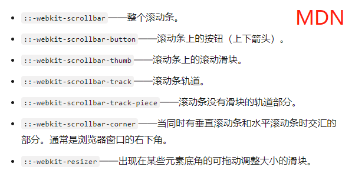
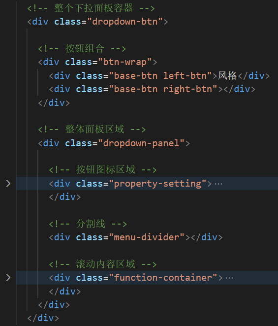
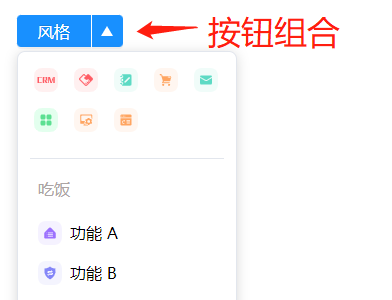
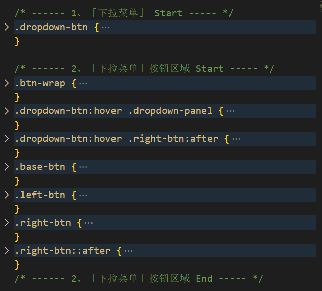
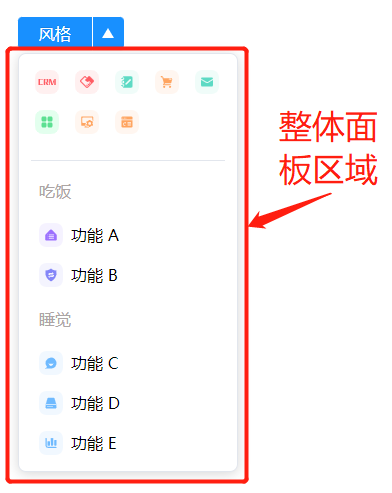
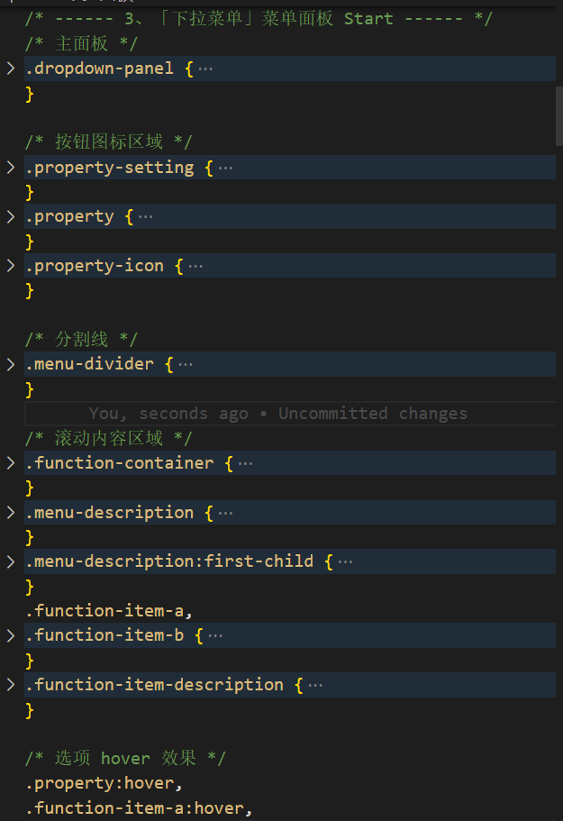
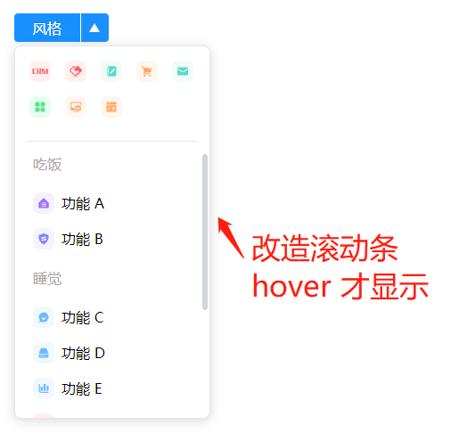
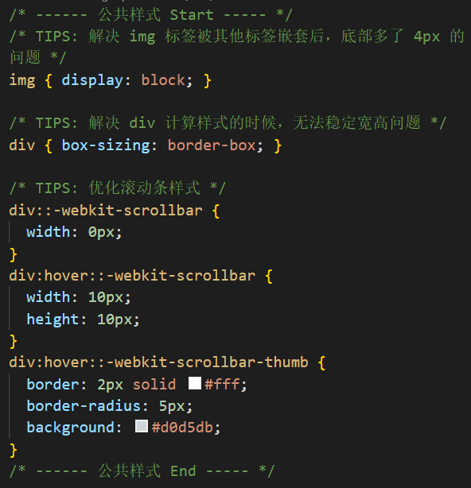

CSS 实例系列 - 04 - Dropdown 下拉面板
===

> Create by **jsliang** on **2023-02-07 21:05:14**  
> Recently revised in **2023-02-07 23:15:23**

Hello 小伙伴们早上、中午、下午、晚上和深夜好，这里是 **jsliang**~

今儿要实现的是：**Dropdown 下拉面板**


本期将和小伙伴们探讨：

* √ 通过精简结构，讲解 HTML 和 CSS 搭配如何实现 Dropdown 下拉面板

本实例的代码地址：

* [Github - all for one](https://github.com/LiangJunrong/all-for-one/tree/master/038-CSS%20系列)
* [码上掘金 - 04 - Dropdown 下拉面板](https://code.juejin.cn/pen/7197207623236583439)

## 一 前言

本 CSS 系列文章：

1. **主推学以致用**。结合面试题和工作实例，让小伙伴们深入体验 61 个工作常见的 CSS 属性和各种 CSS 知识。
2. **主推纯 CSS**。尽可能使用 HTML + CSS 完成学习目的，但仍然有 “一小部分” 功能需要用到 JavaScript 知识，**适合新人学习 + 大佬复习**。

如果文章在一些细节上没写清楚或者误导读者，欢迎评论/吐槽/批判，**你的点赞、收藏和关注是我更新的动力 ❤**

* 更多知识分享文章可见：[jsliang 的文档库](https://github.com/LiangJunrong/document-library)

## 二 本期知识点

### 2.1 :-webkit-scrollbar

关于 [:-webkit-scrollbar](https://developer.mozilla.org/zh-CN/docs/Web/CSS/::-webkit-scrollbar)，小伙伴们在 MDN 上可以看到介绍：

* `:-webkit-scrollbar` CSS 伪类元素会影响设置了 `overflow:scroll` 的元素的滚动条样式



配合这一系列伪元素选择器，我们可以修改基于 Webkit 浏览器的滚动条样式。

### 2.2 overflow: overlay

关于 [overflow](https://developer.mozilla.org/zh-CN/docs/Web/CSS/overflow) 知识点，小伙伴们可以在 MDN 上看到：

* `overflow` 是 CSS 的简写属性，其设置了元素溢出时所需的行为 —— 即当元素的内容太大而无法适应它的块级格式化上下文时

在本项目中，我们使用到了：

* `overflow: scroll`：超出内容后，设置滚动效果
* `overflow: overlay`：行为与 `auto` 相同，但是滚动条绘制在内容之上，而不是占据空间

但是 `overflow: overlay` 在 MDN 上已标记废置了，所以小伙伴们使用的时候注意下。

## 三 实现步骤

OK，下面我们开始玩转起来。

对于 Dropdown 下拉面板，我们实际达成的效果，拆解后是这样的：


### 3.1 HTML 结构划分

所以，接到这种 UI 稿，我们可以拍脑袋瓜，把 HTML 结构整起来：



这里面 HTML 结构对应的 CSS 交互：

1. 鼠标 hover 到【按钮组合】的时候，让它能展开下面的【整体面板区域】，并且 `right-btn` 这个三角能旋转起来
2. 鼠标 hover 到【整体面板区域】的时候，出现滚动条，并且能上下滚动

这样我们就清楚下面 CSS 怎么做了。

### 3.2 CSS 结构划分

**第一部分**，实现总体下拉菜单布局，并且完成【按钮组合区域】。

这样我们就能在鼠标 hover 的时候，有一个动画存在，并且显示【整体面板区域】。





**第二部分**，实现【整体面板区域】





**第三部分**，实现鼠标 hover 进去出现滚动条效果，并且改造滚动条





这个滚动条的实现，其实还需要配合【滚动内容区域】的设置：

```css
.function-container {
  display: flex;
  flex-direction: column;
  padding: 0 12px 12px 12px;
  height: 300px;
  /* 向下兼容 */
  overflow-y: scroll;
  overflow-y: overlay;
}
```

### 3.3 overflow 问题探索

在解决下拉面板在高度不够出现滚动条的时候，因为下拉面板的高度是尽可能希望动态适应的，例如：

* 在高度小于 400px 的时候，出现纵向滚动条
* 在高度大于 400px 且足够存放的时候，不出现滚动条

这时候，有滚动条和无滚动条情况下，对于 `overflow: scroll` 就不太能满足场景了 —— 它毕竟要占据 `17px` 的滚动条宽度的！


讲个冷笑话，都 2022 年了，对于下拉面板，我还真一时半会没找到合适的方案，看网上的 CSS 方式大致有 2：

1. 设置 `padding-right`，但不适用 Dropdown 下拉面板。通过 `padding-right: calc(100vw - 100%)`，不计算滚动条的位置，原理是 `100vw` 是相对于浏览器 `window.innerWidth`，是浏览器的内部宽度，会将 **滚动条宽度计算在内**，而 `100%` 并不会（`100%` 是可用宽度）
2. 设置 `overflow: overlay`，但不适用于低版本浏览器。具体的影响可以看 [caniuse.com - CSS overflow: overlay](https://caniuse.com/?search=overlay)

所以，包括我项目上的代码，就还没解决这个问题。

这时候我就在纠结了，是不是只能通过 JS 模拟滚动条，来实现我的要求。

但是本主题并不想过多讲解 JavaScript 相关内容。

所以 **jsliang** 的解决方案是添加 `overflow: scroll` 和 `overflow: overlay`，能看就看，不能就计算~


这样子我们就做到了 `hover` 的时候，滚动条能随之出来，而不 `hover` 的时候，就不出来滚动条。

最终代码效果查看：

* [Github - all for one](https://github.com/LiangJunrong/all-for-one/tree/master/038-CSS%20系列)
* [码上掘金 - 04 - Dropdown 下拉面板](https://code.juejin.cn/pen/7197207623236583439)

## 四 参考文献

* [张鑫旭 - 小tip:CSS vw让overflow:auto页面滚动条出现时不跳动](https://www.zhangxinxu.com/wordpress/2015/01/css-page-scrollbar-toggle-center-no-jumping/)
* [Menqq - CSDN - 滚动条不占位 overlay属性](https://blog.csdn.net/Menqq/article/details/124040137)
* [caniuse.com - CSS overflow: overlay](https://caniuse.com/?search=overlay)
* [前端开发博客 - 3种方法实现CSS隐藏滚动条并可以滚动内容](http://caibaojian.com/hide-scrollbar.html)
* [Microsoft - Hiding Vertical Scrollbars with Pure CSS in Chrome, IE (6+), Firefox, Opera, and Safari](https://docs.microsoft.com/zh-cn/archive/blogs/kurlak/hiding-vertical-scrollbars-with-pure-css-in-chrome-ie-6-firefox-opera-and-safari)
* [BWestbrook维 - 博客园 - 滚动条出现挤压页面宽度，影响布局](https://www.cnblogs.com/weihuan/p/11681831.html)

---

**不折腾的前端，和咸鱼有什么区别！**

觉得文章不错的小伙伴欢迎点赞/点 Star。

如果小伙伴需要联系 **jsliang**：

* [Github](https://github.com/LiangJunrong/document-library)
* [掘金](https://juejin.im/user/3403743728515246)

个人联系方式存放在 Github 首页，欢迎一起折腾~

争取打造自己成为一个充满探索欲，喜欢折腾，乐于扩展自己知识面的终身学习斜杠程序员。

> jsliang 的文档库由 [梁峻荣](https://github.com/LiangJunrong) 采用 [知识共享 署名-非商业性使用-相同方式共享 4.0 国际 许可协议](http://creativecommons.org/licenses/by-nc-sa/4.0/) 进行许可。<br/>基于 [https://github.com/LiangJunrong/document-library](https://github.com/LiangJunrong/document-library) 上的作品创作。<br/>本许可协议授权之外的使用权限可以从 [https://creativecommons.org/licenses/by-nc-sa/2.5/cn/](https://creativecommons.org/licenses/by-nc-sa/2.5/cn/) 处获得。
