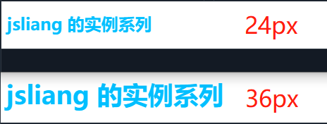
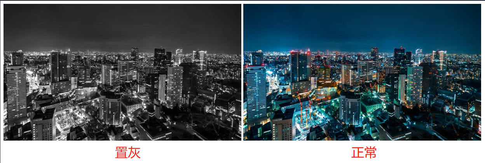
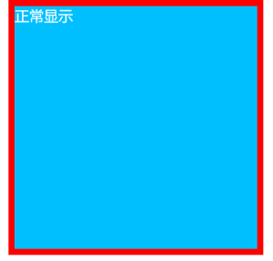
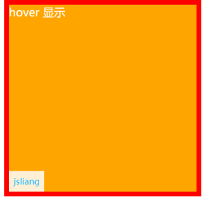
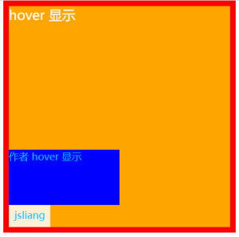
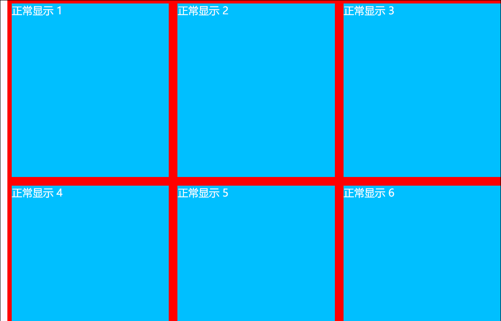

CSS 实例系列 - 05 - Photo Album 瀑布流相册
===

> Create by **jsliang** on **2023-03-12 15:07:39**  
> Recently revised in **2023-03-12 16:34:43**

Hello 小伙伴们早上、中午、下午、晚上和深夜好，这里是 **jsliang**~

今儿要实现的是：**Photo Album 瀑布流相册**


本期将和小伙伴们探讨：

* √ 通过简单几步，带大家用 HTML + CSS + JavaScript 速通瀑布流画册

本实例的代码地址：

* [Github - all for one](https://github.com/LiangJunrong/all-for-one/tree/master/038-CSS%20系列)
* [码上掘金 - 05 - Photo Album 瀑布流相册](https://code.juejin.cn/pen/7209644969336766524)

本实例系列整体效果可见：https://liangjunrong.github.io/

当然，**jsliang** 还贴心准备了视频教程，手把手带你逐步完成：

* TODO: 视频链接

## 一 前言

本 CSS 系列文章：

1. **主推学以致用**。结合面试题和工作实例，让小伙伴们深入体验 61 个工作常见的 CSS 属性和各种 CSS 知识。
2. **主推纯 CSS**。尽可能使用 HTML + CSS 完成学习目的，但仍然有 “一小部分” 功能需要用到 JavaScript 知识，**适合新人学习 + 大佬复习**。

如果文章在一些细节上没写清楚或者误导读者，欢迎评论/吐槽/批判，**你的关注和点赞是我持续更新的动力，谢谢大家 ❤**


* 更多知识分享文章可见：[jsliang 的文档库](https://github.com/LiangJunrong/document-library)

## 二 本期知识点

### 2.1 @media

关于 [@media](https://developer.mozilla.org/zh-CN/docs/Web/CSS/@media)，小伙伴们在 MDN 上可以看到介绍：

* `@media` 规则可用于基于一个或多个媒体查询的结果来应用样式表的一部分。

什么意思呢？大概就是对于一个元素，你可以指定它在不同设备下的展示。

例如：

```html
<h1>jsliang 的实例系列</h1>
```

```css
h1 {
  font-size: 36px;
  color: deepskyblue;
}

@media screen and (max-width: 1000px) {
  h1 {
    font-size: 24px;
  }
}
```



这 2 段代码，即表示对于 `<h1>` 元素，在 `1000+ px` 上，表现为 `36px` 的字体大小，而在 `1000 px` 下，则为 `24px` 大小。

通过这样 `@media`，小伙伴们也可以联想下，本次需要实现的功能，在不同分辨率下如何尝试实践出来。

### 2.2 filter

关于 [filter](https://developer.mozilla.org/zh-CN/docs/Web/CSS/filter)，小伙伴们在 MDN 上可以看到介绍：

* CSS 属性 `filter` 将模糊或颜色偏移等图形效果应用于元素。滤镜通常用于调整图像、背景和边框的渲染。

我们很容易就联想到一些特殊日子，很多网站的置灰效果，有些正是用上了 `filter` 属性。

```css
.gray {
  filter: grayscale(100%);
  filter: gray;
}
```



当然，本文也会通过 `filter` 来完成图片遮罩效果。

## 三 实现步骤

OK，话不多说，我们开始完成本实例，让我们开始吧！

### 3.1 实现一个画框



对于上面这种效果，在小伙伴们看来，想必是已经熟能生巧：

> index.html

```html
<div class="photo-container">
  <div class="show">正常显示</div>
</div>
```

在这里，`.photo-container` 是红色的，而 `.show` 是内部的蓝色框。

> index.css

```css
/* 重置样式 Start */
body, html { margin: 0; padding: 0; }
body {
  display: flex;
  justify-content: center;
  color: #fff;
  font-size: 24px;
}
/* 重置样式 End */

.photo-container {
  width: 400px;
  height: 400px;
  background: red;
  padding: 10px;
  position: relative;
}
.show {
  width: 100%;
  height: 100%;
  background: deepskyblue;
}
```

### 3.2 实现画框 hover 出弹窗



在鼠标 hover 的时候，能出来一个弹窗，遮挡住 `.show` 这个元素，并且左下角有一个 `jsliang` 的小文本，想必也很简单：

> index.html

```diff
<div class="photo-container">
  <div class="show">正常显示</div>
+  <div class="hover-show">
+    hover 显示
+    <div class="author">
+      <span>jsliang</span>
+    </div>
+  </div>
</div>
```

CSS 稍微补充一下：

> index.css

```css
/* 大框 hover 后显示效果 */
.photo-container:hover .hover-show {
  display: block;
}
.hover-show {
  display: none;
  width: calc(100% - 20px);
  height: calc(100% - 20px);
  background: orange;
  position: absolute;
  top: 10px;
  left: 10px;
}
/* 左下角作者 */
.author {
  position: absolute;
  left: 0;
  bottom: 0;
  color: deepskyblue;
  font-size: 18px;
  background: papayawhip;
  padding: 10px;
  cursor: pointer;
}
```

### 3.3 实现画框 hover 的弹窗再 hover 出作者详情



再下来就是在鼠标 hover 到作者的时候，能展开上边的「作者 hover 显示」弹窗，这也不难：

> index.html

```diff
<div class="photo-container">
 <div class="show">正常显示</div>
 <div class="hover-show">
   hover 显示
   <div class="author">
     <span>jsliang</span>
+     <div class="author-hover-show">
+       作者 hover 显示
+     </div>
   </div>
 </div>
</div>
```

同样也是补充一点 CSS：

> index.css

```css
/* 作者 hover 出作者详情 */
.author:hover .author-hover-show {
  display: block;
}
.author-hover-show {
  display: none;

  position: absolute;
  width: 200px;
  height: 100px;
  background: blue;
  bottom: 40px;
  left: 0px;
}
```

### 3.4 Copy 弹窗，通过 JS 实现瀑布流

下面压力来到 JS 这边，我们如何「批量」制造响应式瀑布流呢？



这里咱们挑了「瀑布流的 N 种实现方式」之一来完成：

> index.html

```diff
<body>
- <!-- 删除了很多内容 -->
+  <div class="photo-album"></div>

+  <script src="./index.js"></script>
</body>
```

> index.js

```js
window.onload = () => {
  // 假装后台请求接口给到的图片数据
  const imgList = Array.from(Array(100), (item, index) => index + 1);
  const renderDOM = document.querySelector('.photo-album');
  let prevMode = 1;

  // func: 滚动查找元素并将 String 累计起来，最终渲染到 renderDOM 节点上
  const reduceDOM = (limit) => {
    // 生成 limit 条字符串
    const htmlString = Array.from(Array(limit), () => '<div class="photo-list">');
    // 遍历并将  添加到每一列上
    imgList.forEach((item, index) => {
      const surplus = index % limit;
      if (surplus < limit) {
        htmlString[surplus] += `
<div class="photo-container">
  <div class="show">正常显示 ${item}</div>
  <div class="hover-show">
    hover 显示
    <div class="author">
      <span>jsliang</span>
      <div class="author-hover-show">
        作者 hover 显示
      </div>
    </div>
  </div>
</div>
`;
      }
    });
    // 结尾设置 String
    for (let i = 0; i < limit; i++) {
      htmlString[i] += '</div>';
    }
    // 渲染到 HTML 上。记得处理下数组，要不然会产生逗号
    renderDOM.innerHTML = htmlString.join('');
  };

  // func: 重排节点
  const resize = () => {
    const width = window.innerWidth;
    // 超过 1000px 显示 3 列，否则显示 2 列
    if (width >= 1000 && prevMode !== 3) {
      prevMode = 3;
      reduceDOM(prevMode);
    } else if (width < 1000 && prevMode !== 2) {
      prevMode = 2;
      reduceDOM(prevMode);
    }
  };
  
  // 1、每次进来先执行一遍
  resize();

  // 2、每次拖拽，判断是否需要重新渲染
  window.onresize = () => {
    resize();
  };
};
```

这样，我们就完成了瀑布流相册的雏形。

### 3.5 补充「亿」点点细节

**jsliang** 我想学真正的技术，别拿小框框敷衍我！

好的好的，麻瓜让道，魔法来了~


其实就是照着「[Pexels](https://www.pexels.com/zh-cn/search/%E9%A3%8E%E6%99%AF/)」补充 CSS 细节：


OK，这样我们本次的 CSS 之旅就完成啦！

本实例的代码地址：

* [Github - all for one](https://github.com/LiangJunrong/all-for-one/tree/master/038-CSS%20系列)
* [码上掘金 - 05 - Photo Album 瀑布流相册](https://code.juejin.cn/pen/7209644969336766524)

本实例系列整体效果可见：https://liangjunrong.github.io/

当然，**jsliang** 还贴心准备了视频教程，手把手带你逐步完成：

* TODO: 视频链接

## 四 参考文献

* [Pexels - 才华横溢的摄影作者在这里免费分享最精彩的素材图片和视频](https://www.pexels.com/zh-cn/search/%E9%A3%8E%E6%99%AF/)
* [CSS 实现三角图标](https://www.jianshu.com/p/10ee52e7b6a0)

---

**不折腾的前端，和咸鱼有什么区别！**

觉得文章不错的小伙伴欢迎点赞/点 Star。

如果小伙伴需要联系 **jsliang**：

* [Github](https://github.com/LiangJunrong/document-library)
* [掘金](https://juejin.im/user/3403743728515246)

个人联系方式存放在 Github 首页，欢迎一起折腾~

争取打造自己成为一个充满探索欲，喜欢折腾，乐于扩展自己知识面的终身学习斜杠程序员。

> jsliang 的文档库由 [梁峻荣](https://github.com/LiangJunrong) 采用 [知识共享 署名-非商业性使用-相同方式共享 4.0 国际 许可协议](http://creativecommons.org/licenses/by-nc-sa/4.0/) 进行许可。<br/>基于 [https://github.com/LiangJunrong/document-library](https://github.com/LiangJunrong/document-library) 上的作品创作。<br/>本许可协议授权之外的使用权限可以从 [https://creativecommons.org/licenses/by-nc-sa/2.5/cn/](https://creativecommons.org/licenses/by-nc-sa/2.5/cn/) 处获得。
