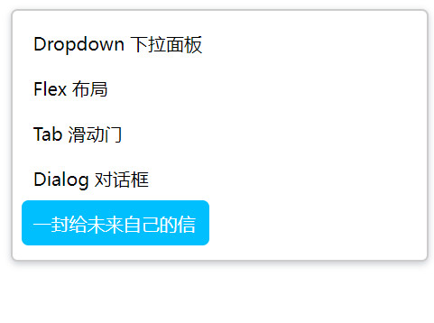
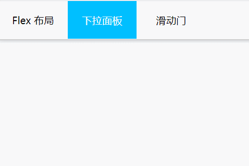
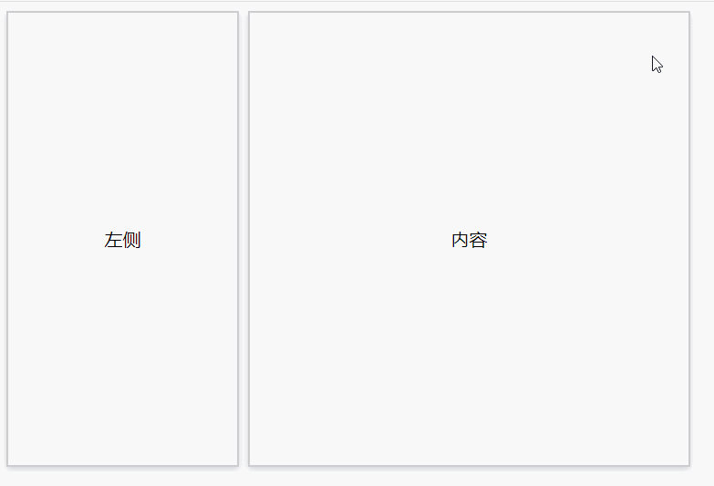
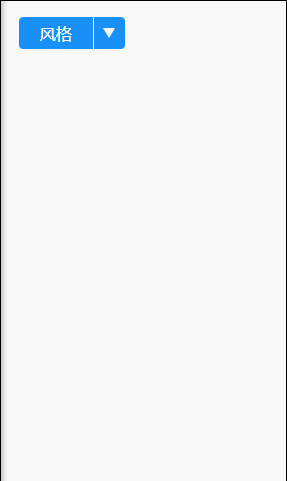
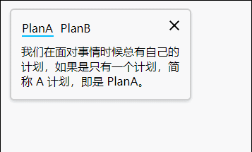
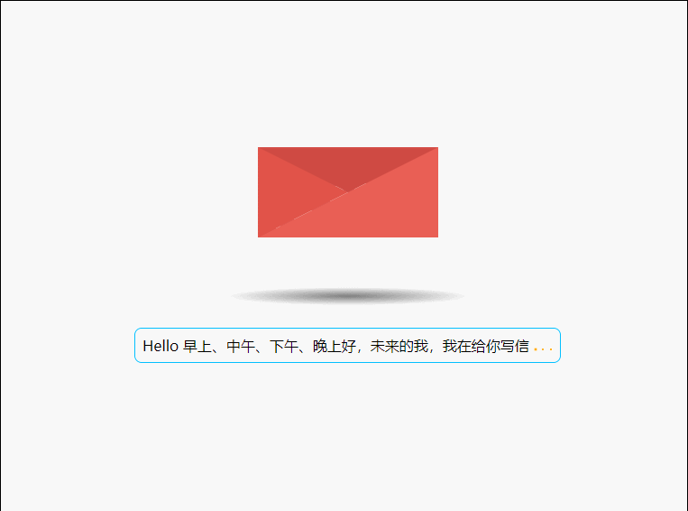
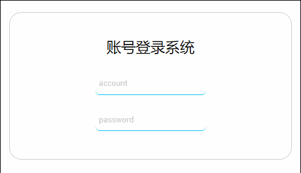
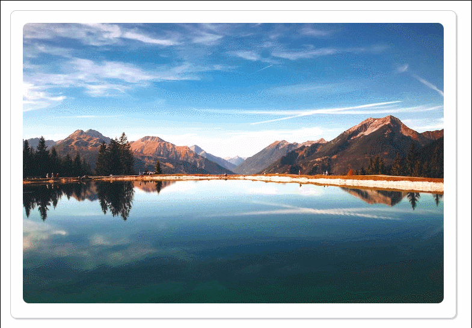

CSS 实例系列
===

> Create by **jsliang** on **2022-07-10 20:53:51**  
> Recently revised in **2023-01-08 22:18:06**

Hello 小伙伴们早上、中午、下午、晚上和深夜好，这里是 **jsliang**~

本 CSS 系列文章：

1. **主推学以致用**。结合面试题和工作实例，让小伙伴们深入体验 61 个工作常见的 CSS 属性和各种 CSS 知识。
2. **主推纯 CSS**。尽可能使用 HTML + CSS 完成学习目的，但仍然有 “一小部分” 功能需要用到 JavaScript 知识，**适合新人学习 + 大佬复习**。

如果文章在一些细节上没写清楚或者误导读者，欢迎评论/吐槽/批判，**你的点赞、收藏和关注是我更新的动力 ❤**

* 更多知识分享文章可见：[jsliang 的文档库](https://github.com/LiangJunrong/document-library)
* 本系列知识点代码可见：[Demo —— all for one](https://github.com/LiangJunrong/all-for-one/tree/master/038-CSS%20系列)

## 一 前言

在 2022.07 左右的时候，同办公室的前端小伙伴就吐槽：**我 CSS 有点差，如果能稍微学习提升下就好了**。

哎嘿！这学习思路不就来了吗~


遂 **偷偷摸摸去观看** 了自己项目中的 121 个 CSS/Less 文件，将里面的 CSS 属性都抽离了出来，本来想直接 share 过去，希望让他看完能有所收获。

后面一想，这样突兀将知识点抛出来没啥意义，还显得非常枯燥！

所以，结合「**Tab 滑动门**」「**DropDown 下拉面板**」「**Flex 布局**」等工作实例，让小伙伴们能更好地体会这些 CSS 属性的作用。

如果文章在一些细节上没写清楚或者误导读者，欢迎评论/吐槽/批判，**你的点赞、收藏和关注是我更新的动力 ❤**

## 二 目标

**jsliang** 在项目中挖掘的常见 CSS 属性有 61 个，并进行了个人归类。

如果下面归类有 CSS 属性，「**确认过眼神，那是你不懂的 code**」，请使用 `Ctrl + F` 在本文搜索该 CSS 属性在实例上的使用。

这里仅做统计，用以辅助 **jsliang** 统计哪些属性还没写案例，或者让小伙伴们看看哪些属性是陌生的~


在了解学习这些 CSS 属性的时候，推荐 2 个靠谱网站：

* [Can I use - CSS 兼容性查询](https://caniuse.com/)
* [MDN - CSS 属性介绍](https://developer.mozilla.org/zh-CN/)

### 2.1 影响元素大小

* [x] [box-sizing 计算元素大小的方式](https://developer.mozilla.org/zh-CN/docs/Web/CSS/box-sizing)
* [x] [width 宽度](https://developer.mozilla.org/zh-CN/docs/Web/CSS/width)
  * [ ] [min-width 最小宽度](https://developer.mozilla.org/zh-CN/docs/Web/CSS/min-width)
  * [x] [max-width 最大宽度](https://developer.mozilla.org/zh-CN/docs/Web/CSS/max-width)
* [x] [height 高度](https://developer.mozilla.org/zh-CN/docs/Web/CSS/height)
  * [ ] [min-height 最小高度](https://developer.mozilla.org/zh-CN/docs/Web/CSS/min-height)
  * [ ] [max-height 最大高度](https://developer.mozilla.org/zh-CN/docs/Web/CSS/max-height)
* [x] [margin 外边距](https://developer.mozilla.org/zh-CN/docs/Web/CSS/margin)
* [x] [padding 内边距](https://developer.mozilla.org/zh-CN/docs/Web/CSS/padding)
* [x] [border 边框](https://developer.mozilla.org/zh-CN/docs/Web/CSS/border)

### 2.2 字体

* [x] [font-size 字体大小](https://developer.mozilla.org/zh-CN/docs/Web/CSS/font-size)
* [x] [font-weight 字体肥瘦](https://developer.mozilla.org/zh-CN/docs/Web/CSS/font-weight)
* [ ] [font-style 字体风格](https://developer.mozilla.org/zh-CN/docs/Web/CSS/font-style)
* [ ] [font-family 字体类型](https://developer.mozilla.org/zh-CN/docs/Web/CSS/font-family)

### 2.3 影响颜色
* [x] [background 背景](https://developer.mozilla.org/zh-CN/docs/Web/CSS/background)
* [x] [color 颜色](https://developer.mozilla.org/zh-CN/docs/Web/CSS/color)
* [x] [filter 滤镜](https://developer.mozilla.org/zh-CN/docs/Web/CSS/filter)
* [x] [opacity 透明度](https://developer.mozilla.org/zh-CN/docs/Web/CSS/opacity)

### 2.4 伪元素

* [x] [::before 第一个子元素](https://developer.mozilla.org/zh-CN/docs/Web/CSS/::before)
* [x] [::after 最后一个子元素](https://developer.mozilla.org/zh-CN/docs/Web/CSS/::after)
* [x] [content 用于在元素的 `::before` 和 `::after` 伪元素中插入内容](https://developer.mozilla.org/zh-CN/docs/Web/CSS/content)
* [x] [::placeholder 适用于 `<input>`，调整 placeholder 样式](https://developer.mozilla.org/zh-CN/docs/Web/CSS/::placeholder)

### 2.5 伪类

* [x] [:hover 鼠标 hover 效果](https://developer.mozilla.org/zh-CN/docs/Web/CSS/:hover)
* [ ] [:active 元素活跃态效果](https://developer.mozilla.org/zh-CN/docs/Web/CSS/:active)

### 2.6 元素选择器

* [x] [:first-child 第一个元素](https://developer.mozilla.org/zh-CN/docs/Web/CSS/:first-child)
* [x] [:last-child 最后一个元素](https://developer.mozilla.org/zh-CN/docs/Web/CSS/:last-child)
* [x] [:nth-child 第几个元素，可以使用 2n 这种设置偶数个元素样式](https://developer.mozilla.org/zh-CN/docs/Web/CSS/:nth-child)
* [ ] [a > b 兄弟元素选择器](https://developer.mozilla.org/zh-CN/docs/Learn/CSS/Building_blocks/Selectors)
* [ ] [a + b 兄弟元素选择器](https://developer.mozilla.org/zh-CN/docs/Learn/CSS/Building_blocks/Selectors)
* [x] [a ~ b 兄弟元素选择器](https://developer.mozilla.org/zh-CN/docs/Learn/CSS/Building_blocks/Selectors)

### 2.7 定位

* [x] [position: absolute/fixed 开启定位](https://developer.mozilla.org/zh-CN/docs/Web/CSS/position)
* [x] [left 距左](https://developer.mozilla.org/zh-CN/docs/Web/CSS/left)
* [x] [right 距右](https://developer.mozilla.org/zh-CN/docs/Web/CSS/right)
* [x] [top 距上](https://developer.mozilla.org/zh-CN/docs/Web/CSS/top)
* [x] [bottom 距下](https://developer.mozilla.org/zh-CN/docs/Web/CSS/bottom)


### 2.8 元素可见

* [x] [visibility: visible/hidden 视觉上显示隐藏](https://developer.mozilla.org/zh-CN/docs/Web/CSS/visibility)
* [x] [display: block/none DOM 层级上显示隐藏](https://developer.mozilla.org/zh-CN/docs/Web/CSS/display)
* [x] [opacity: 1/0 透明度上显示隐藏](https://developer.mozilla.org/zh-CN/docs/Web/CSS/opacity)

### 2.9 Flex 全家桶

* [x] [display: flex Flex 布局](https://developer.mozilla.org/zh-CN/docs/Web/CSS/display)
* [x] [justify-content 水平方位调整](https://developer.mozilla.org/zh-CN/docs/Web/CSS/justify-content)
* [x] [align-items 垂直方位调整](https://developer.mozilla.org/zh-CN/docs/Web/CSS/align-items)
* [x] [flex-direction 排列方向](https://developer.mozilla.org/zh-CN/docs/Web/CSS/flex-direction)
* [x] [flex-shrink Flex 的元素是否能挤压](https://developer.mozilla.org/zh-CN/docs/Web/CSS/flex-shrink)
* [ ] [flex-grow Flex 的元素增长项](https://developer.mozilla.org/zh-CN/docs/Web/CSS/flex-grow)
* [ ] [flex-basis Flex 的元素起始位置](https://developer.mozilla.org/zh-CN/docs/Web/CSS/flex-basis)

### 2.10 其他：字母顺序

* [x] [animation 动画](https://developer.mozilla.org/zh-CN/docs/Web/CSS/animation)
* [x] [border-radius 圆角](https://developer.mozilla.org/zh-CN/docs/Web/CSS/border-radius)
* [x] [box-shadow 阴影](https://developer.mozilla.org/zh-CN/docs/Web/CSS/box-shadow)
* [x] [calc() 计算属性](https://developer.mozilla.org/zh-CN/docs/Web/CSS/calc)
* [x] [cursor 鼠标手势](https://developer.mozilla.org/zh-CN/docs/Web/CSS/cursor)
* [x] [display 布局](https://developer.mozilla.org/zh-CN/docs/Web/CSS/display)
* [x] [line-height 行高](https://developer.mozilla.org/zh-CN/docs/Web/CSS/line-height)
* [x] [linear-gradient 创建颜色渐变的图片](https://developer.mozilla.org/zh-CN/docs/Web/CSS/gradient/linear-gradient)
* [x] [:not() 非指定元素](https://developer.mozilla.org/zh-CN/docs/Web/CSS/:not)
* [x] [outline 轮廓属性，可用于 input/a 等属性](https://developer.mozilla.org/zh-CN/docs/Web/CSS/outline)
* [x] [overflow 滚动效果](https://developer.mozilla.org/zh-CN/docs/Web/CSS/overflow)
  * [x] [overflow-x 横向滚动效果](https://developer.mozilla.org/zh-CN/docs/Web/CSS/overflow-x)
  * [x] [overflow-y 竖向滚动效果](https://developer.mozilla.org/zh-CN/docs/Web/CSS/overflow-y)
* [x] [position 定位](https://developer.mozilla.org/zh-CN/docs/Web/CSS/position)
* [x] [pointer-events 特定元素是否响应鼠标事件](https://developer.mozilla.org/zh-CN/docs/Web/CSS/pointer-events)
* [x] [text-align 水平布局方式](https://developer.mozilla.org/zh-CN/docs/Web/CSS/text-align)
* [x] [text-overflow 如何处理溢出的文本（...）](https://developer.mozilla.org/zh-CN/docs/Web/CSS/text-overflow)
* [ ] [text-indent 块文本首行缩进](https://developer.mozilla.org/zh-CN/docs/Web/CSS/text-indent)
* [x] [transition 状态切换过渡效果](https://developer.mozilla.org/zh-CN/docs/Web/CSS/transition)
* [x] [transform 旋转，缩放，倾斜或平移给定元素](https://developer.mozilla.org/zh-CN/docs/Web/CSS/transform)
  * [x] [transform-origin 起始位置](https://developer.mozilla.org/zh-CN/docs/Web/CSS/transform-origin)
* [ ] [vertical-align 垂直布局方式](https://developer.mozilla.org/zh-CN/docs/Web/CSS/vertical-align)
* [x] [white-space 处理元素空白](https://developer.mozilla.org/zh-CN/docs/Web/CSS/white-space)
* [x] [z-index 层级](https://developer.mozilla.org/zh-CN/docs/Web/CSS/z-index)

## 三 初始化导航页

OK，话不多说，让我们折腾起来吧！

新建 `code` 文件夹，用来存放我们我们的项目代码：

```
- code
 - index.html
```

首页的 HTML 主要做一个导航，本来打算上 Shadow DOM 做一个公共部分代码的。

但想想，这样增加了心智负担，所以后续代码会尽可能简洁，并且讲解部分只有关键代码~

（需要全部代码的，去代码仓库或者在线代码平台看喔~）

> code/index.html

```html
<div class="catalog">
  <a class="catalog-item active" target="_blank" href="./dropdown/index.html">Dropdown 下拉面板</a>
  <a class="catalog-item" target="_blank" href="./flex/index.html">Flex 布局</a>
  <a class="catalog-item" target="_blank" href="./tab/index.html">Tab 滑动门</a>
  <a class="catalog-item" target="_blank" href="./dialog/index.html">Dialog 对话框</a>
  <a class="catalog-item" target="_blank" href="./case-a-letter/index.html">一封给未来自己的信</a>
  <!-- 滑动门 -->
  <div class="catalog-active"></div>
</div>
```

简单来说，首页就是做了个普通的导航栏，打开页面后可见效果：



线上代码地址：

* [码上掘金 - CSS 系列 - 首页](https://code.juejin.cn/pen/7186208363762417719)

这样，我们的首页/导航页就实现啦，接下来逐个实现实例的内容即可！

**Tips**：正常开发，可以通过 `npm` 安装 `live-server` 热更新代码，并配合 Visio Studio Code 等任意编辑器流畅使用~

**本系列的项目代码，你可以通过 GitHub 仓库查看，或者在线上代码平台尝试：**

* 更多知识分享文章可见：[jsliang 的文档库](https://github.com/LiangJunrong/document-library)
* 本系列知识点代码可见：[Demo —— all for one](https://github.com/LiangJunrong/all-for-one/tree/master/038-CSS%20系列)

## 四 CSS 实例

后续会逐步完善下面的实例内容，小伙伴们可以看有没有感兴趣的实例~

（或者在这个列表里面不存在的实例，也可以喊 **jsliang** 帮你实现）

### 4.1 Tab 滑动门

通过 HTML + CSS，以及简单的 JS，实现 Tab 滑动门：



* **文章教程地址**：已有草稿，待发布
* **视频教程地址**：待制作
* **仓库代码地址**：已有草稿，待发布
* **线上代码地址**：已有草稿，待发布
* **主要涉及属性**：`transition`

### 4.2 Flex 布局

通过 HTML + CSS，以及简单的 JS，实现 Flex 切割 div：



* **文章教程地址**：已有草稿，待发布
* **视频教程地址**：待制作
* **仓库代码地址**：已有草稿，待发布
* **线上代码地址**：已有草稿，待发布
* **主要涉及属性**：`display: flex`、`flex-shrink`

### 4.3 Dropdown 下拉面板

通过纯 HTML + CSS，实现 Dropdown 下拉面板：



* **文章教程地址**：已有草稿，待发布
* **视频教程地址**：待制作
* **仓库代码地址**：已有草稿，待发布
* **线上代码地址**：已有草稿，待发布
* **主要涉及属性**：`::-webkit-scrollbar`、`::-webkit-scrollbar-thumb`、`box-sizing`、`calc()`、`overflow-y`

### 4.4 Dialog 对话框

通过 HTML + CSS，以及简单的 JS，实现 2 套 Dialog 对话框动画：



* **文章教程地址**：已有草稿，待发布
* **视频教程地址**：待制作
* **仓库代码地址**：已有草稿，待发布
* **线上代码地址**：已有草稿，待发布
* **主要涉及属性**：`transition`

### 4.5 Envelope 给自己的一封信

通过多个 HTML + CSS + JS 效果，组合成一个比较完整的实例：



* **文章教程地址**：已有草稿，待发布
* **视频教程地址**：待制作
* **仓库代码地址**：已有草稿，待发布
* **线上代码地址**：已有草稿，待发布
* **主要涉及属性**：`calc()`、`linear-gradient`、`::-webkit-scrollbar`、`::-webkit-scrollbar-thumb`、`transition`、`transform-origin`、`repeating-linear-gradient`、`opacity`、`rotateX()`、`translateY()`、`::before`、`animation`

### 4.6 Input 输入框

通过纯 HTML + CSS，实现 Input 输入框：



* **文章教程地址**：已有草稿，待发布
* **视频教程地址**：待制作
* **仓库代码地址**：已有草稿，待发布
* **线上代码地址**：已有草稿，待发布
* **主要涉及属性**：`transition`、`::placeholder`、`:not()`、`a ~ b`、`transform`、`translate3d()`、`scale`、`opacity`、`transform`

### 4.7 Rate 评分

通过 HTML + CSS，以及简单的 JS，实现评分功能：


* **文章教程地址**：已有草稿，待发布
* **视频教程地址**：待制作
* **仓库代码地址**：已有草稿，待发布
* **线上代码地址**：已有草稿，待发布
* **主要涉及属性**：`display: flex`、`flex-direction`、`::after`、`a ~ b`、`:hover`、`:checked`

### 4.8 Gallery 相册

通过纯 HTML + CSS，实现相册面板，同时有一点小小的 JS 功能：



* **文章教程地址**：已有草稿，待发布
* **视频教程地址**：待制作
* **仓库代码地址**：已有草稿，待发布
* **线上代码地址**：已有草稿，待发布
* **主要涉及属性**：`box-shadow`、`opacity`、`:hover`、`box-sizing`、`filter`、`brightness()`、`:first-child`、`:last-child`

### 4.9 Waterfall 瀑布流

通过简单的 HTML + CSS，以及 JS 动态绘制瀑布流：


* **文章教程地址**：已有草稿，待发布
* **视频教程地址**：待制作
* **仓库代码地址**：已有草稿，待发布
* **线上代码地址**：已有草稿，待发布
* **主要涉及属性**：`display: flex`、`flex-shrink`、`calc()`、`@media`

## 五 参考文献

* [Can I use - CSS 兼容性查询](https://caniuse.com/)
* [MDN - CSS 属性介绍](https://developer.mozilla.org/zh-CN/)

---

**不折腾的前端，和咸鱼有什么区别！**

觉得文章不错的小伙伴欢迎点赞/点 Star。

如果小伙伴需要联系 **jsliang**：

* [Github](https://github.com/LiangJunrong/document-library)
* [掘金](https://juejin.im/user/3403743728515246)

个人联系方式存放在 Github 首页，欢迎一起折腾~

争取打造自己成为一个充满探索欲，喜欢折腾，乐于扩展自己知识面的终身学习斜杠程序员。

> jsliang 的文档库由 [梁峻荣](https://github.com/LiangJunrong) 采用 [知识共享 署名-非商业性使用-相同方式共享 4.0 国际 许可协议](http://creativecommons.org/licenses/by-nc-sa/4.0/) 进行许可。<br/>基于 [https://github.com/LiangJunrong/document-library](https://github.com/LiangJunrong/document-library) 上的作品创作。<br/>本许可协议授权之外的使用权限可以从 [https://creativecommons.org/licenses/by-nc-sa/2.5/cn/](https://creativecommons.org/licenses/by-nc-sa/2.5/cn/) 处获得。
