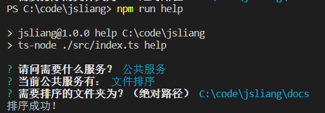
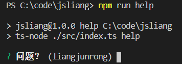
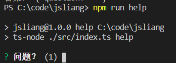
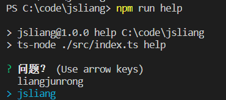
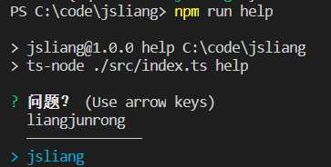
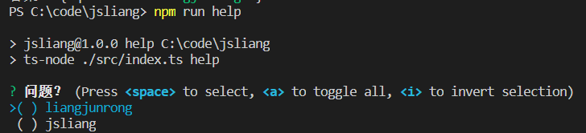
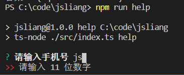
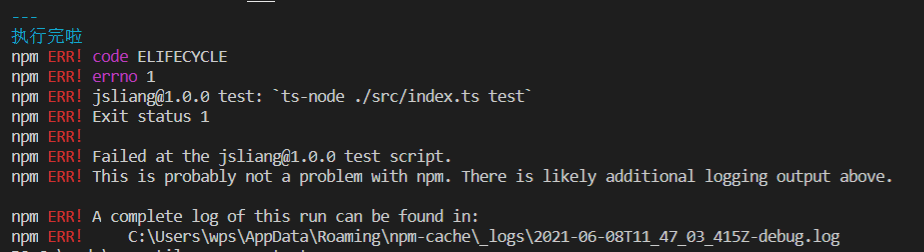
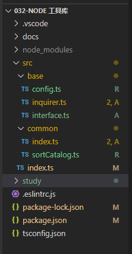

004 - Inquirer.js
===

> Create by **jsliang** on **2021-05-12 10:59:52**  
> Recently revised in **2021-06-15 22:20:02**

——————————☆☆☆——————————

Node 系列相应地址：

* 代码仓库：https://github.com/LiangJunrong/all-for-one
* 文章仓库：https://github.com/LiangJunrong/document-library/tree/master/系列-前端资料/Node

——————————☆☆☆——————————

<!-- 目录开始 -->
## <a name="chapter-one" id="chapter-one"></a>一 目录

**不折腾的前端，和咸鱼有什么区别**

| 目录 |
| --- |
| [一 目录](#chapter-one) |
| <a name="catalog-chapter-two" id="catalog-chapter-two"></a>[二 前言](#chapter-two) |
| <a name="catalog-chapter-three" id="catalog-chapter-three"></a>[三 集成 Inquirer.js](#chapter-three) |
| <a name="catalog-chapter-four" id="catalog-chapter-four"></a>[四 Inquirer.js 使用技巧](#chapter-four) |
| &emsp;[4.1 输入框](#chapter-four-one) |
| &emsp;[4.2 单选项](#chapter-four-two) |
| &emsp;[4.3 多选项](#chapter-four-three) |
| &emsp;[4.4 确认框](#chapter-four-four) |
| &emsp;[4.5 校验输入](#chapter-four-five) |
| <a name="catalog-chapter-five" id="catalog-chapter-five"></a>[五 动态提问](#chapter-five) |
| <a name="catalog-chapter-six" id="catalog-chapter-six"></a>[六 参考文献](#chapter-six) |
<!-- 目录结束 -->

## <a name="chapter-two" id="chapter-two"></a>二 前言

> [返回目录](#chapter-one)

经过前面 TypeScript 环境的搭建和 `commander.js` 的配合，我们现在可以在 `.ts` 文件中编写对应指令，然后通过 `npm run xxx` 来运行项目了，但是这种方式有个 Bug：

* 当指令过多的时候，我们压根记不住那么多的指令！

所以，就需要一个智能提示，将指令简化并可视化。

## <a name="chapter-three" id="chapter-three"></a>三 集成 Inquirer.js

> [返回目录](#chapter-one)

这边 **jsliang** 想的一个法子就是通过终端那种问答形式的来解决这个问题（后续可能安排页面或者 Chrome 插件等）

那么，废话少说，Here we go~

**首先**，安装必须的包：

* 安装 `Inquirer.js`：`npm i inquirer`
* 安装 `@types/inquirer`（可选，TS 必装）：`npm i @types/inquirer -D`

**然后**。我们就可以开始耍起来了，接入前面的 TypeScript 和 `commander.js`，拿起 `index.ts` 和 `package.json` 就是一顿修改：

> src/index.ts

```js
import program from 'commander';
import inquirer from 'inquirer';
import { sortCatalog } from './sortCatalog';

program
  .version('0.0.1')
  .description('工具库')

program
  .command('jsliang')
  .description('jsliang 帮助指令')
  .action(() => {
    inquirer
    .prompt([
      { 
        type: 'rawlist',
        name: 'question1',
        message: '请问需要什么服务？',
        choices: ['公共服务', '其他']
      },
    ])
    .then((answers) => {
      if (answers.question1 === '公共服务') {
        inquirer.prompt([
          {
            type: 'rawlist',
            name: 'question',
            message: '当前公共服务有：',
            choices: ['文件排序']
          }
        ]).then((answers) => {
          if (answers.question === '文件排序') {
            inquirer.prompt([
              {
                type: 'input',
                name: 'question',
                message: '需要排序的文件夹为？（绝对路径）',
                default: 'D:/xx',
              }
            ]).then(async (answers) => {
              const result = await sortCatalog(answers.question);
              if (result) {
                console.log('排序成功！');
              }
            }).catch((error) => {
              console.error('出错啦！', error);
            });
          }
        }).catch((error) => {
          console.error('出错啦！', error);
        });
      } else if (answers === '其他') {
        // 做其他事情
      }
    }).catch((error) => {
      console.error('出错啦！', error);
    });
  });

program.parse(process.argv);
```

注意这里 `sort` 改成 `jsliang` 了（人不要脸天下无敌）。

> package.json

```json
{
  "name": "jsliang",
  "version": "1.0.0",
  "description": "Fe-util, Node 工具库",
  "main": "index.js",
  "scripts": {
    "jsliang": "ts-node ./src/index.ts jsliang"
  },
  "keywords": [
    "jsliang",
    "Node 工具库",
    "Node"
  ],
  "author": "jsliang",
  "license": "ISC",
  "devDependencies": {
    "@types/inquirer": "^7.3.1",
    "@types/node": "^15.12.2",
    "@typescript-eslint/eslint-plugin": "^4.26.1",
    "@typescript-eslint/parser": "^4.26.1",
    "eslint": "^7.28.0",
    "ts-node": "^10.0.0",
    "typescript": "^4.3.2"
  },
  "dependencies": {
    "commander": "^7.2.0",
    "inquirer": "^8.1.0"
  }
}
```

于是就有了效果：



一样的丝滑好用，还可以控制文件夹路径了~

但是！小伙伴们看到上面代码，是不是有种想吐的感觉。

* 问题 1：呀，这是啥，这些代码你写了什么功能？
* 问题 2：太恶心了吧，居然不支持 `async/await`？

OK，一一解决问题，咱们先讲解下 `Inquirer.js` 里面的一些操作。

## <a name="chapter-four" id="chapter-four"></a>四 Inquirer.js 使用技巧

> [返回目录](#chapter-one)

在上面的代码中，通过 `.prompt(Array<Object>)` 可以传递多个问题信息，然后通过回调获取答案，举例一个输入框：

```js
inquirer.prompt([
  { 
    type: 'input',
    name: 'question',
    message: '请问需要什么服务？',
  }
]).then((res) => {
  console.log('成功！', res);
}).catch((err) => {
  console.error('报错！', err);
});
```

其中 `Object` 里面可以塞：

* `type`：【String】提示的类型，默认 `input`，包含 `input`、`number`、`confirm`、`list`、`rawlist`、`expand`、`checkbox`、`password`、`editor`
* `name`：【String】存储当前问题回答的变量
* `message`：【String|Function】提问的问题内容
* `default`：【String|Number|Boolean|Array|Function】默认值
* `choices`：【Array|Function】列表选项
* `validate`：【Function】验证方法，校验输入值是否可行，有效返回 `true`，否则返回字符串表示错误信息（返回 `false` 则为默认的错误信息）
* `filter`：【Function】对答案进行过滤处理，返回处理后的值
* `transformer`：【Function】操作答案的显示效果
* `when`：【Function|Boolean】接受答案，根据前面的内容判断是否需要展示该问题
* `pageSize`：【Number】在 `list`、`rawlist`、`expand`、`checkbox` 这种多选项中，进行分页拆分
* `prefix`：【String】修改默认前缀
* `suffix`：【String】修改默认后缀
* `askAnswered`：【Boolean】已有答案是否强制提问
* `loop`：【Boolean】`list` 是否能循环滚动选择，默认 `true`

相信你也看不懂，咱们将一些可能用到的写一写用例吧。

> 后续代码为简写，全写大概为下面代码所示，后面就不哆嗦了

```js
import program from 'commander';
import inquirer from 'inquirer';

program
  .version('0.0.1')
  .description('工具库')

program
  .command('jsliang')
  .description('jsliang 帮助指令')
  .action(() => {
    inquirer
    .prompt([
      { 
        type: 'rawlist',
        name: 'question',
        message: '请问需要什么服务？',
        choices: ['公共服务', '其他']
      },
    ])
    .then((answers) => {
      console.log('答案：', answers);
    }).catch((error) => {
      console.error('出错啦！', error);
    });
  });

program.parse(process.argv);
```

> 注意：  
> ① 下面这些举例，你也可以在 `Inquires.js` 中找到，但是 **jsliang** 希望搬运到自己这篇文章中方便后续检索。  
> ② 如果有评论没看到这个注释就吐槽 **jsliang** 抄写人家 README，那 **jsliang** 也无话可说，只是被吐槽了几次，稍微写点注释

### <a name="chapter-four-one" id="chapter-four-one"></a>4.1 输入框

> [返回目录](#chapter-one)

**输入文本**：



可配合参数：`type, name, message[, default, filter, validate, transformer]`

```js
inquirer.prompt([
  { 
    type: 'input',
    name: 'question',
    message: '问题？',
    default: 'liangjunrong',
  }
]);
```

**输入数字**：



可配合参数：`type, name, message[, default, filter, validate, transformer]`

```js
inquirer.prompt([
  { 
    type: 'number',
    name: 'question',
    message: '问题？',
    default: '1',
  }
]);
```

**输入密码**：


可配合参数：`type, name, message, mask,[, default, filter, validate]`

```js
inquirer.prompt([
  { 
    type: 'password',
    name: 'question',
    message: '问题？',
  }
]);
```

### <a name="chapter-four-two" id="chapter-four-two"></a>4.2 单选项

> [返回目录](#chapter-one)

**没下标的单选项**：



可配合参数：`type, name, message, choices[, default, filter, loop]`

```js
inquirer.prompt([
  { 
    type: 'list',
    name: 'question',
    message: '问题？',
    default: 'jsliang',
    choices: ['liangjunrong', 'jsliang']
  }
]);
```

**添加分隔符**：



```js
inquirer.prompt([
  { 
    type: 'list',
    name: 'question',
    message: '问题？',
    default: 'jsliang',
    choices: [
      'liangjunrong',
      new inquirer.Separator(), // 添加分隔符
      'jsliang',
    ]
  }
]);
```

**有下标的单选项**：


可配合参数：`type, name, message, choices[, default, filter, loop]`

```js
inquirer.prompt([
  { 
    type: 'rawlist',
    name: 'question',
    message: '问题？',
    default: 'jsliang',
    choices: ['liangjunrong', 'jsliang']
  }
]);
```

### <a name="chapter-four-three" id="chapter-four-three"></a>4.3 多选项

> [返回目录](#chapter-one)



可配合参数：`type, name, message, choices[, filter, validate, default, loop]`

```js
inquirer.prompt([
  { 
    type: 'checkbox',
    name: 'question',
    message: '问题？',
    choices: ['liangjunrong', 'jsliang']
  }
]);
```

### <a name="chapter-four-four" id="chapter-four-four"></a>4.4 确认框

> [返回目录](#chapter-one)


可配合参数：`type, name, message, [default]`

```js
inquirer.prompt([
  { 
    type: 'confirm',
    name: 'question',
    message: '问题?',
  }
]);
```

### <a name="chapter-four-five" id="chapter-four-five"></a>4.5 校验输入

> [返回目录](#chapter-one)



```js
inquirer.prompt([
  { 
    type: 'input',
    name: 'phone',
    message: '请输入手机号',
    validate: (val) => {
      if (val.match(/\d{11}/g)) {
        return true;
      }
      return '请输入 11 位数字';
    },
  }
]);
```

## <a name="chapter-five" id="chapter-five"></a>五 动态提问

> [返回目录](#chapter-one)

上面我们说了 2 个问题：

* 问题 1：呀，这是啥，这些代码你写了什么功能？
* 问题 2：太恶心了吧，居然不支持 `async/await`？

刚才已经将问题 1 解决了（就是这个 `Inquires.js` 功能支持），下面我们看看问题 2 怎么操作。

其实为了解决这个问题，我们需要按照 `Inquires.js` 中的推荐安装 `Rx.js`，`Rx.js` 参考文献：

* [GitHub：rxjs](https://github.com/ReactiveX/rxjs)
* [RxJS 中文文档](https://cn.rx.js.org/manual/overview.html)

开始安装：

* 安装 `rxjs`：`npm i rxjs@5`

> 当前版本为 `v7.1.0`，但是看了下 `Inquirer.js` 举例的是 `v5.x` 版本，找了一会找不到新版本的用法，只能出此下举

> 其次 **jsliang** 是真的懒，不想了解 `Rx.js` 做啥子的，我只希望项目能按照 `async/await` 方式跑起来

```js
import program from 'commander';
import Rx from 'rxjs/Rx';
import inquirer from 'inquirer';

const prompts = new Rx.Subject();

// 无情的信息处理器
inquirer.prompt(prompts).ui.process.subscribe((result) => {
  console.log('成功：', result);
}, (error: unknown) => {
  console.error('失败', error);
}, () => {
  console.log('完成');
});

program
  .version('0.0.1')
  .description('工具库')

program
  .command('jsliang')
  .description('jsliang 帮助指令')
  .action(() => {
    prompts.next({
      type: 'confirm',
      name: 'question',
      message: '问题?',
    });
    prompts.complete();
  });

program.parse(process.argv);
```

这样就完成了封装，更方便处理信息了。（可以想象后面会有一堆 `switch...case...` 判断）

但是，预想不到的是，在多个模块接入 `Inquire.js` 后，出问题了。

> 多个模块示例

```
+ src
  - index.ts
  + base
    - config.ts
  + common
    - inquirer.ts
  + jsliang
    - inquirer.ts
```

> 暂不需要按照这个目录更改接口，以下一个目录为准

> 个人怀疑 `Rx.js` 是单实例缘故

运行时报错提示：



```
npm ERR! code ELIFECYCLE
npm ERR! errno 1
npm ERR! jsliang@1.0.0 test: `ts-node ./src/index.ts test`
npm ERR! Exit status 1
npm ERR!
npm ERR! Failed at the jsliang@1.0.0 test script.
npm ERR! This is probably not a problem with npm. There is likely additional logging output above.

npm ERR! A complete log of this run can be found in:
npm ERR!     C:\Users\wps\AppData\Roaming\npm-cache\_logs\2021-06-08T11_46_58_005Z-debug.log
```

排查了老久，应该跟我不熟悉 RX.js 有关，所以就想着能不能更新一波：

> 【准】按照这个目录更改文件夹/文件

```
+ src —————————————————————— src 文件夹
  - index.ts ——————————————— 主入口
  + base ——————————————————— 基础文件夹，例如 config/math 等
    - config.ts ———————————— 常用配置项
    - inquirer.ts —————————— inquirer 总处理口，统一封装 async/await
    - interface.ts ————————— 暂时将所有通用的 interface.ts 放到这里
  + common ————————————————— 通用功能
    - index.ts ————————————— common 处理问题的入口
    - sortCatalog.ts —————— inquirer 调用具体的功能文件
  + jsliang ———————————————— 业务功能
    - xx.ts ———————————————— 业务功能文件
```

顺带给个目录图吧：



> src/base/inquirer.ts

```js
import * as myInquirer from 'inquirer';
import Rx from 'rxjs/Rx';
import { Question } from './interface';

export const inquirer = (questions: Question[], answers: any): void => {
  const prompts = new Rx.Subject();

  // 长度判断
  if (questions.length !== answers.length) {
    console.error('问题和答案长度不一致！');
  }

  // 问题列表
  const questionList = questions.map((item, index) => {
    return () => {
      prompts.next(Object.assign({}, item, {
        name: String(index),
      }));
    };
  });

  // 问题处理器
  myInquirer.prompt(prompts).ui.process.subscribe(async (res) => {
    console.log('执行成功，输入信息为：', res);
    const index = Number(res.name);
    
    // 回调函数：结果、问题列表、prompts（控制是否需要停止）
    answers[index](res, questionList, prompts);

    // 默认最后一个问题就自动终止
    if (index === answers.length - 1) {
      prompts.complete(); // 回调函数可以手动控制终止询问时机
    }
  }, (error: unknown) => {
    console.error('执行失败，报错信息为：', error);
  }, () => {
    // console.log('完成'); // 必定会执行的代码
  });

  // 执行第一个问题
  questionList[0]();
};
```

> src/base/interface.ts

```js
export interface Question {
  type: string,
  name?: string,
  message: string,
  default?: string,
  choices?: string[],
  validate?(): boolean,
}

export interface Result {
  name: string,
  answer: string,
}
```

按照这样子设置后，就可以在其他地方愉快玩耍了：

> src/common/index.ts

```js
import { inquirer } from '../base/inquirer';
import { Result } from '../base/interface';
import { sortCatalog } from './sortCatalog';

const common = (): void => {
  // 测试新特性
  const questionList = [
    {
      type: 'list',
      message: '请问需要什么服务？',
      choices: ['公共服务', '其他']
    },
    {
      type: 'list',
      message: '当前公共服务有：',
      choices: ['文件排序']
    },
    {
      type: 'input',
      message: '需要排序的文件夹为？（绝对路径）',
      default: 'D:/xx',
    },
  ];

  const answerList = [
    async (result: Result, questions: any) => {
      if (result.answer === '公共服务') {
        questions[1]();
      } else if (result.answer === '其他') {
        // 做其他事情
        console.log('暂未开通该服务');
      }
    },
    async (result: Result, questions: any) => {
      console.log(result);
      if (result.answer === '文件排序') {
        questions[2]();
      }
    },
    async (result: Result) => {
      const sortResult = await sortCatalog(result.answer);
      if (sortResult) {
        console.log('排序成功！');
      }
    },
  ];

  inquirer(questionList, answerList);
};

export default common;
```

传递问题数组，然后回调函数处理内容，满足我当前的需求，咱就不再改造了。

其他详细文件内容如下：

> src/index.ts

```js
import program from 'commander';
import common from './common';

program
  .version('0.0.1')
  .description('工具库')

program
  .command('jsliang')
  .description('jsliang 帮助指令')
  .action(() => {
    common();
  });

program.parse(process.argv);
```

> src/base/config.ts

```js
/**
 * @name 默认的全局配置
 * @time 2021-05-22 16:12:21
 */
import path from 'path';

// 基础目录
export const BASE_PATH = path.join(__dirname, './docs');

// 忽略目录
export const IGNORE_PATH = [
  '.vscode',
  'node_modules',
];
```

> src/common/sortCatalog.ts

```js
/**
 * @name 文件排序功能
 * @time 2021-05-22 16:08:06
 * @description 规则
   1. 系统顺序 1/10/2/21/3，希望排序 1/2/3/10/21
   2. 插入文件 1/2/1-1，希望排序 1/2/3（将 1-1 变成 2，2 变成 3）
*/
import fs from 'fs';
import path from 'path';
import { IGNORE_PATH } from '../base/config';

const recursion = (filePath: string, level = 0) => {
  const files = fs.readdirSync(filePath);

  files
    .filter((item => !IGNORE_PATH.includes(item))) // 过滤忽略文件/文件夹
    .sort((a, b) =>
      Number((a.split('.')[0]).replace('-', '.'))
      - Number((b.split('.')[0]).replace('-', '.'))
    ) // 排序文件夹
    .forEach((item, index) => { // 遍历文件夹
      // 设置旧文件名称和新文件名称
      const oldFileName = item;
      const newFileName = `${index + 1}.${oldFileName.slice(oldFileName.indexOf('.') + 1)}`;

      // 设置旧文件路径和新文件路径
      const oldPath = `${filePath}/${oldFileName}`;
      const newPath = `${filePath}/${newFileName}`;

      // 判断文件格式
      const stat = fs.statSync(oldPath);

      // 判断是文件夹还是文件
      if (stat.isFile()) {
        fs.renameSync(oldPath, newPath); // 重命名文件
      } else if (stat.isDirectory()) {
        fs.renameSync(oldPath, newPath); // 重命名文件夹
        recursion(newPath, level + 1); // 递归文件夹
      }
    });
};

export const sortCatalog = (filePath: string): boolean => {
  // 绝对路径
  if (path.isAbsolute(filePath)) {
    recursion(filePath);
  } else { // 相对路径
    recursion(path.join(__dirname, filePath));
  }

  return true;
};
```

那么，`Inquirer.js` 接入就搞定了，试试我们的 `npm run jsliang`，可以正常使用！

后面可以愉快写功能啦~

## <a name="chapter-six" id="chapter-six"></a>六 参考文献

> [返回目录](#chapter-one)

* [GitHub：SBoudrias/Inquirer.js](https://github.com/SBoudrias/Inquirer.js/)
* [GitHub：rxjs](https://github.com/ReactiveX/rxjs)
* [RxJS 中文文档](https://cn.rx.js.org/manual/overview.html)
* [CSDN：inquirer.js —— 一个用户与命令行交互的工具](https://blog.csdn.net/qq_26733915/article/details/80461257)

---

> jsliang 的文档库由 [梁峻荣](https://github.com/LiangJunrong) 采用 [知识共享 署名-非商业性使用-相同方式共享 4.0 国际 许可协议](http://creativecommons.org/licenses/by-nc-sa/4.0/) 进行许可。<br/>基于 [https://github.com/LiangJunrong/document-library](https://github.com/LiangJunrong/document-library) 上的作品创作。<br/>本许可协议授权之外的使用权限可以从 [https://creativecommons.org/licenses/by-nc-sa/2.5/cn/](https://creativecommons.org/licenses/by-nc-sa/2.5/cn/) 处获得。
