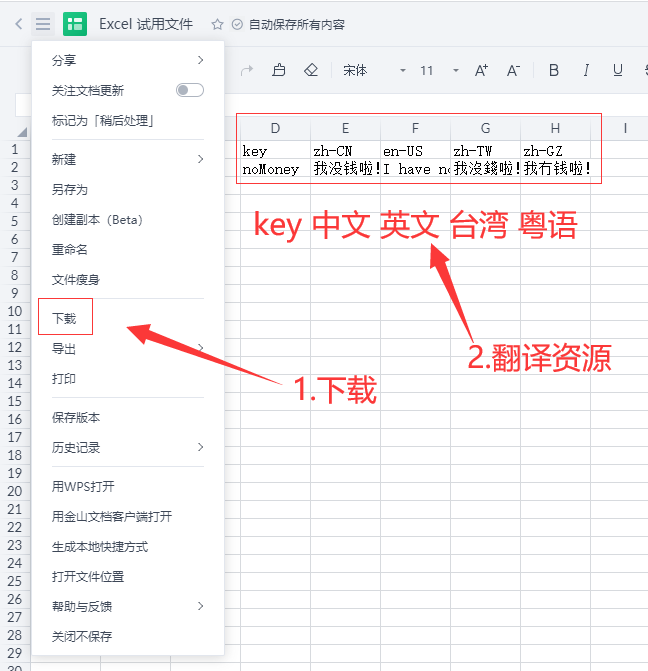

006 - Puppeteer
===

> Create by **jsliang** on **2021-06-16 22:15:56**  
> Recently revised in **2021-06-18 22:56:00**

——————————☆☆☆——————————

Node 系列相应地址：

* 代码仓库：https://github.com/LiangJunrong/all-for-one
* 文章仓库：https://github.com/LiangJunrong/document-library/tree/master/系列-前端资料/Node

——————————☆☆☆——————————

在前面的 5 篇文章打底下，咱们应该接入点接地气的业务了。

本篇开始将接触前端多语言功能。

不知道小伙伴们有没有接触过，这一次 **jsliang** 将把真实的项目中对于多语言的处理（对，仅是处理而不是讲解多语言怎么配置）脱敏后拿出来分享下。

> 该分享所用的数据仅为参考真实项目而虚构，毕竟这只是【工具库】而不是要打造支持多语言的项目，但是这套工具修改下还是能用到其他地方的，具备参考价值

本篇文章我们将讲解如何使用 Puppeteer 控制 Chrome/Chromium，从而达到下载文件的目的。

<!-- 目录开始 -->
## <a name="chapter-one" id="chapter-one"></a>一 目录

**不折腾的前端，和咸鱼有什么区别**

| 目录 |
| --- |
| [一 目录](#chapter-one) |
| <a name="catalog-chapter-two" id="catalog-chapter-two"></a>[二 前言](#chapter-two) |
| <a name="catalog-chapter-three" id="catalog-chapter-three"></a>[三 Puppeteer](#chapter-three) |
| &emsp;[3.1 抓取快照](#chapter-three-one) |
| &emsp;[3.2 下载文件](#chapter-three-two) |
| <a name="catalog-chapter-four" id="catalog-chapter-four"></a>[四 参考文献](#chapter-four) |
<!-- 目录结束 -->

## <a name="chapter-two" id="chapter-two"></a>二 前言

> [返回目录](#chapter-one)

Puppeteer 是一个 Node 库，它提供了一个高级 API 来通过 DevTools 协议控制 Chromium 或 Chrome。

就跟它在 GitHub 简介中介绍的一样：你在浏览器中手动执行的绝大多数操作都可以使用 Puppeteer 来完成！

* 抓取页面快照
* 生成页面 PDF
* 自动操作页面 DOM
* ……

详细例子小伙伴可以翻看本文下方参考文献的 GitHub 或者中文文档，这里不一一举例（免得被吐槽复制 README.md）

## <a name="chapter-three" id="chapter-three"></a>三 Puppeteer

> [返回目录](#chapter-one)

* 安装：`npm i puppeteer`

！**jsliang** 安装的时候报错：

* `(node:7584) ExperimentalWarning: The fs.promises API is experimental`

我的 Node.js 版本是 `node@10.16.0`，所以需要升级 Node.js。

查了下资料有 2 种方法升级，一种是下载最新版覆盖安装，另一种是通过 `nvm/nvmw` 方式去管理。

**jsliang** 网络还不错，直接下载个最新文档版吧：[Node 官网](https://nodejs.org/zh-cn/)

安装完毕后查看下最新版本：

* `node -v`：`v14.17.1`

这时候再安装 Puppeteer，显示安装成功，`package.json` 显示：`"puppeteer": "^10.0.0"`

> 安装 Puppeteer 过程中可能会有各式各样的报错，考验小伙伴们网速的时候到了

安装完毕，开始搞事~

### <a name="chapter-three-one" id="chapter-three-one"></a>3.1 抓取快照

> [返回目录](#chapter-one)

我们拿抓取页面快照做个简单举例：

> src/index.ts

```js
import program from 'commander';
import common from './common';
import './base/console';
import puppeteer from 'puppeteer';

program
  .version('0.0.1')
  .description('工具库')

program
  .command('jsliang')
  .description('jsliang 帮助指令')
  .action(() => {
    common();
  });

program
  .command('test')
  .description('测试频道')
  .action(async () => {
    // 启动浏览器
    const browser = await puppeteer.launch({
      headless: false, // 打开实体浏览器
    });

    // 创建新标签页并打开
    const page = await browser.newPage();
    await page.goto('https://www.baidu.com/s?wd=jsliang');

    // 获取快照并存储到本地
    await page.screenshot({
      path: './src/baidu.png',
    });

    // 关闭窗口
    await browser.close();
  });

program.parse(process.argv);
```

执行完 `npm run test` 之后，`src` 文件夹里面会出现图片文件 `baidu.png`，打开展示如下：


> 实测 科学上网工具 或者 360 安全卫士会对这操作造成影响，为了防止你血压飙升，请确保这些软件的关闭

这样我们就初步了解 Puppeteer 啦，当然它还可以导出 PDF 等，自行翻下文【参考文献】中的内容对 Puppeteer 进一步了解吧。

### <a name="chapter-three-two" id="chapter-three-two"></a>3.2 下载文件

> [返回目录](#chapter-one)

既然我们可以获取到截图，那么我们能操作 DOM 也就不足为奇，咱们获取下线上的文件吧！

拿金山文档举例，咱们先创建一个 Excel 文件：


创建方式可以自己去玩玩，就不做讲解了，金山文档地址：`https://www.kdocs.cn/`

然后，我们下个环节就是需要将这个 Excel 下载下来（假设已经请人做好翻译工作了），就是这样的 Excel：


> 该图片来源于网络，本次知识分享用以参考，侵权必删

然后咱们搞个简单的吧：



> 多语言咋样不重要，咱们目的是需要操作 Puppeteer 获取到这个 Excel 文件

OK，文件有了，咱们怎样才能下载下来呢？现在情况是：

* 试想一下如果我们通过 Puppeteer 打开，那是无头浏览器啊，跟无痕差不多了，如果正常登录的话，需要重新登录、进入链接，然后才是点击按钮，进行下载。

所以，这里用到金山文档的免登录链接：


> 众所众知免登录就是不用登陆，虽然这个解释很弱智，但是我感觉很有必要……

这里提供上面的 Demo 地址，小伙伴们可以拿来练习，但是不确保这个链接会不会哪天就被我删了，所以按照上面步骤自行设置一个吧！

* 【金山文档 Excel 试用文件.xlsx】：`https://www.kdocs.cn/l/sdwvJUKBzkK2`

---

OK，罗里吧嗦讲了那么多前置条件，下面咱们进入正题 —— 如何获取到线下文件：

1. 操作浏览器打开 `https://www.kdocs.cn/l/sdwvJUKBzkK2`
2. 睡眠 6.66s（确保浏览器打开链接并加载页面）
3. 然后触发【更多菜单】按钮的点击
4. 睡眠 2s（确保更多菜单按钮点击到）
5. 设置下载路径（确保下载位置，要不然弹窗就不好处理）
6. 最后触发【下载】按钮的点击
7. 睡眠 10s（确保资源下载到）
8. 关闭窗口

上面唯一要关注的点是第 5 点，因为我们 Windows 点击下载是会有弹窗的（并不是默认下载），所以需要提前设置好下载路径（代码中会体现）。


那么，上代码！

> src/common/index.ts

```js
import { inquirer } from '../base/inquirer';
import { Result } from '../base/interface';
import { sortCatalog } from './sortCatalog';
import { downLoadExcel } from './downLoadExcel';

const common = (): void => {
  // 问题路线：看 questionList.ts
  const questionList = [
    // q0
    {
      type: 'list',
      message: '请问需要什么服务？',
      choices: ['公共服务', '文件管理']
    },
    // q1
    {
      type: 'list',
      message: '当前公共服务有：',
      choices: ['文件排序']
    },
    // q2
    {
      type: 'input',
      message: '需要排序的文件夹为？（绝对路径）',
    },
    // q3
    {
      type: 'list',
      message: '请问需要什么支持？',
      choices: ['多语言', 'Markdown 转 Word'],
    },
    // q4
    {
      type: 'list',
      message: '请问需要什么支持？',
      choices: [
        '下载多语言资源',
        '导入多语言资源',
        '导出多语言资源',
      ],
    },
    // q5
    {
      type: 'input',
      message: '资源下载地址（HTTP）？',
      default: 'https://www.kdocs.cn/l/sdwvJUKBzkK2',
    }
  ];

  const answerList = [
    // q0
    async (result: Result, questions: any) => {
      if (result.answer === '公共服务') {
        questions[1]();
      } else if (result.answer === '文件管理') {
        questions[3]();
      }
    },
    // q1
    async (result: Result, questions: any) => {
      if (result.answer === '文件排序') {
        questions[2]();
      }
    },
    // q2
    async (result: Result, _questions: any, prompts: any) => {
      const sortResult = await sortCatalog(result.answer);
      if (sortResult) {
        console.log('排序成功！');
        prompts.complete();
      }
    },
    // q3
    async (result: Result, questions: any) => {
      if (result.answer === '多语言') {
        questions[4]();
      }
    },
    // q4
    async (result: Result, questions: any) => {
      if (result.answer === '下载多语言资源') {
        questions[5]();
      }
    },
    // q5
    async (result: Result, _questions: any, prompts: any) => {
      if (result.answer) {
        const downloadResult = await downLoadExcel(result.answer);
        if (downloadResult) {
          console.log('下载成功！');
          prompts.complete();
        }
      }
    },
  ];

  inquirer(questionList, answerList);
};

export default common;

```

看到上面的代码我后悔了，为啥 `Inquirer.ts` 被我改造的那么恶心，弄得 **jsliang** 还需要特地写个文件来表明问题序列然后才捋顺问题顺序：

> src/common/questionList.ts

```js
// common 板块的问题咨询路线
export const questionList = {
  '公共服务': { // q0
    '文件排序': { // q1
      '需要排序的文件夹': 'Work 工作', // q2
    },
  },
  '文件管理': { // q0
    '多语言': { // q3
      '下载多语言资源': { // q4
        '下载地址': 'Work 工作', // q5
      },
      '导入多语言资源': { // q4
        '导入地址': 'Work 工作',
      },
      '导出多语言资源': { // q4
        '导出全量资源': 'Work 工作',
        '导出单门资源': 'Work 工作',
      }
    },
    'Markdown 转 Word': '暂未支持', // q3
  },
};
```


写完后转入写功能上：

> src/common/downLoadExcel.ts

```js
import puppeteer from 'puppeteer';
import path from 'path';
import fs from 'fs';

export const downLoadExcel = async (link: string): Promise<boolean> => {
  // 启动浏览器
  const browser = await puppeteer.launch({
    headless: false, // 打开实体浏览器
    devtools: true, // 打开开发模式
  });

  // 1. 创建新标签页并打开
  const page = await browser.newPage();
  await page.goto(link);

  // 2. 睡眠 6.66s - 确保页面正常打开
  await page.waitForTimeout(6666);

  // 3. 触发【更多菜单】按钮的点击
  const moreBtn = await page.$('.header-more-btn');
  moreBtn?.click();

  // 4. 睡眠 1s - 确保按钮点击到
  await page.waitForTimeout(2000);

  // 5. 设置下载路径
  const dist = path.join(__dirname, './dist');
  if (!fs.existsSync(dist)) {
    fs.mkdirSync(dist);
  }
  await (page as any)._client?.send('Page.setDownloadBehavior', {
    behavior: 'allow',
    downloadPath: dist,
  });

  // 6. 触发【下载】按钮的点击
  const elements = await page.$$('.header-menu-item');
  let downloadBtn;
  if (elements.length) {
    downloadBtn = elements[8];
  }
  if (!downloadBtn) {
    console.error('没找到下载按钮');
    await browser.close();
  }
  await downloadBtn?.click();

  // 7. 睡眠 10s - 确保资源下载到
  await page.waitForTimeout(10000);

  // 8. 关闭窗口
  await browser.close();

  return await true;
};
```

这样子运行之后，如果控制台不报错，那么 VS Code 展示为：


可以看到 `common` 目录下的确有 `dist/Excel 试用文件.xlsx` 了，咱们就可以接入 `node-xlsx` 这个库来操作 Excel 啦~

下期见！

## <a name="chapter-four" id="chapter-four"></a>四 参考文献

> [返回目录](#chapter-one)

* [Github: Puppeteer](https://github.com/puppeteer/puppeteer)
* [Puppeteer](https://zhaoqize.github.io/puppeteer-api-zh_CN/)
* [puppeteer 前端利器](https://www.cnblogs.com/mingme/p/14013325.html)
* [Puppeteer 之爬虫入门](https://blog.fundebug.com/2017/11/01/guide-to-automating-scraping-the-web-with-js/)

---

**不折腾的前端，和咸鱼有什么区别！**

觉得文章不错的小伙伴欢迎点赞/点 Star。

如果小伙伴需要联系 **jsliang**：

* [Github](https://github.com/LiangJunrong/document-library)
* [掘金](https://juejin.im/user/3403743728515246)

个人联系方式存放在 Github 首页，欢迎一起折腾~

争取打造自己成为一个充满探索欲，喜欢折腾，乐于扩展自己知识面的终身学习横杠程序员。

> jsliang 的文档库由 [梁峻荣](https://github.com/LiangJunrong) 采用 [知识共享 署名-非商业性使用-相同方式共享 4.0 国际 许可协议](http://creativecommons.org/licenses/by-nc-sa/4.0/) 进行许可。<br/>基于 [https://github.com/LiangJunrong/document-library](https://github.com/LiangJunrong/document-library) 上的作品创作。<br/>本许可协议授权之外的使用权限可以从 [https://creativecommons.org/licenses/by-nc-sa/2.5/cn/](https://creativecommons.org/licenses/by-nc-sa/2.5/cn/) 处获得。
