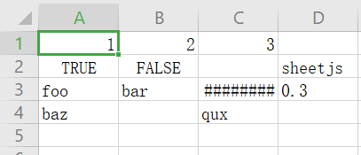

007 - node-xlsx
===

> Create by **jsliang** on **2021-06-03 17:55:35**  
> Recently revised in **2021-07-12 23:34:00**

——————————☆☆☆——————————

Node 系列相应地址：

* 代码仓库：https://github.com/LiangJunrong/all-for-one
* 文章仓库：https://github.com/LiangJunrong/document-library/tree/master/系列-前端资料/Node

——————————☆☆☆——————————

在通过 Puppeteer 操作浏览器下载到 Excel 之后，我们终于可以将预备将多语言的操作玩出花来了。

本篇我们将通过 `node-xlsx`，对 Excel 进行多语言导入导出的操作。

<!-- 目录开始 -->
## <a name="chapter-one" id="chapter-one"></a>一 目录

**不折腾的前端，和咸鱼有什么区别**

| 目录 |
| --- |
| [一 目录](#chapter-one) |
| <a name="catalog-chapter-two" id="catalog-chapter-two"></a>[二 前言](#chapter-two) |
| <a name="catalog-chapter-three" id="catalog-chapter-three"></a>[三 快速开始](#chapter-three) |
| &emsp;[3.1 测试导入](#chapter-three-one) |
| &emsp;[3.2 测试导出](#chapter-three-two) |
| &emsp;[3.3 测试定制宽度](#chapter-three-three) |
| <a name="catalog-chapter-four" id="catalog-chapter-four"></a>[四 多语言操作](#chapter-four) |
| &emsp;[4.1 导入](#chapter-four-one) |
| &emsp;[4.2 导出](#chapter-four-two) |
| <a name="catalog-chapter-five" id="catalog-chapter-five"></a>[五 后续](#chapter-five) |
| <a name="catalog-chapter-six" id="catalog-chapter-six"></a>[六 参考文献](#chapter-six) |
<!-- 目录结束 -->

## <a name="chapter-two" id="chapter-two"></a>二 前言

> [返回目录](#chapter-one)

在服务端的工作中，生成报表并送给运营、产品进行分析应该是一门简单手艺。

但是在前端中，能这样耍的机会并不多，所以多语言操作是个好玩的点（没接触过的会觉得比较新鲜）。

当然，既然服务端可以，对 Node.js 来说，提供这种功能也无可厚非。

**jsliang** 非常懒，所以直奔主题打开 GitHub：


那就第 1 个了，不要搞什么调研不调研的，对于非生产数据来说，我就是玩~

看第一行简介：`Excel file parser/builder that relies on js-xlsx.`

`js-xlsx`？这个我知道啊，在 `2021.06.03` 这一刻有 `25.7k` Star 的仓库地址：`https://github.com/SheetJS/sheetjs`

> 其实一开始试了下它关于 Node 的，enm...一时半会没入门！

但是，我还是用我的 `node-xlsx` 吧，毕竟例子都在它仓库的 README.md 贴出来了！

## <a name="chapter-three" id="chapter-three"></a>三 快速开始

> [返回目录](#chapter-one)

* 安装包：`npm i node-xlsx -S`
* 安装 TypeScript：`npm i @types/node-xlsx -D`

### <a name="chapter-three-one" id="chapter-three-one"></a>3.1 测试导入

> [返回目录](#chapter-one)

> src/index.ts

```js
import program from 'commander';
import common from './common';
import './base/console';
import xlsx from 'node-xlsx';
import fs from 'fs';

program
  .version('0.0.1')
  .description('工具库')

program
  .command('jsliang')
  .description('jsliang 帮助指令')
  .action(() => {
    common();
  });

program
  .command('test')
  .description('测试频道')
  .action(async () => {
    // 测试新功能的时候使用
    
    // 以 buffer 形式导入
    const workSheetsFromBuffer = xlsx.parse(fs.readFileSync(`${__dirname}/common/dist/Excel 试用文件.xlsx`));
    console.log(JSON.stringify(workSheetsFromBuffer, null, 2));

    // 以文件形式导入
    const workSheetsFromFile = xlsx.parse(`${__dirname}/common/dist/Excel 试用文件.xlsx`);
    console.log(JSON.stringify(workSheetsFromFile, null, 2));
  });

program.parse(process.argv);
```

执行 `npm run test`，控制台打印如下：

```js
---1---
[
  {
    "name": "Sheet1",
    "data": [
      [
        "key",
        "zh-CN",
        "en-US",
        "zh-TW",
        "zh-GZ"
      ],
      [
        "noMoney",
        "我没钱啦！",
        "I have no money",
        "我沒錢啦！",
        "我冇钱啦！"
      ]
    ]
  }
]

---2---
[
  {
    "name": "Sheet1",
    "data": [
      [
        "key",
        "zh-CN",
        "en-US",
        "zh-TW",
        "zh-GZ"
      ],
      [
        "noMoney",
        "我没钱啦！",
        "I have no money",
        "我沒錢啦！",
        "我冇钱啦！"
      ]
    ]
  }
]
```

OK，都能正常导入~

### <a name="chapter-three-two" id="chapter-three-two"></a>3.2 测试导出

> [返回目录](#chapter-one)

```js
import program from 'commander';
import common from './common';
import './base/console';
import xlsx from 'node-xlsx';
import fs from 'fs';

program
  .version('0.0.1')
  .description('工具库')

program
  .command('jsliang')
  .description('jsliang 帮助指令')
  .action(() => {
    common();
  });

program
  .command('test')
  .description('测试频道')
  .action(async () => {
    // 测试新功能的时候使用
    
    // 导出数据
    const data = [
      [1, 2, 3],
      [true, false, null, 'sheetjs'],
      ['foo', 'bar', new Date('2014-02-19T14:30Z'), '0.3'],
      ['baz', null, 'qux'],
    ];
    const buffer = xlsx.build([{ name: "jsliang", data: data }]); // 拿到文件 buffer

    // 写入文件
    fs.writeFileSync(`${__dirname}/common/dist/test-sheet.xlsx`, Buffer.from(buffer));
  });

program.parse(process.argv);
```

执行 `npm run test` 后，目录变成：


打开这个 Excel 文件，可以看到：



好的，导出也 OK 了~

### <a name="chapter-three-three" id="chapter-three-three"></a>3.3 测试定制宽度

> [返回目录](#chapter-one)

当然，有时候产品非常懒，需要我们将表格宽度给做好成每一列都能宽一点，那就要定制下页面宽度：

> index.ts

```js
import program from 'commander';
import common from './common';
import './base/console';
import xlsx from 'node-xlsx';
import fs from 'fs';

program
  .version('0.0.1')
  .description('工具库')

program
  .command('jsliang')
  .description('jsliang 帮助指令')
  .action(() => {
    common();
  });

program
  .command('test')
  .description('测试频道')
  .action(async () => {
    // 测试新功能的时候使用
    
    // 导出数据
    const data = [
      ['key', 'zh-CN', 'en-US', 'zh-TW', 'zh-GZ'],
      ['noMoney', '我没钱啦！', 'I have no money', '我沒錢啦！', '我冇钱啦！'],
    ];
    // 列宽设置
    const options = {
      '!cols': [
        { wch: 10 },
        { wch: 15 },
        { wch: 15 },
        { wch: 15 },
        { wch: 15 },
      ]
    }
    // 生成 buffer
    const buffer = xlsx.build([{ name: "jsliang", data: data }], options); // 拿到文件 buffer

    // 写入文件
    fs.writeFileSync(`${__dirname}/common/dist/Excel 导出文件.xlsx`, Buffer.from(buffer));
  });

program.parse(process.argv);
```

执行 `npm run test`，看到 `dist` 目录生成：


然后点开「Excel 导出文件.xlsx」，里面内容为：


安逸，满屏飘满 no money~

## <a name="chapter-four" id="chapter-four"></a>四 多语言操作

> [返回目录](#chapter-one)

在我们简单了解 `node-xlsx` 之后，我们就可以通过它完成多语言的导入导出，以及下一章会讲解如何获取需要的资源。

### <a name="chapter-four-one" id="chapter-four-one"></a>4.1 导入

> [返回目录](#chapter-one)

接「006 - Puppeteer」，我们在上一篇文章已经完成了资源的下载，实际上我们应该一条龙服务，从下载到导入统统给安排了。

那么，我们当前的目录需要改造一番：

```
- src
  + base
  - common
    - language
      + dist
      - download.ts
      - export.ts
      - import.ts
      - source.json
    - index.ts
    - questionList.ts
    - sortCatalog.ts
  - index.ts
```

文字目录好像没那么清晰，还是贴个图吧：


那么，开始写代码：

> questionList.ts - 先明确自己的提问路线

```js
// common 板块的问题咨询路线
export const questionList = {
  '公共服务': { // q0
    '文件排序': { // q1
      '需要排序的文件夹': 'Work 工作', // q2
    },
  },
  '多语言': { // q0
    '下载多语言资源': { // q3
      '下载地址': 'Work 工作', // q4
    },
    '导入多语言资源': { // q3
      '下载地址': 'Work 工作', // q4
    },
    '导出多语言资源': { // q3
      '导出全量资源': 'Work 工作',
      '导出单门资源': 'Work 工作',
    }
  },
};
```

> index.ts

```js
import { inquirer } from '../base/inquirer';
import { Result } from '../base/interface';
import { sortCatalog } from './sortCatalog';
import { downLoadExcel } from './language/download';
import { importLanguage } from './language/import';
import { exportLanguage } from './language/export';

// 问题记录器
const answers = {
  q0: '',
  q1: '',
  q2: '',
  q3: '',
  q4: '',
};

const common = (): void => {
  // 问题路线：看 questionList.ts
  const questionList = [
    // q0
    {
      type: 'list',
      message: '请问需要什么服务？',
      choices: ['公共服务', '多语言']
    },
    // q1
    {
      type: 'list',
      message: '当前公共服务有：',
      choices: ['文件排序']
    },
    // q2
    {
      type: 'input',
      message: '需要排序的文件夹为？（绝对路径）',
    },
    // q3
    {
      type: 'list',
      message: '请问多语言需要什么支持？',
      choices: [
        '下载多语言资源',
        '导入多语言资源',
        '导出多语言资源',
      ],
    },
    // q4
    {
      type: 'input',
      message: '资源下载地址（HTTP）？',
      default: 'https://www.kdocs.cn/l/sdwvJUKBzkK2',
    }
  ];

  const answerList = [
    // q0 - 请问需要什么服务？
    async (result: Result, questions: any) => {
      answers.q0 = result.answer;
      switch (result.answer) {
        case '公共服务':
          questions[1]();
          break;
        case '多语言':
          questions[3]();
          break;
        default: break;
      }
    },
    // q1 - 当前公共服务有：
    async (result: Result, questions: any) => {
      answers.q1 = result.answer;
      if (result.answer === '文件排序') {
        questions[2]();
      }
    },
    // q2 - 需要排序的文件夹为？（绝对路径）
    async (result: Result, _questions: any, prompts: any) => {
      answers.q2 = result.answer;
      const sortResult = await sortCatalog(result.answer);
      if (sortResult) {
        console.log('排序成功！');
        prompts.complete();
      }
    },
    // q3 - 请问多语言需要什么支持？
    async (result: Result, questions: any, prompts: any) => {
      answers.q3 = result.answer;
      switch (result.answer) {
        case '下载多语言资源':
        case '导入多语言资源':
          questions[4]();
          break;
        case '导出多语言资源':
          const exportResult = await exportLanguage();
          if (exportResult) {
            console.log('导出成功！');
            prompts.complete();
          }
        default: break;
      }
    },
    // q4 - 资源下载地址（HTTP）？
    async (result: Result) => {
      answers.q4 = result.answer;
      const download = async (): Promise<any> => {
        const downloadResult = await downLoadExcel(result.answer);
        if (downloadResult) {
          console.log('下载成功！');
          return true;
        }
      };
      switch (answers.q3) {
        case '下载多语言资源':
          await download();
          break;
        case '导入多语言资源':
          await download();
          const importResult = await importLanguage();
          if (importResult) {
            console.log('导入完毕！');
          }
        default:
          break;
      }
    },
  ];

  inquirer(questionList, answerList);
};

export default common;

```

需要注意的是，我们如果要导入的话，肯定有个对应的资源文件，这边就用 `source.json` 演示：

> source.json

```js
{
  "zh-CN": {

  },
  "en-US": {

  },
  "zh-TW": {

  },
  "zh-GZ": {

  }
}
```

简版内容如下，通过 `import.ts` 导入资源并填充里面内容：

> import.ts

```js
import xlsx from 'node-xlsx';
import fs from 'fs';
import path from 'path';

export const importLanguage = async (): Promise<boolean> => {
  const language = JSON.parse(fs.readFileSync(path.join(__dirname, './source.json'), 'utf8'));

  const workSheetsFromBuffer = xlsx.parse(
    fs.readFileSync(
      path.join(__dirname, '/dist/Excel 试用文件.xlsx'),
    ),
  );

  const sheet1Data = workSheetsFromBuffer[0].data.map(i => i.map(j => String(j)));

  // 获取头部数据
  const header = sheet1Data[0];
  
  // 查找 key 对应列
  let keyIndex = 0;
  for (let i = 0; i < header.length; i++) {
    if (header[i] === 'key') {
      keyIndex = i;
      break;
    }
  }
  if (keyIndex < 0) {
    console.error('未找到 key 对应列！');
    return false;
  }

  // 设置资源内容
  const fullLanguage: any[] = [...Object.keys(language), ...header.filter((item: any) => item !== 'key')];
  const filterFullLanguage = new Set();
  for (let i = 0; i < fullLanguage.length; i++) {
    if (!filterFullLanguage.has(fullLanguage[i])) {
      filterFullLanguage.add(fullLanguage[i]);
      // 如果没有该种语言，则新增
      if (!language[fullLanguage[i]]) {
        language[fullLanguage[i]] = {};
      }
    }
  }

  // 获取内容数据
  const body = sheet1Data.slice(1);
  for (let i = 0; i < body.length; i++) {

    for (let j = 0; j < body[i].length; j++) {
      if (j !== keyIndex) {
        const nowLanguage = language[header[j]]; // 一个损耗性能的操作，每次都会读取新列表，但是我不想优化
        const nowKey = body[i][keyIndex]; // 获取这一行的 key
        nowLanguage[nowKey] = body[i][j]; // 替换 key
      }
    }
  }

  fs.writeFileSync(path.join(__dirname, './source.json'), JSON.stringify(language, null, 2), 'utf8');

  return true;
};
```

> export.ts

```js
export const exportLanguage = async (): Promise<boolean> => {
  // 详细内容待补充
  return await true;
};
```

编写完毕，执行 `npm run jsliang`，按照提问逐个回车：


然后代码跑起来（姿势很帅），成功导入：


这样导入流程就完毕了。

> 当然，导入的过程中，还需要修复对齐 key（即某中文 key 情况下，其他资源未翻译；或者删除 key 资源），这些就不哆嗦列举了，需要的时候补充写一写，也不难~

### <a name="chapter-four-two" id="chapter-four-two"></a>4.2 导出

> [返回目录](#chapter-one)

导入尚且如此，导出就更轻松了：

> export.ts

```js
import xlsx from 'node-xlsx';
import fs from 'fs';
import path from 'path';

export const exportLanguage = async (): Promise<boolean> => {
  const languageData = JSON.parse(fs.readFileSync(path.join(__dirname, './source.json'), 'utf8'));

  // 组装头部数据
  const header = Object.keys(languageData);

  // 组装内容数据
  const chineseKeyList = Object.keys(languageData['zh-CN']);
  const body: any[] = [];
  for (let i = 0; i < chineseKeyList.length; i++) {
    const nowKey = chineseKeyList[i];
    const nowFloor = [nowKey];
    console.log(nowFloor, nowKey);
    for (let j = 0; j < header.length; j++) {
      const nowLanguage = header[j];
      nowFloor.push(languageData[nowLanguage][nowKey]);
    }
    body.push(nowFloor);
  }

  // 导出数据
  const data = [
    ['keys', ...header],
    ...body,
  ];
  const buffer = xlsx.build([{ name: "jsliang", data: data }]); // 拿到文件 buffer

  // 写入文件
  fs.writeFileSync(path.join(__dirname, './dist/Excel 导出文件.xlsx'), Buffer.from(buffer));

  return await true;
};
```

执行 `npm run jsliang`，按流程点点：


然后就看下 `dist` 目录有没有对应的文件：


在打开文件看看：


OK，搞定，收工~

## <a name="chapter-five" id="chapter-five"></a>五 后续

> [返回目录](#chapter-one)

那么，Excel 的操作流程我们就安排得明明白白了。

再往下一章，**jsliang** 可能开启 Node 服务，完成简单网站的搭建，不过 **jsliang** 于 2018 年写过一篇 Node 从 0 基础到企业官网的文章了，所以咱们尝试搞个小游戏吧，嘿嘿~

> 当前阶段算上 Node 初篇完毕，主要也没啥内容，后续会补充开启服务，WebSocket 等内容，冲鸭~

## <a name="chapter-six" id="chapter-six"></a>六 参考文献

> [返回目录](#chapter-one)

* [nodejs 实现导出 excel 报表](https://cloud.tencent.com/developer/article/1653844)
* [GitHub：SheetJS](https://github.com/SheetJS/sheetjs)
* [GitHub：node-xlsx](https://github.com/mgcrea/node-xlsx)

---

**不折腾的前端，和咸鱼有什么区别！**

觉得文章不错的小伙伴欢迎点赞/点 Star。

如果小伙伴需要联系 **jsliang**：

* [Github](https://github.com/LiangJunrong/document-library)
* [掘金](https://juejin.im/user/3403743728515246)

个人联系方式存放在 Github 首页，欢迎一起折腾~

争取打造自己成为一个充满探索欲，喜欢折腾，乐于扩展自己知识面的终身学习横杠程序员。

> jsliang 的文档库由 [梁峻荣](https://github.com/LiangJunrong) 采用 [知识共享 署名-非商业性使用-相同方式共享 4.0 国际 许可协议](http://creativecommons.org/licenses/by-nc-sa/4.0/) 进行许可。<br/>基于 [https://github.com/LiangJunrong/document-library](https://github.com/LiangJunrong/document-library) 上的作品创作。<br/>本许可协议授权之外的使用权限可以从 [https://creativecommons.org/licenses/by-nc-sa/2.5/cn/](https://creativecommons.org/licenses/by-nc-sa/2.5/cn/) 处获得。
