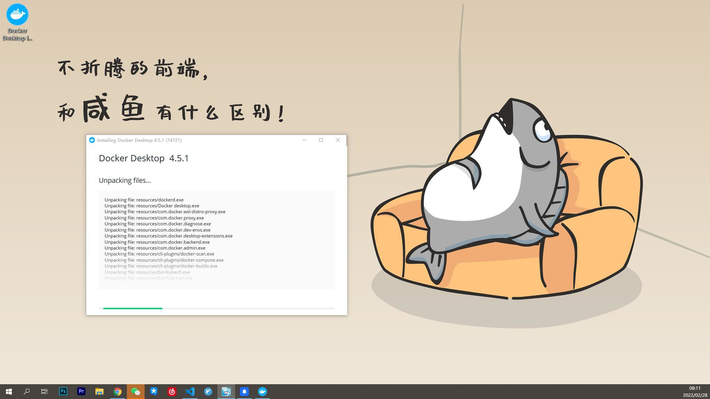
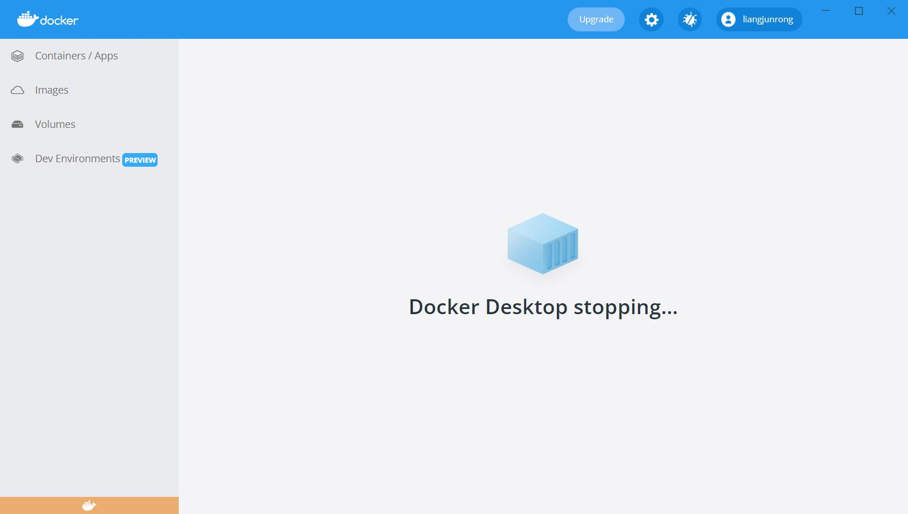
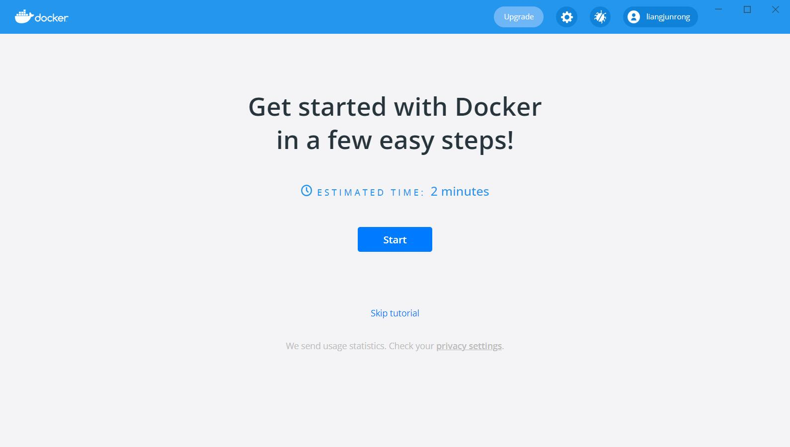
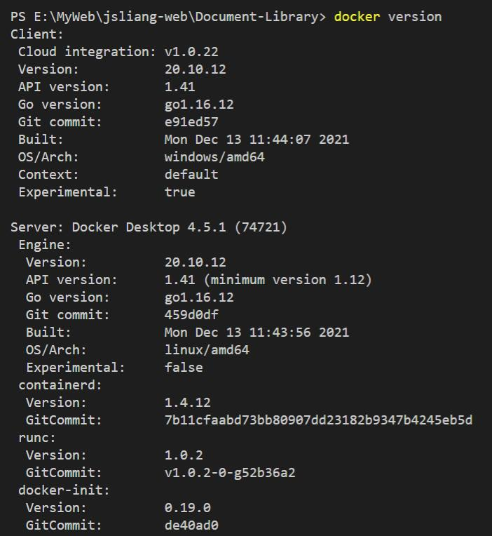
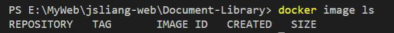
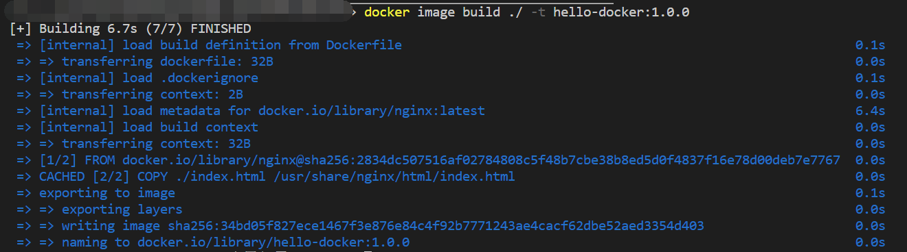
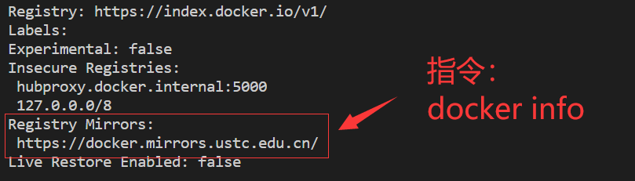

Docker
===

> Create by **jsliang** on **2022-02-28 08:40:59**  
> Recently revised in **2022-02-28 19:55:30**

## 一、安装

### 1.1 下载 & 安装

打开地址进行下载：

* https://www.docker.com/products/docker-desktop

安装过程如下：



### 1.2 查看版本

安装完毕后查看版本：`docker version`


注意，此时它报错：`error during connect: This error may indicate that the docker daemon is not running.`

### 1.3 修复 error during connect

当它报这个错的时候，可以看到桌面端无法正常启动，界面显示 `Docker Desktop stopping...`



解决上面报错方法：

* https://stackoverflow.com/questions/40459280/docker-cannot-start-on-windows

我使用的解决方案是 Manuel Larrota 的，界面上 Ctrl + F 直接搜这个人就好

> **注意**：修复问题过程中很可能要求重启，所以该重启的时候就重启，别一直觉得他们提供的方案没问题

### 1.4 修复 WSL 2 installation is iscomplate

启动 Docker 的时候，弹窗：


大概意思就是缺少某个小组件，找到同样疑惑：

* https://superuser.com/questions/1584710/docker-wsl-2-installation-is-incomplete

解决方案（Using WSL 2 based engine）：

* https://docs.microsoft.com/en-us/windows/wsl/install-manual#step-4---download-the-linux-kernel-update-package

下载这个 `.msi` 文件并安装即可。

> **注意**：修复问题过程中很可能要求重启，所以该重启的时候就重启，别一直觉得他们提供的方案没问题

### 1.5 检查正常运转

* 查看桌面端：



* 查看 Docker 版本：`docker version`



* 查看镜像（Image）：`docker image ls`



## 二、Docker 基础入门

安装完毕后，我们就开始折腾吧：

* **在 Docker 上部署一个 Nginx 服务，上面放一个简单的 index.html 页面**

> 不用太过于计较下面指令的意思，我们会在下面进一步讲解

那么，Here we go~

**首先**，我们新建个 `demo-01` 的文件夹，之后控制台输入：

* 跳转到该文件夹：`cd demo-01`

并在里面存放 2 个文件：

> Dockerfile

```dockerfile
# 本镜像拷贝自 Nginx 镜像
FROM nginx

# 将当前目录下的 index.html 挪到 Nginx 的 html 目录中
COPY ./index.html /usr/share/nginx/html/index.html

# 对外暴露本镜像的 80 端口
EXPOSE 80
```

> index.html

```html
<!DOCTYPE html>
<html lang="en">
<head>
  <meta charset="UTF-8">
  <meta name="viewport" content="width=device-width,initial-scale=1.0,maximum-scale=1.0,user-scalable=no">
  <meta http-equiv="X-UA-Compatible" content="ie=edge">
  <title>Hello Docker</title>
  <style>
    /* 设置页面居中显示 Hello Docker! */
    body {
      margin: 0 auto;
      width: 1000px;
    }
    h1 {
      text-align: center;
    }
  </style>
</head>
<body>
  <h1>Hello Docker!</h1>
</body>
</html>

```

**然后**，我们编写指令创建镜像（Image）：

* `docker image build ./ -t hello-docker:1.0.0`

> 在这行指令中，我们基于相对路径 `./`，创建了一个叫 `hello-docker` 的镜像，它的 TAG 是 `1.0.0`（相当于版本），而 `-t` 的意思就是为容器重新分配了一个伪输入终端。



**接着**，我们创建容器（Container）：

* `docker container create -p 2222:80 hello-docker:1.0.0`

> 在这行指令中，我们基于镜像 `hello-docker` 且 TAG 为 `1.0.0` 版本的，创建了一个容器，并将宿主机的 `2222` 端口，映射到容器的 `80` 端口


此时控制台返回一串字符，即 **创建容器得到的结果**

**最后**，我们运行这个容器（Container）：

* `docker container start 312b8278e11373cb3211faeab53b7f0b47e996b5e84fc58`

> 在这行指令中，我们通过 `docker start CONTAINER_ID`，启动了这个容器


这时候，如果你打开界面：http://127.0.0.1:2222/

你就会看到：


恭喜你！入手 Docker 啦~

有局域网或者 WIFI 的小伙伴，可以修改 ip 地址（`http://ip 地址:2222/`）看看，正常情况下是可以访问成功的。

## 三、Docker 基础入门指令解疑

在上面代码中，我们有几个概念需要理解：

* Dockerfile 是什么？
* 镜像（Image）是什么？
* 容器（Container）是什么？

下面我们会一一讲解，并且罗列下像 **jsliang** 这样的新手，入门时候都应该懂哪些指令。

### 3.1 Dockerfile 是什么？

Dockerfile 是一个用来构建镜像的文本文件，文本内容包含了一条条构建镜像所需的指令和说明。

Docker 通过读取 Dockerfile 中的指令自动生成镜像。

Dockerfile 可以使用在命令行中调用任何命令。

Dockerfile 一般分为四部分：基础镜像信息、维护者信息、镜像操作指令和容器启动时执行指令。

简单来说：你可以通过 Dockerfile，告诉 Docker 编译的时候需要注意什么情况，就好比你通过 `package.json`，告诉 `npm` 我需要安装的包都有哪些一样。

> 参考文献：[华为云 - 什么是 Dockerfile](https://www.huaweicloud.com/zhishi/edu-arc-yys28.html)

### 3.2 镜像（Image）是什么？

镜像是一个文件系统，提供了容器运行时需要用到的文件和参数配置。

相当于平时在使用某个软件时需要下载的安装包，也相当于安装操作系统时需要用到的 ISO 文件。

简单来说：你可以把镜像（Image）看成是一张 Windows 11 的系统光盘，然后哪部电脑需要安装新系统，就基于这张光盘安装就可以了。

在 Docker Hub 上面有许许多多的镜像，感兴趣的小伙伴可以前往查看和下载：https://hub.docker.com/

值得一提的是：

* **国内官方源下载速度会比较慢，所以跟 npm 一样切换个国内源地址是不错的选择，例如 中国科学技术大学（中科大）、阿里云、网易、Docker 官方中国区等**

| 镜像仓库名称 | 链接 |
| --- | --- |
| Docker 官方中国区 | https://registry.docker-cn.com |
| 网易 163 | http://hub-mirror.c.163.com |
| 中国科学技术大学 | https://docker.mirrors.ustc.edu.cn |
| 阿里云 | https://<你的ID>.mirror.aliyuncs.com |

**Mac 修改方式**：

1. 修改 Docker 镜像仓库配置：`sudo vim /etc/docker/daemon.json`
2. 修改配置文件：

> daemon.json

```json
{
  "registry-mirrors": ["https://docker.mirrors.ustc.edu.cn"],
}
```

3. 使配置文件生效：`sudo systemctl daemon-reload` 
4. 重启 Docker：`sudo service docker restart`

**Windows 修改方式**：


修改完毕后，通过指令 `docker info` 查看：



当然，需要注意的是：切换源重启后，会导致当前的容器暂停掉，重启回来就行了。

> 参考文献：[知乎 - 测试的能量 - Docker 入门：镜像 image](https://zhuanlan.zhihu.com/p/144355897)

### 3.3 容器（Container）是什么？

容器（Container），就是一种轻量级的虚拟化技术，目的和虚拟机一样，都是为了创造 “隔离环境”。

镜像（Image）和容器（Container）的关系，就像是面向程序设计中的 **类** 和 **实例** 一样，镜像是静态的定义，容器是镜像运行时的实体。

结合我们前面的小实例，我们会看到：

* 创建镜像（Image）：`docker image build ./ -t hello-docker:1.0.0`
* 创建容器（Container）：`docker container create -p 2222:80 hello-docker:1.0.0`

在这里，我们创建容器的时候，其中 `hello-docker:1.0.0` 就是镜像的 REPOSITORY 和 TAG，我们基于这个镜像，创建了一个容器，并指定了它的端口。

同时，在说到端口的时候，我们讲到了 **宿主机**，宿主机即相对于容器来说的主机，即 **jsliang** 的手提笔记本的 Windows 10 系统。

> 敲重点！后面会有 **宿主机** 的出现，别漏知识点啦！

## 四、Docker 部署 Node 服务


## 五、Docker 指令

## 六、Shell 指令

## 七、Docker 部署 Puppeteer 无头浏览器


## 参考文献

* [华为云 - 什么是 Dockerfile](https://www.huaweicloud.com/zhishi/edu-arc-yys28.html)
* [知乎 - 测试的能量 - Docker 入门：镜像 image](https://zhuanlan.zhihu.com/p/144355897)
* [Docker Hub](https://hub.docker.com/)
* [SegmentFault - facelessman - Docker 必备六大国内镜像](https://segmentfault.com/a/1190000023117518)
* [CSDN - AC_bin - docker 修改使用国内镜像源](https://blog.csdn.net/qq_21384293/article/details/115180907)
* [CSDN - Yvesty - win10-Docker desktop 切换中国镜像源](https://blog.csdn.net/Yvesty/article/details/118601701)
* [Andy_Lee - 可能是把 Docker 的概念讲的最清楚的一篇文章](http://dockone.io/article/6051)
* [华为云 - 崔云龙 - 什么是 Docker 容器？](https://info.support.huawei.com/info-finder/encyclopedia/zh/Docker%E5%AE%B9%E5%99%A8.html)
* [Docker — 从入门到实践](https://yeasy.gitbook.io/docker_practice/basic_concept/container)

---

**不折腾的前端，和咸鱼有什么区别！**

觉得文章不错的小伙伴欢迎点赞/点 Star。

如果小伙伴需要联系 **jsliang**：

* [Github](https://github.com/LiangJunrong/document-library)

个人联系方式存放在 Github 首页，欢迎一起折腾~

争取打造自己成为一个充满探索欲，喜欢折腾，乐于扩展自己知识面的终身学习横杠程序员。

> jsliang 的文档库由 [梁峻荣](https://github.com/LiangJunrong) 采用 [知识共享 署名-非商业性使用-相同方式共享 4.0 国际 许可协议](http://creativecommons.org/licenses/by-nc-sa/4.0/) 进行许可。<br/>基于 [https://github.com/LiangJunrong/document-library](https://github.com/LiangJunrong/document-library) 上的作品创作。<br/>本许可协议授权之外的使用权限可以从 [https://creativecommons.org/licenses/by-nc-sa/2.5/cn/](https://creativecommons.org/licenses/by-nc-sa/2.5/cn/) 处获得。
