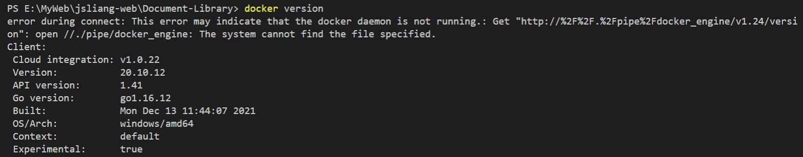

01 - 下载 & 安装
===

> Create by **jsliang** on **2022-03-01 12:45:21**  
> Recently revised in **2022-03-01 12:45:21**

* Docker 系列文档：https://github.com/LiangJunrong/document-library/tree/master/%E7%B3%BB%E5%88%97-%E5%89%8D%E7%AB%AF%E8%B5%84%E6%96%99/Node/Node%20%E5%BA%94%E7%94%A8%E9%83%A8%E7%BD%B2

## 一、下载 & 安装

打开地址进行下载：

* https://www.docker.com/products/docker-desktop

安装过程如下：

## 二、查看版本

安装完毕后查看版本：`docker version`

注意，此时它报错：`error during connect: This error may indicate that the docker daemon is not running.`

## 三、修复 error during connect

当它报这个错的时候，可以看到桌面端无法正常启动，界面显示 `Docker Desktop stopping...`

解决上面报错方法：

* https://stackoverflow.com/questions/40459280/docker-cannot-start-on-windows

我使用的解决方案是 **Manuel Larrota** 的，界面上 Ctrl + F 直接搜这个人就好

> **注意**：修复问题过程中很可能要求重启，所以该重启的时候就重启，别一直觉得他们提供的方案没问题

## 四、修复 WSL 2 installation is iscomplate

启动 Docker 的时候，弹窗：

大概意思就是缺少某个小组件，找到同样疑惑：

* https://superuser.com/questions/1584710/docker-wsl-2-installation-is-incomplete

解决方案（Using WSL 2 based engine）：

* https://docs.microsoft.com/en-us/windows/wsl/install-manual#step-4---download-the-linux-kernel-update-package

下载这个 `.msi` 文件并安装即可。

> **注意**：修复问题过程中很可能要求重启，所以该重启的时候就重启，别一直觉得他们提供的方案没问题

## 五、检查正常运转

* 查看桌面端：

* 查看 Docker 版本：`docker version`

* 查看镜像（Image）：`docker image ls`

## 六、小结

那么，经过这一系列操作，我们终于安装并跑起来 Docker 服务了，下面就可以开始操作啦！

欢迎期待下篇：02 - 入门 & Nginx 服务

---

**不折腾的前端，和咸鱼有什么区别！**

觉得文章不错的小伙伴欢迎点赞/点 Star。

如果小伙伴需要联系 **jsliang**：

* [Github](https://github.com/LiangJunrong/document-library)

个人联系方式存放在 Github 首页，欢迎一起折腾~

争取打造自己成为一个充满探索欲，喜欢折腾，乐于扩展自己知识面的终身学习斜杠程序员。

> jsliang 的文档库由 [梁峻荣](https://github.com/LiangJunrong) 采用 [知识共享 署名-非商业性使用-相同方式共享 4.0 国际 许可协议](http://creativecommons.org/licenses/by-nc-sa/4.0/) 进行许可。 基于 [https://github.com/LiangJunrong/document-library](https://github.com/LiangJunrong/document-library) 上的作品创作。 本许可协议授权之外的使用权限可以从 [https://creativecommons.org/licenses/by-nc-sa/2.5/cn/](https://creativecommons.org/licenses/by-nc-sa/2.5/cn/) 处获得。
