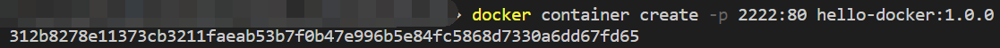
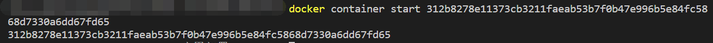
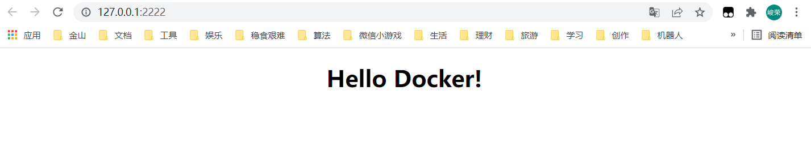

02 - 入门 & Nginx 服务
===

> Create by **jsliang** on **2022-03-01 12:48:04**  
> Recently revised in **2022-03-01 12:48:04**

* 本篇文档对应的代码：https://github.com/LiangJunrong/all-for-one/tree/master/035-Docker%20for%20Nginx
* Docker 系列文档：https://github.com/LiangJunrong/document-library/tree/master/%E7%B3%BB%E5%88%97-%E5%89%8D%E7%AB%AF%E8%B5%84%E6%96%99/Node/Node%20%E5%BA%94%E7%94%A8%E9%83%A8%E7%BD%B2

安装完毕后，我们就开始折腾吧：

* **在 Docker 上部署一个 Nginx 服务，上面放一个简单的 index.html 页面**

那么，Here we go~

**首先**，我们新建个 `demo-01` 的文件夹，之后控制台输入：

* 跳转到该文件夹：`cd demo-01`

并在里面存放 2 个文件：

> Dockerfile

```dockerfile
# 本镜像拷贝自 Nginx 镜像
FROM nginx

# 将当前目录下的 index.html 挪到 Nginx 的 html 目录中
COPY ./index.html /usr/share/nginx/html/index.html

# 对外暴露本镜像的 80 端口
EXPOSE 80
```

> index.html

```html
<!DOCTYPE html>
<html lang="en">
<head>
  <meta charset="UTF-8">
  <meta name="viewport" content="width=device-width,initial-scale=1.0,maximum-scale=1.0,user-scalable=no">
  <meta http-equiv="X-UA-Compatible" content="ie=edge">
  <title>Hello Docker</title>
  <style>
    /* 设置页面居中显示 Hello Docker! */
    body {
      margin: 0 auto;
      width: 1000px;
    }
    h1 {
      text-align: center;
    }
  </style>
</head>
<body>
  <h1>Hello Docker!</h1>
</body>
</html>

```

**然后**，我们编写指令创建镜像（Image）：

* `docker image build ./ -t docker-nginx:1.0.0`


**接着**，我们创建容器（Container）：

* `docker container create -p 2222:80 docker-nginx:1.0.0`



此时控制台返回一串字符，即 **创建容器得到的结果**

**最后**，我们运行这个容器（Container）：

* `docker container start 312b8278e11373cb3211faeab53b7f0b47e996b5e84fc58`



这时候，如果你打开界面：http://127.0.0.1:2222/

你就会看到：



恭喜你！入手 Docker 啦~

有局域网或者 WIFI 的小伙伴，可以修改 ip 地址（`http://ip 地址:2222/`）看看，正常情况下是可以访问成功的。

---

**不折腾的前端，和咸鱼有什么区别！**

觉得文章不错的小伙伴欢迎点赞/点 Star。

如果小伙伴需要联系 **jsliang**：

* [Github](https://github.com/LiangJunrong/document-library)

个人联系方式存放在 Github 首页，欢迎一起折腾~

争取打造自己成为一个充满探索欲，喜欢折腾，乐于扩展自己知识面的终身学习横杠程序员。

> jsliang 的文档库由 [梁峻荣](https://github.com/LiangJunrong) 采用 [知识共享 署名-非商业性使用-相同方式共享 4.0 国际 许可协议](http://creativecommons.org/licenses/by-nc-sa/4.0/) 进行许可。<br/>基于 [https://github.com/LiangJunrong/document-library](https://github.com/LiangJunrong/document-library) 上的作品创作。<br/>本许可协议授权之外的使用权限可以从 [https://creativecommons.org/licenses/by-nc-sa/2.5/cn/](https://creativecommons.org/licenses/by-nc-sa/2.5/cn/) 处获得。
