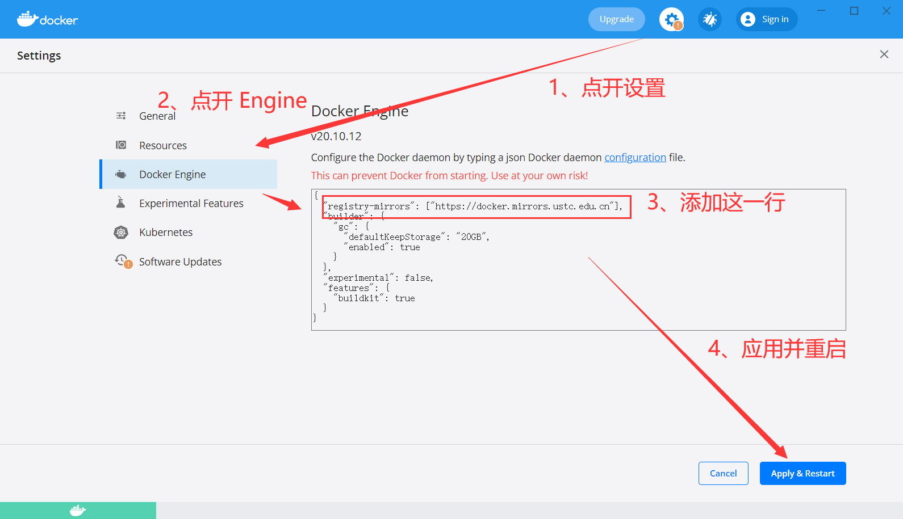

03 - 入门 & 概念解疑
===

> Create by **jsliang** on **2022-03-01 12:51:34**  
> Recently revised in **2022-03-01 12:51:34**

* Docker 系列文档：https://github.com/LiangJunrong/document-library/tree/master/%E7%B3%BB%E5%88%97-%E5%89%8D%E7%AB%AF%E8%B5%84%E6%96%99/Node/Node%20%E5%BA%94%E7%94%A8%E9%83%A8%E7%BD%B2

在前文的代码中，我们有几个概念需要理解：

* Dockerfile 是什么？
* 镜像（Image）是什么？
* 容器（Container）是什么？

下面我们会一一讲解，并且罗列下像 **jsliang** 这样的新手，入门时候都应该懂哪些指令。

## 一、Dockerfile 是什么？

Dockerfile 是一个用来构建镜像的文本文件，文本内容包含了一条条构建镜像所需的指令和说明。

Docker 通过读取 Dockerfile 中的指令自动生成镜像。

Dockerfile 可以使用在命令行中调用任何命令。

Dockerfile 一般分为四部分：基础镜像信息、维护者信息、镜像操作指令和容器启动时执行指令。

简单来说：你可以通过 Dockerfile，告诉 Docker 编译的时候需要注意什么情况，就好比你通过 `package.json`，告诉 `npm` 我需要安装的包都有哪些一样。

> 参考文献：[华为云 - 什么是 Dockerfile](https://www.huaweicloud.com/zhishi/edu-arc-yys28.html)

## 二、镜像（Image）是什么？

镜像是一个文件系统，提供了容器运行时需要用到的文件和参数配置。

相当于平时在使用某个软件时需要下载的安装包，也相当于安装操作系统时需要用到的 ISO 文件。

简单来说：你可以把镜像（Image）看成是一张 Windows 11 的系统光盘，然后哪部电脑需要安装新系统，就基于这张光盘安装就可以了。

在 Docker Hub 上面有许许多多的镜像，感兴趣的小伙伴可以前往查看和下载：https://hub.docker.com/

值得一提的是：

* **国内官方源下载速度会比较慢，所以跟 npm 一样切换个国内源地址是不错的选择，例如 中国科学技术大学（中科大）、阿里云、网易、Docker 官方中国区等**

| 镜像仓库名称 | 链接 |
| --- | --- |
| Docker 官方中国区 | https://registry.docker-cn.com |
| 网易 163 | http://hub-mirror.c.163.com |
| 中国科学技术大学 | https://docker.mirrors.ustc.edu.cn |
| 阿里云 | https://<你的ID>.mirror.aliyuncs.com |

**Linux 修改方式**：

1. 修改 Docker 镜像仓库配置：`sudo vim /etc/docker/daemon.json`
2. 修改配置文件：

> daemon.json

```json
{
  "registry-mirrors": ["https://docker.mirrors.ustc.edu.cn"],
}
```

3. 使配置文件生效：`sudo systemctl daemon-reload` 
4. 重启 Docker：`sudo service docker restart`

**Windows/Mac 修改方式**：



修改完毕后，通过指令 `docker info` 查看：


当然，需要注意的是：切换源重启后，会导致当前的容器暂停掉，重启回来就行了。

> 参考文献：[知乎 - 测试的能量 - Docker 入门：镜像 image](https://zhuanlan.zhihu.com/p/144355897)

## 三、容器（Container）是什么？

容器（Container），就是一种轻量级的虚拟化技术，目的和虚拟机一样，都是为了创造 “隔离环境”。

镜像（Image）和容器（Container）的关系，就像是面向程序设计中的 **类** 和 **实例** 一样，镜像是静态的定义，容器是镜像运行时的实体。

结合我们前面的小实例，我们会看到：

* 创建镜像（Image）：`docker image build ./ -t hello-docker:1.0.0`
* 创建容器（Container）：`docker container create -p 2222:80 hello-docker:1.0.0`

在这里，我们创建容器的时候，其中 `hello-docker:1.0.0` 就是镜像的 REPOSITORY 和 TAG，我们基于这个镜像，创建了一个容器，并指定了它的端口。

同时，在说到端口的时候，我们讲到了 **宿主机**，宿主机即相对于容器来说的主机，即 **jsliang** 的手提笔记本的 Windows 10 系统。

> 敲重点！后面会有 **宿主机** 的出现，别漏知识点啦！

## 四、小结

了解完这些知识点后，我们是时候再操作操作，回顾下内容了！

所以下篇，我们会讲解；04 - 入门 & Node 服务

敬请期待！

---

**不折腾的前端，和咸鱼有什么区别！**

觉得文章不错的小伙伴欢迎点赞/点 Star。

如果小伙伴需要联系 **jsliang**：

* [Github](https://github.com/LiangJunrong/document-library)

个人联系方式存放在 Github 首页，欢迎一起折腾~

争取打造自己成为一个充满探索欲，喜欢折腾，乐于扩展自己知识面的终身学习斜杠程序员。

> jsliang 的文档库由 [梁峻荣](https://github.com/LiangJunrong) 采用 [知识共享 署名-非商业性使用-相同方式共享 4.0 国际 许可协议](http://creativecommons.org/licenses/by-nc-sa/4.0/) 进行许可。<br/>基于 [https://github.com/LiangJunrong/document-library](https://github.com/LiangJunrong/document-library) 上的作品创作。<br/>本许可协议授权之外的使用权限可以从 [https://creativecommons.org/licenses/by-nc-sa/2.5/cn/](https://creativecommons.org/licenses/by-nc-sa/2.5/cn/) 处获得。
