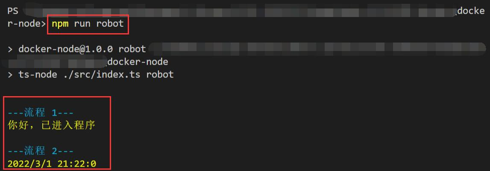
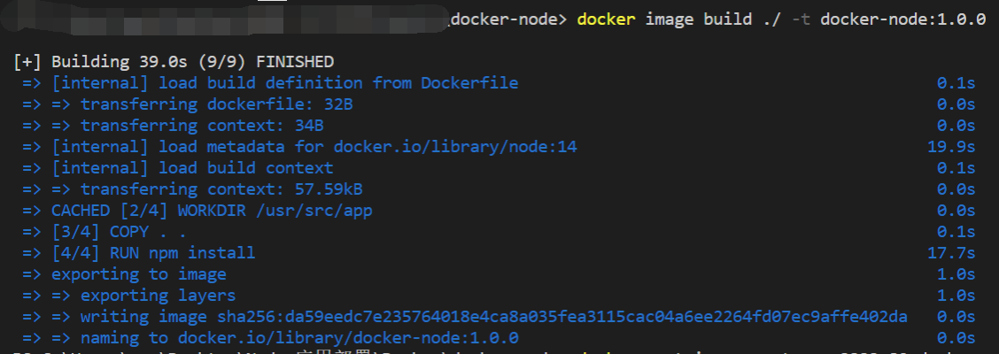
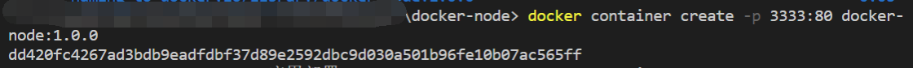
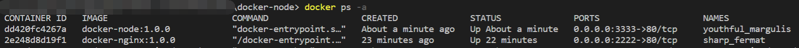
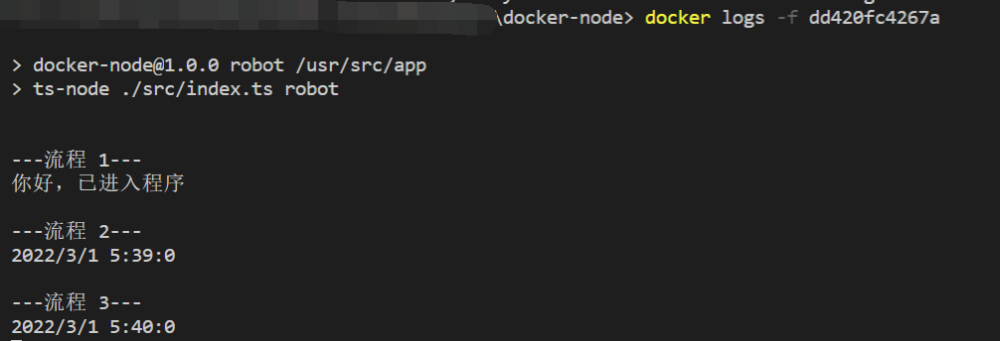
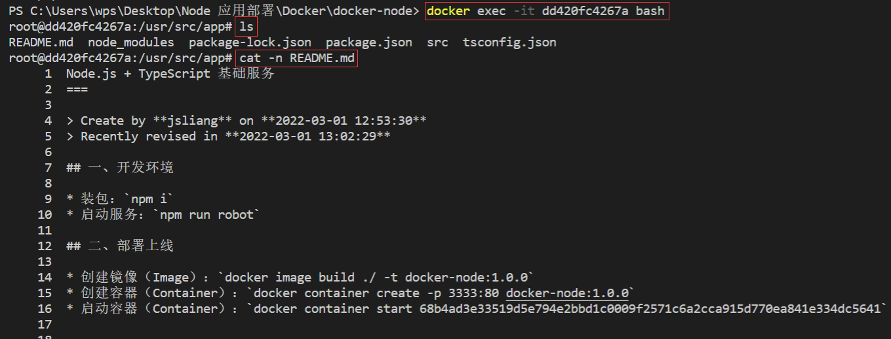

04 - 入门 & Node 服务
===

> Create by **jsliang** on **2022-03-01 12:53:30**  
> Recently revised in **2022-03-01 22:04:25**

* 本篇文档对应的代码：https://github.com/LiangJunrong/all-for-one/tree/master/036-Docker%20for%20Node
* Docker 系列文档：https://github.com/LiangJunrong/document-library/tree/master/%E7%B3%BB%E5%88%97-%E5%89%8D%E7%AB%AF%E8%B5%84%E6%96%99/Node/Node%20%E5%BA%94%E7%94%A8%E9%83%A8%E7%BD%B2

## 一、前文回顾

经过前文的讲解，想必小伙伴们对 Docker 的一些相关词语有所了解，这里咱们小小回归一下：

* **宿主机**：你的电脑对应的系统机子
* **Dockfile**：一份文件，可以用来创建镜像
* **镜像**：类似光盘，可以用来创建容器，相当于安装操作系统时需要用到的 ISO 文件
* **容器**：轻量级虚拟技术，相当于通过 IOS 文件创造的一个系统

> 一千个哈姆雷特，每个人看法不同，欢迎吐槽

## 二、一个 Node.js Demo

那么，既然要将 Node.js 塞到 Docker 上，我们就要有一个 Node 服务，所以 **jsliang** 拿了自己写的一个基础 Node.js + TypeScript 的服务。

它的目录结构如下：

> docker-node

```
> src
.eslintrc.js
.gitignore
package-lock.json
package.json
README.md
tsconfig.json
```

启动这个 Demo 只需要 2 步：

* 安装包：`npm i`
* 启动服务：`npm run robot`

等到每分钟的第 0 秒的时候，终端会打印：



这个 Demo 简单来说，就是通过 `commander.js`，运行 `npm run robot` 时，走命令 `ts-node ./src/index.ts robot`。

然后 `/src/index.ts` 中的任务，主要是：

```js
// ……代码省略
console.log('你好，已进入程序'); // 打印
schedule.scheduleJob('0 * * * * *', () => { // 设置定时任务
  const { year, month, day, hour, minute, second } = getDateDetail(new Date());
  console.log(`${year}/${month}/${day} ${hour}:${minute}:${second}`);
});
// ……代码省略
```

即打印一行文本，然后在每分钟的第 `0` 秒打印 **年月日时分秒**。

感兴趣的小伙伴可以停下来先看下 Demo，不感兴趣的可以继续往下看。

## 三、改造 Node.js 服务，添加 Docker 必备文件

下面我们看看如何将这个 Node.js 服务塞到 Docker 里面。

* **目标**：**在 Docker 中构建 Node.js 环境且启动服务**

> docker-node

```diff
> src
+ .dockerignore
.eslintrc.js
.gitignore
+ Dockerfile
package-lock.json
package.json
README.md
tsconfig.json
```

我们添加两个文件，分别是 `.dockerignore` 和 `Dockerfile`，然后往里面塞内容：

> `.dockerignore`：

```dockerignore
node_modules
.dockerignore
Dockerfile
*-debug.log
*-error.log
.git
.hg
.svn
.vscode
```

`.dockerignore` 就像 `.gitignore` 一样，起到忽略文件/文件夹的作用，所以 Docker 在运行 `Dockerfile` 的时候，会选择性忽略里面对应的文件/文件夹。

> `Dockerfile`：

```dockerfile
# 本镜像拷贝自 Node v14 版本
FROM node:14

# 指定执行 CMD 的目录，即先 cd 到该目录上
WORKDIR /usr/src/app

# 拷贝宿主机（当前运行终端的位置）的文件到容器中的 app 目录中
COPY . .

# 安装 npm 包
RUN npm install

# 对外暴露本镜像的 80 端口
EXPOSE 80

# 启动 Node 服务
CMD ["npm", "run", "robot"];
```

`Dockerfile` 会告诉 Docker：你只需要这样，然后这样，然后再这样……

详细的我就不哆嗦了，上面的注释写得很清楚了。

那么接下来我们只需要 Show 下操作，狂敲指令即可！

## 四、Docker 部署 Node.js 服务

* 创建镜像（Image）：`docker image build ./ -t docker-node:1.0.0`
  * `docker image build`：创建镜像
  * `./`：基于当前目录
  * `-t`：为容器重新分配一个伪输入终端，通常与 `-i` 同时使用
  * `docker-node:1.0.0`：对应的镜像名称和 TAG



* 创建容器（Container）：`docker container create -p 3333:80 docker-node:1.0.0`
  * `docker container create`：创建容器
  * `-p 3333:80`：端口，`3333:80` 即 `宿主机:容器`
  * `docker-node:1.0.0`：对应的镜像及其 TAG



* 启动容器（Container）：`docker container start dd420fc4267ad3bdb9eadfdbf37d89e2592dbc9d030a501b96fe10b07ac565ff`
  * `docker container start`：启动容器
  * `dd420fc4267ad3bdb9eadfdbf37d89e2592dbc9d030a501b96fe10b07ac565ff`：容器 ID，即 `docker ps -a` 查找到的 `CONTAINER ID`


* 查看容器（Container）运行情况：`docker ps -a`



* 查看容器（Container）的日志：`docker logs -f dd420fc4267a`
  * `dd420fc4267a`：容器 ID，可通过 `docker ps -a` 查找到



* 进入容器（Container）：`docker exec -it dd420fc4267a bash`
  * `dd420fc4267a`：容器 ID，可通过 `docker ps -a` 查找到
* 查看 README.md 文件：`cat -n README.md`
  * `cat`：cat（英文全拼：concatenate）命令用于连接文件并打印到标准输出设备上
  * `-n`：由 1 开始对所有输出的行数编号



## 五、小结

通过上面的讲解，想必小伙伴们大致了解了 Docker 的一些指令，下篇我们会讲解 Docker 中新人必备的 **指令** 和如何做 `Hosts` 隔离，且修改容器里面的时间。

---

**不折腾的前端，和咸鱼有什么区别！**

觉得文章不错的小伙伴欢迎点赞/点 Star。

如果小伙伴需要联系 **jsliang**：

* [Github](https://github.com/LiangJunrong/document-library)

个人联系方式存放在 Github 首页，欢迎一起折腾~

争取打造自己成为一个充满探索欲，喜欢折腾，乐于扩展自己知识面的终身学习横杠程序员。

> jsliang 的文档库由 [梁峻荣](https://github.com/LiangJunrong) 采用 [知识共享 署名-非商业性使用-相同方式共享 4.0 国际 许可协议](http://creativecommons.org/licenses/by-nc-sa/4.0/) 进行许可。<br/>基于 [https://github.com/LiangJunrong/document-library](https://github.com/LiangJunrong/document-library) 上的作品创作。<br/>本许可协议授权之外的使用权限可以从 [https://creativecommons.org/licenses/by-nc-sa/2.5/cn/](https://creativecommons.org/licenses/by-nc-sa/2.5/cn/) 处获得。
