05 - 解疑 & Docker 指令
===

> Create by **jsliang** on **2022-03-01 22:05:25**  
> Recently revised in **2022-03-07 08:04:01**

* Docker 系列文档：https://github.com/LiangJunrong/document-library/tree/master/%E7%B3%BB%E5%88%97-%E5%89%8D%E7%AB%AF%E8%B5%84%E6%96%99/Node/Node%20%E5%BA%94%E7%94%A8%E9%83%A8%E7%BD%B2

## 一、前文回顾 & 前言

经过前文的讲解，想必小伙伴们可以起 Nginx 容器和 Node 容器并对一些简单的概念和指令有所了解了。

那么本篇将讲解 Docker 中新人需要知道的一些指令和操作。

* 镜像（Image）指令
* 容器（Container）指令
* Shell 指令
* 宿主机和容器代码同步
* 隔离 Hosts
* 修改容器时间

## 二、镜像（Image）指令

* 创建镜像：`docker image build ./ -t hello-docker:1.0.0`
* 查看镜像清单：`docker image ls`

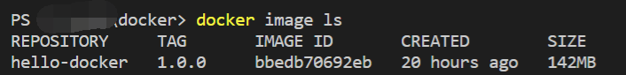

* 删除单个镜像：`docker rmi <image id>`
* 删除所有镜像：`docker rmi $(docker images -q)`
* 强制删除全部镜像：`docker rmi -f $(docker images -q)`

## 三、容器（Container）指令

* 创建容器：`docker container create -p 2333:80 hello-docker:1.0.0`
* 运行容器（其中那一长串字符，为创建容器得到的结果）：`docker container start 4a4d2ac6bf3977ee7c5b4a15562bab17d59b4c61531908fd52632fb0c989f430`
* 创建并运行即时容器（退出则关闭并删除容器）：`docker run -it --rm --name hello-docker -p 2333:80 hello-docker:1.0.0`
* 查看容器清单：`docker ps -a`

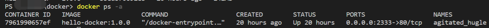

* 进入指定容器：`docker exec -it 7961990657ef bash`
  * `bash`：根据不同镜像来变化，例如 `alpine` 则需要变成 `/bin/sh`

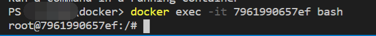

> 进入容器（Container）之后，切换 Shell 指令使用（本质上同 VS Code 编辑器终端、Windows 的 cmd 等）

* 退出容器：`exit`
* 启动/停止/重启容器：`docker start/stop/restart CONTAINER_ID`
* 删除单个容器：`docker rm CONTAINER_ID`
* 强制删除单个容器：`docker rm -f CONTAINER_ID`
* 停止所有容器：`docker stop $(docker ps -a -q)` 或者 `docker stop $(docker ps -aq)`
* 删除所有容器：`docker rm $(docker ps -a -q)` 或者 `docker rm $(docker ps -aq)`

## 三、Shell 指令

* 查看当前文件夹：`ls`

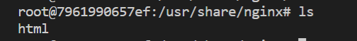

* 打开指定文件夹：`cd html`

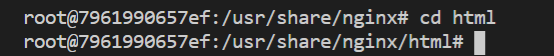

* 查看指定文件内容（带行号）：`cat -n index.html`

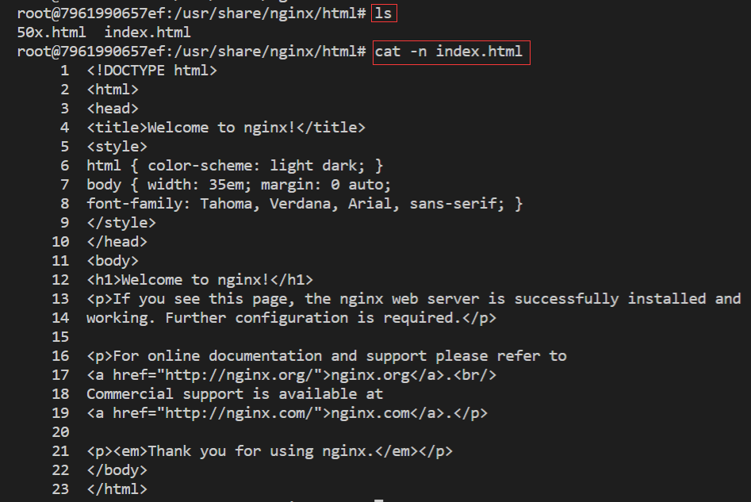

## 四、代码同步

在我们起本地 Docker 服务的时候，很容易就就将代码修改了。

但是！该死的代码并不会同步到容器中，这时候如果删除容器这样操作，也太 low 了吧，所以就需要进行代码同步~

下面我们以 Node.js 那个 Demo 为例，操作下如何同步代码。

> 代码仓库地址：https://github.com/LiangJunrong/all-for-one/tree/master/036-Docker%20for%20Node

* 将宿主机代码复制到容器：

```shell
docker cp "E:/MyWeb/036-Docker for Node/README.md" 8e1910aa2a12:/usr/src/app/README.md
docker cp 宿主机的路径                                          容器名|容器 ID:容器中的文件路径
```

> 注 1：如果是 Windows，且目录包含空格的话，最好通过 `"路径"` 包裹  
> 注 2：目录的话最好后退一层，例如 `docker cp E:/MyWeb/036-Docker for Node/src /usr/src/app/`
> 注 3：`cp` 即 `copy`，拷贝的意思

* 将容器代码复制到宿主机：

```shell
docker cp 8e1910aa2a12:/usr/src/app/tsconfig.json E:\MyWeb\all-for-one
docker cp 容器名       :容器中的文件路径            宿主机的路径
```

* 让容器代码实时同步宿主机代码：

```shell
docker run -d -v E:\MyWeb\all-for-one\src:/usr/src/app/src docker-node:1.0.0
docker run -d -v 宿主机文件路径            :容器中文件路径   容器名      :版本号
```

我们需要知道的是：

1. `-d`：后台运行
2. `-v A:B`：将宿主机 A 路径的文件/文件夹挂载到容器 B 的路径上面（两者都是绝对路径）
3. `docker-node:1.0.0`：即 `docker image ls` 查看到的 `REPOSITORY` 和 `TAG`

## 五、隔离 Hosts

进入容器后，我们可以通过 `cat /etc/hosts` 查看到容器的 `Hosts`：

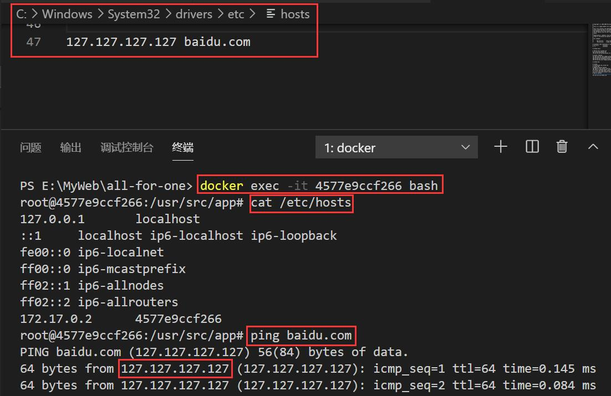

顺带咱们改了下本地 Hosts 文件，将百度改成了 `127.127.127.127`，在容器中 `ping baidu.com`，我们可以看到 Hosts 跟随宿主机变化了。

那么，怎样才能让它有自己想法，别乱动呢？

**首先**，我们找到项目目录，添加 2 个文件：

> hosts

```
127.0.0.1       localhost
```

> resolv.conf

```
nameserver 114.114.114.114
```

这 2 个文件，1 个是修改 Hosts，一个是修改 DNS 端口，即我们想法子，让容器开启的时候，使用的是独立的 Hosts 和 DNS 端口。

**接着**，我们运行指令：

* `docker run -d -v E:\MyWeb\all-for-one\hosts:/etc/hosts -v E:\MyWeb\all-for-one\resolv.conf:/etc/resolv.conf docker-node:1.0.0`

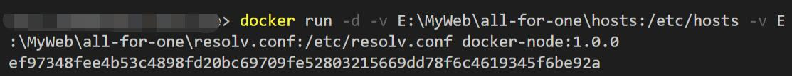

这样创建的容器，就能起到隔离的效果。

**最后**，我们进入新容器并 `ping baidu.com` 即可：

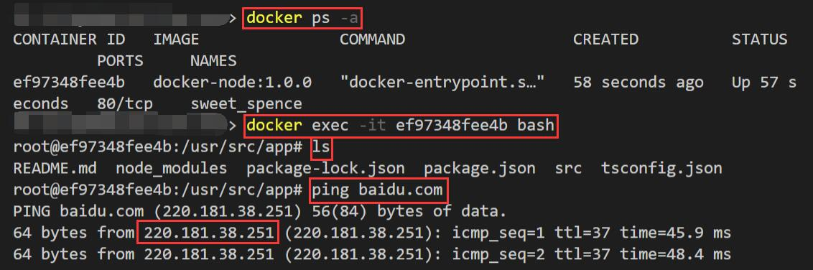

可以发现，我们成功修改了容器的 Hosts！

## 六、修改容器时间

正常情况下，Docker 容器的时间，和我们机器的时候是不同的，因为它默认设置的时区问题：

* 查询机器时间：`date`

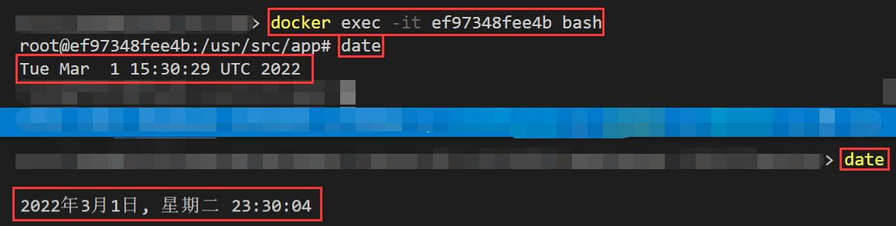

可以看到，上面容器的时间，是 UTC，和下面宿主机的完全不一致。

但是，在我们的代码中，有些是需要存储正确的时间的，这就不得不修改一下了。

而修改它们非常简单，只需要设置下 `Dockerfile` 就可以了：

> Dockerfile

```
# 设置 Docker 容器时区
RUN apk add --no-cache tzdata && cp /usr/share/zoneinfo/Asia/Shanghai /etc/localtime \
    && echo Asia/Shanghai > /etc/timezone
```

咱们还是以 Node.js 那个服务举例，来尝试统一宿主机和容器的时间。

> 代码仓库地址：https://github.com/LiangJunrong/all-for-one/tree/master/036-Docker%20for%20Node

咱们按照仓库的 README.md，创建镜像并运行容器：

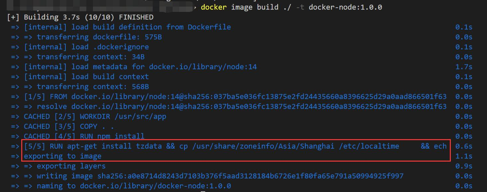

进入容器后查看 `date`：

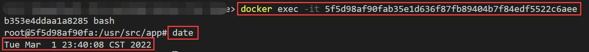

可以看到时间正常了！

## 七、小结

本章我们将一些常见的内容都进行了整理，小伙伴们在第一次看到那么多指令的时候可能有点懵逼，其实 **jsliang** 也是一点一点敲起来熟练起来的。

所以这些只能多敲多熟悉，我之前尝试过几天没敲，回头就忘了，所以整理成这篇文章方便自己和大家回顾。

敬请期待下篇：06 - 入门 & Puppeteer 服务

---

**不折腾的前端，和咸鱼有什么区别！**

觉得文章不错的小伙伴欢迎点赞/点 Star。

如果小伙伴需要联系 **jsliang**：

* [Github](https://github.com/LiangJunrong/document-library)

个人联系方式存放在 Github 首页，欢迎一起折腾~

争取打造自己成为一个充满探索欲，喜欢折腾，乐于扩展自己知识面的终身学习斜杠程序员。

> jsliang 的文档库由 [梁峻荣](https://github.com/LiangJunrong) 采用 [知识共享 署名-非商业性使用-相同方式共享 4.0 国际 许可协议](http://creativecommons.org/licenses/by-nc-sa/4.0/) 进行许可。<br/>基于 [https://github.com/LiangJunrong/document-library](https://github.com/LiangJunrong/document-library) 上的作品创作。<br/>本许可协议授权之外的使用权限可以从 [https://creativecommons.org/licenses/by-nc-sa/2.5/cn/](https://creativecommons.org/licenses/by-nc-sa/2.5/cn/) 处获得。
