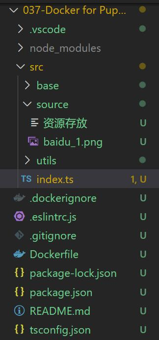
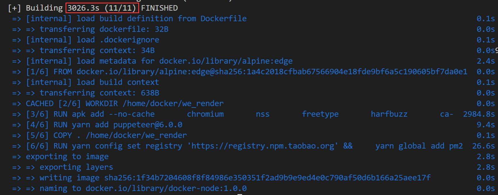
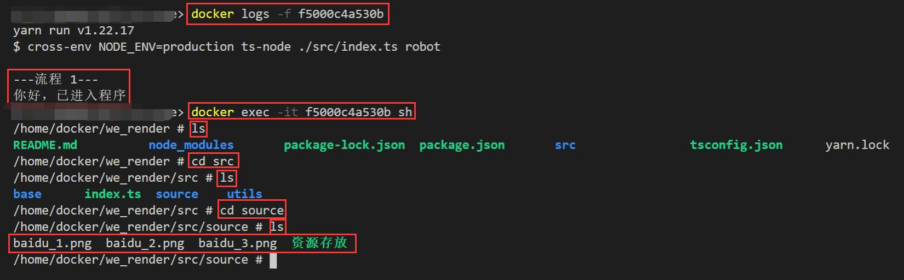

06 - 入门 & Puppeteer 服务
===

> Create by **jsliang** on **2022-03-01 23:47:42**  
> Recently revised in **2022-03-02 01:35:52**

* 本篇文档对应的代码：https://github.com/LiangJunrong/all-for-one/tree/master/037-Docker%20for%20Puppeteer
* Docker 系列文档：https://github.com/LiangJunrong/document-library/tree/master/%E7%B3%BB%E5%88%97-%E5%89%8D%E7%AB%AF%E8%B5%84%E6%96%99/Node/Node%20%E5%BA%94%E7%94%A8%E9%83%A8%E7%BD%B2

## 一、前文回顾 & 前言

经过前文的讲解，想必大家已经对 Docker 有比较深的印象了，那么这篇文章我们将长话短说：

* 如何将 Puppeteer 这种无头浏览器塞到 Docker 中

## 二、Puppeteer 目录结构

管理，我们的服务还是基于之前的 Node.js 服务改造，所以 **jsliang** 拿了自己写的一个基础 Node.js + TypeScript 的服务。

它的目录结构如下：

> docker-puppeteer



启动这个 Demo 只需要 2 步：

* 安装包：`npm i`
* 启动服务：`npm run robot-test`

等到每分钟的第 0 秒的时候，终端操作打开 Puppeteer，并将图片存放到 `src/source` 上。

关键代码是：

> src/index.ts

```js
// ……代码省略
console.log('你好，已进入程序');
let time = 0;
await schedule.scheduleJob('0 * * * * *', async () => {
  const browser = process.env.NODE_ENV === 'production' ?
    // 正式环境需要开启沙盒模式
    await puppeteer.launch({
      args: ['--no-sandbox', '--disable-setuid-sandbox'],
    }) :
    // 非正式环境则随意
    await puppeteer.launch({
      headless: false, // 非无头模式,
      devtools: true, // 调试模式，可以在控制台看到 console
    });
  
  // 创建新标签页并打开
  const page = await browser.newPage();
  await page.goto('https://www.baidu.com/s?wd=jsliang');

  // 等待 5 秒加载
  await page.waitForTimeout(5 * 1000);

  // 获取快照并存储到本地
  await page.screenshot({
    path: `./src/source/baidu_${++time}.png`,
  });

  // 关闭窗口
  await browser.close();
});
// ……代码省略
```

感兴趣的小伙伴可以停下来打开仓库，先看下 Demo，不感兴趣的可以继续往下看。

我们看下关键中的关键：

> src/index.ts

```js
const browser = process.env.NODE_ENV === 'production' ?
  // 正式环境需要开启沙盒模式
  await puppeteer.launch({
    args: ['--no-sandbox', '--disable-setuid-sandbox'],
  }) :
  // 非正式环境则随意
  await puppeteer.launch({
    headless: false, // 非无头模式,
    devtools: true, // 调试模式，可以在控制台看到 console
  });
```

因为如果是通过 Docker 构建 Node.js 服务的话，我们是没法正常启动 Puppeteer 的，所以需要：

1. 设置 Dockerfile
2. 设置 `launch` 的姿势

这里我们的 `package.json` 代码：

> package.json

```json
"scripts": {
 "robot": "cross-env NODE_ENV=production ts-node ./src/index.ts robot",
 "robot-test": "cross-env NODE_ENV=test ts-node ./src/index.ts robot"
},
```

所以，我们设置到 `launch` 后，只需要在在正式环境运行 `npm run robot`，即可启动沙盒模式。

## 三、编写 Dockerfile

话不多说，我们直接编写 Dockerfile：

> Dockerfile

```dockerfile
# 官方文档 https://github.com/puppeteer/puppeteer/blob/main/docs/troubleshooting.md#running-puppeteer-in-docker
# 基于 Alpine Linux 的最小 Docker 图像，具有完整的包索引，大小仅为 5 MB！
FROM alpine:edge

# 指定执行 CMD 的目录，即先 cd 到该目录上
WORKDIR /home/docker/we_render

# 安装最新版 Chromium(89) 的包
RUN apk add --no-cache \
      chromium \
      nss \
      freetype \
      harfbuzz \
      ca-certificates \
      ttf-freefont \
      nodejs \
      yarn

# 跳过自动安装 Chrome 包. 使用上面已经安装的 Chrome
ENV PUPPETEER_SKIP_CHROMIUM_DOWNLOAD=true \
    PUPPETEER_EXECUTABLE_PATH=/usr/bin/chromium-browser

# Puppeteer v6.0.0 配套 Chromium 89
RUN yarn add puppeteer@6.0.0

# 拷贝宿主机的文件到容器中的 we_render 目录
COPY . /home/docker/we_render

# 通过 yarn 设置淘宝源和装包，并清除缓存
RUN yarn config set registry 'https://registry.npm.taobao.org' && \
    yarn global add pm2 && \
    yarn install && \
    yarn cache clean

# 声明容器提供的服务端口
EXPOSE 9527

# 容器主进程的启动命令
CMD ["yarn", "run", "robot"]

```

然后只需要按部就班创建镜像和创建容器等操作即可。

## 四、启动服务

**注意**：强烈建议先切换镜像，否则下载内容会非常慢，之前我在公司操作还行，回来自己挂科学上网也整了好久（3000s）。

修改镜像方法：[03 - 入门 & 概念解疑](https://github.com/LiangJunrong/document-library/blob/master/%E7%B3%BB%E5%88%97-%E5%89%8D%E7%AB%AF%E8%B5%84%E6%96%99/Node/Node%20%E5%BA%94%E7%94%A8%E9%83%A8%E7%BD%B2/Docker/03-%E8%A7%A3%E7%96%91%20%26%20Docker%20%E6%A6%82%E5%BF%B5.md)

* 创建镜像（Image）：`docker image build ./ -t docker-node:1.0.0`



* 创建容器（Container）：`docker container create -p 3333:80 docker-node:1.0.0`
* 启动容器（Container）：`docker restart dd420fc4267ad3bdb9eadfdbf37d89e2592dbc9d030a501b96fe10b07ac565ff`
* 查看容器（Container）运行情况：`docker ps -a`
* 查看容器（Container）的日志：`docker logs -f dd420fc4267a`
* 进入容器（Container）：`docker exec -it dd420fc4267a bash`
* 前往目录：`cd src/source`
* 查看目录内容：`ls`

可以看到，我们已经有几张截图了：



使用前面学习的方法，将容器的内容拷贝出来，并查看下：`docker cp f5000c4a530b:/home/docker/we_render/src/source E:\MyWeb\all-for-one `


虽然不懂 ？？？ 是什么鬼，但是好歹能正常运转了！

那么，我们将 Puppeteer 塞到 Docker 上就成功啦，剩下的只需要将时区和 Hosts 设置下就可以了，这里就不一一赘述了。

这样，我们的 Docker 之旅就先告一段落了，感兴趣的小伙伴欢迎催更，后续的 **本地编写 Git 仓库代码，然后 push 到 GitHub 后，走 CI/CD 并更新到服务器……** 操作，只能等 **jsliang** 有时间了再进一步更新啦！

我是 **jsliang**，一个充满探索欲，喜欢折腾，乐于扩展自己知识面的终身学习斜杠程序员，让我们一起来折腾探索吧！

---

**不折腾的前端，和咸鱼有什么区别！**

觉得文章不错的小伙伴欢迎点赞/点 Star。

如果小伙伴需要联系 **jsliang**：

* [Github](https://github.com/LiangJunrong/document-library)

个人联系方式存放在 Github 首页，欢迎一起折腾~

争取打造自己成为一个充满探索欲，喜欢折腾，乐于扩展自己知识面的终身学习斜杠程序员。

> jsliang 的文档库由 [梁峻荣](https://github.com/LiangJunrong) 采用 [知识共享 署名-非商业性使用-相同方式共享 4.0 国际 许可协议](http://creativecommons.org/licenses/by-nc-sa/4.0/) 进行许可。<br/>基于 [https://github.com/LiangJunrong/document-library](https://github.com/LiangJunrong/document-library) 上的作品创作。<br/>本许可协议授权之外的使用权限可以从 [https://creativecommons.org/licenses/by-nc-sa/2.5/cn/](https://creativecommons.org/licenses/by-nc-sa/2.5/cn/) 处获得。
