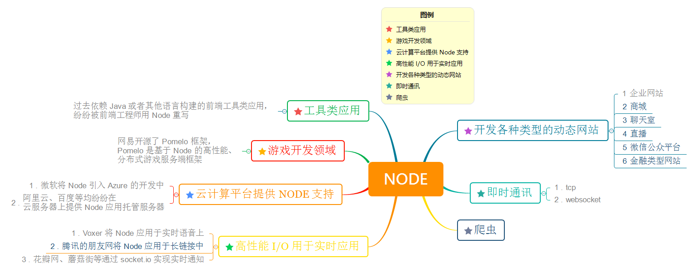

Node 系列
===

> Create by **jsliang** on **2018-11-22 08:21:23**  
> Recently revised in **2021-04-15 07:39:38**

什么，作为一枚前端复制粘贴工程师，你居然还不会 Node.js？

在日常工作中，**jsliang** 会用 Node.js 写写便捷小工具，优化工作流程和进行接口数据转发等。

本系列会由易到难，和小伙伴们一起探索 Node.js。

* Node 工具库（编写 ing、日更中）
  * commander
  * 翻译
  * 文件序号重排
  * 获取文件头信息

<!-- 目录开始 -->
## 一 目录

**不折腾的前端，和咸鱼有什么区别**

| 目录 |
| --- |
| [一 目录](#chapter-one) |
| [二 Node.js 介绍](#chapter-two) |
| &emsp;[2.1 什么是 Node.js？](#chapter-two-one) |
| &emsp;[2.2 Node.js 优点？](#chapter-two-two) |
| &emsp;[2.3 Node.js 应用？](#chapter-two-three) |
| [三 Node.js 开发环境](#chapter-three) |
| &emsp;[3.1 Node.js](#chapter-three-one) |
| &emsp;[3.2 Visio Studio Code](#chapter-three-two) |
| [四 参考文献](#chapter-four) |
<!-- 目录结束 -->

## 二 Node.js 介绍

> [返回目录](#chapter-one)

### 2.1 什么是 Node.js？

> [返回目录](#chapter-one)

Node.js 是一个 JavaScript 运行环境（`runtime`）。它让 JavaScript 可以开发后端程序，实现几乎其他后端语言实现的所有功能。传说中 **能与 PHP、JSP、Python、Ruby 等后端语言平起平坐**。

但是，实际上 Node.js 一般用作中间件。例如：在浏览器端和 Java 端使用 Node.js 作为中间件，Node.js 调用 Java 后端发布的接口，同时 Node.js 可以发布 HTTP 接口给浏览器端调用。 

### 2.2 Node.js 优点？

> [返回目录](#chapter-one)

1. Node.js 语法完全是 JS 语法，只要你懂了 JS 基础就可以学会 Node.js 后端开发。
2. Node.js 超强的高并发能力。在 Java、PHP 或者 .Net 等服务端语言中，会为每一个客户端的连接创建一个新的线程，而每个线程需要耗费大约 2 MB 内存。也就是说，理论上一个 8GB 的服务器，可以同时连接的最大用户数为 4000 个左右。而 Node.js 不会为每个客户创建新的线程，仅仅使用一个线程。所以，使用 Node.js，一个 8GB 的服务器，可以同时处理超过 4 万用户的连接。
3. 实现高性能服务器。Node.js 基于 V8 引擎，V8 引擎是 Google 公司使用 C++ 开发的一种高性能引擎。这意味着开发者编写的高端 JavaScript 脚本代码与开发者编写的低端的 C 语言具有非常相近的执行效率。
4. 开发周期短、开发成本低、学习成本低。花最小的硬件成本，追求更高的并发，更高的处理性能。

### 2.3 Node.js 应用？

> [返回目录](#chapter-one)

## 三 Node.js 开发环境

> [返回目录](#chapter-one)

在你使用 Node.js 进行开发之前，一些准备条件必不可少：

* 安装 Node.js
* 安装 Visio Studio Code

### 3.1 Node.js

> [返回目录](#chapter-one)

* [Node 下载 | Node.js 中文网](http://nodejs.cn/download/)
* [Node 安装步骤 | 菜鸟教程](https://www.runoob.com/nodejs/nodejs-install-setup.html)
* [Node 与 Npm | 廖雪峰](https://www.liaoxuefeng.com/wiki/001434446689867b27157e896e74d51a89c25cc8b43bdb3000/00143450141843488beddae2a1044cab5acb5125baf0882000)
* [cnpm | 淘宝 NPM 镜像](https://npm.taobao.org/)

Node.js、npm、cnpm 的关系，用一句话来概括就是：

* npm 是 Node.js 的包管理工具，所谓包管理工具可以理解为大佬们将一些常用的功能写成包并发布到 npm 市场上，然后别人通过 npm 直接安装即可使用（类似手机应用 app）。而因为 npm 在国内有一定限制，所以就需要用淘宝的镜像 cnpm，从而提高我们 npm 的下载安装速度（类似手机网络和 WIFI 下载手机应用 app）

最后，如果小伙伴们下载安装好环境后，在控制台输入 `cnpm -v` 就可以查看到自己的 Node.js 版本：

> 这是 18 年的一个截图，与时俱进啦大人~

### 3.2 Visio Studio Code

> [返回目录](#chapter-one)

工欲善其事，必先利其器。

作为一枚前端开发，你怎么能没有自己的软件开发工具~

这里安利 Visio Studio Code（以下简称 VS Code），这是一款轻量级的代码编辑器，支持语法高亮、智能代码补全、自定义热键、括号匹配、代码片段、代码对比 diff、Git 等特性。

当然，开发软件不仅限于 VS Code，还有 Atom、Sublime、WebStorm 等，这里不一一介绍。

> 如果小伙伴开发工具和 **jsliang** 不一样，帮小伙伴排查问题一般没那么容易

下面贴上下载链接和介绍：

* [Visio Studio Code 安装 | 官网](https://code.visualstudio.com/)
* [Visio Studio Code 安装及使用技巧 | 博客园](https://www.cnblogs.com/huyong/p/4573041.html)

OK，废话那么多，小伙伴们应该将 Node.js 和 VS Code 安装完毕了，话不多说，开始探索！

## 四 参考文献

> [返回目录](#chapter-one)

* [知乎：浅谈前后端分离与实践之 nodejs 中间层服务(二)](https://zhuanlan.zhihu.com/p/30384677)

---

**不折腾的前端，和咸鱼有什么区别！**

觉得文章不错的小伙伴欢迎点赞/点 Star。

如果小伙伴需要联系 **jsliang**：

* [Github](https://github.com/LiangJunrong/document-library)
* [掘金](https://juejin.im/user/3403743728515246)

联系方式存放在 Github 首页，坚持每天一道 LeetCode，坚持每天学习，欢迎一起折腾~

> jsliang 的文档库由 [梁峻荣](https://github.com/LiangJunrong) 采用 [知识共享 署名-非商业性使用-相同方式共享 4.0 国际 许可协议](http://creativecommons.org/licenses/by-nc-sa/4.0/) 进行许可。 基于 [https://github.com/LiangJunrong/document-library](https://github.com/LiangJunrong/document-library) 上的作品创作。 本许可协议授权之外的使用权限可以从 [https://creativecommons.org/licenses/by-nc-sa/2.5/cn/](https://creativecommons.org/licenses/by-nc-sa/2.5/cn/) 处获得。
