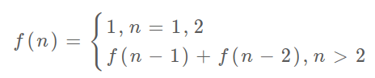

「Temp」动态规划 - 小本子
===

> Create by **jsliang** on **2022-08-09 08:29:56**  
> Recently revised in **2022-08-09 08:29:56**

解决问题：暴力递归产生的爆炸性时间复杂度
解决方案：
1、使用备忘录，记录每个子问题的求解
2、
举例：斐波那契数列、爬楼梯的逐步演化

```js
// step 1 - 常见的递归解法
// 时间复杂度为子问题个数（ O(2^n)） * 解决一个子问题的时间（O(1)）
cosnt fib = (n) => {
  if (n === 1 || n === 2) {
    return 1;
  }
  return fib(n - 1) + fib(n - 2);
};

// step 2 - 带备忘录的解法 1
// 时间复杂度为子问题个数（O(n)） * 解决一个子问题的时间（O(1)），即 O(n)
const fib = (n) => {
  // 初始化备忘录
  const meno = [];
  // 进行带备忘录的递归
  return helper(meno, n);
};
const helper = (meno, n) => {
  // 基础用例
  if (n === 0 || n === 1) {
    return n;
  }
  // 已经计算过的，不用再计算了
  if (meno[n]) {
    return menu[n];
  }
  meno[n] = helper(meno, n - 1) + helper(meno, n - 2);
  return meno[n];
};

// step 3 - 将上述步骤 2 的自顶向下换成自下向上
// 时间复杂度为子问题个数（O(n)） * 解决一个子问题的时间（O(1)），即 O(n)
const fib = (n) => {
  if (n === ) {
    return 0;
  }
  const dp = [];
  
  // 基础用例
  dp[0] = 0;
  dp[1] = 1;

  // 状态转移
  for (let i = 2; i <= n; i++) {
    dp[i] = dp[i - 1] + dp[i - 2];
  }

  return dp[n];
};

// step 4 - 最后优化，降低空间复杂度为 O(1)
const fib = (n) => {
  // 基础用例
  if (n === 0 || n === 1) {
    return n;
  }

  // 分别代表 dp[i - 1] 和 dp[i - 2]
  let dp1 = 1, dp2 = 0;
  for (let i = 0; i <= n; i++) {
    // 原始写法
    // const dpTemp = dp1 + dp2;
    // dp2 = dp1;
    // dp1 = dpTemp;
    [dp1, dp2] = [dp1 + dp2, dp1];
  }

  // 返回最终计算
  return dp1;
};
```

状态转移方程：



斐波那契数列的例子严格来说不算动态规划，因为没有涉及求最值，以上旨在说明重叠子问题的消除方法，演示得到最优解法逐步求精的过程。


TODO: https://labuladong.github.io/algo/3/25/69/

---

**不折腾的前端，和咸鱼有什么区别！**

觉得文章不错的小伙伴欢迎点赞/点 Star。

如果小伙伴需要联系 **jsliang**：

* [Github](https://github.com/LiangJunrong/document-library)
* [掘金](https://juejin.im/user/3403743728515246)

个人联系方式存放在 Github 首页，欢迎一起折腾~

争取打造自己成为一个充满探索欲，喜欢折腾，乐于扩展自己知识面的终身学习斜杠程序员。

> jsliang 的文档库由 [梁峻荣](https://github.com/LiangJunrong) 采用 [知识共享 署名-非商业性使用-相同方式共享 4.0 国际 许可协议](http://creativecommons.org/licenses/by-nc-sa/4.0/) 进行许可。<br/>基于 [https://github.com/LiangJunrong/document-library](https://github.com/LiangJunrong/document-library) 上的作品创作。<br/>本许可协议授权之外的使用权限可以从 [https://creativecommons.org/licenses/by-nc-sa/2.5/cn/](https://creativecommons.org/licenses/by-nc-sa/2.5/cn/) 处获得。
