迁移 Vue v2.x 版本到 Vite
===

> Create by **jsliang** on **2023-01-28 08:36:31**  
> Recently revised in **2023-01-28 08:36:31**

人生无常，大肠包小肠~

在接近年底的时候，有一个 Vue 项目，需要从中抽取 2 个模块出来。

然后想着新建项目，Vue CLI 也是学，Vite 也是学，于是哼次哼次用上了 Vite，结果开始了一路的 bug 挨打之旅……


## 前言

Hello 小伙伴们早上、中午、下午、晚上、深夜好，我是 **jsliang**。

本次「迁移 Vue v2.x 项目到 Vite」将分为 2 个部分：

1. 以一个简单项目，进行 Vite 快速入手
2. 在实例项目迁移，对比 Vue CLI 和 Vite 以及碰到的问题。

## 简单项目：通过 Vite 打包 lib 仓库

下面开始保姆级教学，从 0 到 1 构建 Vite 项目，并处理打包问题。

前面及步骤略简单，小伙伴可选择跳读

本小节的代码仓库：[all-for-one/039-迁移 Vue v2.x 项目到 Vite/](https://github.com/LiangJunrong/all-for-one/tree/master/039-%E8%BF%81%E7%A7%BB%20Vue%20v2.x%20%E9%A1%B9%E7%9B%AE%E5%88%B0%20Vite)

### 步骤一：创建项目

* 安装 PNPM：`npm i pnpm -g`
* 通过 PNPM 创建 Vite + Vue 项目：`pnpm create vite jsliang-plugin --template vue`
  * 创建 Vite 项目：`pnpm create vite`
  * 创建 Vite + Vue TypeScript 项目：`pnpm create vite jsliang-vue-plugin --template vue-ts`

### 步骤二：初始化并运行

* 安装 node_modules：`pnpm i`
* 运行项目：`pnpm run dev`

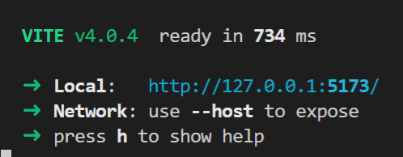

如上图所示，打开 `http://127.0.0.1:5173/` 即可。

效果如下图：

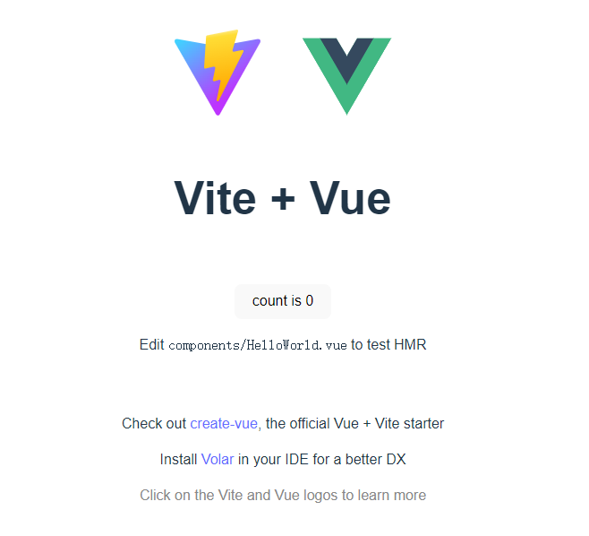

如果需要外部访问的话，需要在指令上加上 `--host`，即：

> package.json

```diff
"scripts": {
-  "dev": "vite",
+  "dev": "vite --host",
  "build": "vite build",
  "preview": "vite preview"
},
```

### 步骤三：修改端口

一般 Vite + Vue 提供的端口是，像我这么靓的靓仔，肯定要 `8888`。

那就直接修改 `vite.config.js` 吧：

> vite.config.js

> 为避免代码臃肿，第一次提的时候会写全代码，后面会写改动位置

```diff
import { defineConfig } from 'vite'
import vue from '@vitejs/plugin-vue'

// https://vitejs.dev/config/
export default defineConfig({
  plugins: [vue()],
+  server: {
+    port: 8888,
+  },
})
```

这时候再启动 `pnpm run dev`，就能看到相应的端口有变更了。

### 步骤四：清场搞事

该做的事我们都做了，下面我们把 `src` 目录下所有代码删除，留下一个干净的 Vue 仓库。

并依据下图创建文件夹及其文件：

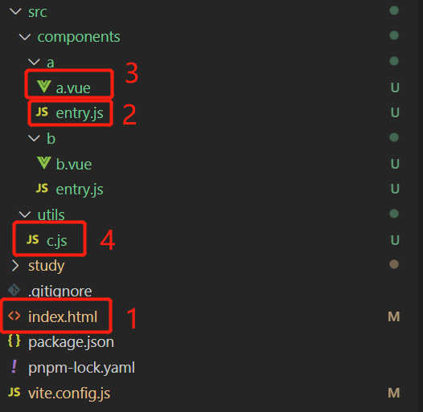

我们执行 `pnpm run dev` 的时候，代码的调用思路如上图所示。

1. 先调用 `index.html`
2. 再走 `a/entry.js` 或者 `b/entry.js`
3. 接着走 `a/a.vue` 或者 `b/b.vue`
4. 最后走 `utils/c.js` 这个公共模块

### 步骤五：补充代码

下面我们补充代码，使其最终展示如下：


**首先**，我们修改 `index.html`，使其提供了一个类 `jsliang`，其中有一个方法 `addPlugin` 提供注入 HTML 的能力。

> index.html

```html
<!DOCTYPE html>
<html lang="en">
  <head>
    <meta charset="UTF-8" />
    <link rel="icon" type="image/svg+xml" href="/vite.svg" />
    <meta name="viewport" content="width=device-width, initial-scale=1.0" />
    <title>Vite + Vue</title>
    <script>
      class jsliang {
        addPlugin({ pluginName, pluginObj }) {
          const div = document.createElement('div');
          div.classList.add('container');
          div.innerHTML = `
            <div>插件 ${pluginName} 加载成功：</div>
          `;
          document.body.appendChild(div);
          document.body.appendChild(pluginObj());
        }
      }
      window.jsliang = new jsliang();
    </script>
  </head>
  <body>
    <div id="app"></div>
    <script type="module" src="/src/components/a/entry.js"></script>
    <script type="module" src="/src/components/b/entry.js"></script>
  </body>
</html>
```

**然后**，我们这里引用了 2 个入口，即 `a/entry.js` 和 `b/entry.js`（因为是测试的，所以直接在 `pnpm run dev` 模式上测试）

> src/components/a/entry.js

```js
// 这里引用了 a.vue 的代码
import A from './a.vue';

(function() {
  console.log('jsliang 插件加载成功');

  window.jsliang && window.jsliang.addPlugin && window.jsliang.addPlugin({
    pluginName: 'jsliang',
    pluginObj: A.methods.renderDOM,
  });
})();
```

> src/components/a/a.vue

```vue
<template>
  <div id="container">
    Hello jsliang
  </div>
</template>

<script>
// 引用公共模块 C
import { c } from '../../utils/c';

export default {
  name: 'jsliang',
  mounted() {
    c();
  },
  methods: {
    renderDOM: () => {
      const div = document.createElement('div');
      div.innerHTML = 'Hello jsliang';
      return div;
    }
  }
}
</script>
```

> src/utils/c.js

```js
export const c = () => {
  console.log('c 模块加载');
};
```

最后，我们在 `src/components/b/entry.js` 和 `src/components/b/b.vue` 补上同 `a` 部分的代码即可。

> 这里就省略了，可以拷贝过去简单改改

### 步骤六：库模式和单入口单出口打包

我们需要完成的最终目标是：**多入口多出口打包**。

当前，我们执行 `pnpm run build`，产生的打包文件为：

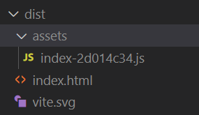

而实际上，我们需要的打包结构（打包成 JS 库）：

```
- dist
  - A
    - A.entry.xxx.js
    - c.xxx.js
  - B
    - B.entry.xxx.js
    - c.xxx.js
```

所以，就需要修改 `vite.config.js`：

> vite.config.js

```js
export default defineConfig({
  // ... 代码省略

  // 打包模式
  build: {
    // 库模式
    lib: {
      // 设置入口文件
      entry: 'src/components/a/entry.js',
      // 打包后的包名称
      name: 'A',
      // 打包后的文件名
      fileName: (format) => `A.entry.${format}.js`,
    }
  }
});
```

**除此之外**，顺带删除项目下 `public` 目录（包含里面的 `vite.svg`，避免打包时参和进来。

此时，我们再次执行 `pnpm run build`，打包内容如下：

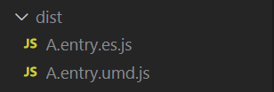

从而实现了单入口单出口打包。

### 步骤六：库模式和多仓库打包

其实上面步骤，我们发觉应该是同时走 2 个入口，然后打包出 2 个文件夹出来。

```
- dist
  - A
    - A.entry.xxx.js
    - c.xxx.js
  - B
    - B.entry.xxx.js
    - c.xxx.js
```

经过一番折腾，我们修改 Vite 配置如下：

```js
import { defineConfig } from 'vite'
import vue from '@vitejs/plugin-vue'

// https://vitejs.dev/config/
export default defineConfig({
  // 加载插件
  plugins: [vue()],
  // 端口设置
  server: {
    port: 8888,
  },
  // 打包模式
  build: {
    // 库模式
    lib: {
      // 设置入口文件
      entry: {
        'A': 'src/components/a/entry.js',
        'B': 'src/components/b/entry.js'
      },
      formats: ['es'],
      // 打包后的文件名
      fileName: (format, entryName) => `${entryName}/${entryName}.entry.${format}.js`,
    },
  }
});
```

此时打包内容如下：

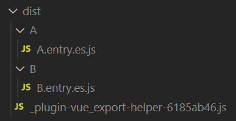

无疑，这一个打包结果，距离我们差的有点多。

主要问题，出在打包后，公共代码并没有分 2 个文件装到指定文件夹。

关于这个问题，厚颜无耻在 Vite 的 Discussions 上请教大佬：

* [Vite Discussions - vite lib multiple outputs](https://github.com/vitejs/vite/discussions/11843)

经小伙伴 `sapphi-red` 的提醒，我也是意识到这种还是需要依靠外挂。

> 在对 Vite 和 Rollup 不想深入了解的情况下，我们应该把关注点放在解决问题上

于是开始修改代码。

**步骤一**：改造 `package.json`：

```diff
"scripts": {
  "dev": "vite --host",
- "build": "vite build",
+  "build": "node build.js",
+  "A": "vite build --mode A",
+  "B": "vite build --mode B",
  "preview": "vite preview"
},
```

在这里，我们看到修改了下 `build` 指令，并且新增了 `A` 和 `B` 指令。

我们应当可以理解，此时我们只需要在 `pnpm run build` 指令操作时，在 `build.js` 上，执行 `A` 和 `B` 指令即可。

**步骤二**：改造 `vite.config.js`，让它能根据模式单独打包

> vite.config.js

```js
// 打包模式
build: {
 outDir: `dist/${mode}`,
 lib: {
   entry: {
     [mode]: mode === 'A'
       ? 'src/components/a/entry.js'
       : 'src/components/b/entry.js'
   },
   formats: ['es'],
   fileName: (format, entryName) => `${entryName}.entry.${format}.js`,
 },
}
```

这里代码很容易理解，就是打包的时候，区分模块进行单入口单出口的打包。

**第三步**：在项目文件夹上，新增 `build.js`，配合 `package.json` 中的 `pnpm run build` 指令：

> build.js

```js
import shell from 'shelljs';

shell.exec('pnpm run A');
shell.exec('pnpm run B');
```

这样，我们就搞定了单独打包：

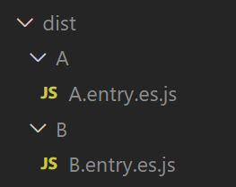

## 实例项目：迁移 Vue v2.x 项目到 Vite 新项目

### 前言

在公司项目中，有个 Vue v2.x 版本的项目，希望从中迁移 2 个模块出来。

然后因为旧项目的打包流程过于复杂，牵扯了一些没必要的元素。

所以新项目希望整一个干净的流程，单独打 2 个 JS 包出来，项目结构大致如下：

```
- 新项目
 - src
  - A 包
  - B 包
```

确认过眼神，是熟悉的人，即【简单项目：通过 Vite 打包 lib 仓库】中探索的内容。

这里咱们将讲下折腾过程中，**jsliang** 的探索和思考，给后续小伙伴提供思路。

### 迁移 - Vue CLI 方案

通过 Vue CLI 的构建，可以查看：https://cli.vuejs.org/zh/guide/build-targets.html

我们新旧的构建方案对比如下：

> package.json

```js
"scripts": {
  "build-new": "vue-cli-service build --target lib --inline-vue --name FullTextCommentPc src/main.js",
  "build": "vue-cli-service build",
},
```

自带的是 `npm run build`，打包的内容如下：

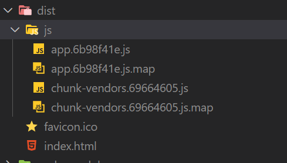

这种打包方式不太符合我们的需求，因为这个插件，应该是单入口的，最终目录是这样的：

```
- 文件夹 A
  - A.entry.js
  - info.json
- 文件夹 B
  - B.entry.js
  - info.json
```

所以参考链接，将打包改为：`vue-cli-service build --target lib --inline-vue --name FullTextCommentPc src/main.js`，这样就可以打包出来：

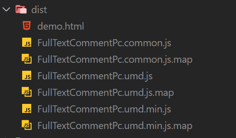

### 迁移 - Vite 方案

这种打包出来的结构，已经很像了，仍需要调整文件名包含 `entry` 和添加 `mainfest.json` 文件。

这种情况下，感觉探索 Vue CLI + Webpack 方式，跟用 Vite 差不多了。

而猎奇的我，肯定要去耍耍 Vite。

### 报错 - import Vue from 'vue'

迁移首个困难：

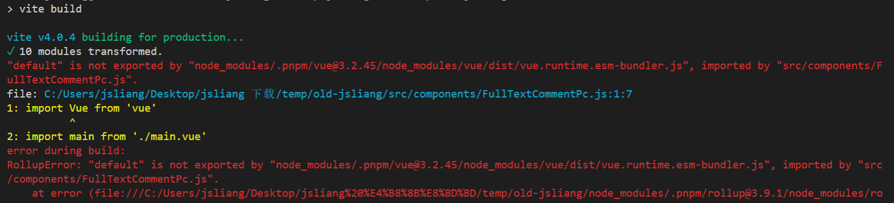

```
1: import Vue from 'vue'
          ^
2: import main from './main.vue'
error during build:
RollupError: "default" is not exported by "node_modules/.pnpm/vue@3.2.45/node_modules/vue/dist/vue.runtime.esm-bundler.js", imported by "src/components/FullTextCommentPc.js".
```

震惊！什么，`import Vue from 'vue'` 还能报错，你是不是跟我开玩笑？

然后我就去傻傻地搜：`RollupError: "default" is not exported by ……`

您猜怎么着，翻了 1 个多小时，一点头绪都没有。


搞得我下班的时候还是檬茶茶的，带着困惑下班了。

### 思考 - 究竟哪里犯错了

回来后我就在纠结了，前面看到了很多冗余消息，例如：

* Vite 上 yyx 说 `import Comp from 'comp.vue'` 才是真实写法，之前的 `import Comp from 'comp'` 其实并不支持……（Issue 上看到的，别纠结，纠结就是你赢）
* Vue 并没有默认导出，我看了下 `vue.d.ts` 确实如此

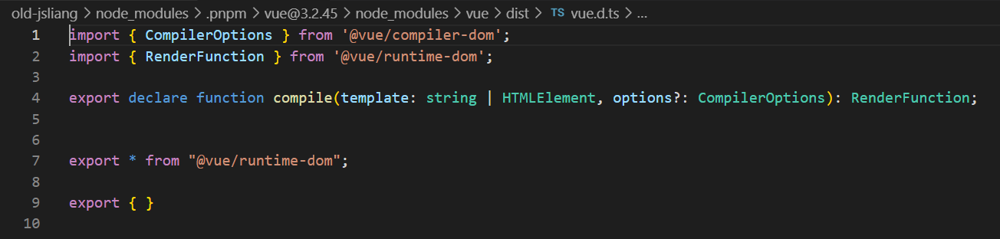

* Vite 上用 `import a from 'a.js'` 这种形式需要装一个 `commonjs` 的包，并配置 `vite.config.js`（其实搜到这里我已经迷糊了，连自己要什么都不清楚了）

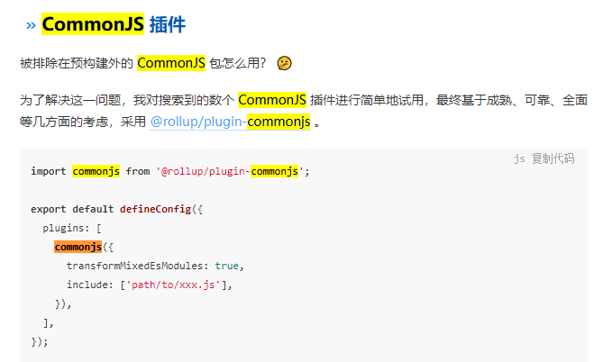

* ……

回来后镇定思痛，感觉还是要从 “版本” 2 字找起，因为我想起之前玩 Webpack v4.x 的时候，也是这么被愚弄的。

所以我搜了下 Vite + Vue 2.x 的说法，还真找到了：

* [Vite 官方中文文档 - Vue](https://cn.vitejs.dev/guide/features.html#vue)
* [GitHub - vitejs - vite-plugin-vue2](https://github.com/vitejs/vite-plugin-vue2)

好家伙，原来尽在文档……（其实这里很困惑，上面报错的时候，是不是可以指引下降低版本的信息，而不是直接来个 `"default" is not exported by`？）

### 释疑 - 总有一个版本适合你

操作方法很简单：

* **首先**，删包，把你的 `node_modules` 删掉。
* **然后**，按照下面版本，修改 `package.json`：

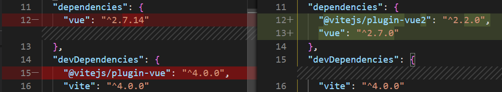

```json
"dependencies": {
  "@vitejs/plugin-vue2": "^2.2.0",
  "vue": "^2.7.0"
},
"devDependencies": {
  "vite": "^4.0.0"
}
```

* 接着，重新装包 `pnpm i`

这里需要注意一点：`@vitejs/plugin-vue2` 的包，只支持 `Vue` 的 `^2.7.0` 版本：

> Note: this plugin only works with Vue@^2.7.0.

详细可以看上面提到的 GitHub 仓库，里面有强调。

* 最后，修改下 `vite.config.js`：

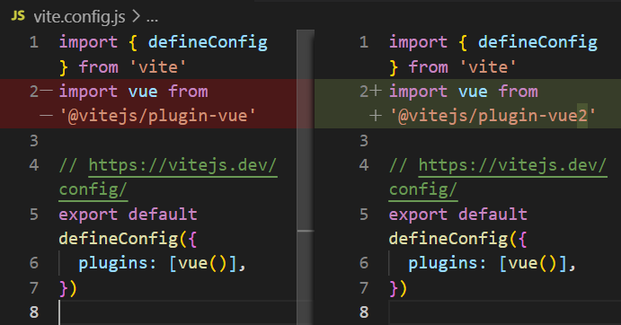

我们需要用 `plugin-vue2` 替换掉 `plugin-vue` 插件。

再运行 `pnpm run build`，打包成功，搞定收工！

### 优化 - 我不需要 index.html

OK，打包报错的问题解决了，下面开始操作，让它剩下单入口：

```
- 文件夹 A
  - A.entry.js
  - info.json
- 文件夹 B
  - B.entry.js
  - info.json我们继续操作，权当先打通 文件夹 A
```

这里我们参考：

* [掘金 - 孤独的根号3 - vite打包lib库](https://juejin.cn/post/7073646687968821256)

这时候修改 `vue.config.js` 为：

```js
import { defineConfig } from 'vite'
import vue from '@vitejs/plugin-vue2'

// https://vitejs.dev/config/
export default defineConfig({
  // 使用的插件
  plugins: [vue()],
  build: {
    lib: {
      // 设置入口文件
      entry: 'src/main.js',
      // 打包后的包名称
      name: 'A',
      // 打包后的文件名
      fileName: (format) => `A.entry.${format}.js`,
    }
  },
})
```

打包 `pnpm run build`：

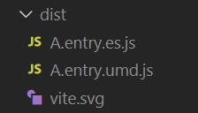

似乎可行！添加一个 `index.html` 试试：

> dist/index.html

```html
<!DOCTYPE html>
<html lang="en">
<head>
  <meta charset="UTF-8">
  <meta name="viewport" content="width=device-width,initial-scale=1.0,maximum-scale=1.0,user-scalable=no">
  <meta http-equiv="X-UA-Compatible" content="ie=edge">
  <title>测试</title>
  <script src="./A.entry.umd.js"></script>
</head>
<body>
  Hello jsliang
</body>
</html>
```

运行：

* 前往目录：`cd dist`
* 运行项目：`live-server`
* 打开 `127.0.0.1:8080`，控制台报错：

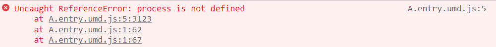

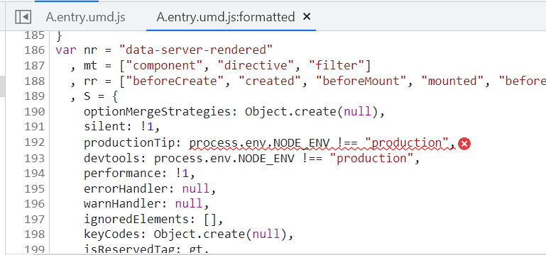

OK，报错 `process is not defined`，并且导向 `process.env`。

这个问题，在 [Vite 导向](https://cn.vitejs.dev/guide/migration-from-v2.html#advanced) 的时候，#8090 有所表示：

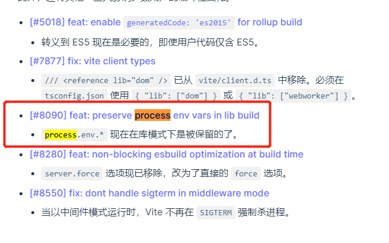

查看对应的 ISSUE：

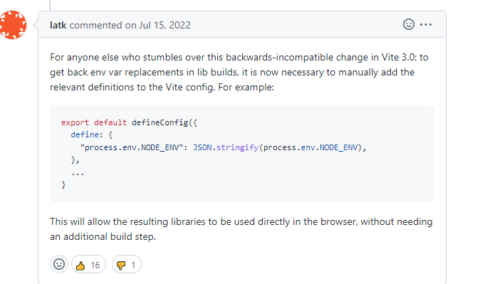

所以，还需要再次修改 `vite.config.js`：

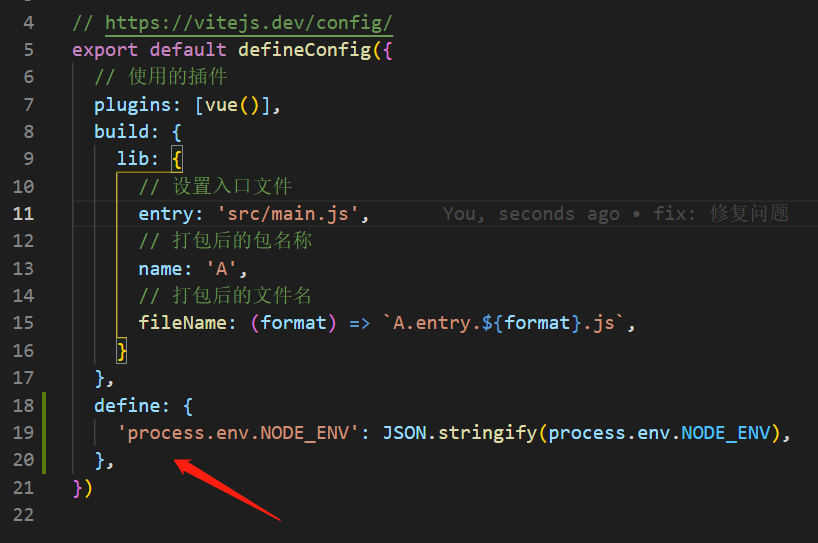

它的最终代码：

```js
import { defineConfig } from 'vite'
import vue from '@vitejs/plugin-vue2'

// https://vitejs.dev/config/
export default defineConfig({
  // 使用的插件
  plugins: [vue()],
  build: {
    lib: {
      // 设置入口文件
      entry: 'src/main.js',
      // 打包后的包名称
      name: 'A',
      // 打包后的文件名
      fileName: (format) => `A.entry.${format}.js`,
    }
  },
  define: {
    'process.env.NODE_ENV': JSON.stringify(process.env.NODE_ENV),
  },
})
```

搞定收工，又解决了一个难题~

### 对比 - Vite 对比 Vue CLI

我们拿前面的打包数据查看：

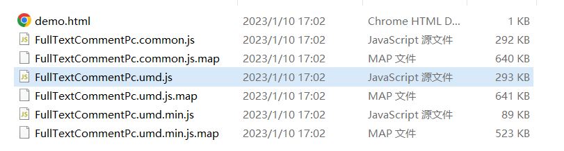

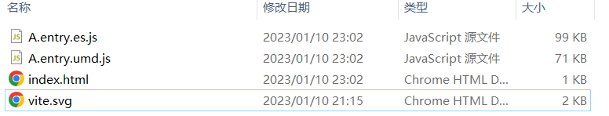

发现经过 Vite 打包，确实减轻了构建大小？

这里无法给出明确判断，本来想找个 Vue v2.x 的 GitHub 项目试试水，来验证下的。

但是怕小伙伴们没兴趣，所以就浅尝而止吧，在我单项目上是 OK 的。

如果小伙伴们在打包构建时碰到问题，可以私聊 **jsliang** 大家一起折腾下。

> 个人联系方式 WX：Liang123Gogo

## 参考文献

* [Vite 官方中文文档 - Vue](https://cn.vitejs.dev/guide/features.html#vue)
* [GitHub - vitejs - vite-plugin-vue2](https://github.com/vitejs/vite-plugin-vue2)
* [掘金 - 孤独的根号3 - vite打包lib库](https://juejin.cn/post/7073646687968821256)
* [Vite 导向](https://cn.vitejs.dev/guide/migration-from-v2.html#advanced)
* [Vite Issue - Multiple entry points/output in library mode? #1736](https://github.com/vitejs/vite/discussions/1736)
* [Vite Discussions - vite lib multiple outputs](https://github.com/vitejs/vite/discussions/11843)

---

**不折腾的前端，和咸鱼有什么区别！**

觉得文章不错的小伙伴欢迎点赞/点 Star。

如果小伙伴需要联系 **jsliang**：

* [Github](https://github.com/LiangJunrong/document-library)
* [掘金](https://juejin.im/user/3403743728515246)

个人联系方式存放在 Github 首页，欢迎一起折腾~

争取打造自己成为一个充满探索欲，喜欢折腾，乐于扩展自己知识面的终身学习斜杠程序员。

> jsliang 的文档库由 [梁峻荣](https://github.com/LiangJunrong) 采用 [知识共享 署名-非商业性使用-相同方式共享 4.0 国际 许可协议](http://creativecommons.org/licenses/by-nc-sa/4.0/) 进行许可。<br/>基于 [https://github.com/LiangJunrong/document-library](https://github.com/LiangJunrong/document-library) 上的作品创作。<br/>本许可协议授权之外的使用权限可以从 [https://creativecommons.org/licenses/by-nc-sa/2.5/cn/](https://creativecommons.org/licenses/by-nc-sa/2.5/cn/) 处获得。
