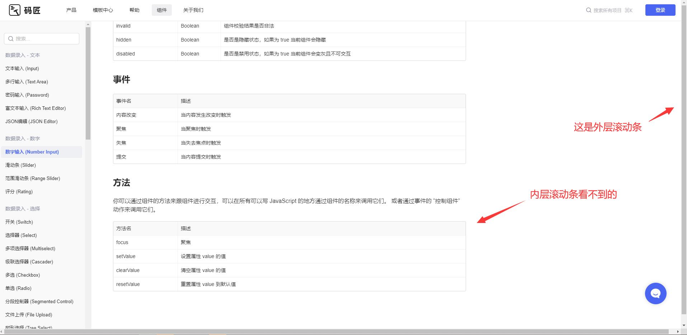

低代码分享
===

> Create by **jsliang** on **2022-11-16 12:59:04**  
> Recently revised in **2022-11-16 12:59:04**

Hello 小伙伴们早上、中午、下午、晚上、深夜好，这边是 @jsliang ，本次分享的主题是：

* 低代码

低代码是通过可视化方式创建应用的一种概念，特点是代码量比传统开发少得多，甚至无代码，能显著提升开发效率。

## 一、前言

### 1.1 低代码历史

OutSystems 在 2001 成立于葡萄牙，在 2018-2021 年相继完成了数论过亿元美金的融资，成为国外低代码领域的独角兽。

[一文看懂什么是 OutSystems](https://zhuanlan.zhihu.com/p/544629596)

低代码行业分析：

> 材料来源于 iResearch，摘抄自 [凹凸实验室 - 低代码行业现状简析](https://juejin.cn/post/7043977419207737375)

### 1.1 首次接触可视化

还记得 @jsliang 第一次接触可视化，可以追溯到大学时期，当时接触了 C# 的 Windows 窗体应用：

相对于前面学过枯燥无味的 C 以及 C#，窗体应用让爱整活的小伙伴们眼前一亮：

1. 通过反复批量弹窗，让电脑卡死
2. 通过调整弹窗位置，让对方永远关闭不了弹窗

奔着说话要有证据的思路，看到我电脑上还有 Visio Studio 2017，本来想试试能不能场景再现。

但是经过时间的洗礼，代码也忘记怎么使唤了，连新建都麻烦，遂放弃~

### 1.2 浏览器可视化低代码

2016 年左右，随着开始学习前端，逐渐接触到 Bootstrap 可视化搭建：

* https://www.bootcss.com/p/layoutit/

这种搭建对于当时的我来说无疑是 “神兵利器”：

1. 界面干净。几乎没有任何包袱
2. 操作简单。拖拽界面，然后生成代码，最后替换到本地代码

这让一大堆没有很深的代码基础的小伙伴，直接一键上手，非常通人性。

### 1.3 背景 & 利益分析

资本，是逐利的。

从 @jsliang 在 2018 做的第一份外包工作来看：

* 一套 H5 代码吃遍天，每天换个图片，又是一个新的活动页

那么，假设有一天，老板看到外面流行低代码，甚至无代码。

于是要求产品以后提的需求，不得超出低代码平台支持的能力范围。

因为高可复用性，这一块只需要快速生成即可，可以缩减一些不必要的 “人工”。

虽然不排除有高定制化的需求，但是客户的需求标准化/模块化，让运营变得更为简单。

低代码，对于老板而言，招聘更少的员工，做更多的事；

对于程序员而言，成为真正的 Ctrl + C / Ctrl + V 员工，简单快活每一天。

所以，不要觉得低代码叫「low code」，你就觉得它很 low，说不定哪一天就夺取了你的工作。

低代码平台能力还没有足够完善成熟，但是低代码的宗旨，对于降低门槛，提升效率来说，它的意义是肯定的。

什么时候能感受低代码带来的切确红利，时间能给我们答案。

也许明天，一个人就可以很快完成前后端应用、完成运营监控，随手拿出一套可运行的程序。

### 1.4 利弊

低代码在利弊方面：

利：

1. 企业节省人力资源。招聘 10 个 ￥5000 的前端，和招聘 3 个 ￥10000 的前端干活，都做出一样的效果，无疑选择后者。
2. 更快地效率。随便一个人员即可操作，更快让客户看到效果。

弊：

1. 失业危机。企业好了，新时代农民工肯定就要失业，虽然不至于大范围，但是总会有那么些的。
2. 无法满足高定制需求。在项目初建的时候，需要衡量是否可启用低代码，如果用户的需求有变更，再更换为定制化，是否会浪费无谓的开发时间
3. 前后端数据交互问题。无法做更好的数据联动，除非这个模式一开始就有预期。

### 1.5 小结

虽然低代码吹的快起飞了，但是：

1. 对于企业，低代码创业不可取。当前低代码还有技术壁垒，且 B 端的低代码技术不是特别成熟，容易翻车。
2. 对于员工，尽可能提供硬实力。增加自己的不可替代性，让自己在新时代更替洪潮下活下来，是当前不可避免的一件事。

## 二、体验 - 不同低代码平台

### 2.1 独角兽 OutSystems

[「OutSystems」](https://www.outsystems.com/)

好玩的点：

1. 程序的开发都是自动化的，程序会自动生成标准的 HTML、CSS、JS、.net 代码

不好玩的点：

1. 官方英文版。
2. 具有详细复杂流程（不够灵活）。需要装包，运行，熟悉这一套流程，了解前后端，入手门槛大。

> 看写中文教程的老哥，他公司也准备抛弃这套系统了。

教程：

* [知乎 - 朱家俊 - outsystems从入门到精通](https://zhuanlan.zhihu.com/p/322582052)

### 2.2 Deco

[「Deco」设计稿一键生成多端代码](https://deco-preview.jd.com/)

好玩的点：支持设计稿转换代码

不好玩的点：

1. 设备局限。适用 Mac，仅支持 Sketch 工具。
2. UI 约束。虽然 Deco 说是对视觉稿没有严格约束，但是使用文档有提到设计稿基本规范，对 UI 有所要求。

> [官网](https://deco-preview.jd.com/help?key=design-guide) 小 bug

### 2.3 其他

* 「码酱」。在掘金多处评论看到 “自来水” 在宣传，注册要手机账号，没操作，官方文档界面有 bug。

## 实操 - 模拟 Bootstrap 可视化

低代码基本功能模块：

* 页面搭建
* 数据逻辑
* 数据模型
* 在线部署
* 管理系统

低代码平台形态划分：

* 表单/数据模型驱动

> 图片地址摘抄自 [凹凸实验室 - 低代码行业现状简析](https://juejin.cn/post/7043977419207737375)

* 界面驱动

> 图片地址摘抄自 [凹凸实验室 - 低代码行业现状简析](https://juejin.cn/post/7043977419207737375)

实现思路：

左侧组件思路：

* 添加属性：draggable
* 添加事件：dragstart + drop

中间画布思路：

* 记忆数据
* 画布重现
* 画布支持调整

右侧思路：点击显示属性

TODO: 写的实用点，要不然会被骂

## 参考文献

* [关于前端低代码的一些个人观点](https://juejin.cn/post/7131801252500865055)
* [推荐一个 yyds 的低代码开源项目](https://juejin.cn/post/7054186640868130830)
* [低代码 火火火！](https://mp.weixin.qq.com/s?__biz=MzUxNjg4NDEzNA==&mid=2247506645&idx=1&sn=7638eee635c1c7df89acf9431e092c3f&chksm=f9a2091cced5800a0a0d9ab253ebdf8557b74cb64ddbc76694cb5c05ecbf0312f9659b9578c4&scene=21#wechat_redirect)
* [解放双手！推荐一款阿里开源的低代码工具，YYDS！](https://juejin.cn/post/7088121411981541390)
* [低代码 yyds](https://juejin.cn/post/6984053870121091103)
* [掘金 - 凹凸实验室 - 低代码行业现状简析](https://juejin.cn/post/7043977419207737375)
* [掘金 - 小天师 - 低代码可视化编辑平台](https://juejin.cn/post/6930506113553006599)
* [掘金 - 三月风997 - 因为懒，我把公司的后管定制成了低代码中台](https://juejin.cn/post/7028069543951990821)
* [GitHub - woai3c - 一个低代码平台的前端部分，靠拖拉拽生成页面。](https://github.com/woai3c/visual-drag-demo)
* [掘金 - 何遇er - 低代码跨 iframe 拖拽](https://juejin.cn/post/7170845236078313486)

---

**不折腾的前端，和咸鱼有什么区别！**

觉得文章不错的小伙伴欢迎点赞/点 Star。

如果小伙伴需要联系 **jsliang**：

* [Github](https://github.com/LiangJunrong/document-library)
* [掘金](https://juejin.im/user/3403743728515246)

个人联系方式存放在 Github 首页，欢迎一起折腾~

争取打造自己成为一个充满探索欲，喜欢折腾，乐于扩展自己知识面的终身学习斜杠程序员。

> jsliang 的文档库由 [梁峻荣](https://github.com/LiangJunrong) 采用 [知识共享 署名-非商业性使用-相同方式共享 4.0 国际 许可协议](http://creativecommons.org/licenses/by-nc-sa/4.0/) 进行许可。 基于 [https://github.com/LiangJunrong/document-library](https://github.com/LiangJunrong/document-library) 上的作品创作。 本许可协议授权之外的使用权限可以从 [https://creativecommons.org/licenses/by-nc-sa/2.5/cn/](https://creativecommons.org/licenses/by-nc-sa/2.5/cn/) 处获得。
