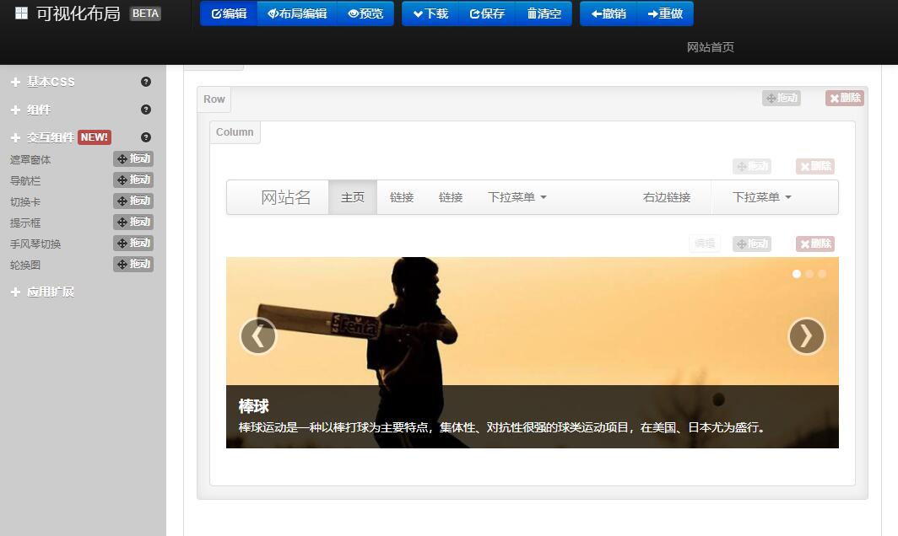

README
===

> Create by **jsliang** on **2022-11-16 12:59:04**  
> Recently revised in **2022-11-16 12:59:04**

Hello 小伙伴们早上、中午、下午、晚上、深夜好，这边是 @jsliang ，本次分享的主题是：

* 低代码

还记得 @jsliang 第一次接触低代码，可以追溯到 2016 年左右接触到的 Bootstrap 可视化搭建平台：

* https://www.bootcss.com/p/layoutit/

它的界面非常干净，你的操作也非常干净：**拖拽 -> 生成代码 -> 替换到本地代码**。

这让一大堆没有很深的代码基础的小伙伴，直接一键上手，非常通人性。

## 一、背景

资本，是逐利的。

假如有一天，老板要求产品以后提的需求，不得超出低代码平台支持的能力范围。

因为非标准需求，需要付出额外的开发成本，创造不了预期的收益，那对那些试错成本容忍度比较低的团队而言，这些需求完全没有存在的必要。

不知道小伙伴们有没有体验过外包生活，之前 @jsliang 做过电信外包，一套 H5 代码吃遍天，每天换个图片，又是一套新的电信活动页。

客户需求的标准化/模板化，让运营变得简单（当然，不排除有高定制化的需求）。

低代码，对于老板而言，招聘更少的员工，做更多的事；对于程序员而言，成为真正的 Ctrl + C / Ctrl + V 员工，简单快活每一天。

TODO: C# 可视化：https://blog.csdn.net/weixin_45263626/article/details/105845715

## 

* 推荐一个 yyds 的低代码开源项目：https://juejin.cn/post/7054186640868130830
* 低代码 火火火！：https://mp.weixin.qq.com/s?__biz=MzUxNjg4NDEzNA==&mid=2247506645&idx=1&sn=7638eee635c1c7df89acf9431e092c3f&chksm=f9a2091cced5800a0a0d9ab253ebdf8557b74cb64ddbc76694cb5c05ecbf0312f9659b9578c4&scene=21#wechat_redirect
* 解放双手！推荐一款阿里开源的低代码工具，YYDS！：https://juejin.cn/post/7088121411981541390

TODO
* 学习位置：
    ◦ https://juejin.cn/search?query=%E4%BD%8E%E4%BB%A3%E7%A0%81&type=0&sort=2
* 低代码介绍学习：
    ◦ 关于前端低代码的一些个人观点：https://juejin.cn/post/7131801252500865055

---

**不折腾的前端，和咸鱼有什么区别！**

觉得文章不错的小伙伴欢迎点赞/点 Star。

如果小伙伴需要联系 **jsliang**：

* [Github](https://github.com/LiangJunrong/document-library)
* [掘金](https://juejin.im/user/3403743728515246)

个人联系方式存放在 Github 首页，欢迎一起折腾~

争取打造自己成为一个充满探索欲，喜欢折腾，乐于扩展自己知识面的终身学习斜杠程序员。

> jsliang 的文档库由 [梁峻荣](https://github.com/LiangJunrong) 采用 [知识共享 署名-非商业性使用-相同方式共享 4.0 国际 许可协议](http://creativecommons.org/licenses/by-nc-sa/4.0/) 进行许可。 基于 [https://github.com/LiangJunrong/document-library](https://github.com/LiangJunrong/document-library) 上的作品创作。 本许可协议授权之外的使用权限可以从 [https://creativecommons.org/licenses/by-nc-sa/2.5/cn/](https://creativecommons.org/licenses/by-nc-sa/2.5/cn/) 处获得。
