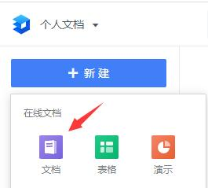
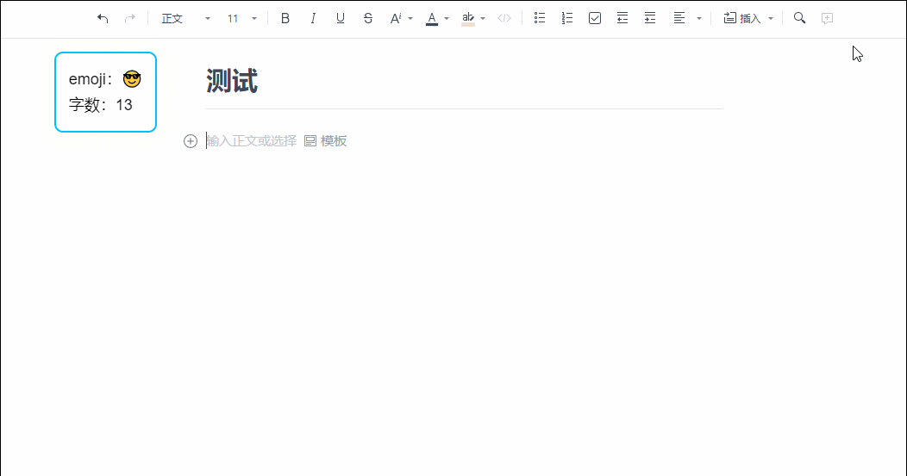
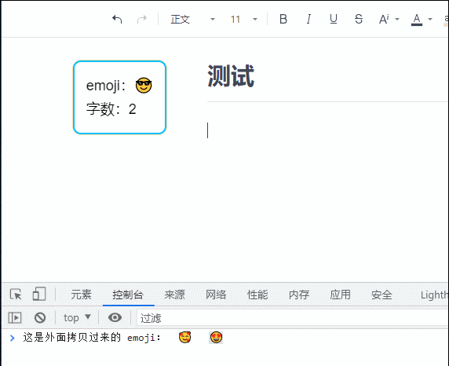
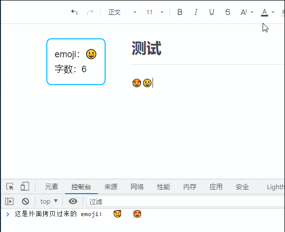
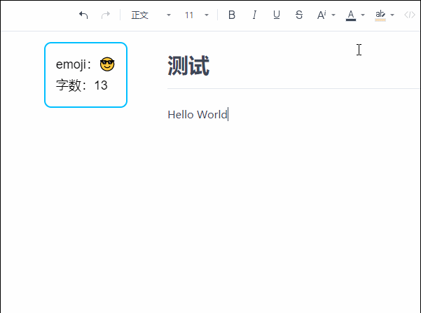

002 - 油猴插件从 0 到 1：亲自开发一个实在有用的工具
===

> Create by **jsliang** on **2021-12-23 08:57:06**  
> Recently revised in **2021-12-29 22:21:15**

作为一枚喜爱折腾的咸鱼，看到一些新产品发布，难免想先体验一番。

但是，如果这个产品不是很满足你的想法，然后你又不想走反馈流程（毕竟要等几个月才能体验新功能），或者你提的需求比较极端，产品不想采纳你的建议，你就会觉得很恼火~

> 张小龙：每天都有 5 亿人吐槽，1 亿人教我怎么做产品 

所以，客户端的咱们定制不了，但是 Web 端的束缚不住咱，这时候肯定想方设法 DIY 它！

## 一 既定目标

本次操刀的是「金山文档」的新产品「文档」



咱们希望基于它现有的功能，往上面加一些新内容：

* [x] 支持模板搜索功能
* [x] 插入自定义 emoji
* [x] 字数统计
* [x] 「做不了，技术限制」右键搜索功能
  * [x] 页内搜索
  * [x] 页外搜索
* [x] 「做不了，技术限制」支持导入自定义模板
* [x] 「做不了，技术限制」自定义视频（不局限 哔哩哔哩）
* [x] 「不想做，过于麻烦」皮肤

那么，Here we go~

## 二 实现情况

下面有请美容师出场：

* 油猴插件（Tampermonkey）：https://www.tampermonkey.net/

油猴脚本（Tampermonkey）是一个非常流行的浏览器扩展，它可以运行由广大社区编写的扩展脚本，来实现各式各样的功能，常见的去广告、修改样式文件、甚至是下载视频。

> 你需要使用一丁点的小手段，才能下载插件和访问官网。当然，如果找不到好的方式（譬如找国内版的），你可以直接 call **jsliang**，让他给你推荐个科学上网小工具

* 下载：[Chrome 拓展工具：Tampermonkey](https://chrome.google.com/webstore/detail/tampermonkey/dhdgffkkebhmkfjojejmpbldmpobfkfo?hl=zh)
* 使用说明：[Tampermonkey 首页](https://www.tampermonkey.net/index.php?version=4.13&ext=dhdg&updated=true)

当然，有些小伙伴想偷懒，想直接从安装到建立第一个脚本，可以看下面 GIF：


### 3.1 模板搜索功能

先上效果图：



因为代码比较多，所以咱们不在文章具体展示，这个模块的代码可见：[GitHub 仓库 - 模板搜索](https://github.com/LiangJunrong/all-for-one/blob/master/033-%E6%96%87%E6%A1%A3%E6%B2%B9%E7%8C%B4%E6%8F%92%E4%BB%B6/%E6%A8%A1%E6%9D%BF%E6%90%9C%E7%B4%A2.js)

### 3.2 自定义 emoji

先上效果图：

> 自定义 emoji 上传和复制



> 搜索自定义 emoji



因为代码比较多，所以咱们不在文章具体展示，这个模块的代码可见：[GitHub 仓库 - emoji](https://github.com/LiangJunrong/all-for-one/blob/master/033-%E6%96%87%E6%A1%A3%E6%B2%B9%E7%8C%B4%E6%8F%92%E4%BB%B6/emoji%20%E9%9D%A2%E6%9D%BF.js)

### 3.3 字数统计

先上效果图：



因为代码比较多，所以咱们不在文章具体展示，这个模块的代码可见：[GitHub 仓库 - 字数统计](https://github.com/LiangJunrong/all-for-one/blob/master/033-%E6%96%87%E6%A1%A3%E6%B2%B9%E7%8C%B4%E6%8F%92%E4%BB%B6/emoji%20%E9%9D%A2%E6%9D%BF.js)

## 三 疑难解惑

### 3.1 为什么脚本被运行了多次？

* 问：为什么脚本被运行了多次？
* 答：可参考：https://stackoverflow.com/questions/59795141/userscript-should-run-once-not-multiple-times

它里面有一句话：

```
your script could be loading for each frame in the page.
add // @noframes to prevent this.
```

意思是这个页面，如果加载了多次 `iframe`，那么在每个 `iframe` 中都会执行，所以需要禁止掉 `iframe`，故添加 `// @noframes` 即可！

所以直接改：

```diff
// ==UserScript==
// @name         Test
// @namespace    http://tampermonkey.net/
// @version      0.1
// @description  try to take over the world!
// @author       You
// @match        https://myanimelist.net/*
// @require http://code.jquery.com/jquery-3.4.1.slim.min.js
// @grant        none
// @noframes
+ // ==/UserScript==
```

### 3.2 开发过程的 Icon 这些资源怎么获取？

在编写插件的过程中，难免用到一些网上资源，例如右下角的刷新按钮，所以我将这些资源罗列起来了，小伙伴们按需领取：

* Icon 图标获取：https://www.flaticon.com/free-icons/refresh
* 图片转 Base64 编码：https://c.runoob.com/front-end/59/

### 3.3 闪烁的 div

就是一个 div 会发光的样子，因为没使用到了，所以这里记录下：

```css
@keyframes jsliang-bottom-bar-animated {
  0% {
    box-shadow: 0 0 0 0 #fca30066;
  }
  100% {
    box-shadow: 0 0 0 20px #f6bc8a00;
  }
}
.jsliang-bottom-bar {
  display: flex;
  justify-content: space-between;

  animation: jsliang-bottom-bar-animated 1.5s infinite;

  font-family: Arial;
  font-size: 18px;
  line-height: 30px;

  border: 2px solid deepskyblue;
  border-radius: 10px;
  padding: 15px;

  position: fixed;
  bottom: 10px;

  z-index: 99;
}
```

## 四 参考文献

* [【SegmentFault】techstay - 油猴脚本编写教程](https://segmentfault.com/a/1190000021654926)
* [【张鑫旭】JS 复制文字到剪切板的极简实现及扩展](https://www.zhangxinxu.com/wordpress/2021/10/js-copy-paste-clipboard/)
* [【知乎】前端天宇 - 9 个很棒的 CSS 边框技巧](https://zhuanlan.zhihu.com/p/144775015)

---

> jsliang 的文档库由 [梁峻荣](https://github.com/LiangJunrong) 采用 [知识共享 署名-非商业性使用-相同方式共享 4.0 国际 许可协议](http://creativecommons.org/licenses/by-nc-sa/4.0/) 进行许可。<br/>基于 [https://github.com/LiangJunrong/document-library](https://github.com/LiangJunrong/document-library) 上的作品创作。<br/>本许可协议授权之外的使用权限可以从 [https://creativecommons.org/licenses/by-nc-sa/2.5/cn/](https://creativecommons.org/licenses/by-nc-sa/2.5/cn/) 处获得。
