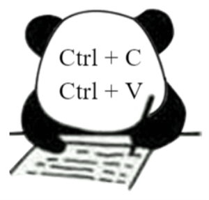
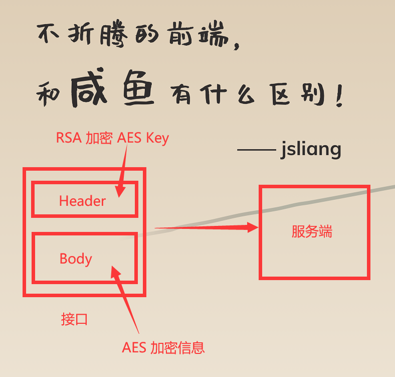
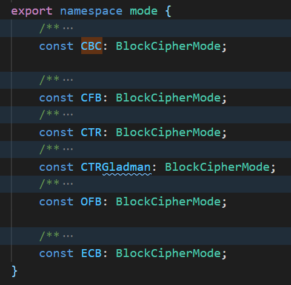
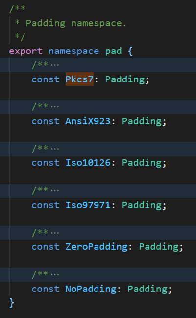

JavaScript + GO 通过 AES + RSA 进行数据加解密
===

> Create by **jsliang** on **2023-08-06 15:46:34**  
> Recently revised in **2023-08-06 15:46:34**

浏览器端搞些小儿科的加密，就好比在黑暗夜空中，点缀了几颗星星，告诉黑客「这里有宝贵信息，快来翻牌」


浏览器端的加密，都是相对安全的。

它的具体安危，取决于里面存在的信息价值，是否值得破解者出手一试。

就跟那个经典的笑话一样：

某个客户自己开发了一套软件，并买了一个防破解插件，让大牛测试破解难度。

三天后大牛郁闷地说这还挺难搞的，居然花了 3 天。

仔细一看原来是把人家的防破解插件给破了……

## 一、信息对齐

其实 JavaScript + Go 的加解密，真实代码调用很简单。

我和服务端小伙伴对着网上资料，库库一顿操作就搞定了。



所以在进入代码环节之前，我们先对齐同步一些基本信息，避免其他想了解这块知识点的小伙伴，捋不清里面逻辑。

### 1.1 什么是加解密

所谓「加密」，就是将你的信息，通过「某种处理」，让它变成不可读，被保护不被非法获取。

而「解密」，就是将处理后的信息，再转换成正常人能读懂的信息。

**举个栗子**，你要去拿货，对方来了一句「天王盖地虎」。

你是不是要接话，来表明你的身份？


“对暗号”，其实就是一种处理信息的方式，你只有回答出对方的问题，才能进一步操作。

### 1.2 为什么要数据加密

为了「安全」。

为什么安全要括起来，因为没有绝对的安全。

在浏览器端做数据加解密，只能保证：

1. 传输的数据是经过加密或者编码的，即使有人通过抓包软件抓取数据，也看不懂或者比较难解开
2. 确保数据没有经过篡改，确认发送者的身份

注意！以上 2 点只能防抓包，不防注入。

意思就是对方通过 JavaScript 脚本注入，替换你原先写的代码。


这样就可以在你加密信息之前，获取到原信息。

### 1.3 对称加密

所谓「对称加密」，意思就是大家拿到同一把钥匙，对传递的数据进行加解密。

**举个栗子**，对称加密就像你和朋友买了一个保险柜并配了 2 把一样的钥匙。

每次你找 ta 聊天，你把信写好，丢到保险柜，把保险柜扔给对方。

然后对方拿一样的钥匙，就可以开保险柜，并把他的信也丢到里面仍回给你。

**再举个栗子**，高中同学 A 和 B 谈恋爱了，但是他们纸条不能直接写情书呀，要不然被发现就哦豁了。

所以他们想了个法子，写纸条的时候，只写数字，比如 108-1，意思就是找某本书的 108 页第 1 个字。


看，他们的钥匙，就是相同的书，这样信息就等同了，对称了。

**常见的对称加密算法**：DES、3DES、DESX、Blowfish、IDEA、RC4、RC5、RC6 和 AES。

### 1.4 非对称加密

所谓「非对称加密」，就是 A 生成一对密钥，将公钥给别人，然后私钥自己藏好，别人通过公钥加密信息给 A，A 拿自己的私钥解密。

**举个栗子**，就是甲方是养蛊的，ta 有一对子母蛊。

甲方会把子蛊给乙方，母蛊留给自己。

这样哪怕子蛊丢了，别人拿子蛊传递信息，也只有甲方才能通过母蛊获取。

这种情况只有甲方才能破解信息，别人都没法理解不同人拿子蛊传递的信息。


所以非对称加密可以用在松鼠党上：我可不管谁拿了子蛊，只要传递信息给我，我就都存起来。

对称加密算法的运行速度比非对称加密算法快，所以需要加密大量的数据时，建议采用对称加密算法，提升加解密速度。

**常见的非对称加密算法**：RSA、ECC（移动设备用）、Diffie-Hellman、El Gamal、DSA（数字签名用）

### 1.5 哈希（Hash）算法

所谓哈希（Hash）算法，其实就是将信息做一个不可逆的转换，然后将信息存储起来。

**举个栗子**，小明同学将自己的密码，通过哈希（Hash）算法，存到了数据库里。

这样别人监听了小明登录账号的接口，也没法获取到里面的内容。

又或者别人看到了数据库，也不知道小明同学记录的原始密码是什么。

哈希（Hash）算法中，MD5 因为计算机算力提升，可以快速找到一个 MD5 的值对应的原文，所以大家由 MD5 的使用变成了 SHA-256 的使用，提升了加密的安全性。


> 当然，如果小伙伴们的密码比较简单，例如 123456 或者 666666 这种，被破解的还是大有可能的，可以在线试试 https://tool.oschina.net/encrypt?type=2

常见的哈希算法：MD2、MD4、MD5、HAVAL、SHA、SHA-1、HMAC、HMAC-MD5、HMAC-SHA1

### 1.6 数据加密算法的选择

在上面中，我们知道加密算法，大致分为「对称加密」和「非对称加密」以及「哈希（Hash）算法」这 3 种类型。

其中哈希（Hash）算法在对接中不可用了，因为它一般用作存储，不解出来。

而简单的对称加密和非对称加密，可能又过不了安全审查。

所以再三考虑下，我们采用 AES + RSA（对称加密 + 非对称加密）这种加密方式，提高数据传输的安全性。

## 二、RSA + AES

RSA + AES 的方案，我们采用这种形式：

1. 服务端生成一堆 RSA 密钥，其中私钥自己保存，公钥下发给浏览器端
2. 浏览器端通过随机函数，生成 AES 加密需要的 key（下面简称 AES key）
3. 浏览器端通过 AES 和步骤 2 生成的 key，对要传输的数据进行加密，通过接口的 body 传递
4. 浏览器端通过 RSA，对自己生成的 AES key 进行加密，通过接口的 header 传递
5. 服务端拿到数据后，先通过 RSA 解密 header，获取到 AES key，再通过 AES，解密出 body 的数据



### 2.1 RSA 加解密

这一块的困难点在于 Go，因为 JavaScript 更多用的是一个库，即 `jsencrypt`。

前端的 RSA 加密，是：

1. 通过 `jsencrypt`，设置公钥
2. 加密信息，生成 base64 数据并调用接口，传递给服务端

代码如下：

```js
import JSEncrypt from 'jsencrypt';

const encryptor = new JSEncrypt();

/**
 * @name RSA-设置公钥
 * @param val 公钥
 */
export const setPublicKey = (val: string) => {
  encryptor.setPublicKey(val);
}

/**
 * @name RSA-加密
 * @param data 待加密数据
 * @returns {PromiseLike<ArrayBuffer>} 返回加密字符串
 */
export const rsaEncrypt = (data: string) => {
  return encryptor.encrypt(data) || '';
}
```

服务端的 RSA 解密，是：

1. 先解密 base64
2. 再通过 RSA 解密

Go 的代码可参考：

* 《CSDN - 在vue、golang搭建的前后端系统中使用jsencrypt包实现RSA加解密功能》https://blog.csdn.net/sinat_26553595/article/details/122411287
* 《语言中文网 - 前后端交互，密码加密，RSA 实现前端 js 加密，后端 go 解密》https://studygolang.com/articles/35387

因为 Go 这边的库可能比较原始，所以如果碰到问题的话，大概率可能是公私钥的生成有问题，它需要按照最原始的标准格式来生成。

### 2.2 AES 加解密

对这一块确实没啥经验，网上说的文章，要么单独讲 JavaScript 的，要么单独讲 Go 的，整个人看完都懵圈。

好在网上大佬也确实给力，我跟服务端大佬合计了下，将一些点给撇掉了，直接采用：

* 《思否 - Golang 实现与 crypto-js 一致的 AES 简单加解密》https://segmentfault.com/a/1190000043754783

实际开发中使用 AES 加密解密需要注意的地方：

* 服务端和我们客户端必须使用一样的密钥和初始向量 IV
* 服务端和我们客户端必须使用一样的加密模式
* 服务端和我们客户端必须使用一样的 Padding 模式

**首先**，上面说这些可能有所信息误导，所以咱们直接看前端通过 JavaScript 生成 AES key 及加解密方法：

```js
// 为什么不直接用 window.crypto，因为这个库做了兼容，可以看 https://github.com/brix/crypto-js/blob/4dcaa7afd08f48cd285463b8f9499cdb242605fa/src/core.js#L13
import CryptoJS from 'crypto-js';

/**
 * @name AESKey
 * @description 生成 AES Key
 * @return 随机生成 16 位的 AES Key
 */
export const createAesKey = () => {
  const expect = 16;
  let str = Math.random().toString(36).substr(2);
  while (str.length < expect) {
    str += Math.random().toString(36).substr(2);
  }
  str = str.substr(0, 16);
  return str;
}

/**
 * @name AES-加密
 * @param raw 待加密字段
 * @param AESKey AES Key
 * @return {string} 返回加密字段
 */
export const aesEncrypt = (raw: any, AESKey: string) => {
  const cypherKey = CryptoJS.enc.Utf8.parse(AESKey);
  CryptoJS.pad.ZeroPadding.pad(cypherKey, 4);

  const iv = CryptoJS.SHA256(AESKey).toString();
  const cfg = { iv: CryptoJS.enc.Utf8.parse(iv) };
  return CryptoJS.AES.encrypt(raw, cypherKey, cfg).toString();
}

/**
 * @name AES-解密
 * @param raw 待解密数据
 * @param AESKey 解密 key
 * @returns {string} 返回解密字符串
 */
export const aesDecrypt = (raw: string, AESKey: string) => {
  const cypherKey = CryptoJS.enc.Utf8.parse(AESKey);
  CryptoJS.pad.ZeroPadding.pad(cypherKey, 4);

  const iv = CryptoJS.SHA256(AESKey).toString();
  const cfg = { iv: CryptoJS.enc.Utf8.parse(iv) };

  const decrypt = CryptoJS.AES.decrypt(raw, cypherKey, cfg);
  return CryptoJS.enc.Utf8.stringify(decrypt).toString();
}
```

**然后**，在上面这段代码，有几个关键信息指标需要统一：

* `mode`：AES 有各种加密模式，例如 CBC、CFB、CTR 等模式，在前端的 `crypto-js` 说明文档里面可以看到它含有 6 种



* `iv`：AES 在一些加密模式上，需要指定 IV，即初始向量

* `padding`：AES 需要加密的数据，不是 16 的倍数的时候，需要对原本的数据做 `padding` 操作（即补全长度到固定的位数），它有 Pkcs7、AnsiX923 等种类



**最后**，服务端 Go 的代码可以参考：

```go
package main

import (
  "fmt"

  "github.com/LinkinStars/go-scaffold/contrib/cryptor"
)

func main() {
  key := "1234"

  e := cryptor.AesSimpleEncrypt("Hello World!", key)
  fmt.Println("加密后：", e)
  
  d := cryptor.AesSimpleDecrypt(e, key)
  fmt.Println("解密后：", d)

  iv := cryptor.GenIVFromKey(key)
  fmt.Println("使用的 IV：", iv)
}

// 输出
// 加密后： NHlpzbcTvOj686VaF7fU7g==
// 解密后： Hello World!
// 使用的 IV： 03ac674216f3e15c
```

## 参考文献

搜索关键词：`浏览器端 rsa + aes`

* 《博客园 - 常用加密算法概述》https://www.cnblogs.com/colife/p/5566789.html
* 《CSDN - 浅谈常见的七种加密算法及实现》https://blog.csdn.net/baidu_22254181/article/details/82594072
* 《简书 - 一、消息摘要算法MD5、SHA-1》https://www.jianshu.com/p/38c93c677124
* 《简书 - sha256为什么不可逆，sha256的安全性如何》https://www.jianshu.com/p/fb2cc870337a
* 《CSDN - 网络传输数据加解密方案选择（RSA+AES）》https://blog.csdn.net/yuzhiqiang_1993/article/details/88641265
* 《掘金 - 实习技术总结（八）前端AES解密》https://juejin.cn/post/7122392902319210503
* 《CSDN - 网络传输数据加解密方案选择（RSA+AES）》https://blog.csdn.net/yuzhiqiang_1993/article/details/88641265
* 《KACIRAS - WebCrypto 与 Node 的 AES-GCM 踩坑》https://blog.kaciras.com/article/26/aes-crypto-in-node-and-browser
* 《掘金 - 前端利用jsencrypt.js进行RSA加密》https://juejin.cn/post/7075542251228626951
* 《思否 - 一套简单的基于 RSA + AES 加密机制的前端解决方案》https://segmentfault.com/a/1190000019399444
* 《掘金 - 前端加解密方案探讨》https://juejin.cn/post/6844903745701019662
* 《掘金 - springboot＋vue接口加密：RSA+AES》https://juejin.cn/post/7181726644799963173
* 《思否 - Golang 实现与 crypto-js 一致的 AES 简单加解密》https://segmentfault.com/a/1190000043754783
* 《阿里云 - RSA：jsencrypt/Python实现加密》https://developer.aliyun.com/article/813627
* 《简书 - jsencrypt前台加密，Go后台解密失败》https://www.jianshu.com/p/f2b03fe16193
* 《CSDN - 在vue、golang搭建的前后端系统中使用jsencrypt包实现RSA加解密功能》https://blog.csdn.net/sinat_26553595/article/details/122411287
* 《语言中文网 - 前后端交互，密码加密，RSA 实现前端 js 加密，后端 go 解密》https://studygolang.com/articles/35387

---

**不折腾的前端，和咸鱼有什么区别！**

觉得文章不错的小伙伴欢迎点赞/点 Star。

如果小伙伴需要联系 **jsliang**：

* [Github](https://github.com/LiangJunrong/document-library)
* [掘金](https://juejin.im/user/3403743728515246)

个人联系方式存放在 Github 首页，欢迎一起折腾~

争取打造自己成为一个充满探索欲，喜欢折腾，乐于扩展自己知识面的终身学习斜杠程序员。

> jsliang 的文档库由 [梁峻荣](https://github.com/LiangJunrong) 采用 [知识共享 署名-非商业性使用-相同方式共享 4.0 国际 许可协议](http://creativecommons.org/licenses/by-nc-sa/4.0/) 进行许可。<br/>基于 [https://github.com/LiangJunrong/document-library](https://github.com/LiangJunrong/document-library) 上的作品创作。<br/>本许可协议授权之外的使用权限可以从 [https://creativecommons.org/licenses/by-nc-sa/2.5/cn/](https://creativecommons.org/licenses/by-nc-sa/2.5/cn/) 处获得。
