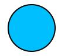

SVG 安全
===

> Create by **jsliang** on **2022-12-21 15:15:12**  
> Recently revised in **2022-12-28 22:31:03**

<!-- 目录开始 -->
## <a name="chapter-one" id="chapter-one"></a>一 目录

**不折腾的前端，和咸鱼有什么区别**

| 目录 |
| --- |
| [一 目录](#chapter-one) |
| <a name="catalog-chapter-two" id="catalog-chapter-two"></a>[二 任务目标](#chapter-two) |
| <a name="catalog-chapter-three" id="catalog-chapter-three"></a>[三 SVG 简要介绍](#chapter-three) |
| <a name="catalog-chapter-four" id="catalog-chapter-four"></a>[四 SVG 漏洞认知](#chapter-four) |
| &emsp;[4.1 跨站脚本（XSS）](#chapter-four-one) |
| &emsp;[4.2 HTML 注入](#chapter-four-two) |
| &emsp;[4.3 XML 实体导致的 Billion Laughs 攻击](#chapter-four-three) |
| &emsp;[4.4 Dos（拒绝服务）：新型 SVG Billion Laughs 攻击](#chapter-four-four) |
| &emsp;[4.5 XML 外部实体注入（XXE）](#chapter-four-five) |
| <a name="catalog-chapter-five" id="catalog-chapter-five"></a>[五 SVG 安全防护](#chapter-five) |
| &emsp;[5.1 安全引用 SVG](#chapter-five-one) |
| &emsp;[5.2 文件格式验证](#chapter-five-two) |
| &emsp;[5.3 SVG 合法标签白名单列表](#chapter-five-three) |
| <a name="catalog-chapter-six" id="catalog-chapter-six"></a>[六 SVG 安全库](#chapter-six) |
| &emsp;[6.1 DOMPurify 介绍](#chapter-six-one) |
| &emsp;[6.2 DOMPurify 使用](#chapter-six-two) |
| &emsp;[6.3 DOMPurify 源码剖析](#chapter-six-three) |
| &emsp;&emsp;[6.3.1 DOMPurify v0.1](#chapter-six-three-one) |
| &emsp;&emsp;[6.3.2 DOMPurify v2.4.1](#chapter-six-three-two) |
| <a name="catalog-chapter-seven" id="catalog-chapter-seven"></a>[七 总结](#chapter-seven) |
| <a name="catalog-chapter-eight" id="catalog-chapter-eight"></a>[八 参考资料](#chapter-eight) |
<!-- 目录结束 -->

## <a name="chapter-two" id="chapter-two"></a>二 任务目标

> [返回目录](#chapter-one)

本篇文章的目的有：

* [ ] 了解 SVG 漏洞
* [ ] 了解 SVG 常见防护手段
* [ ] 搜寻 SVG 数据安全性校验和过滤的库
* [ ] 了解如何使用此类库来进行 SVG 上传防护
* [ ] 阅读源码，能明确讲述此类库做了什么

如果对你有所帮助，不妨点赞、评论、收藏和吐槽一番~

## <a name="chapter-three" id="chapter-three"></a>三 SVG 简要介绍

> [返回目录](#chapter-one)

SVG 即可缩放矢量图形（Scalable Vector Graphics），它使用 XML 格式定义图像。

> circle.svg

```xml
<svg xmlns="http://www.w3.org/2000/svg" version="1.1">
  <circle cx="100" cy="50" r="40" stroke="black"
  stroke-width="2" fill="deepskyblue" />
</svg>
```

打开 `circle.svg`，即可看到：



> 注：因后续 SVG 代码有些存有危害，请自行创建 `xx.svg` 文件来存放，了解此 SVG 用途（甚至有些 SVG 建议只看代码了解其攻击性即可，否则会卡自己机子）

SVG 更像是 HTML，而不单单是一张简单的图像。

例如，当设计师需要五彩斑斓的黑，我们还可以直接修改上面 `circle.svg` 中的 `fill="deepskyblue"`，将其改成 `fill="black"`，想必设计师会非常开心，我们又帮 ta 解决了一个难题~

此外，可缩放矢量也是 SVG 一大优点，毕竟能大能小还能清晰可见，保持真本性，谁不喜欢呢~

更多的可自行前往 MDN 等网站了解：

* [MDN - SVG](https://developer.mozilla.org/zh-CN/docs/Web/SVG)
* [菜鸟教程 - SVG](https://www.runoob.com/svg/svg-tutorial.html)

## <a name="chapter-four" id="chapter-four"></a>四 SVG 漏洞认知

> [返回目录](#chapter-one)

在上面，我们了解到，SVG 更像是 （X）HTML，而不单单是一张简单的图像。

所以，在进行 SVG 安全防护之前，我们尚需了解它的危害性。

### <a name="chapter-four-one" id="chapter-four-one"></a>4.1 跨站脚本（XSS）

> [返回目录](#chapter-one)

SVG 可通过 `<script>` 元素执行 JavaScript 代码。

所以，如果开放了 SVG 上传，那么会存在 XSS （跨站脚本）安全风险。

> 01-xss.svg

```xml
<svg xmlns="http://www.w3.org/2000/svg" version="1.1">
  <circle cx="100" cy="50" r="40" stroke="black" stroke-width="2" fill="black" />
  <!-- 这种操作，可以在 SVG 中直接执行 Script，从而通过 Ajax 将同域的 cookie 投出去，造成存储型 XSS -->
  <script>alert(document.cookie)</script>
</svg>
```

注：如果在 Chrome 上通过 `` 标签引入，并不会触发攻击。但是，如果单独在 Tab 上打开图片，是会触发攻击的！！

又或者，我们可以通过 SVG，让用户在查看图片的时候，假装丢失了密码，需要重新输入：

```xml
<svg xmlns="http://www.w3.org/2000/svg" version="1.1">
  <circle cx="100" cy="50" r="40" stroke="black" stroke-width="2" fill="black" />
  <script>
    const passwd = prompt('输入密码继续');
    console.error('passwd: ', passwd);
    alert(`感谢你的密码：${passwd}`);
  </script>
</svg>
```

### <a name="chapter-four-two" id="chapter-four-two"></a>4.2 HTML 注入

> [返回目录](#chapter-one)

SVG 是基于 XML 的矢量图，没法简单将 HTML 内容放到里面。

所以，SVG 提供了 `<foreignObject>` 元素，用来包含其他 XML 命名空间的元素。

这一部分数据很可能采用 （X）HTML 形式。

> 02-html-injection

```xml
<svg viewBox="0 0 200 200" xmlns="http://www.w3.org/2000/svg">
  <style>
    div {
      background: black;
      color: pink;
      font: 18px serif;
      width: 100px;
      height: 100px;
      overflow: auto;
    }
  </style>

  <foreignObject x="20" y="20" width="100" height="100">
    <div xmlns="http://www.w3.org/1999/xhtml">
      <a href="https://www.kdocs.cn">点击这里</a>
      <p>超好看的内容等你来喔~</p>
    </div>
  </foreignObject>
</svg>
```

在这种情况下，我们可以发起类似钓鱼、绕开同源策略、CSRF 之类的攻击。

如果在 Chrome 上通过 `` 标签引入，并不会渲染 `<a>` 标签，可能是 Chrome 做的防护，但是单独打开是会触发的

### <a name="chapter-four-three" id="chapter-four-three"></a>4.3 XML 实体导致的 Billion Laughs 攻击

> [返回目录](#chapter-one)

`a billion laughs attack` 是一种 `denial-of-service`（DoS）攻击，它主要作用于 XML 文档解析器。

它也被称为指数实体扩展攻击，是一种名副其实的 XML 炸弹。

在 SVG 中，可以通过 `Entity` 声明实体功能：

> 03-billion-laughs.svg

```xml
<!DOCTYPE lolz [
<!ENTITY lol "lol">
<!ENTITY lol2 "&lol;&lol;&lol;&lol;&lol;&lol;&lol;&lol;&lol;&lol;">
<!ENTITY lol3 "&lol2;&lol2;&lol2;&lol2;&lol2;&lol2;&lol2;&lol2;&lol2;&lol2;">
<!ENTITY lol4 "&lol3;&lol3;&lol3;&lol3;&lol3;&lol3;&lol3;&lol3;&lol3;&lol3;">
<!ENTITY lol5 "&lol4;&lol4;&lol4;&lol4;&lol4;&lol4;&lol4;&lol4;&lol4;&lol4;">
<!ENTITY lol6 "&lol5;&lol5;&lol5;&lol5;&lol5;&lol5;&lol5;&lol5;&lol5;&lol5;">
<!ENTITY lol7 "&lol6;&lol6;&lol6;&lol6;&lol6;&lol6;&lol6;&lol6;&lol6;&lol6;">
<!ENTITY lol8 "&lol7;&lol7;&lol7;&lol7;&lol7;&lol7;&lol7;&lol7;&lol7;&lol7;">
<!ENTITY lol9 "&lol8;&lol8;&lol8;&lol8;&lol8;&lol8;&lol8;&lol8;&lol8;&lol8;">
<!ENTITY lol10 "&lol9;&lol9;&lol9;&lol9;&lol9;&lol9;&lol9;&lol9;&lol9;&lol9;">
<!ENTITY lol11 "&lol10;&lol10;&lol10;&lol10;&lol10;&lol10;&lol10;&lol10;&lol10;">
<!ENTITY lol12 "&lol11;&lol11;&lol11;&lol11;&lol11;&lol11;&lol11;&lol11;&lol11;">
<!ENTITY lol13 "&lol12;&lol12;&lol12;&lol12;&lol12;&lol12;&lol12;&lol12;&lol12;">
<!ENTITY lol14 "&lol13;&lol13;&lol13;&lol13;&lol13;&lol13;&lol13;&lol13;&lol13;">
<!ENTITY lol15 "&lol14;&lol14;&lol14;&lol14;&lol14;&lol14;&lol14;&lol14;&lol14;">
]>
<svg xmlns="http://www.w3.org/2000/svg">
  <text x="0" y="20" font-size="20">
    <lolz>&lol15;</lolz>
  </text>
</svg>
```

浏览器打开这个文件后，CPU 直接干上 100%，所以如非必要，不要打开它。

### <a name="chapter-four-four" id="chapter-four-four"></a>4.4 Dos（拒绝服务）：新型 SVG Billion Laughs 攻击

> [返回目录](#chapter-one)

除了 `Entity`，还有一种方式，就是通过 SVG 图像发起攻击。

其中 `xlink:href` 属性以 IRI（国际资源标识）方式定义了对某个资源的引用，该链接的具体含义需根据使用该链接的每个元素的上下文来决定。

`<use>` 元素从 SVG 文档中获取节点，然后将其复制到其他位置。

在下面代码中，我们实现了反复嵌套使用，直至浏览器或者电脑卡死。

> 04-xlink-billion-laughs.svg

```xml
<svg version="1.2" baseProfile="tiny" xmlns="http://www.w3.org/2000/svg" xmlns:xlink="http://www.w3.org/1999/xlink" x="0px" y="0px" xml:space="preserve">
<path id="a" d="M0,0"/>
<g id="b"><use xlink:href="#a"/><use xlink:href="#a"/><use xlink:href="#a"/><use xlink:href="#a"/><use xlink:href="#a"/><use xlink:href="#a"/><use xlink:href="#a"/><use xlink:href="#a"/><use xlink:href="#a"/><use xlink:href="#a"/></g>
<g id="c"><use xlink:href="#b"/><use xlink:href="#b"/><use xlink:href="#b"/><use xlink:href="#b"/><use xlink:href="#b"/><use xlink:href="#b"/><use xlink:href="#b"/><use xlink:href="#b"/><use xlink:href="#b"/><use xlink:href="#b"/></g>
<g id="d"><use xlink:href="#c"/><use xlink:href="#c"/><use xlink:href="#c"/><use xlink:href="#c"/><use xlink:href="#c"/><use xlink:href="#c"/><use xlink:href="#c"/><use xlink:href="#c"/><use xlink:href="#c"/><use xlink:href="#c"/></g>
<g id="e"><use xlink:href="#d"/><use xlink:href="#d"/><use xlink:href="#d"/><use xlink:href="#d"/><use xlink:href="#d"/><use xlink:href="#d"/><use xlink:href="#d"/><use xlink:href="#d"/><use xlink:href="#d"/><use xlink:href="#d"/></g>
<g id="f"><use xlink:href="#e"/><use xlink:href="#e"/><use xlink:href="#e"/><use xlink:href="#e"/><use xlink:href="#e"/><use xlink:href="#e"/><use xlink:href="#e"/><use xlink:href="#e"/><use xlink:href="#e"/><use xlink:href="#e"/></g>
<g id="g"><use xlink:href="#f"/><use xlink:href="#f"/><use xlink:href="#f"/><use xlink:href="#f"/><use xlink:href="#f"/><use xlink:href="#f"/><use xlink:href="#f"/><use xlink:href="#f"/><use xlink:href="#f"/><use xlink:href="#f"/></g>
<g id="h"><use xlink:href="#g"/><use xlink:href="#g"/><use xlink:href="#g"/><use xlink:href="#g"/><use xlink:href="#g"/><use xlink:href="#g"/><use xlink:href="#g"/><use xlink:href="#g"/><use xlink:href="#g"/><use xlink:href="#g"/></g>
<g id="i"><use xlink:href="#h"/><use xlink:href="#h"/><use xlink:href="#h"/><use xlink:href="#h"/><use xlink:href="#h"/><use xlink:href="#h"/><use xlink:href="#h"/><use xlink:href="#h"/><use xlink:href="#h"/><use xlink:href="#h"/></g>
<g id="j"><use xlink:href="#i"/><use xlink:href="#i"/><use xlink:href="#i"/><use xlink:href="#i"/><use xlink:href="#i"/><use xlink:href="#i"/><use xlink:href="#i"/><use xlink:href="#i"/><use xlink:href="#i"/><use xlink:href="#i"/></g>
</svg>
```

### <a name="chapter-four-five" id="chapter-four-five"></a>4.5 XML 外部实体注入（XXE）

> [返回目录](#chapter-one)

这个危害没有在浏览器测试到，但是看他们说是存在的。

可能我的网络安全资料比较缺乏，所以这里记录一下：

> 05-xxe.svg

```xml
 <!-- ubuntu 文件信息： file:///etc/passwd -->
 <!-- ubuntu 文件信息： file:///etc/hostname -->
<!DOCTYPE test [ <!ENTITY xxe SYSTEM "file:///etc/hostname"> ]>
<svg width="128px" height="128px" xmlns="http://www.w3.org/2000/svg" xmlns:xlink="http://www.w3.org/1999/xlink" version="1.1">
  <text font-size="16" x="0" y="16">&xxe;</text>
</svg> 
```

## <a name="chapter-five" id="chapter-five"></a>五 SVG 安全防护

> [返回目录](#chapter-one)

既然贸然使用 SVG 是有危险的，那么我们肯定要有所措施来应对使用。

1. 限制 SVG 的危险标签。例如 `<script>`、`<foreignObject>` 等
2. 限制 SVG 图像内加载资源和一些拓展逻辑
3. 将 SVG 图片存储到其他服务器，防止主要服务器被攻击
4. 限制 SVG 的引用方式，尽可能通过 `` 标签等安全形式引用
5. ……

### <a name="chapter-five-one" id="chapter-five-one"></a>5.1 安全引用 SVG

> [返回目录](#chapter-one)

在 `DigiNinja` 的 《Protecting against XSS in SVG》一文中，我们可以看到 ta 对其的一些个人见解。

* [DigiNinja - Protecting against XSS in SVG](https://digi.ninja/blog/svg_xss.php)

**不推荐的**：

* 「容易被攻击的」直接查看。这种直接链接并查看很危险
* 「容易被攻击的」查看 iframe 中的图片
* 「容易被攻击的」通过矢量图形进行消杀（？原文 `Sanitised through Inkscape`）。这种操作类似于直接查看，虽然它看起来像是被下面指令保护

```bash
inkscape --file="xss.svg" --verb="FileVacuum" --export-plain-svg="sanitised.svg"
```

这个指令看起来像是移除了 JavaScript 代码，但是实际上并没有

**推荐的**：

* 「不容易被攻击的」在 Content-Disposition 响应标头查看
* 「不容易被攻击的」设置查看元素的 CSP 白名单
* 「不容易被攻击的」通过 `` 标签加载。`` 标签具有防止 JS 脚本攻击的功能
* 「不容易被攻击的」设置标签的 CSP 白名单。通过上面的 `` 标签，加上这个举措，可以进行双重保护
* 「不容易被攻击的」在 iframe 沙箱中查看图片。设置 iframe 的时候，需要设置 `sandbox` 属性，来避免脚本攻击

### <a name="chapter-five-two" id="chapter-five-two"></a>5.2 文件格式验证

> [返回目录](#chapter-one)

下面 2 个是不可靠且可以被构造的：

1. 文件名后缀
2. 表单上传 `Content-Type`

所以，如果需要上传安全的 SVG，那么对其格式也需要进行验证。

判断文件类型的库：

* [Github - sindresorhus/file-type](https://github.com/sindresorhus/file-type)

### <a name="chapter-five-three" id="chapter-five-three"></a>5.3 SVG 合法标签白名单列表

> [返回目录](#chapter-one)

如上面所言，SVG 更像是 （X）HTML，所以需要过滤掉诸如 `<script>`、`<foreignObject>` 等相关标签和属性。

可参考的过滤清单：

* [Github - lizheming - svg-allow-tags.json](https://gist.github.com/lizheming/1b69b00d8575047b0b9b4a0f739ee0b4)
* [Github - DOMPurify - tags.js](https://github.com/cure53/DOMPurify/blob/main/src/tags.js)
* [Github - DOMPurify - attrs.js](https://github.com/cure53/DOMPurify/blob/main/src/attrs.js)

## <a name="chapter-six" id="chapter-six"></a>六 SVG 安全库

> [返回目录](#chapter-one)

如果是自己写的话，那也太对不住你的用户了，毕竟你不知道还有啥内容没防护到。

所以这里推荐一个库：[DOMPurify](https://github.com/cure53/DOMPurify)

### <a name="chapter-six-one" id="chapter-six-one"></a>6.1 DOMPurify 介绍

> [返回目录](#chapter-one)

DOMPurify 从 2014.07 开始建设，截止目标 10.1k Star，仅有 2 个待解决 Issue。

兼容性方面，可以说非常到位：

* Safari（10+）
* Opera（15+）
* IE（10+）
* Edge
* Firefox
* Chrome

其他介绍：

* [仓库自动测试覆盖面](https://github.com/cure53/DOMPurify/blob/main/test/karma.custom-launchers.config.js#L5)
* [支持 TypeScript](https://github.com/DefinitelyTyped/DefinitelyTyped/tree/master/types/dompurify)
* [过滤尝试](https://cure53.de/purify)

### <a name="chapter-six-two" id="chapter-six-two"></a>6.2 DOMPurify 使用

> [返回目录](#chapter-one)

既然我们的目标之一：

* [x] 了解如何使用此类库来进行 SVG 上传防护

那么，了解怎么防护也是必要的，这里 **jsliang** 编写了一个实例：

> index.html

```html
<!DOCTYPE html>
<html lang="en">
<head>
  <meta charset="UTF-8">
  <meta name="viewport" content="width=device-width,initial-scale=1.0,maximum-scale=1.0,user-scalable=no">
  <meta http-equiv="X-UA-Compatible" content="ie=edge">
  <title>DOMPurify - jsliang</title>
  <style>img { width: 300px; height: 300px; }</style>
  <script src="./dist/purify.min.js"></script>
</head>
<body>
  <p>请上传你的 svg 图片</p>
  <input id="input" type="file" accept="image/*">
  <div>
    <!-- TODO: 修改为相应的占位图图片 -->
    
  </div>

  <script>
    window.onload = () => {
      const input = document.querySelector('#input');
      const img = document.querySelector('#img');

      // 监听文件上传，并以文本形式读取内容
      const reader = new FileReader();
      input.onchange = (e) => {
        const [file] = input.files;
        if (file) {
          reader.readAsText(file);
        };
      };

      // 对获取到的内容进行处理，并进行加载
      reader.onload = (e) => {
        const result = e.target.result;
        const cleanResult = DOMPurify.sanitize(result);
        console.error('过滤前: ', result);
        console.error('过滤后: ', cleanResult);
        const bolb = new Blob([cleanResult], {
          type: 'image/svg+xml',
        });
        img.src = URL.createObjectURL(bolb);
      };
    };
  </script>
</body>
</html>
```

那么，对于下述 SVG 代码，它的 Diff 比对为：

> 01-xss.svg

```diff
<svg xmlns="http://www.w3.org/2000/svg" version="1.1">
  <circle cx="100" cy="50" r="40" stroke="black" stroke-width="2" fill="black" />
-  <!-- 这种操作，可以在 SVG 中直接执行 Script，从而通过 Ajax 将同域的 cookie 投出去，造成存储型 XSS -->
-  <script>alert(document.cookie)</script>
</svg>
```

是的，它会清理掉这个注释，并且把具有危害的 `<script>` 也给清理了。

那么，它是如何做到的？我们接着往下看。

### <a name="chapter-six-three" id="chapter-six-three"></a>6.3 DOMPurify 源码剖析

> [返回目录](#chapter-one)

对于 DOMPurify 源码剖析，将划分 `v0.1` 版本的细讲，和 `v2.4.1` 版本的新增讲解。

#### <a name="chapter-six-three-one" id="chapter-six-three-one"></a>6.3.1 DOMPurify v0.1

> [返回目录](#chapter-one)

DOMPurify 的 `v0.1` 最初版本代码在 `2014.03.01` 开始打 Tag，地址为：[DOMPurify v0.1](https://github.com/cure53/DOMPurify/releases/tag/0.1)

作为一个精美的小类库，我认为它的初始版本是非常具有参考性的，所以特意下载下来查看实现思路：

> purify.js

```js
;(function(root, factory) {
  'use strict';
  if (typeof define === "function" && define.amd) {
    define(factory);
  } else {
    root.DOMPurify = factory();
  }
}(this, function() {
  'use strict';
  var DOMPurify = {};
  DOMPurify.sanitize = function(dirty, cfg) {
    // ... 其余内容
  };
  return DOMPurify;
}));
```

我们可以看到，它往当前环境挂载了 `DOMPurify`，且支持 2 种方式引用：

1. 在 HTML 中引用：

```js
// 挂载到诸如 window.DOMPurify 并使用
var clean = DOMPurify.sanitize(dirty);
```

2. 在 AMD 模式中引用：

```js
require(['dompurify'], function(DOMPurify) {
    var clean = DOMPurify.sanitize(dirty);
};
```

此时，如果我们注入的 `dirty` 如下述调用所示：

```html
<!DOCTYPE html>
<html lang="en">
<head>
  <meta charset="UTF-8">
  <meta name="viewport" content="width=device-width,initial-scale=1.0,maximum-scale=1.0,user-scalable=no">
  <meta http-equiv="X-UA-Compatible" content="ie=edge">
  <title>DOMPurify - 0.1 版本</title>
  <script src="purify.js"></script>
</head>
<body>
  <script>
    window.onload = () => {
      const svg = `
<svg xmlns="http://www.w3.org/2000/svg" version="1.1">
  <circle cx="100" cy="50" r="40" stroke="black" stroke-width="2" fill="black" />
  <!-- 这种操作，可以在 SVG 中直接执行 Script，从而通过 Ajax 将同域的 cookie 投出去，造成存储型 XSS -->
  <script>alert(document.cookie)<\/script>
</svg>
`;
      debugger;
      const clean = DOMPurify.sanitize(svg);
      console.error('clean: ', clean);
      /**
       * 清理后，注释和 script 均移除：
        <svg xmlns="http://www.w3.org/2000/svg">
          <circle fill="black" stroke-width="2" stroke="black" r="40" cy="50" cx="100"></circle>
        
        
        </svg>
       */
    };
  </script>
</body>
</html>
```

那么，它的代码调用顺序是这样的：

> 代码 + 讲解

```js
// 步骤一，进入主函数
DOMPurify.sanitize = function(dirty, cfg) {
  // ... 其余内容
};


// 步骤二，判断传参，是否需要根据用户参数做配置
cfg ? _parseConfig(cfg) : null;
var _parseConfig = function(cfg) {
  cfg.ALLOWED_ATTR    ? ALLOWED_ATTR    = cfg.ALLOWED_ATTR    : null;
  // ...诸如 cfg.xxx，来配置参数
};


/**
 * @name 步骤三，初始化含脏数据的新 Document
 * @description
 * document.implementation 介绍 - https://javascript.ruanyifeng.com/dom/document.html#toc8
 * document.implementation 属性返回一个 DOMImplementation 对象。该对象有三个方法，主要用于创建独立于当前文档的新的 Document 对象。
 * 下面代码的作用，是将新创建的 Document 对象变为：
<html>
  <head></head>
  <body>
    <!-- 这里存放传入的 dirty 脏数据 -->
  </body>
</html>
 */
// 
var dom = document.implementation.createHTMLDocument('');
  dom.body.parentNode.removeChild(dom.body.parentNode.firstElementChild);
  dom.body.outerHTML = dirty;
var body = WHOLE_DOCUMENT ? dom.body.parentNode : dom.body;

if (
  !(dom.body instanceof HTMLBodyElement) ||
  !(dom.body instanceof HTMLHtmlElement)
) {
  var freshdom = document.implementation.createHTMLDocument('');
  body = WHOLE_DOCUMENT
    ? freshdom.getElementsByTagName.call(dom,'html')[0]
    : freshdom.getElementsByTagName.call(dom,'body')[0];
}


/**
 * @name 步骤四，创建新的节点，来存放最终结果
 * @description
 * document.createNodeIterator 介绍 - https://javascript.ruanyifeng.com/dom/document.html#toc28
 * document.createNodeIterator 方法返回一个子节点遍历器
 * 该实例的 nextNode() 方法和 previousNode() 方法，可以用来遍历所有子节点
 * 
 */
var _createIterator = function(doc) {
  return document.createNodeIterator(
    doc,
    NodeFilter.SHOW_ELEMENT | NodeFilter.SHOW_COMMENT,
    function() { return NodeFilter.FILTER_ACCEPT; },
    false
  );
};
var currentNode;
var nodeIterator = _createIterator(body);


// 步骤五，迭代节点，清理标签和元素
while (currentNode = nodeIterator.nextNode()) {
  // 注 5-1：清理标签和元素:
  if (_sanitizeElements(currentNode)) {
    continue;
  }

  // 注 5-2：检测到 Shadow DOM，对其进行清理
  if (currentNode.content instanceof DocumentFragment) {
    _sanitizeShadowDOM(currentNode.content);
  }

  // 注 5-3：检查属性，如有必要则清理
  _sanitizeAttributes(currentNode);
}


// 步骤六，清理完毕，按需要返回数据（字符串或者 DOM）
if (RETURN_DOM) {
  return body;
}
return WHOLE_DOCUMENT ? body.outerHTML : body.innerHTML;
```

这里面的【注 5-1】【注 5-2】以及【注 5-3】代码剖析如下所示：

> 注 5-1

```js
// 通过 3 种手段，检查当前 Node 节点是否安全，如不安全，则删除之
// 第 1 种手段是独立检查
// 第 2 种是判断注释
// 第 3 种是检查标签白名单（详细白名单可以看附件，这里不详细提示）
// 检查 JQ 的跳过不看
var _sanitizeElements = function(currentNode) {
  if (
    // 注：_isClobbered 在下方单独解读
    _isClobbered(currentNode)
    || currentNode.nodeType === currentNode.COMMENT_NODE
    || ALLOWED_TAGS.indexOf(currentNode.nodeName.toLowerCase()) === -1
  ) {
    currentNode.parentNode.removeChild(currentNode);
    return true;
  }
  if (SAFE_FOR_JQUERY && !currentNode.firstElementChild) {
    currentNode.textContent = currentNode.textContent.replace(/</g, '&lt;');
  }
  return false;
};

// _isClobbered： 检查具有攻击性的元素，如果返回 true 则代表具有攻击性，否则没有
var _isClobbered = function(elm) {
  if (
    (elm.children && !(elm.children instanceof HTMLCollection))
    || typeof elm.nodeName  !== 'string'
    || typeof elm.textContent !== 'string'
    || typeof elm.nodeType !== 'number'
    || typeof elm.COMMENT_NODE !== 'number'
    || typeof elm.setAttribute !== 'function'
    || typeof elm.cloneNode !== 'function'
    || typeof elm.removeAttributeNode !== 'function'
    || typeof elm.attributes.item !== 'function'
  ) {
    return true;
  }
  return false;
};
```

> 注 5-2

```js
// 清理 Shadow DOM
var _sanitizeShadowDOM = function(fragment) {
  var shadowNode;
  var shadowIterator = _createIterator(fragment);

  while (shadowNode = shadowIterator.nextNode()) {
    // 注 5-1：清理标签和元素
    if (_sanitizeElements(shadowNode)) {
      continue;
    }

    // 递归检查 Shadow DOM
    if (shadowNode.content instanceof DocumentFragment) {
      _sanitizeShadowDOM(shadowNode.content);
    }

    // 注 5-3：检查属性，如有必要则清理
    _sanitizeAttributes(shadowNode);
  }
};
```

> 注 5-3

```js
// 清理属性
var _sanitizeAttributes = function(currentNode) {
  var regex = /^(\w+script|data):/gi,
    clonedNode = currentNode.cloneNode();

  for (var attr = currentNode.attributes.length-1; attr >= 0; attr--) {
    var tmp = clonedNode.attributes[attr];
    currentNode.removeAttribute(currentNode.attributes[attr].name);

    if (tmp instanceof Attr) {
      if (
        (ALLOWED_ATTR.indexOf(tmp.name.toLowerCase()) > -1 ||
        (ALLOW_DATA_ATTR && tmp.name.match(/^data-[\w-]+/i)))
          && !tmp.value.replace(/[\x00-\x20]/g,'').match(regex)
      ) {
        currentNode.setAttribute(tmp.name, tmp.value);
      }
    }
  }
};
```

#### <a name="chapter-six-three-two" id="chapter-six-three-two"></a>6.3.2 DOMPurify v2.4.1

> [返回目录](#chapter-one)

* 版本地址：https://github.com/cure53/DOMPurify/releases/tag/2.4.1
* 版本时间：`2022.11.10`

这里主要看 `DOMPurify.sanitize` 部分源码更改：

* 【新增】数据判空、数据格式问题、数据兼容
* 【优化】配置项更加丰富
* 【新增】`DOMPurify.removed` 数组可检查被清理的元素
* 【新增】传入的数据会先进行安全监测
* 【新增】传入的数据类型更为丰富（可为 DOM element）
* 【优化】修复了一些 IE 等浏览器的兼容 bug
* 【优化】迭代节点，清理标签和元素的代码更为完善（清理 Shadow DOM 的也优化了）
* 【新增】条件允许会序列化 `doctype`
* 【新增】条件允许会对最后的数据通过 `template-safe` 再清理一次
* 【优化】标签白名单和属性白名单更加丰富健全了

详细的这里就不一一讲解了，感兴趣的小伙伴可以自行前往上面版本地址下载和了解。

## <a name="chapter-seven" id="chapter-seven"></a>七 总结

> [返回目录](#chapter-one)

通过这一系列的操作，我们可以给开头的任务目标划上句号啦~

* [x] 了解 SVG 漏洞
* [x] 了解 SVG 常见防护手段
* [x] 搜寻 SVG 数据安全性校验和过滤的库
* [x] 了解如何使用此类库来进行 SVG 上传防护
* [x] 阅读源码，能明确讲述此类库做了什么

欢迎小伙伴们点赞、评论、收藏和吐槽，我是 **jsliang**，下篇文章见~

## <a name="chapter-eight" id="chapter-eight"></a>八 参考资料

> [返回目录](#chapter-one)

优秀网站：

* [MDN - SVG](https://developer.mozilla.org/zh-CN/docs/Web/SVG)
* [菜鸟教程 - SVG](https://www.runoob.com/svg/svg-tutorial.html)
* [FreeBuf 网络安全行业门户](https://www.freebuf.com/)

参考文献：

* [某某某在搬砖 - 从黑产的角度看文件上传安全之svg文件](https://www.skrskr.me/index.php/posts/svg-file-upload-security-from-the-dark-patterns.html)
* [知乎 - 怡红公子 - Web 安全漏洞之文件上传](https://zhuanlan.zhihu.com/p/71678827)
* [安全客 - 興趣使然的小胃 - SVG在Web攻击中的应用](https://www.anquanke.com/post/id/190651)
* [CSDN - 帅气的吴先生 - billion laughs attack](https://blog.csdn.net/daily_to_full/article/details/79942191)
* [srcmini - 什么是.NET Framework C＃Xml Parser上的Billion Laughs XML DoS攻击](https://www.srcmini.com/60444.html)
* [freebuf - 山石网科 - SVG简介](https://m.freebuf.com/articles/web/330777.html)
* [腾讯云 - FB客服 - 安全研究 | 利用图片上传功能实现存储型XSS](https://cloud.tencent.com/developer/article/1798953)
* [知乎 - 合天网安实验室 - 浅谈SVG的两个黑魔法](https://zhuanlan.zhihu.com/p/323315064)
* [DigiNinja - SVG XSS Defence Scenarios](https://svg.digi.ninja/)
* [Github - digininja/svg_xss](https://github.com/digininja/svg_xss)
* [DigiNinja - Protecting against XSS in SVG](https://digi.ninja/blog/svg_xss.php)
* [简书 - book4yi - 文件上传利用Tips](https://www.jianshu.com/p/27bde8f4a9a2)
* [FinClip小程序里如何安全使用SVG](https://www.finclip.com/news/f/18693.html)
* [StackOverflow - Change default text in input type="file"?](https://stackoverflow.com/questions/5138719/change-default-text-in-input-type-file)
* [How to handle SVG](https://medium.com/@assertis/how-to-handle-svg-6d2bb8e8242a)
* [MDN - FileReader.readAsText()](https://developer.mozilla.org/zh-CN/docs/Web/API/FileReader/readAsText)
* [StackOverflow - HTML5 File API: How to see the result of readAsText()](https://stackoverflow.com/questions/13729301/html5-file-api-how-to-see-the-result-of-readastext)
* [掘金 - redmed - SVG 在 image 标签中的动态修改技巧](https://juejin.cn/post/6844903769885376520)
* [Github - lizheming - svg-allow-tags.json](https://gist.github.com/lizheming/1b69b00d8575047b0b9b4a0f739ee0b4)
* [Github - sindresorhus/file-type](https://github.com/sindresorhus/file-type)
* [Github - DOMPurify - tags.js](https://github.com/cure53/DOMPurify/blob/main/src/tags.js)
* [Github - DOMPurify - attrs.js](https://github.com/cure53/DOMPurify/blob/main/src/attrs.js)

---

**不折腾的前端，和咸鱼有什么区别！**

觉得文章不错的小伙伴欢迎点赞/点 Star。

如果小伙伴需要联系 **jsliang**：

* [Github](https://github.com/LiangJunrong/document-library)
* [掘金](https://juejin.im/user/3403743728515246)

个人联系方式存放在 Github 首页，欢迎一起折腾~

争取打造自己成为一个充满探索欲，喜欢折腾，乐于扩展自己知识面的终身学习斜杠程序员。

> jsliang 的文档库由 [梁峻荣](https://github.com/LiangJunrong) 采用 [知识共享 署名-非商业性使用-相同方式共享 4.0 国际 许可协议](http://creativecommons.org/licenses/by-nc-sa/4.0/) 进行许可。<br/>基于 [https://github.com/LiangJunrong/document-library](https://github.com/LiangJunrong/document-library) 上的作品创作。<br/>本许可协议授权之外的使用权限可以从 [https://creativecommons.org/licenses/by-nc-sa/2.5/cn/](https://creativecommons.org/licenses/by-nc-sa/2.5/cn/) 处获得。
