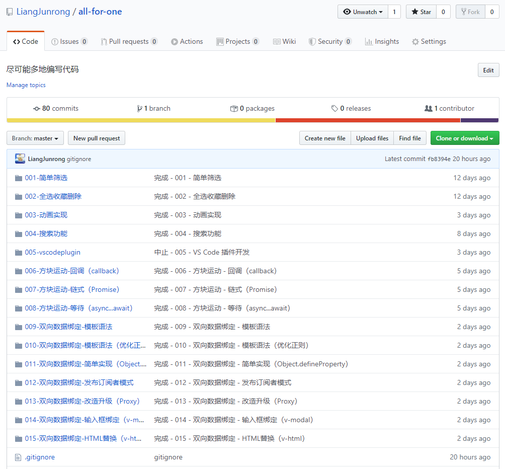
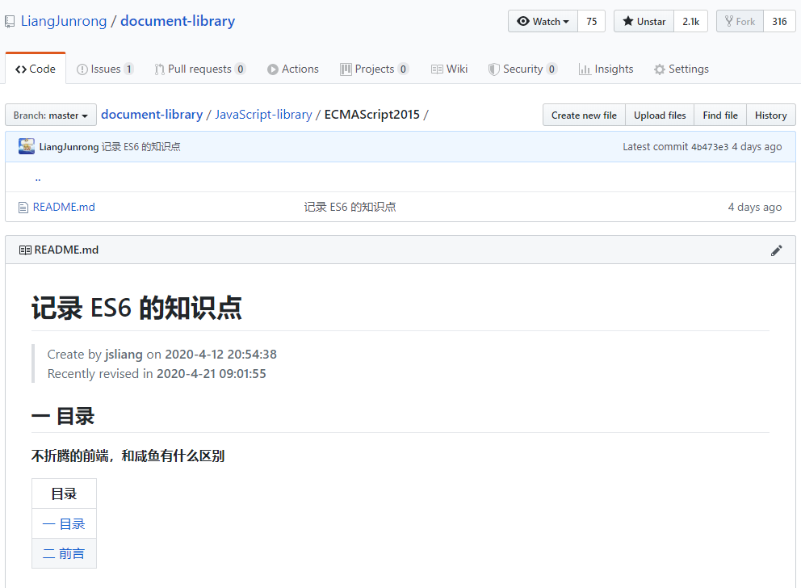

朝花夕拾 - 公众号停更感想
===

> Create by **jsliang** on **2020-4-25 10:15:37**  
> Recently revised in **2020-4-25 10:44:40**

* 最后一次公众号更新时间：2020-04-17
* 当前时间：2020-04-25

是的，自从我们将过年时候刷的近百篇存稿用完之后，我们 LeetCode 的简单难度已经完结了。

> 当时的的确确是将 LeetCode 简单难度刷完了，现在可能 LeetCode 它又更新了一些简单难度的题目

看到这里，可能有的小伙伴就会说：

* “啊，**jsliang** 你居然断更了，取消关注！”

天，你要听我解释啊~

咱先说说我这一周多一天都在干啥吧~

## Plan A

目前有个很尴尬的点，就是 **jsliang** 想跳槽，但是自身技术又感觉荒废了。又因为可能写了点算法题目（公众号），所以很多小伙伴觉得 **jsliang** 很厉害……

> 其实不然

尴尬，那只能硬着头皮上，将自己的知识点逐个补上来，才能在面试的时候能体面点。

> 死的没那么惨点

目前建了个私仓，报了个课程，静悄悄地打枪（学习），希望自己能混个更好点的样子。

## Plan B

可能因为 **jsliang** 刷了 270 多道题了，小入门坎，有点自己心得，所以最近很多小伙伴在问我 **算法与数据结构** 怎么刷，

因此，最近有筹划是不是能搞一门课程，讲解下自己怎么学的，推荐小伙伴们怎么学。

当然，和朋友讨论过，说有可能被 diss，因为这个课程，enm...你懂的，市面上很多内容，分分钟写不好被丢臭鸡蛋，哈哈。

但是，怎么说呢，还是想尝试一下：相信自己能做好。

如果自己连尝试都不尝试，那么心里肯定会鄙视自己吧。

## 总结

以上，就是今年的 2 个计划。

内心肯定是非常纠结的啦，自己做课程的联系好了，就差我去搞了；但是自己也报了课程，就差我去学了。

后面问同事建议，同事告诉我：

* 小孩子才做选择，要是我肯定全都搞！

enm...问题还是丢回给我自己了，只能说发挥自己折腾的本质，去尝试一波咯~

毕竟：

**不折腾的前端，和咸鱼有什么区别！**

最后，希望小伙伴们能投票一波（或者私聊 **jsliang** 微信），看下小伙伴们有啥好建议~

>  jsliang 的文档库 由 <a xmlns:cc="http://creativecommons.org/ns#" href="https://github.com/LiangJunrong/document-library" property="cc:attributionName" rel="cc:attributionURL">梁峻荣</a> 采用 <a rel="license" href="http://creativecommons.org/licenses/by-nc-sa/4.0/">知识共享 署名-非商业性使用-相同方式共享 4.0 国际 许可协议</a>进行许可。 基于<a xmlns:dct="http://purl.org/dc/terms/" href="https://github.com/LiangJunrong/document-library" rel="dct:source">https://github.com/LiangJunrong/document-library</a>上的作品创作。 本许可协议授权之外的使用权限可以从 <a xmlns:cc="http://creativecommons.org/ns#" href="https://creativecommons.org/licenses/by-nc-sa/2.5/cn/" rel="cc:morePermissions">https://creativecommons.org/licenses/by-nc-sa/2.5/cn/</a> 处获得。