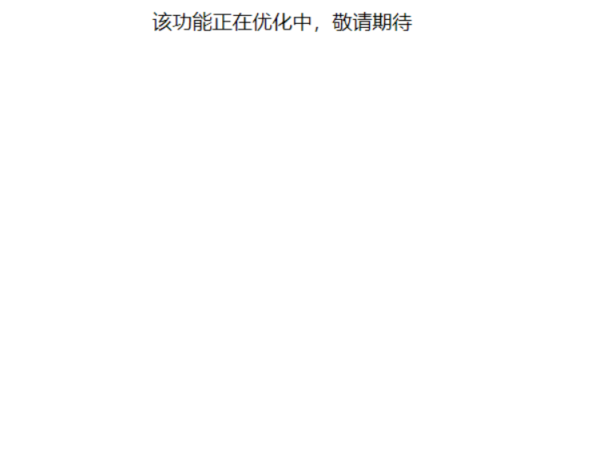
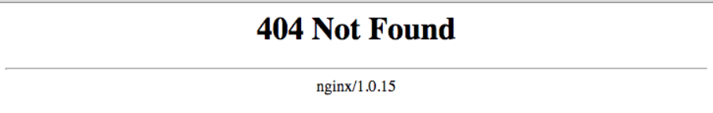

1219 - 程序员序列 - 渣渣网页设计
===

> Create by **jsliang** on **2021-12-19 22:02:54**  
> Recently revised in **2021-12-19 22:02:54**

「制作第一个小视频」创作思路：

* 领导：客户需要一个「该功能正在优化中」的界面，小梁你给整一下
* 我：有 UI 设计稿吗？领导你要怎样的效果？
* 领导：不用 UI，做出来就行了，类似于 404 NotFound，关键是要快！
* 我：enm...好的收到，这就去做！
* （咔咔咔写了个 margin: 0 auto，可以了，发送 html 文件）
* 我：页面整好了！

* 同事 C：还不如 Nginx 的 404 界面

* 领导：确实，你再改改，来个五彩斑斓的黑
* 我：懂了，这就优化
* （打开 10 多个页签，然后搜索好看的动效）
* 我：搞定了！

* 同事 A：666
* 同事 A：秀儿
* 同事 A：等着客户爸爸的锦旗
* 同事 B：666
* 同事 B：牛X
* 同事 C：/狗头 墙都不扶就服你
* 同事 C：看来 jsliang 还是有点审美的
* 领导：可以可以

---

> jsliang 的文档库由 [梁峻荣](https://github.com/LiangJunrong) 采用 [知识共享 署名-非商业性使用-相同方式共享 4.0 国际 许可协议](http://creativecommons.org/licenses/by-nc-sa/4.0/) 进行许可。 基于 [https://github.com/LiangJunrong/document-library](https://github.com/LiangJunrong/document-library) 上的作品创作。 本许可协议授权之外的使用权限可以从 [https://creativecommons.org/licenses/by-nc-sa/2.5/cn/](https://creativecommons.org/licenses/by-nc-sa/2.5/cn/) 处获得。
