前端都在聊什么 - 第 1 期
===

> Create by **jsliang** on **2023-01-18 10:53:49**  
> Recently revised in **2023-01-19 20:46:59**

Hello 小伙伴们早上、中午、下午、晚上、深夜好，我是爱折腾的 **jsliang**~

「**前端都在聊什么**」是 **jsliang** 日常写文章/做视频/搞直播过程中，小伙伴们的提问以及我的解疑整理。

本期对应 2023 年的 `01.01-01.15` 这个时间段。

本期针对「工作」「学习」「规划」「闲谈」这 4 个板块的 20 个问题进行了讨论，看看有没说到你心中想法去的。

你的 **点赞** 和 **关注** 是我持续更新的动力💖，谢谢大家~

## 一 工作

### 1.1 Question：一直在写管理后台，要不要换个工作？

这也是之前困惑 **jsliang** 的一个问题，因为 19-20 年的时候，我也在 SHEIN 里哼次哼次写后台管理系统。

现在想来，自己对当初的解答是这样的：

**① 薪酬问题**

换不换工作，最重要的还是，公司的工资，和你技术创造的价值，匹配不上了（个人内心感官）。

其实就是「新时代打工仔」，拧螺丝还是去涂漆，老板给多少工资的问题~

同样给你一张毛爷爷，你是想敲一天钟还是敲一次钟？

**② 技术问题**

写后台管理，经常会碰到的一个问题，就是一些项目，并没有太高的技术难度，你做个几年下来，不见任何长进。

这种情况，**个人觉得**：

* 要么乘有时间挖掘更深层次的技术；
* 要么通过技术将这项目的工作效能提升到极致；
* 要么挖掘这条产业链更深层次的内容。

如果都没有，enm...那你还待着干嘛，想啥呢？

**③ 时机准备**

确定了上面 2 点都没啥想法了，那就考虑下，要做哪些跑路准备。

最基础的你肯定得看看：一是八股文，二是项目经验（重难点/亮点）

这种 百度/Google 一搜一大堆，这里就不吐槽了，感兴趣的也可以看看「[jsliang 的文档库](https://github.com/LiangJunrong/document-library)」

### 1.2 Question：JS 掌握到什么程度就可以了？

这个问题的命题范围有点大，就跟你问 **jsliang** 打算存多少钱娶老婆一样，那肯定是越多越好是吧！

还是跟上面的问题解答一样：先把八股文和项目经验（重难点/亮点）整理好：

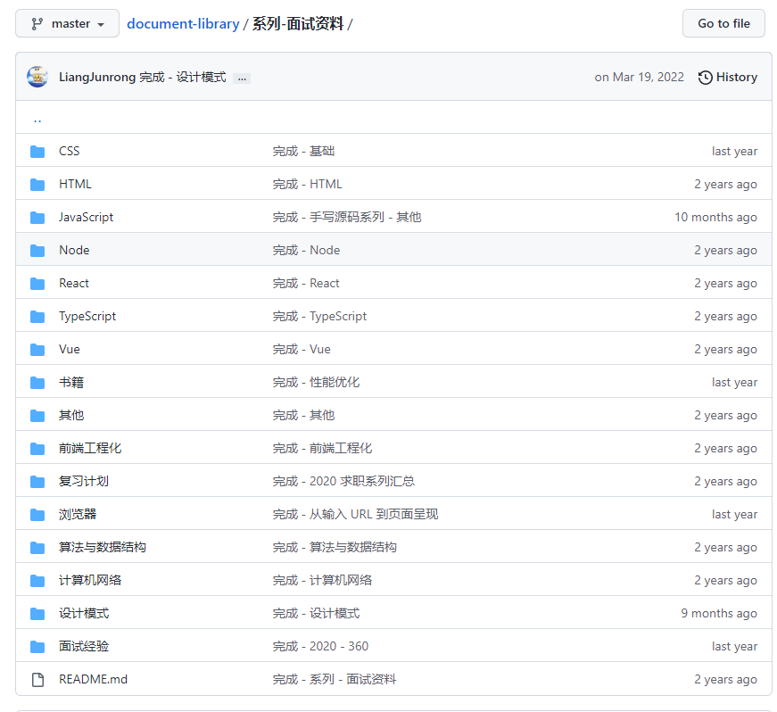

八股文相关的看这一套，项目相关的自行总结整理。

基本的套路是这样的：

1. **一面**。关于八股文相关的一面基础知识。其实你复习了，能对着录音机讲出来这一块知识点，那么等到要面试的时候，再过一遍，就可以了。
2. **二面**。关于项目部分的，还是重难点/亮点。需要在日常工作中总结，比如：项目重点在哪？哪些需求需要用到的知识点比较复杂，有实现难度，你是如何实现的。

这些知识点，学了不用很快忘，所以才需要笔记来记录内容，方便随手复习。

### 1.3 Question：不知道自我介绍怎么说？

看个人，你觉得练好了，可以私聊 **jsliang** 吹一下，他贼能唠嗑~

你需要明白的是：

1. 面试官跟你没仇，也不是你看中的女神/男神，不要紧张
2. 面试官是人，也会累，连自我介绍都能磕巴讲不顺畅，听得更累

说句大实话，**jsliang** 之前面试的自我介绍，都是背自己写的模板的：

[jsliang 的 2020 自我介绍](https://github.com/LiangJunrong/document-library/tree/master/%E7%B3%BB%E5%88%97-%E9%9D%A2%E8%AF%95%E8%B5%84%E6%96%99/%E9%9D%A2%E8%AF%95%E7%BB%8F%E9%AA%8C)

---

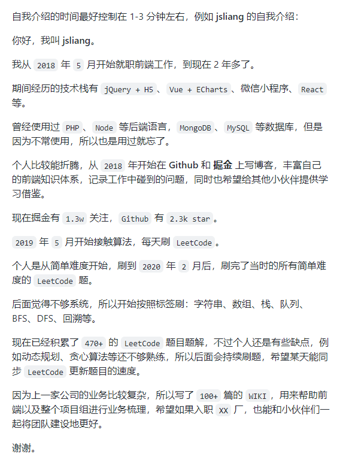

自我介绍，一般面试官都不会打断你的，所以这块好好整理下，别磕巴磕巴了喔~

### 1.4 Question：对于初级前端在公司工作内容是什么？

看业务范畴。

举例：我曾经在的央企电信外包，就是写 H5 的，每天工作就是套用 H5 模板，写写电信活动页。

或者写写微信小程序，以及 Vue + ECharts 大数据报表等。

很多小伙伴去到新公司，会觉得忐忑，尤其有些是有几年空窗期的。

靓仔/靓女，你是出去搵食，不是出去干啥违法的事，**并没有那么多人关注你，不要怕做不好人家笑你**！

我这辈子觉得最刺激的一件事：就是我第一份工作的时候，大佬让我搞个 H5 活动页，然后我在那 position 定位来定位去搞到晚上 2 点多没搞定……

尴尬吗？尴尬。

但是现在看来，当时大佬肯定有 Plan B，而且这事儿公司其他人压根就不知道。

这样想想你就觉得这事儿也不那么尴尬了。

### 1.5 Question：待过几份工作？

很遗憾的是，工作 4 年没干倒过任何一家公司。

（老板们快看我，我是公司的福星！）

* 18-19：【广州】电信外包
* 19-20：【广州】SHEIN
* 20-23：【珠海】金山

### 1.6 Question：在金山工作是一种怎样的体验？

* **每年有末尾淘汰**。为了保证公司的活力，末尾每家公司都会有的了，偶尔还会有小地震、大地震。
* **加班多不多看情况**。如果部门事儿多，那就多；或者老板想法多，也会多；到了部门旺季，那也多。
* **新技术栈的使用看情况**。金山干活比较稳，中小项目你可以看情况用新技术，但是更重要的是 **安全**，请做好你的技术调研再安排。

另外有小伙伴想年后找工作的，考虑下金山不？

到时候在【珠海】【武汉】【广州】【北京】应该都有 HC，有需要的 call~

### 1.7 Question：老板怎么对待你干活？

**① 老板看结果**

老板是希望你出业绩的，他好跟大老板汇报。

**② 会哭的娃有饭吃**

你干了活，但是你没表现出，你中间吃苦吃累，需要安慰。

于是，老板觉得你干活是正常的，人手也是够的，薪资不用加。

然后你的活，就越来越多，只要你不说，那就继续加，薪资正常给。

**③ 不要跟钱过不去**

卖苦力，赚钱钱。

你都说 “人矿” 了，非要搞得自己很有尊严，那能让我怎么劝你。

## 二 学习

### 2.1 Question：你是如何学习的，推荐怎么样学习？

**① jsliang 作息表**：

—— 早上 ——

* 08:20-08:50 学习
* 08:50-09:30 磨蹭去上班，到工位做早餐

> 别小看这个蒸蛋器，已经给 5 个同事提供了 1 年半的早餐

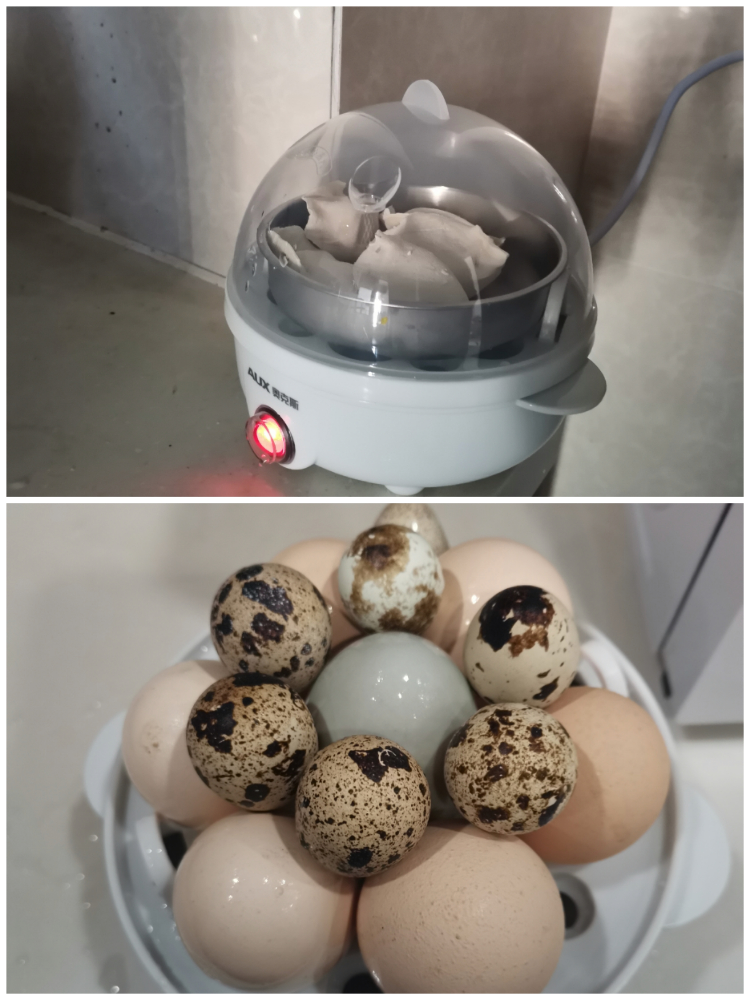

—— 中午 ——

* 12:00-12:40 吃午饭
* 12:50-13:20 学习
* 13:30-13:50 午觉

—— 晚上 ——

* 18:00-19:00 跑步 3.33km。[jsliang - 99 次跑步](https://kdocs.cn/l/ctIuv60kWkXf)
* 19:00-20:00 洗澡吃饭
* 20:00-20:30 吃水果刷短视频放松，恢复精神
* 20:30-23:00 学习 + 直播。[jsliang - 2023 的 99 次直播打卡](https://kdocs.cn/l/cd1mebuZf0rg)
 
---

也就是说，我一天大概有 3.5 小时学习时间，1 小时跑步时间，其他时间贡献给工作。

**② jsliang 的学习方法**：

最关键的一点：**当前最急迫最需要学习的知识点是哪块**？

你要抓住最重要的，把它做下来，搞定后在内心打个 √，特别有成就感。

**搞明白自己的学习目的很重要**。

就好比，你最近的目的是追个妹子/靓仔：

1. 先要到微信
2. 了解一下个人喜好，生活工作
3. 约出来徒步/爬山/吃饭，送小礼物……

你连自己的目的都不知道，那你可能正在前往墓地。

### 2.2 Question：做笔记、写文档/写知识库是一种怎样的体验？

这里有一段我在 18 年写的前言可以看看：

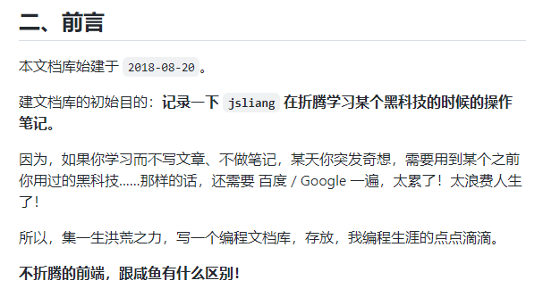

**写笔记的目的**

写笔记有 3 个目的：

1. 强迫自己养成学习习惯
2. 方便自己回顾学习内容
3. 系统形成自己知识体系

**① 强迫自己养成学习习惯**

很多小伙伴说，自己也尝试做笔记，但是后面自己也不会看，或者写完自己下次还得查。

这不正常，你不记后面更难收场，记录了在学习时候的笔记，回头回顾也方便呀。

还有，如果你真的写了，请写得好一点，对自己好一点 —— 致鬼画符后回头发现看不懂自己笔记/代码的小伙伴。

**② 方便自己回顾学习内容**

还有的小伙伴会感慨，面试的时候能手写 Promise，工作后就忘光光了。

这很正常，为什么高考代考都找大一的？

例如 **jsliang** 在写 [2023 兔年祝福](https://github.com/LiangJunrong/document-library/blob/master/%E7%B3%BB%E5%88%97-%E5%89%8D%E7%AB%AF%E8%B5%84%E6%96%99/CSS/CSS%20%E5%AE%9E%E4%BE%8B%E7%B3%BB%E5%88%97/02-2023%20%E5%85%94%E5%B9%B4%E7%A5%9D%E7%A6%8F.md) 的时候，也是看着自己写过的教程一步一步搭建 Node.js 环境呀。

**③ 系统形成自己知识体系**

很多时候，我们写这玩意，真的不需要别人知道你做过这种牛逼的事。

你需要的是把自己做的事情记录下来，系统点，全面点。

例如我要面试，我就把前端八股文系列过一遍，写出来；

例如我要复习 CSS，我就把 CSS 系列过一遍，写出来。

没人看我会有损失吗？

### 2.3 Question：如何写好一篇文章？

举个例子，你要写一篇 Vue 源码剖析：

1. 怎么个剖析法，你对 Vue 源码，去看过一遍了吗？这一块别人是怎么看 Vue 源码的你了解不
2. 你在看的时候，做了笔记吗？例如，我看 MVVM 的时候，我写了当时关于这块的心得
3. 逐步增加你的笔记内容……
4. 最后，将这些笔记内容整理出来，要大家能看得懂，并发布出去

讲尼滴，这谁不知道？

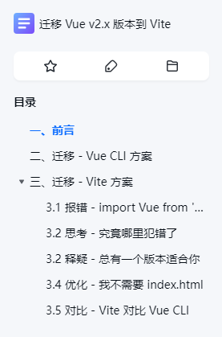

OK，这是我最近做的一篇笔记，能看出和你平时记录有什么区别不？

我在写这篇文章的时候，心理历程是这样的：

* √ 最初的目的是什么？从一个大项目中，迁移一个小的 JS 库
* √ 为什么不用 Vue CLI 啦？因为用 Vue CLI 和 Vite 对我都差不多，但我不能这么跟领导说，所以要比对 2 者方案
* √ 这当中会碰到什么问题？记录，太重要了！我恨不得自己打开过哪些 ISSUE、文章、教程、官网地址 都贴上来
* √ 后续怎么优化？优化开发体验、优化打包模式……

所以最重要的还是不要乱。

心乱，写的东西也乱，自己都搞不明白要做啥，你写出来的自己都看不懂。

### 2.4 Question：力扣/算法学习路径是怎样的？

建议针对性学习。

因为算法内容比较多，最好结合最近前端面试题的变更，各个厂子对算法要求不同。

如果是针对 LeetCode，那么建议：

1. 先过《剑指 Offer》：https://leetcode.cn/study-plan/lcof/
2. 再过《程序员面试金典（第 6 版）》：https://leetcode.cn/problem-list/xb9lfcwi/

在你刷题的过程中，最好总结下：

* 哪些你是做得很棒的，不管是从简单、中等还是困难你都能反应过来
* 哪些你是做得贼烂的，例如写一道动态规划，简单难度花个 1 个钟，那是你没解题思路，还是这道题难度规划出问题了

针对自己的不足，多角度尝试，总有适合你的：

* [CodeTop - 按照热度排序的题库](https://codetop.cc/home)
* [LeetcodeTop - 汇总互联网公司技术岗考察 Leetcode 题目的热度](https://github.com/afatcoder/LeetcodeTop)
* [「小浩」算法图解题典](https://mp.weixin.qq.com/s/3eJNKDTZ5y5icMnfv9Is_w)
* [前端「瓶子君」的算法题解](https://github.com/sisterAn/JavaScript-Algorithms)
* [「世奇」的算法题解](https://www.conardli.top/)
* [「labuladong」的算法小抄](https://github.com/labuladong/fucking-algorithm)

请停下你的收藏欲望，有需要的时候再找资源就好了。

### 2.5 Question：怎么做针对性学习？

来啦，客官~

掐指一算你是不是迷茫自己后面要怎么做，又不好意思问前端小伙伴。

* 觉得自己对于源码相关阅读度不够，那就去看相关内容；
* 觉得自己对于项目了解程度不够，那就去看项目相关内容；
* 觉得自己想跳槽，那就看八股文和项目。

不要盲目去逛 GitHub 和掘金，除非你能从里面找到自己希望提升的地方。

计划是为什么制定的？

计划是对后续目标的一个准备！

举个栗子：**我希望跳槽到一家公司，这家公司是做游戏的**。

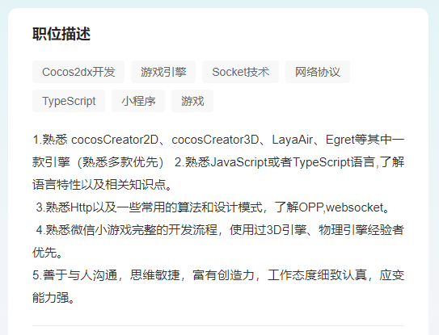

到 Boss 直聘等招聘网站找一下「前端 游戏」的关键字，可以看到类似上面的要求。

OK：

1. 你是不是应该熟练一门游戏引擎，Egret、Cocos、Three.js，你怎么考虑？
2. 之后，我们是不是考虑下时间，大概要多久入门？例如 3 个月达到能写中等难度的 Demo？
3. 再之后你是不是应该找一个基础的，能接受你这种「小菜鸡」的工作。拜托，你可是「新入行」耶，你想一学完直接月薪几个 w？有这种好事我早上了。

我不知道自己做什么？这是最不应该的。

就好比你请了一个人来维修空调，你问了一句：“师傅，你是做什么的” 一样！

## 三 规划

### 3.1 Question：前端生态链是怎样的？

关于前端生态链，咱们从 3 个小观点说起。

**① 蹭个话题**

这让我想起今天（2023-01-19）看到的一个讨论：

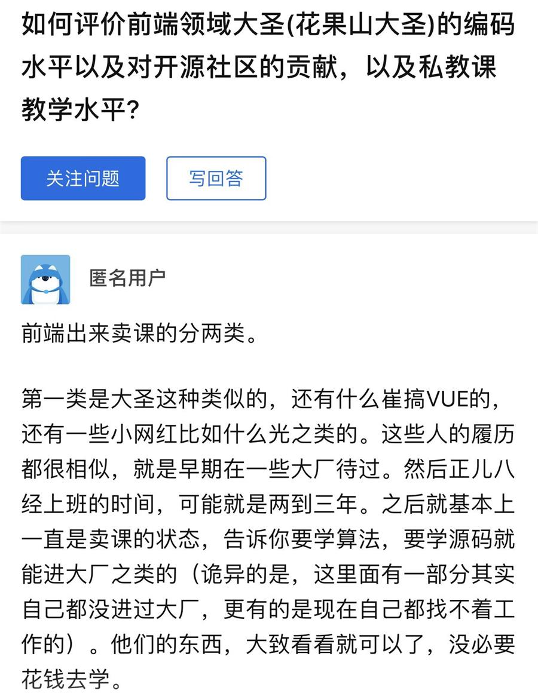

这个话题我在多个微信群、朋友圈都刷到了，当时自己第一思考：

* 为什么这里提到的大佬能卖课，有些甚至卖得口碑很不错

**② 入行千斤顶**

撇开这个不说，想分享下 18/19 年刚入行时，看到的一个生态链说法：

1. 作为 Vue 生态链，众所周知，yyx 是顶层的，他吃的是大头，尤其是做技术指导等
2. 再下来一层，即对 Vue 源码有过研究，并且能讲透、或者将这部分应用到工作上的人，这些在项目中都是扛把子，他们是在 yyx 下面的一个生态链
3. 再再下来一层，就是一些懂得 Vue 技巧的熟练工，这些基本是拿技术当个新时代农民工的工头
4. 最低下的一层，才是初学者，或者才熟悉不久的 Ctrl C + V 搬运工

结合这几年在前端圈子的摸爬滚打：**想混得更好，那就往上专研**

别老想着别人技术相倾，老想着别人吃肉你就嫉妒。

很多东西都开源，如果你有很强的自学能力，那就去专研折腾；如果没有，那就看看哪家能将这个东西讲透。

—— 个人想法

**③ 做更高的赵高**

中国有句古话：“学成了徒弟，饿死了师傅”。

就这么一种金字塔模式，就这么一个市场。

如果你想吃到更大的蛋糕，那么你就要保持你的技术地位。

如果你没技术，那只能接钱少的项目/工作，事多麻烦多那种。

OK，这么一种情况下，你就卷起来了，就不要想讨论 “不要给资本家剥削”。

回头再看这些培训班，培训课程，再看看自己三脚猫的功夫。

学不学，怎么学？

### 3.2 Question：不知道今年能不能就业，怎么去规划职业路线？

建议，先试试！

不要因为外面说啥，就感觉不行，先试试才知道。

就好比一个橙子，先剥了皮，再吃点肉，才知道苦不苦。

另外，看小伙伴是大学生，还是新时代打工人。

如果是大学的话，有比较多的时间规划

（有时间去专研，慢慢学）

如果是毕业生的话，那就先找份工作，再骑驴看唱本

（更多的是为了 offer，为了养家糊口，为了小钱钱）

## 四 闲谈

### 4.1 Question：过年回家看看机会？

嘶，你指的是相亲机会？

还是回家看看能不能开个小店。

像什么小卖部、按摩店、网吧、茶水间、猫咖？

### 4.2 Question：梁 Sir 是个怎样的人？

**jsliang** 是个英语四级没过，作息有点小规律，能力不足以写掘金小册，苟活进决赛圈还没阳的人。

如果你想调整自己的作息，最好就是：

1. 调个 11 点闹钟，准备睡觉
2. 手机 11:30 定时关机，强制休息

### 4.3 Question：最近基金咋样？

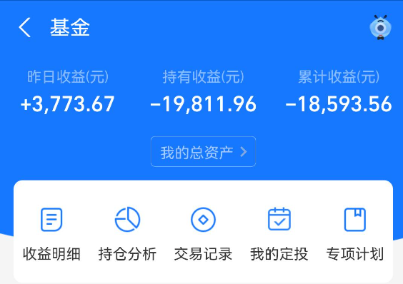

### 4.4 Question：平时直播的时候，写的 HTML 如何运行的？

1. 安装 live-server：`npm i live-server -g`  https://www.npmjs.com/package/live-server
2. 前往执行目录：`cd code`
3. 执行 live-server：`live-server`
4. 此时更新可以看到效果：

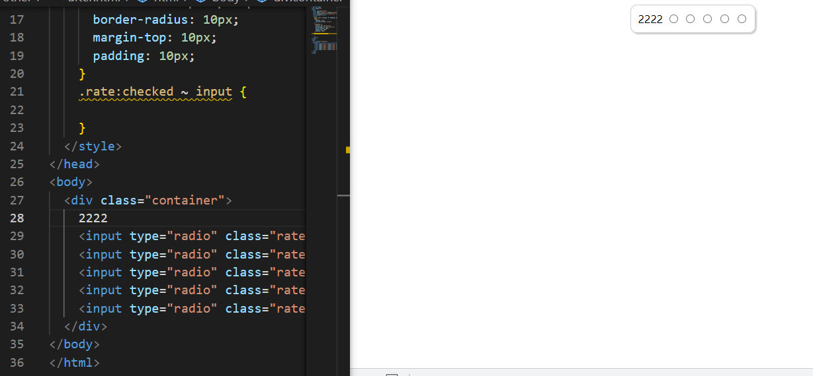

### 4.5 Question：为什么 npm run xxx 可以运行

简单讲讲：

1. 可以看到 package.json 里面，有 `scripts`

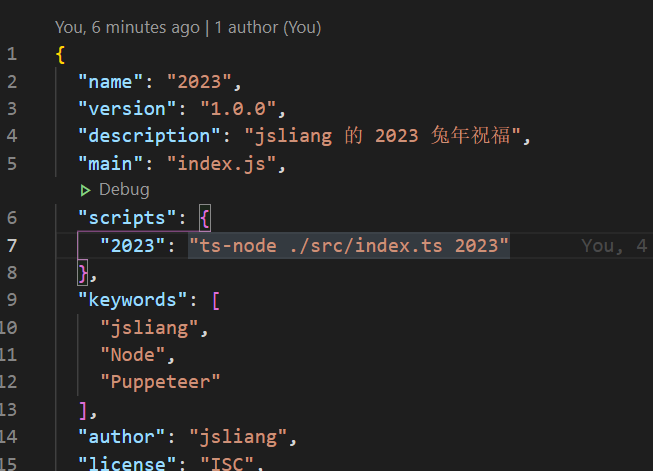

2. `npm run 2023` 就会在控制台执行 `ts-node ./src/index.ts 2023`
3. 接着会走正常的控制台执行代码
4. 为什么控制台可以跑？因为装了这个服务，才可以运行
就好比为什么你可以在控制台使用 `node index.js` 一样
你只有装了 Node.js，才能去跑这个指令

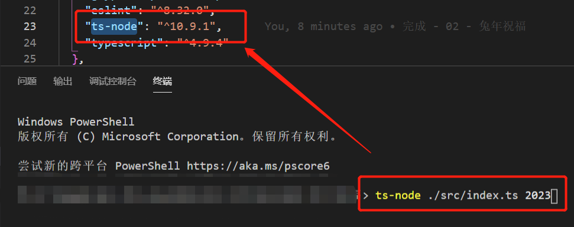

### 4.6 Question：对下面技术怎么看？

* **微前端现在都在用吗**？

**Answer**：我们这边没有明显的项目表示再用。

---

* **有研究过 SSR 么**？

**Answer**：

1. 当时用的是 React 的 Next.js 技术，SSR + SSG 混合吧应该，忘了
2. 对着英文版文档写的 https://nextjs.org ，这种英文网站，看一眼，当时会用，转眼就忘了

---

* **有推荐的 TS 教程吗**？

**Answer**：TS 体操的话没有，可以看看掘金、思否等平台？

---

* **对低代码怎么看**？

**Answer**：

趋势所向，但不推荐。

除非有比较大的技术变更，否则不想去搞

之前做了一期低代码分享（内部分享），然后感觉不太好，网上骂的多，自己写出来也不讨好，所以那篇文章也没拿出来分享，还在 GitHub 仓库上。

你的心态应该是这样的：折腾低代码，可以提升自己眼界，但是，不要过于贬低自己工作，毕竟折腾也是一件好事，总好过没活干。

公司推广不行，因为目前没有比较出色的项目，证明低代码是可通用的，证明低代码在各个业务场景都可用。

（内部分享时候的总结，里面条条框框自己没搞明白）

---

**不折腾的前端，和咸鱼有什么区别！**

觉得文章不错的小伙伴欢迎点赞/点 Star。

如果小伙伴需要联系 **jsliang**：

* [Github](https://github.com/LiangJunrong/document-library)
* [掘金](https://juejin.im/user/3403743728515246)

个人联系方式存放在 Github 首页，欢迎一起折腾~

争取打造自己成为一个充满探索欲，喜欢折腾，乐于扩展自己知识面的终身学习斜杠程序员。

> jsliang 的文档库由 [梁峻荣](https://github.com/LiangJunrong) 采用 [知识共享 署名-非商业性使用-相同方式共享 4.0 国际 许可协议](http://creativecommons.org/licenses/by-nc-sa/4.0/) 进行许可。 基于 [https://github.com/LiangJunrong/document-library](https://github.com/LiangJunrong/document-library) 上的作品创作。 本许可协议授权之外的使用权限可以从 [https://creativecommons.org/licenses/by-nc-sa/2.5/cn/](https://creativecommons.org/licenses/by-nc-sa/2.5/cn/) 处获得。
