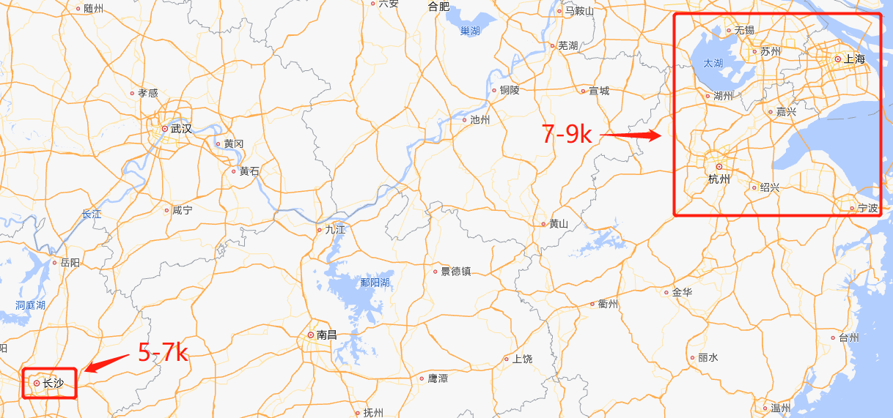

前端都在聊什么 - 第 4 期
===

> Create by **jsliang** on **2023-02-26 21:12:08**  
> Recently revised in **2023-02-27 08:33:19**

Hello 小伙伴们早上、中午、下午、晚上、深夜好，我是爱折腾的 **jsliang**~

「**前端都在聊什么**」是 **jsliang** 日常写文章/做视频/玩直播过程中，小伙伴们的提问以及我的解疑整理。

本文章视频同步：TODO:

本期对应 **2023.01.28** 当天直播间的粉丝互动。

主要内容是跟大三的小伙伴沟通他的前端实习规划，对制定规划和初入职场这 2 点提出自己的见解，希望对小伙伴们有所帮助。

你的 **关注** 和 **点赞** 是我持续更新的动力💖，谢谢大家~


## 背景分析

小伙伴 **大三在校**，希望找一份 **比较好的前端实习**。

当前就读于湖南，所以 **优先考虑长沙**，不行的话可能去 **江浙和广深**。

长沙预期薪资是 **5-7k**，江浙预期是 **7-9k**。



计划是通过 React 写前台系统，Vue 写管理后台，配合工具类小程序，服务端用 Node.js 写。

最终在 7 月份（即大三下学期左右找到工作）

小伙伴的问题点在于：

1. 不知道该做什么样的项目
2. 如何编写项目经历中重难点亮点

聆听完小伙伴的想法，我也陷入沉思，怎样计划才能更好地帮助小伙伴。


## 薪酬分析

**jsliang** 的大学是失败的，毕业季那会也是被迫去找了个工作应付学校任务。

所以在招聘网站上查找，也是才知道实习生的工资是算日薪的。

小伙伴的日薪，大概要求是 ￥250-350 之间。

* 长沙方面，小伙伴希望日薪 ￥250+，但是这边薪酬 ￥100-200 居多
* 江浙这边，小伙伴希望日薪 ￥350+，但是这边薪酬 ￥200-300 居多

所以这种情况下，小伙伴可能就要做到比其他实习生优秀，要不然找不到高薪酬的实习岗位。

## 主体分析

但是会存在时间不够的问题，所以需要有精挑的方面。

对于深度来说。对于同届的来说，我们要有自己的优势，如果你的优势只是各种语言都熟悉 Hello World 的话，那么你的优势会非常小。

所以我们应该有侧重点。

第一步，立项。先完成 React 前台系统，并配合 Node.js 相关服务，搭建一个完整的系统。
建议你去找一个实用性的项目，写出来。

https://www.zhihu.com/question/362103682

第二步，对于写出来的项目进行进一步优化（在你考虑项目的时候，就应该关注后续是否可以优化，如果项目比较简单，写完就扔的，那么立项的时候，就可以不要找这种）

前端工程化，为什么这个会 比同届有优势？很多时候，像 Webpack、Vite 以及 Rollup 等，需要对 React、Vue 等进行打包。很多时候，我们可以通过前端工程化，了解我们项目最终异步，即部署上去后的优势。

一开始，打包大小在 1M 左右，通过前端工程化的优化，可以将打包后的文件变为 100k 左右，那么这个优势怎么建立的，我们如何通过前端工程化让项目更有挑战。

从而在部署/上线后，有更加优良的体验。

第三步，Node.js 优化相关。

设计到服务器/服务端相关内容。

通过计算机网路、算法与数据结构以及设计模式方面，来帮助我们提升 Node.js 服务相关代码，和 Node.js 接口优化体验。

小结，通过这 3 步，我们扩大了相关优势，这样被录用的概率会大大提升，同时我们项目有比较好的重难点以及亮点来跟面试官沟通。

所以，我们的项目，要 能用上，而不单单只是一个 Demo。

Demo 大家都会写，但是能上线部署，能给到别人用起来，就是一种挑战。

## 服务端优化

• Q：服务端一般写接口啥的，不知道有哪些优化

A：弹幕

对于一个接口，要读取视频信息和弹幕信息，然后弹幕接口，需要读取 DB，那么这一块，如何保证它接口质量，读取的数据比较多的时候，如何才能正常的在前端渲染。

这一块的话，就需要服务端和前端共同保证。

服务端的接口，肯定不能是慢借口，假设一个视频有 10w 条弹幕数据，那么服务端如何操作？

这就是一个优化点。

假设你做的不是这个，那么是不是可以考虑其他的优化点。

1. Nodejs性能分析工具
2. 代码性能优化/垃圾回收/内存泄漏
3. 多进程

https://zhuanlan.zhihu.com/p/50055740

回头在写完 Node.js 服务的时候，如果不知道如何提升优化，那就看一下别人是怎么操作的。

最重要的是，能在自己项目中用到 -> 关联第一步立项

很多时候，并不是说优化点，导致我们在项目中做了这个事；而是我们在项目开发过程中，发现这个问题点，并且去解决它的一个过程。

很多时候，我们看中的不是你写代码的能力，而是你解决问题的能力。

同样的一个积木，大家都会搭，但是当缺少了一个积木零件的时候，谁能把它搞定？

1. 自己造一个积木零件（自己去解决这个问题，从 0 开始） —— 100 分
2. 要么自己偷一个积木零件（Ctrl C + V，然后修改，从而完成，从 0.5 开始） —— 50 分
3. 要么自己找回来这个积木零件（从 1 开始，但是靠运气） —— 0 分

相当于大家都在项目中碰到这个问题，你是怎么解决的。

你一定要有一个亮点，让面试官真的眼前一亮，这个亮点，就体现在你解决问题当中，而不是你写项目过程中

## 需求评估

淘宝 -> 商家上传了图片 -> 发现图片有点小瑕疵 -> 直接处理 -> 有没方法直接在浏览器处理

工期：6 个月（2-7），这些工期你要做哪些事情，你是怎么给自己排期的，做为一个 PM + FE（FrontEnd） + BE（BackEnd），是怎么想的？

排期这一步，又让你理解了如何去管控一个项目，从而提升自己对于项目管理的一个能力。（这是不是又属于一个亮点了呢？）

领导丢给你一个任务，你是不是有自己的想法，能预估多久完成？

在写一个系统的时候，A 模块，你一开始用了 3 天，那么你积累 A 模块的经验，对于尚未开始的 B 模块，有什么借鉴的，能否预估出 B 模块的时间？

领导，会给你一个任务：

* 假设，你还 没接触过。“那你先试试，看看大概多久”“我先写个 1-2 天，然后给排期”
* 假设，如果 你接触过。“那你直接给我排期”“参考 XX 模块，排期是多少”

尽可能地去积累这块经验，很多时候，经验不是上面排下来，然后你才能积累的，而是我们在开发的时候，就将这个内容记录下来，方便观摩后续如何提升。

* 预期：A 模块 -> B 模块，经验直接过来，这叫预期
* 意外：A 模块 -> B 模块，发现漏了一个点，这叫意外

意外是怎么产生的呢，就是你在评估的是，不够仔细，将某个困难的点，当做简单的点处理了。

你评估要造一个螺丝钉，其实它要的是凳子。

有了这个意外的时候，你的处理能力是怎样的？（临时的处理能力）

1. 加班加点做
2. GitHub -> 抄下来的不一定是最好的，但是在“此时此刻”，是最佳的解决方案

评估这 2 点的耗时（比较快地反应）

面试的时候，回答一个问题，有时候面试官不满意，为什么，因为你的做法可能让项目黄了。
这时候，就需要临时的处理能力。

评估需要花 3 天，实际用了 6 天，如果是难度导致加了 3 天，那这个时候你应该是惊喜的，因为你在后续的实际项目中，可能就有这种情况。

2023.02 - 2023.07 这半年的复习挑战中，发现了问题，还有时间处理，但是你实际工作中，有时候就没办法处理了。

碰到了问题，就应该更高兴，去处理它。

在工作中，对于评估工期，领导会给你一张 PSD、给你一个产品稿，你就去预估。

这个在个人 Demo 上，其实并没有这一个步骤，大家都会忽略这个步骤，但是实际上，它是需要的。
这，也是你实习面试时候的一个亮点。

## 练习

* Q：预估时间怎么练习？

A：对于整体系统。在我们去面试的时候，这点能告诉面试官，我是可以直接上手的，而不是需要慢慢教，我可以边做边请教。

步骤一，对于 A 模块，先预估 3 天

这是在没经验情况下，我自己的一个预估，可能存在问题是，我没有接触过这个技术（技术是这里的变量）

我在实际写的时候，就是 3 天，那么我的预估，是 OK 的，我知道变量在技术上。

步骤二，对于 B 模块，预估 5 天

在有 A 模块的经验下，预估 B 模块，发现 A & B 的相似度在 80%，且当中没有技术等变量，那我根据代码量/产品内容量，评估的时间是 5 天。

我在实际写的时候，发现超过了 5 天，那么我的评估，是有问题的，问题出在 XX 变量上。（总结，为什么会有这个变量疏漏了，是看了没发现 —— 没实际经验；看了却漏了 —— 粗心）

步骤三，再结合上面 A 和 B 模块，去提升 C 模块的评估

小结，对于普通实习生，他们评分是 50 分，那我的评分，我要拿 80 分。这 30 分怎么来的：

1. 从我已上线的个人项目的难度来提升
2. 从我已上线的项目中，个人亮点（我对问题的处理能力）来提升
3. 从我自己对于自己开发的项目上，个人经验积累提升的方面，来提升

## 项目如何立意

对于项目的 README.md，怎么去写：

代码大家都会写，但是思路乱糟糟，那么这一块，我也能作为自己一个亮点。

（考点：将这个 README.md 写成经验分享，贴到【掘金】【GitHub】，其他平台也可以）

```md
XXX 项目开发
===

## 一、立项
* 为什么要选这个项目
* 其中的重难点会有哪些
* TODO: 我在开发这个项目中的亮点（自己的处理能力）（项目带来的惊喜）

## 二、开发

### 2.1 前端界面如何开发
先实现项目初始化部署（记录起来里面步骤，创建项目的，为什么对一些代码进行处理 - 对构建代码的处理，对实际内容的处理）
> 不需要对细节讲清楚，而是说对于一些内容处理有备注，尤其是个人认为的 “关键点”（一人个人经验不熟练，才觉得是关键点；这个应验了我的现有经验，从而成为关键点，并且有可能成为我项目的重难点/亮点）
成就我们在讲项目的时候，我们有内容可以讲
而不是说，在面试的之前，才想起去看代码，哪些才是我们的重难点（这不就是年三十回家养猪 —— 晚了）
在第一份经验上，一定要记录，一定要认真对待

### 2.2 服务如何开发

## 三、反思

### 3.1 做这个项目的评估反思
对于不同模块，不同知识点，如何做恰当的评估

### 3.2 做这个项目中的前端反思
1. 我发现的问题是哪些（在第二步的时候，就记录到这里）
2. 我的处理方式，后续弥补

### 3.3 做这个项目的服务端反思

### 3.4 其他
随便写写

## 四、总结
对于项目整体，我的思考，以及庆祝。
```

---

**不折腾的前端，和咸鱼有什么区别！**

觉得文章不错的小伙伴欢迎点赞/点 Star。

如果小伙伴需要联系 **jsliang**：

* [Github](https://github.com/LiangJunrong/document-library)
* [掘金](https://juejin.im/user/3403743728515246)

个人联系方式存放在 Github 首页，欢迎一起折腾~

争取打造自己成为一个充满探索欲，喜欢折腾，乐于扩展自己知识面的终身学习斜杠程序员。

> jsliang 的文档库由 [梁峻荣](https://github.com/LiangJunrong) 采用 [知识共享 署名-非商业性使用-相同方式共享 4.0 国际 许可协议](http://creativecommons.org/licenses/by-nc-sa/4.0/) 进行许可。<br/>基于 [https://github.com/LiangJunrong/document-library](https://github.com/LiangJunrong/document-library) 上的作品创作。<br/>本许可协议授权之外的使用权限可以从 [https://creativecommons.org/licenses/by-nc-sa/2.5/cn/](https://creativecommons.org/licenses/by-nc-sa/2.5/cn/) 处获得。
