0 基础学脚本：一键发送新同事自我介绍到事业部群聊「01」
===

> Create by **jsliang** on **2023-05-24 08:29:10**  
> Recently revised in **2023-06-05 00:43:24**

Hello 小伙伴们早上、中午、下午、晚上、深夜好！

我是爱折腾的 **jsliang**~

本系列文章和配套直播视频，将对金山文档的「表单」「表格」「轻表格」「轻维表」里面的数据进行操作。

我们将讲解如何通过【脚本】和【自动化】等能力，进行数据相互流转，提升工作效率。

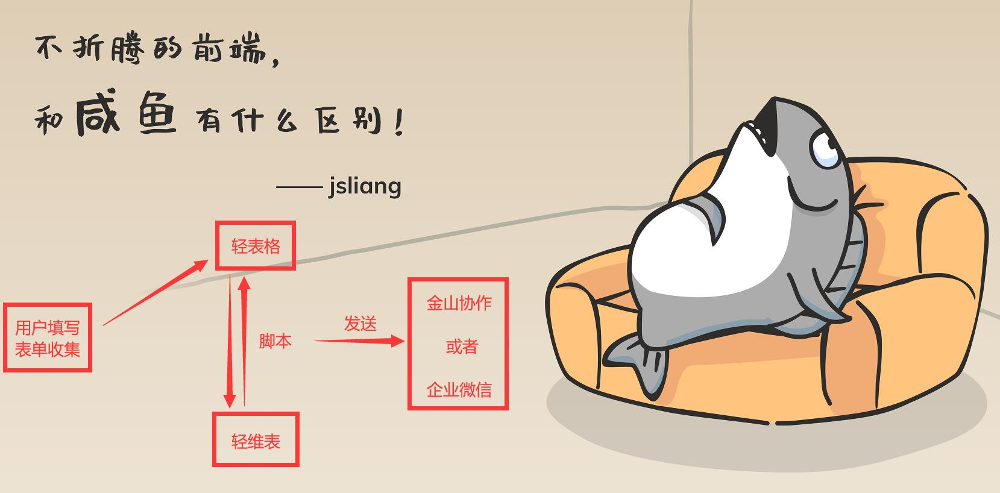

举例：

1. 将表单收集的数据，和用户订单对应的表格进行汇总，制作数据报表
2. 统一各个厂商提交的订单表，并将信息发送到企业微信，实时跟进数据情况
3. 定时读取值班表、工作表，通知员工值班情况、工作进展

为了避免 “**看不懂**” “**入手难**”，本系列会以【0 编程新人】角度，讲解如何快速学习 JavaScript（脚本），从而能流畅使用【脚本】能力。

* 如果对你有帮助 **欢迎点赞和关注**
* 如果对内容有感 **欢迎评论和私聊**
* 如果要介绍对象 **欢迎扫码加微信**

> WX: Liang123Gogo

## 一、数据收集

### 1.1 为什么要数据收集？

当你提出这个问题后，也许会听到各式各样的回答：

* 班级投票
* 意向调查
* 出入登记
* ……

那么，信息收集完毕后，你希望拿这些数据做什么分析呢？

毋庸置疑，第一件事肯定是完成上面的初始目的，但是……

—— “仅此而已吗？”

如果多问自己这么一句话，你会发现不一样的世界。

举个栗子，02.20 那天我直播抽奖送掘金马克杯的统计数据：

* 64 人浏览，17 人填写，为什么填写完成率这么低？
* 填写的设备来源上，94%+ 居然是移动设备！
* iOS 设备填写的来源居然占 58%+ ！

这些分析结果，你会想到什么？

我当时获取到了要做竖屏视频教学的信息，并尝试做竖屏 PPT 来做教案。

蓦然回首，这也是一种相当炸裂的尝试呀！

那么，回想你的表单统计，你都做了哪些分析和尝试？

### 1.2 本次收集目的？

现在，我们的任务来了！

每次部门来新人，除了姓名，我居然一无所知！所以：

* 能不能设计一个表单，在新人到来之后，我们随手 “点击按钮”，就能爆料新人信息到群里，增加部门同事的互动~

效果示意图：

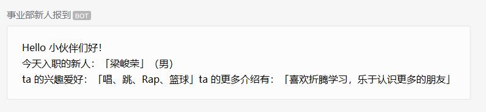

### 1.3 如何收集数据？

OK，没有问题！

我们先打开金山表单并创建一个：

* 「金山表单」https://f.kdocs.cn/forms/


这个表单的填写问题主要有：

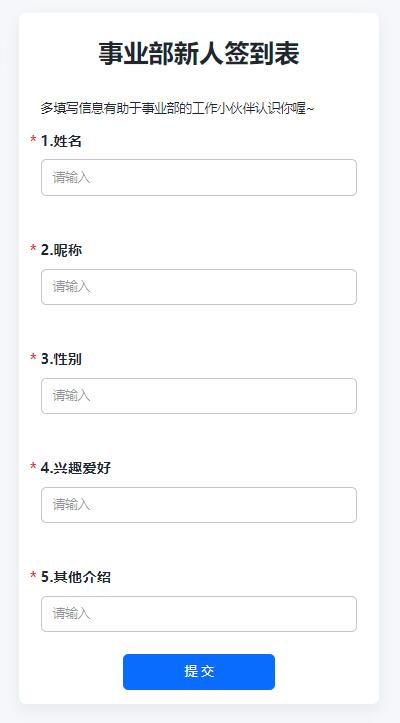

当然，小伙伴们也可以自己填写这张表试试：

方式 1：扫描二维码


方式 2：点击链接：「事业部新人签到表」https://f.kdocs.cn/g/7867wZDn/

这里 **jsliang** 随意填写了一条数据，并将数据关联到「轻表格」上：

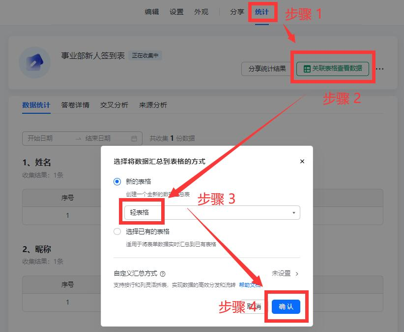


## 二、数据处理

很好，现在我们已经收集到新同事的数据了，接下来我们明确下要做的事：

1. 创建机器人。让脚本能调用企业微信机器人发送信息
2. 编写脚本。对收集到的数据进行处理
3. 设计触发按钮。让 HR 或者自己能点击按钮后，直接运行脚本

### 2.1 创建机器人

这里要求小伙伴们去企业微信创建一个群聊，具体创建方式我们就不介绍啦，Google、百度一搜就有教程的。

> 如果你希望信息发送到金山协作，也是差不多的步骤呢~

我们主要看如何创建机器人：

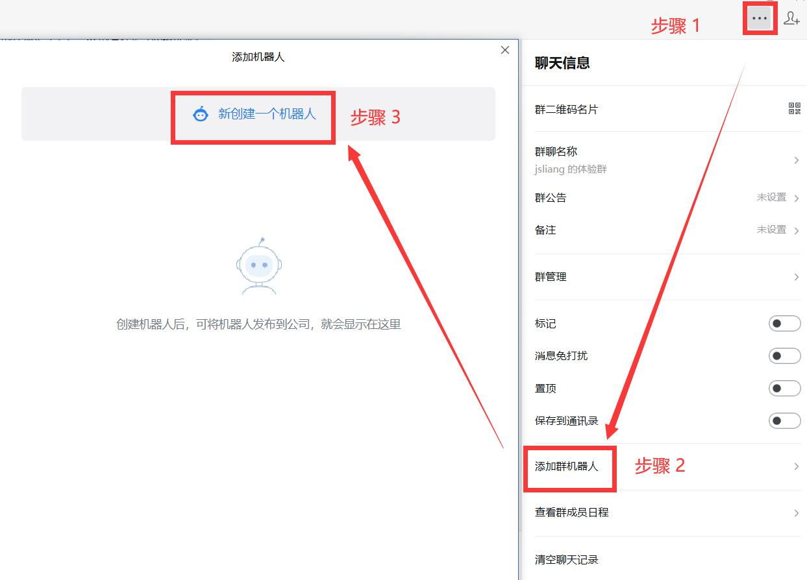

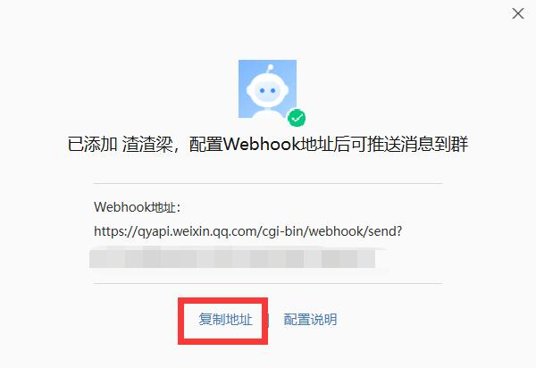

这里我们需要点击【复制地址】，然后在下面的脚本中使用。

### 2.2 编写脚本

在关联的「轻表格」中，我们可以通过下面步骤创建一个脚本，并填写代码进去：

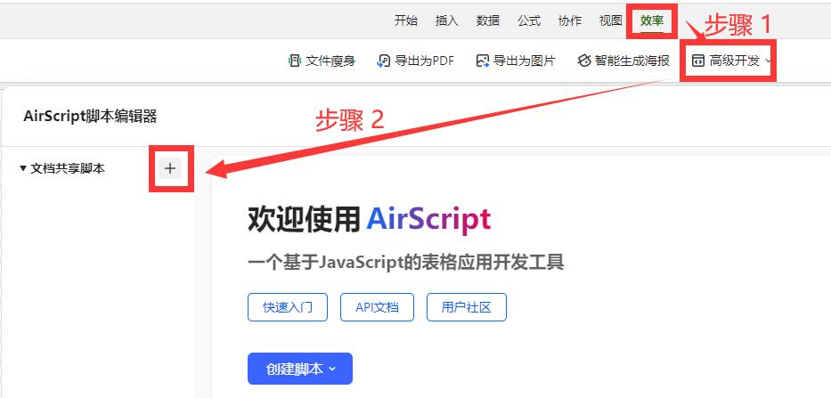

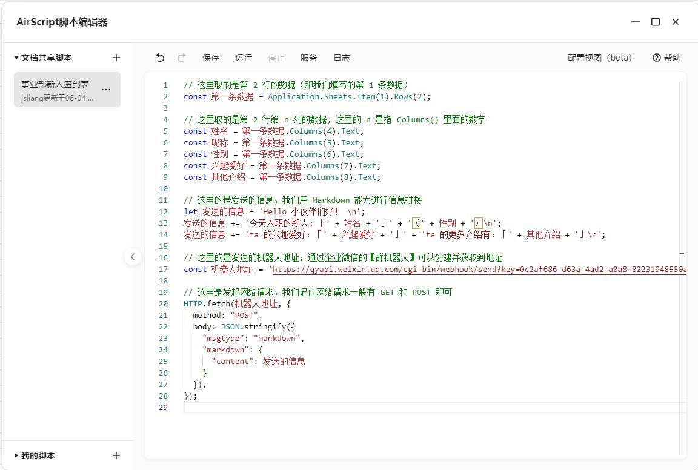

脚本的应该填写的代码如下所示：

```js
// 这里取的是第 2 行的数据（即我们填写的第 1 条数据）
const 第一条数据 = Application.Sheets.Item(1).Rows(2);

// 这里取的是第 2 行第 n 列的数据，这里的 n 是指 Columns() 里面的数字
const 姓名 = 第一条数据.Columns(4).Text;
const 昵称 = 第一条数据.Columns(5).Text;
const 性别 = 第一条数据.Columns(6).Text;
const 兴趣爱好 = 第一条数据.Columns(7).Text;
const 其他介绍 = 第一条数据.Columns(8).Text;

// 这里的是发送的信息，我们用 Markdown 能力进行信息拼接
let 发送的信息 = 'Hello 小伙伴们好！ \n';
发送的信息 += '今天入职的新人：「' + 姓名 + '」' + '（' + 性别 + '）\n';
发送的信息 += 'ta 的兴趣爱好：「' + 兴趣爱好 + '」' + 'ta 的更多介绍有：「' + 其他介绍 + '」\n';

// 这里的是发送的机器人地址，通过企业微信的【群机器人】可以创建并获取到地址
const 机器人地址 = 'https://qyapi.weixin.qq.com/cgi-bin/webhook/send?key=xxxxxxxx';

// 这里是发起网络请求，我们记住网络请求一般有 GET 和 POST 即可
HTTP.fetch(机器人地址, {
  method: "POST",
  body: JSON.stringify({
    "msgtype": "markdown",
    "markdown": {
      "content": 发送的信息
    }
  }),
});

```

PS：**注意啦，这里的机器人地址，你需要将上面复制的内容，填写到两个 `'` 之间**

也就是：`const 机器人地址 = '复制的地址'`（注意 `'` 不要漏了）

------ 华丽分割线-开始 ------

篇外话：看到这里，很多小伙伴就担心了：

“说好的 0 基础呢？你这里直接一坨代码我怎么看得懂！”

放宽心~

这里我们的第 1 个例子，是「快速体验」，即让你先体验到这个脚本的能力。

这样你才有信心做更多尝试，后面 **jsliang** 讲解每一行代码你也会认真听讲！

------ 华丽分割线-结束 ------

OK，话回正题，我们代码填写完毕后，我们就要尝试运行脚本看看效果啦：

Step 1：先申请网络 API 服务


Step 2：点击运行，发送信息，注意看日志是否发送成功~

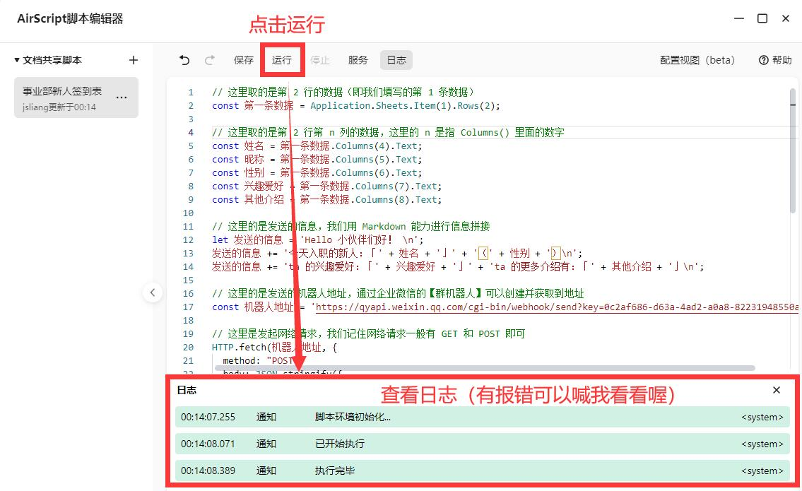

正确发送成功，我们群聊会显示这个信息：


### 2.3 设计触发按钮

很好，到了这里小伙伴们应该和 **jsliang** 一样有点小激动了~

毕竟我们已经上手了第 1 个脚本，并且它愉快地运行起来了！

下面我们再加把劲，让这个脚本，能在 PC 或者移动设备上，可以通过点击一个按钮，就可以运行起来：

Step 1：在关联的「轻表格」，新建一张工作表

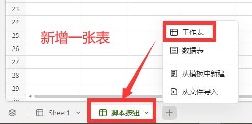

Step 2：在 A1 单元格填写 “事业部新人报到” 文字，并右键打开面板，绑定脚本（插入链接）

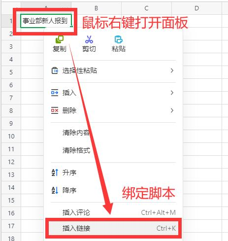

Step 3：这里的【类型】，我们选择【AirScript 脚本】中的【事业部新人签到表】

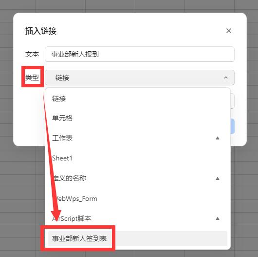

Step 4：点击【确定】后，鼠标 hover 到这个按钮上，出现可点击指令（移动设备打开文档，需要点击一次才会出现这个指令）

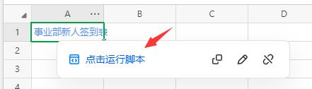

这样，我们就成功完成今天的教学啦！

赶紧来尝试一遍吧！

## 三、下回分解及口水话

人最大的恐惧，是面对未知。

很多时候，我们害怕做的事情，被定义为无意义、显摆、不靠谱……

也会害怕，这件事情能不能做得完，做完后效果是否和自身预期一致。

很多小伙伴担心跟不上、学不会，其实我也会担心写这么一系列文章作用在哪。

但是，All is well~

如果你能和我写教程的时候一样，能保持住自己的烦躁心，一步一步学下去。

那我感觉这件事情，那真是，泰裤辣！

后续文章我们将逐步讲解：

* 本篇文章出现的代码含义及作用
* 如何读取其他行的新人报到，并且防止重复发送数据
* 如何读取数据进行计算统计
* 如何合并「表格」「轻维表」「轻表格」数据
* ……

如果你感觉文章讲解不清楚，希望通过视频直播来快速了解，可以加本人 WX：`Liang123Gogo`

一般文章发出后，随后会有配套直播视频！

如果你希望关注后续脚本直播，可私聊发送 `进脚本直播群`，即拉你进相应群聊。

---

**不折腾的前端，和咸鱼有什么区别！**

觉得文章不错的小伙伴欢迎点赞/点 Star。

如果小伙伴需要联系 **jsliang**：

* [Github](https://github.com/LiangJunrong/document-library)
* [掘金](https://juejin.im/user/3403743728515246)

个人联系方式存放在 Github 首页，欢迎一起折腾~

争取打造自己成为一个充满探索欲，喜欢折腾，乐于扩展自己知识面的终身学习斜杠程序员。

> jsliang 的文档库由 [梁峻荣](https://github.com/LiangJunrong) 采用 [知识共享 署名-非商业性使用-相同方式共享 4.0 国际 许可协议](http://creativecommons.org/licenses/by-nc-sa/4.0/) 进行许可。<br/>基于 [https://github.com/LiangJunrong/document-library](https://github.com/LiangJunrong/document-library) 上的作品创作。<br/>本许可协议授权之外的使用权限可以从 [https://creativecommons.org/licenses/by-nc-sa/2.5/cn/](https://creativecommons.org/licenses/by-nc-sa/2.5/cn/) 处获得。
