0 基础学脚本：给同事做一个排班表并每日通知「02」
===

> Create by **jsliang** on **2023-05-24 08:29:10**  
> Recently revised in **2023-06-11 21:36:26**

Hello 小伙伴们早上、中午、下午、晚上、深夜好！

我是爱折腾的 **jsliang**~

本系列文章和配套直播视频，面向金山文档的「轻维表」「表单」用户。

希望通过【自动化】和【脚本】等能力，让里面数据相互流转起来，从而提升工作效率。

## 一、序

本篇文章为系列第 2 篇，将介绍下面内容：

1. 定义一个数据。`let` 和 `const` 区别是什么
2. 数据类型。字符串（`String`）、数字（`Number`）、布尔（`Boolean`）、数组（`Array`）、对象（`Object`）
3. 接口请求。`GET` 和 `POST` 请求区别是什么

当然，本篇干货将会有 “亿点点” 多~

上面知识点只是前一篇文章的回顾，我们还需要学习：

1. 数据遍历。如何通过 `for` 取到表中每一条信息
2. 日期判断。如何通过 `if...else if...else...` 判断只发送当天时间对应的信息

这 5 个知识点，我们将在下面内容反复展示用法，让小伙伴们通过一个又一个的实例巩固起来，达到随手就可以写脚本的目的。

本篇文章将进行每日发送：


* 如果对你有帮助 **欢迎点赞和关注**
* 如果对内容有感 **欢迎评论和私聊**
* 如果要介绍对象 **欢迎扫码加微信**

> WX: Liang123Gogo

**糟糕！哪怕上篇文章被投诉了，这篇文章还是写完了，这个作者他真的试图教会你们~**

**他真的，我哭死！**


> 上篇文章感谢【超燕】小伙伴的赞赏！

## 一、代码是怎么运转起来的

还记得上一篇文章我们的那 28 行代码么？

它是如何运转起来的，我们如何能手刃代码，成为独当一面的「脚本小能手」，让我们开始整起来吧~

**在这之前**，让我们创建一个「轻维表」并运行一段简单的脚本，开始我们的 **Hello World** 之旅：

打开 https://www.kdocs.cn/ ，登录后按步骤操作：

> Step 1：创建文件

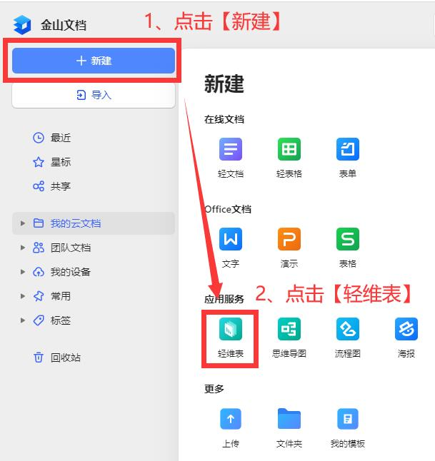

> Step 2：了解「轻维表」能力


> Step 3：管理脚本并创建脚本

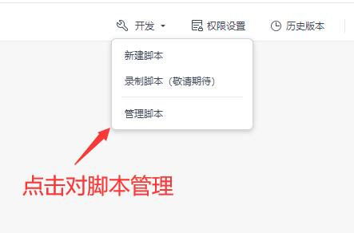

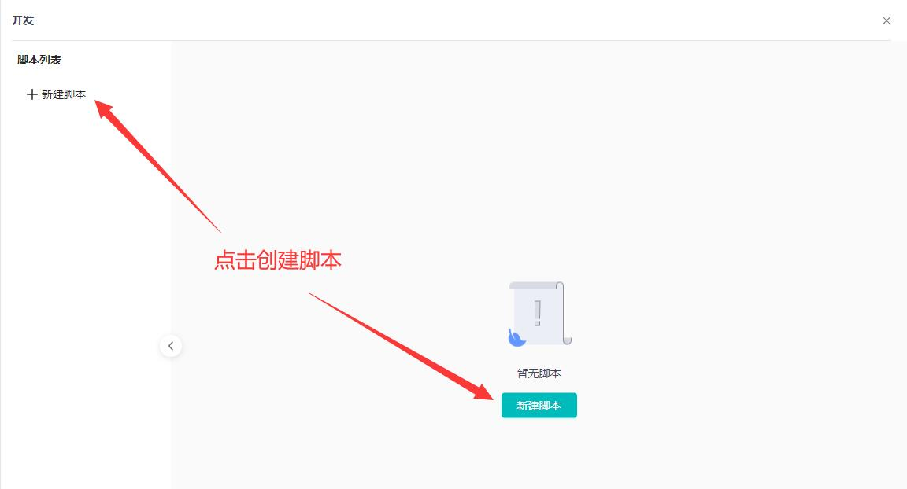

> Step 4：脚本界面介绍

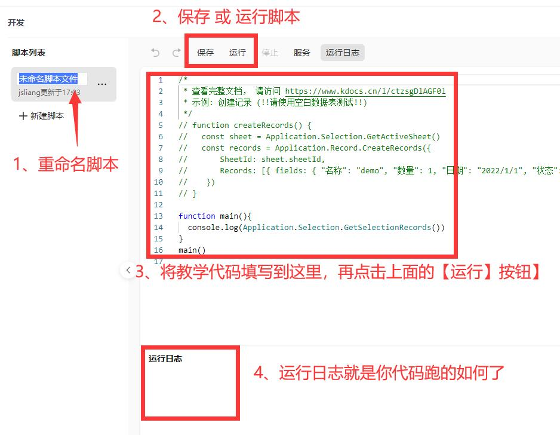

> Step 5：运行一段脚本

复制脚本并按照下面图片流程操作：

```js
console.log('你好金山文档的 jsliang');
```

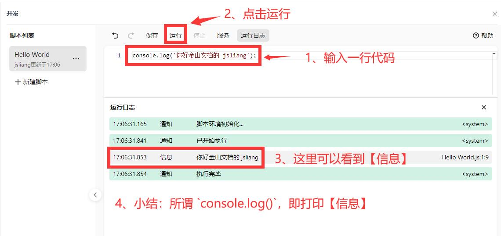

哦豁，欢迎来到【编程】世界，你敲下了人生的第一种语言的 `Hello World`。

> 这里的 `console.log`，就是打印【信息】，下面我们会看到很多打印，你可以快速了解它的能力

### 1.1 定义数据

```js
// 这里取的是第 2 行的数据（即我们填写的第 1 条数据）
const 第一条数据 = Application.Sheets.Item(1).Rows(2);
```

好，话不多说，让我开始哆嗦起来~

先看这 2 行代码，它们是怎样子的。

---

#### 知识点 1：注释

通过 `// 注释内容`，我们给第 2 行做了代码注释，告诉看这行代码的小伙伴，下面这个这行代码的作用是啥。

JavaScript 有多种注释方式：

```js
// 注释内容
/* 注释内容 */
```

你并不需要太过于在意别人怎么写注释~

你需要明白的是，如果你的代码是会分享给别人的。

那么！一些比较绕的地方，千万记得注释，要不然别人不想看你代码也很正常。

---

#### 知识点 2：变量

通过 `const`，我们定义了一个变量。

什么是变量，为什么要定义，这个引用数学中的一个经典：

```
// 很明显这个 `x` 的值为 `2`
2x = 4
```

在数学中，我们把这里的 `x` 叫做 “未知数”。

而在 JavaScript 代码上，我们这么定义：

```js
const x = 4 / 2;
```

这里的 `x`，我们叫做变量，而 `const`，是定义变量的一种方式。

在 JavaScript 中，我们有 2 种定义变量的方式：

```js
// 通过 let 定义的变量，是可以 “变” 更的
// 下面我的存款，就是可以动态变化的
let 我的存款 = 1000;
我的存款 = 10000;
console.log('我的存款: ', 我的存款);

// 通过 const 定义的，我们可以称之为 “常” 量
// 即这个字段，一般情况下是不可以变的
// 当然，下一小节有几个特殊家伙，他们可以变一些 “东西”
// 这里我们先忽略，认定 “常” 量
const 我的性别 = '男';
console.log('我的性别: ', 我的性别);
```

将这几行代码丢到我们脚本运行：

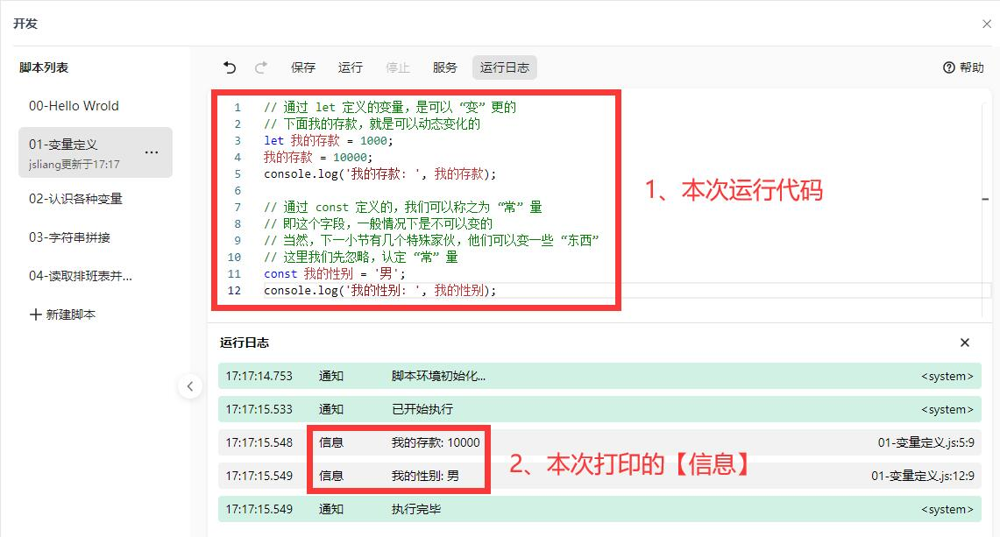

当然，实际上有 3 种，还有一种定义方式是 `var`。

但是！**jsliang** 不推荐你们使用 `var`！！

所以你们看到这个关键字，知道它是定义变量的即可，千万不要在你的代码中使用。

---

#### 知识点 3：其他

**最后**，这里的 `Application.Sheets.Item(1).Rows(2)` 是什么意思呢？

就不得不提到下一小节的 “对象” 了。

> 你们经常听的程序员 `new` 一个对象，要来咯~

### 1.2 读取表信息

现在，打开 **jsliang** 为这次精心准备的教学文档：

* 0 基础学脚本：给同事做一个排班表并每日通知「02」https://kdocs.cn/l/cpPbvz32LSxB

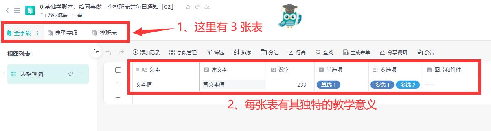

**然后**，我们顺手就 pia 一下新建好一个脚本并跑起来：

```js
// 所谓 Application，我们可以看做是「轻维表」这个应用
// 然后 .Sheet 即查询里面的所有「表」
// 最后 .GetSheets() 即获取所有「表」的信息
// 参考文档: https://kdocs.cn/l/ctzsgDlAGF0l?linkname=ijRISSgUJ8
// 这些功能，我们会在下一篇文章的【方法-Function】中介绍
// 这里我们只需要知道有这个功能即可(后面会介绍!)
const 所有表 = Application.Sheet.GetSheets();

// 这里我们定义了一个【数组】，用来获取信息
// 数组即变量的一种，下一小节我们会详细介绍
const 所有表信息 = [];

// 这里我们对上面取到的数组进行了遍历
// 数据遍历通过 `for (let 自增变量; 自增变量 < 总遍历次数; 自增变量自增)` 的形式操作
// 同样，下面小节我们会详细介绍遍历
for (let i = 0; i < 所有表.length; i++) {
  const 单张表 = 所有表[i];
  所有表信息.push({
    名称: 单张表.name,
    id: 单张表.id
  });
}
console.log('所有表信息: ', 所有表信息);
```

运行代码：

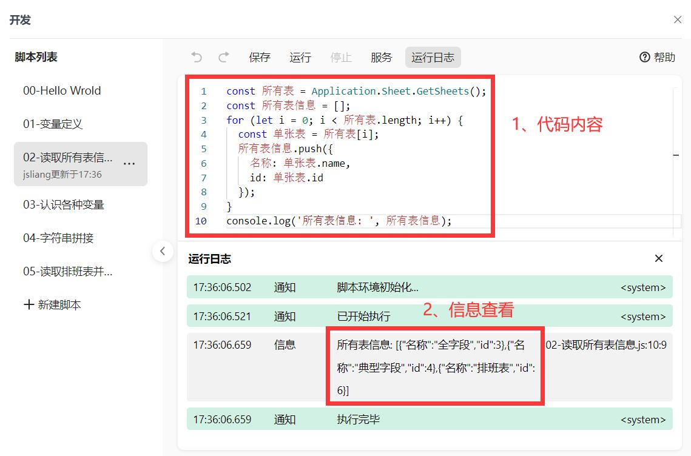

哦豁，我们在上面图片，好像发现一些不得了的信息：

```json
[
  { "名称": "全字段", "id": 3 },
  { "名称": "典型字段", "id": 4 },
  { "名称": "排班表", "id": 6 }
]
```

是的！我们把这个文档里面的 3 张表信息打印出来了~

PS：这里的【方法】【数组】【遍历】，我们会在下面一一介绍，这里运行这个代码，单纯是为了获取表的信息！

### 1.3 数据类型

OK，通过上面代码，我们知道了：

* `{ "名称": "典型字段", "id": 4 }`

那么，很巧的是，我这里有一段代码，可以根据这个信息，获取到这张表的数据：

```js
// 这里的数据，是从【02-读取所有表信息】这个脚本取的
const 典型字段表 = { "名称": "典型字段", "id": 4 };

// 参考文献： https://kdocs.cn/l/ctzsgDlAGF0l?linkname=PpHAGnTCor
// 通过 “已知” 的表 ID，我们获取到这张表的数据
const 典型字段表的数据 = Application.Record.GetRecords({ SheetId: 典型字段表.id });
console.log('典型字段表的数据: ', 典型字段表的数据);

// 因为【运行日志】显示不齐全了
// 所以我们需要发送全部信息到企业微信，再拷贝到控制台查看
const 发送的信息 = JSON.stringify(典型字段表的数据);

// 这里的是发送的机器人地址，通过企业微信的【群机器人】可以创建并获取到地址
// 下面代码请填写你们机器人的地址
const 机器人地址 = '请填写自己机器人的 Webhook 地址';

// 这里是发起网络请求，我们记住网络请求一般有 GET 和 POST 即可
HTTP.fetch(机器人地址, {
  method: "POST",
  body: JSON.stringify({
    "msgtype": "markdown",
    "markdown": {
      "content": 发送的信息
    }
  }),
});
```

> Step 1：复制粘贴并运行代码

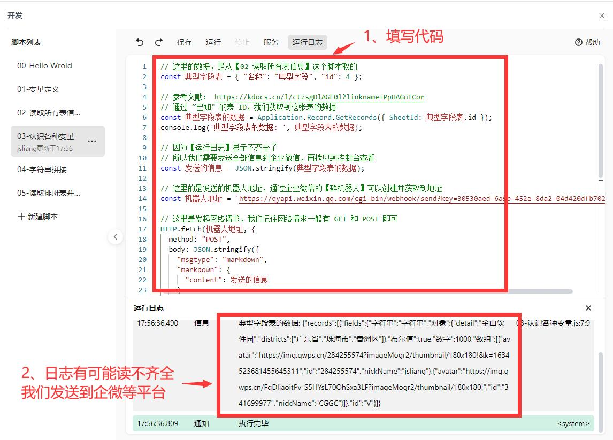

> Step 2：查看发送到企微群的信息

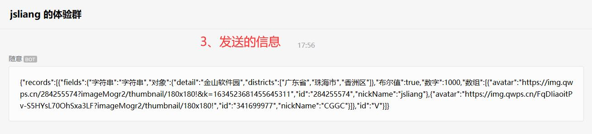

> Step 3：通过 Chrome 的【F12】按钮，打开控制台；或者按照下面步骤，打开控制台，并输入内容

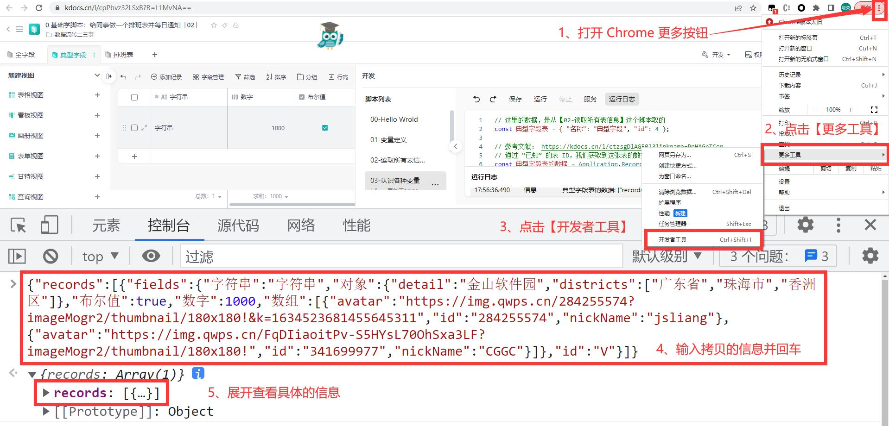

OK，我们开始看看这些信息：

```js
{
  字符串: "字符串",
  数字: 1000,
  布尔值: true,
  数组: [
    {
      avatar:
        "https://img.qwps.cn/284255574?imageMogr2/thumbnail/180x180!&k=1634523681455645311",
      id: "284255574",
      nickName: "jsliang",
    },
    {
      avatar:
        "https://img.qwps.cn/FqDIiaoitPv-S5HYsL70OhSxa3LF?imageMogr2/thumbnail/180x180!",
      id: "341699977",
      nickName: "CGGC",
    },
  ],
  对象: {
    detail: "金山软件园",
    districts: ["广东省", "珠海市", "香洲区"],
  },
}
```

在 JavaScript 中，我们有【字符串】【数字】【布尔值】【数组】【对象】等多种数据类型，下面我们逐个了解吧！

---

#### 知识点 1：字符串

所谓字符串，就是我们平时说的 “文本”，我们平时在各种聊天输入框说的话，在计算机上存储起来的，就是 “字符串”。

这个字符串，在 JavaScript 中，一般通过双引号 `"字符串"`，或者单引号 `'字符串'` 的形式包裹起来。

比如我们定义一段文本：

```js
const 对前任的话 = '此时此刻此歌又想起你，可恶总感觉自己跟舔狗一样，被甩了也念念不忘';
```

当然，我们还可以对它 “拼接”，正如上一篇文章那样做的一样：

```js
const 姓名 = '梁峻荣';
const 年龄 = 28;
const 爱好 = '吃喝玩乐';

// 通过 '字符串' + '字符串'，我们可以把多个字符串拼接起来
// 这里的效果是：
// 梁峻荣28吃喝玩乐
const 拼接的信息1 = 姓名 + 年龄 + 爱好;
console.log('拼接的信息 1: ', 拼接的信息1);

// 这里的效果是：
// 你好，我叫梁峻荣，今年28。我喜欢吃喝玩乐
const 拼接的信息2 = '你好，我叫' + 姓名 + '，今年' + 年龄 + '。我喜欢' + 爱好;
console.log('拼接的信息 2: ', 拼接的信息2);
```

---

#### 知识点 2：数字

数字，这个大家都不会陌生。

我们在「轻维表」中存储的数据，很多都是数字类型的，例如：

* 数值
* 百分比
* 等级
* 编号
* 货币
* 进度

而说到数字，我们需要了解简单的 5 则运算：

1、**加法**：通过 `+` 进行运算

```js
// 加法
const 和 = 2 + 4;
// 通过【变量 A + 变量 B】，我们可以求和
// 下面输出是【和: 6】
console.log('和: ', 和);

// 自增数字
let 自增值 = 10;
const 自增和 = 自增值++;
// 通过【变量++】，我们可以让它自增 1
// 下面输出是【自增和: 11 10】
// 即【自增值++】相当于【自增值 + 1】
console.log('自增和: ', 自增值, 自增和);
```

2、**减法**：通过 `-` 进行运算

```js
// 减法
const 我当前有的钱 = 10000;
const 月租 = 900;
const 我剩余的钱 = 我当前有的钱 - 月租;
// 通过【变量 A - 变量 B】，我们可以求差值
// 下面输出是【我剩余的钱: 9100】
console.log('我剩余的钱: ', 我剩余的钱);

// 自减数字
let 自减值 = 10;
const 自减差 = 自减值--;
// 通过【自减值--】，我们可以让它自减 1
// 下面输出是【自减差: 9 10】
// 即【自减值--】相当于【自减值 - 1】
console.log('自减差: ', 自减值, 自减差);
```

3、**乘法**：通过 `*` 进行运算

```js
const 乘数1 = 3;
const 乘数2 = 3;
const 乘积 = 乘数1 * 乘数2;
// 打印信息【乘积: 9】
console.log('乘积: ', 乘积);
```

4、**除法**：通过 `/` 进行运算

```js
const 除数 = 9;
const 被除数 = 3;
const 结果 = 除数 / 被除数;
// 打印信息【结果: 3】
console.log('结果: ', 结果);
```

5、**求余**：通过 `%` 进行运算

```js
const 数值 = 10;
const 求余 = 3;
const 结果 = 数值 % 求余;

// 打印信息【结果: 1】
// 这里的计算，即 10 / 3，得 3，余 1，这里的 1 即余值
console.log('结果: ', 结果);
```

当然，我们脚本还有更高级的数字计算方法，比如：

* 平方：`Math.pow(2, 3)`（结果为 `8`）
* 绝对值：`Math.abs(-10)`（结果为 `10`）
* 四舍五入：`Math.ceil(4.5)`（结果为 `5`）

这里我们不一一列举，更多的小伙伴们可自行查看：

* Math 函数： https://developer.mozilla.org/zh-CN/docs/Web/JavaScript/Reference/Global_Objects/Math

需要注意的是，我们四则运算是符合数学的四则运算的，所以碰到先乘除后加减的场景，记得加上括号 `()`：

```js
console.log('平方: ', Math.pow(2, 3));
console.log('绝对值: ', Math.abs(-10));
console.log('四舍五入: ', Math.ceil(4.5));

// 四则运算
const 求值 = (2 + 2) * 2 / 2;
// 这里输出【4】
console.log('求值: ', 求值);
```

**记住，脚本光看不敲不练，你永远也学不会**。

所以，最好的练习，是将上面的代码都敲一遍，这样你才能学会！！

---

#### 知识点 3：布尔值

所谓布尔值，非【真】即【假】~

即它只有 2 种状态：

* `true`：真
* `false`：假

```js
{
  布尔值: true,
}
```

我们在进行【是否】判断的时候，需要用到布尔值：

```js
const 空字符串 = '';
// 这里通过 !! 可以将一个值转换为布尔值
// 空字符串对应的是 false
console.log('空字符串: ', !!空字符串);

const 有值的字符串 = 'jsliang';
// 有值的字符串对应的是 true
console.log('有值的字符串: ', !!有值的字符串);

const 数字0 = 0;
const 数字1 = 1;
// 打印的值【数字: false true】
// 这里需要明白的是，一个数字小于等于 0，输出 false
// 一个数字大于 0，输出 true
console.log('数字: ', !!数字0, !!数字1);

// 下面是一个 if...else if...else... 判断，用来判断一种情况
const 你的名字 = 'jsliang';
// 这里的意思是，【你的名字】这个变量，是否等于【梁峻荣】
// 很明显是错误的
if (你的名字 === '梁峻荣') {
  console.log('输出 1');

  // 下面的意思是，上面条件不满足的时候
  // 再判断【你的名字】这个变量，是否等于【jsliang】
  // 很明显是对的
  // 所以输出【输出 2】
} else if (你的名字 === 'jsliang') {
  console.log('输出 2');
} else {
  console.log('输出 3');
}
```

这里的 `if...else if...else...` 判断，我们在下面还会用到！

---

#### 知识点 4：数组

了解完上面几种基础类型后，我们要开始出招了，【数组】和【对象】怎么一回事呢？

在脚本，即 JavaScript 中，有 2 种数据区分方式：

* 基础数据类型（引值）：字符串、数字、布尔值
* 引用数据类型（引址）：数组、对象

这就好比你买了一块地皮：

所谓 **基础数据类型（引值）**，就是计算机分配给它一个固定的位置，用来存放这个值，它销毁了就直接销毁了。

这里面的【字符串】【数字】【布尔值】，就好比你购买的家居、你存放的纸质人民币，他们是固定的实体的。

你可以在这块地皮上面，建一套房子。

这套房子上随意挪动你的家居和纸质人民币，这并不影响他们的性质。

而这块地皮，就像【数组】和【对象】，它是计算机分配的一块固定位置的内存，它建了房子，它的房间还蛮大的，你可以用它来存放各种 **基础数据类型**。

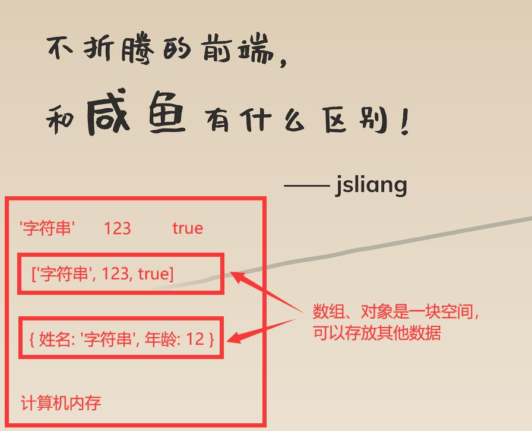

让我们快速了解下数组：

```js
// 下面的数组存放了字符串、数字和布尔值
// 我们通过 [] 的方式存放数组
const 数组1 = ['字符串', 12, true];

// 【填写数组数据】
// 计算机是 0101 二进制的，所以很多数据从 0 开始
// 数组也是从 0 开始
数组1[0] = 'jsliang';
// 这里的 1 是指第二个数字，即 12 -> 28
数组1[1] = 28;
// 这里的 数组1.length 是指数组的长度
// 很明显上面的数组，有 3 个字段，即长度为 3
// 所以【数组1[数组1.length - 1]】相当于【数组1[3 - 1]】，即【数组1[2]】
// 也就是我们的布尔值 true，这里修改为 false
数组1[数组1.length - 1] = false;
// 这里将一个字段推到数组里面了
// 我们知道数组是引址的
// 也就是分配的是一块地皮，你可以往里面再添加新东西
数组1.push('新的字符串');
// 这里输出【数组1: ["jsliang",28,false,"新的字符串"]】
console.log('数组1: ', 数组1);

// 下面的数组存放了字符串和对象
const 数组2 = [
  // 这里每个 {} 包裹的，都是 “一条数据”
  {
    // 对象里面也可以存放各种数据
    avatar: "https://img.qwps.cn/284255574?imageMogr2/thumbnail/180x180!&k=1634523681455645311",
    id: "284255574",
    nickName: "jsliang",
  },
  {
    avatar: "https://img.qwps.cn/FqDIiaoitPv-S5HYsL70OhSxa3LF?imageMogr2/thumbnail/180x180!",
    id: "341699977",
    nickName: "CGGC",
  },
];

// 【查询数组数据】通过 for 可以遍历数据
for (let i = 0; i < 数组2.length; i++) {
  const 本条数据 = 数组2[i];
  const 用户ID = 本条数据.id;
  const 昵称 = 本条数据.nickName;
  console.log('输出:', 用户ID, 昵称);
}
// 这里会打印 2 次
// 第 1 次：输出: 284255574 jsliang
// 第 2 次：输出: 341699977 CGGC
```

很好，通过这样操作，你会发现数组不过如此！

后续文章会用到数组的一些【方法-Function】或者一些对数组的操作，但是这里我们不需要有太多了解。

> 拼接 2 个数组

```js
const 数组左侧 = [1, 2];
const 数组右侧 = [3, 4];
const 新数据 = [...数组左侧, ...数组右侧];
// 这里输出【新数据: [1,2,3,4]】
console.log('新数据: ', 新数据);
```

---

#### 知识点 5：对象

加油！数据类型还差一个需要了解了：**对象**

回归开头：

```js
// 这里取的是第 2 行的数据（即我们填写的第 1 条数据）
const 第一条数据 = Application.Sheets.Item(1).Rows(2);
```

我们不是说 `Application.Sheets.Item(1).Rows(2)` 是对象吗？其实它是这样的：

```js
{
  "Application": {
    "Sheets": {
      "Item": Function
    }
  }
}
```

哎嘿，假设要在代码上表示：

* 你的对象是白雪公主

```js
// 这里定义了一个对象【你】
const 你 = {
  // 这里定义了对象【你】的对象是【白雪公主】
  // 这里的【对象】，可以不用 "" 括起来
  // 但是一般推荐你括起来（有时候你看到的数据是不括的）
  "对象": "白雪公主"
};

// 【修改值】这里定义了【你】的职业
你.职业 = '骑士';
// 【读取值】这里输出【你的职业: 骑士】
console.log('你的职业: ', 你.职业);

// 这里输出：【你的对象: 白雪公主】
console.log('你的对象: ', 你.对象);
```

这里我们有 4 点信息：

1. 对象定义的方式是 `{}`
2. 对象可以通过 `"键名": "值"` 这种键值对方式定义（比如 `"对象": "白雪公主"`）
3. 对象也可以通过 `对象.属性` 这种形式定义（比如 `你.职业`）
4. 通过 `对象.属性` 可以获取到这个属性的值

这里小伙伴们可能很不理解，为什么叫「键值对」：


这里我们可以拿键盘来举例：

```js
const 键盘 = {
  "回车键": 13,
  "ESC 按键": 27,
};
```

哎~

说到这个你是不是可以快速理解「键值对」了，就是【按键】对应的【值】嘛~

那么我们再看开头打印的值：

```js
对象: {
  detail: "金山软件园",
  districts: ["广东省", "珠海市", "香洲区"],
},
```

这里的对象，`对象.detail` 对应的就是【详细地址】，`对象.districts` 对应的就是【省市区】（我们用数组来表示【省市区】）

很赞，对象我们也了解了~

### 1.4 简单回顾

再回收前面我们在变量中说的话：

```js
// 通过 const 定义的，我们可以称之为 “常” 量
// 即这个字段，一般情况下是不可以变的
// 当然，下一小节有几个特殊家伙，他们可以变一些 “东西”
// 这里我们先忽略，认定 “常” 量
const 我的性别 = '男';
console.log('我的性别: ', 我的性别);
```

在这里我们说过有几个特殊家伙，可以变，那就是【数组】和【对象】。

```js
const 我的性别 = '男';
// 下面这行在脚本编辑器运行会报错
const 我的性别 = '女';

const 你 = {
  "性别": "男",
};
// 这里运行不会报错喔
你.性别 = '女';
console.log('你的性别: ', 你.性别);
```

好家伙，居然改变性别了~

当然，如果你仔细跟着上面代码敲过一遍，实际上你是可以理解：

1. 【对象】和【数组】是引址，它是可变的
2. 我将【对象】的内容变更，实际上还是在这块地址操作
3. 所以，通过 `const` 定义这个对象【你】，就不能再次定义
4. 但是，我可以反复修改对象【你】里面的所有数据

### 1.5 接口请求

很好，温习旧知识，我们就差最后一步了！

当你打开浏览器的任意一个网站，你会发送网络请求给他们，让他们给你返回信息。

这个【请求】，我们一般叫做【GET 请求】，它主要是用来获取信息的。

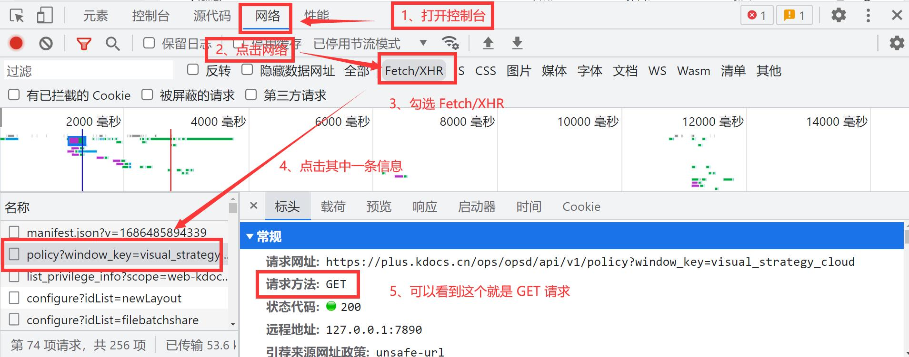

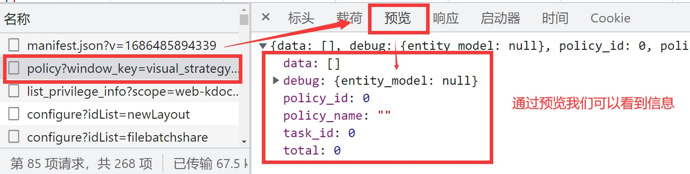

既然 GET 请求是用来获取信息的，那么相对应的就是 POST 请求：

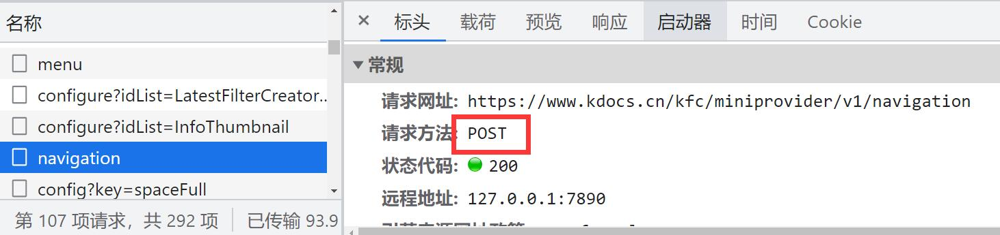

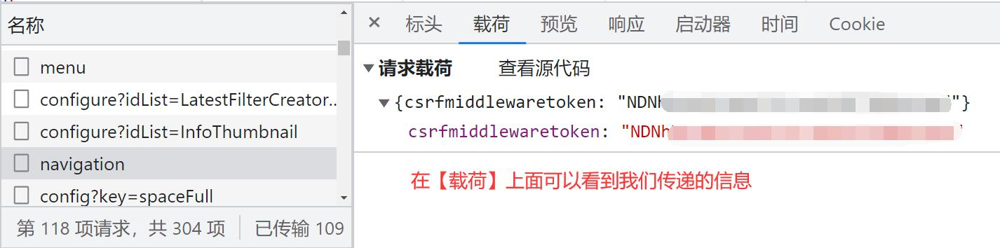

还记得我们前面发送企微信息的代码么：

```js
// 这里的是发送的机器人地址，通过企业微信的【群机器人】可以创建并获取到地址
const 机器人地址 = 'https://qyapi.weixin.qq.com/cgi-bin/webhook/send?key=xxxxxxxx';

// 这里是发起网络请求，我们记住网络请求一般有 GET 和 POST 即可
HTTP.fetch(机器人地址, {
  method: "POST",
  body: JSON.stringify({
    "msgtype": "markdown",
    "markdown": {
      "content": '发送的信息'
    }
  }),
});
```

看这里的 `method`，我们就是用的企微的 `POST` 接口请求！

当然，如果我们只是简单往【脚本】里面塞这段代码，并且修改【机器人地址】，我们是发不出去信息的

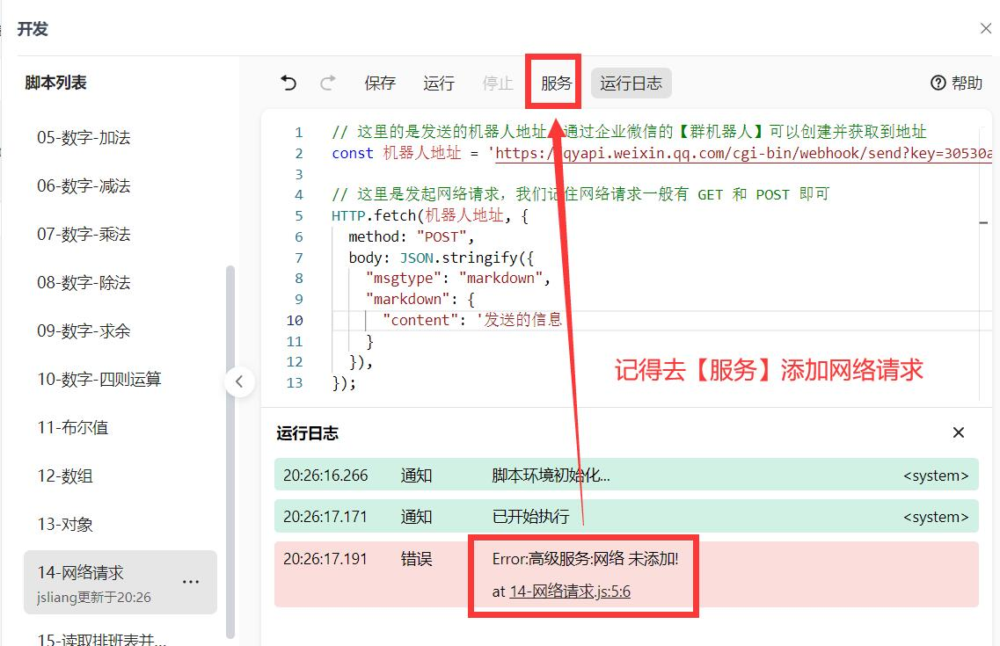

开通服务后，我们可以查看我们网络请求是否正常发出去了没有：

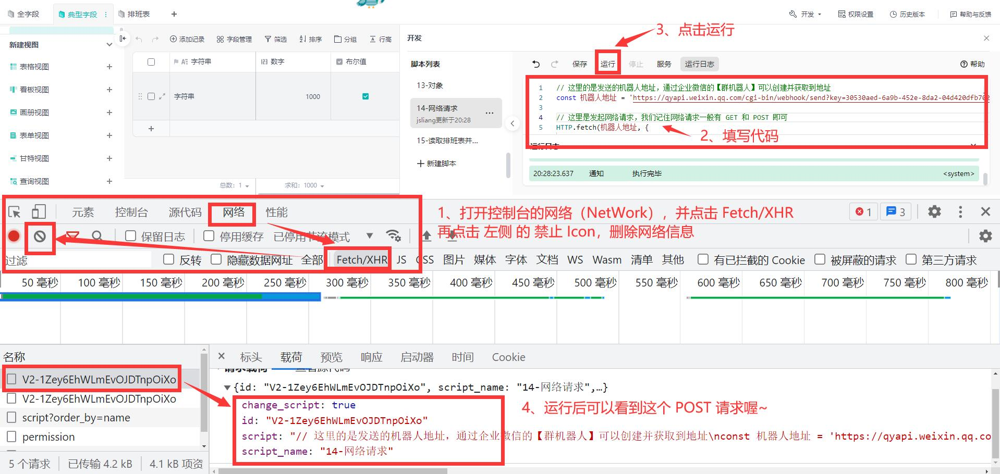

> 当然，这里的截图，是【脚本】发出去的 POST 请求，非发送企微的 POST 请求，这里面的复杂点，我们就不一一介绍啦！

### 1.6 小结回顾

OK，通过上面内容，我们拿前一篇的代码回顾看看，我们还有什么不懂的：

```js
// 这里取的是第 2 行的数据（即我们填写的第 1 条数据）
const 第一条数据 = Application.Sheets.Item(1).Rows(2);

// 这里取的是第 2 行第 n 列的数据，这里的 n 是指 Columns() 里面的数字
const 姓名 = 第一条数据.Columns(4).Text;
const 昵称 = 第一条数据.Columns(5).Text;
const 性别 = 第一条数据.Columns(6).Text;
const 兴趣爱好 = 第一条数据.Columns(7).Text;
const 其他介绍 = 第一条数据.Columns(8).Text;

// 这里的是发送的信息，我们用 Markdown 能力进行信息拼接
let 发送的信息 = 'Hello 小伙伴们好！ \n';
发送的信息 += '今天入职的新人：「' + 姓名 + '」' + '（' + 性别 + '）\n';
发送的信息 += 'ta 的兴趣爱好：「' + 兴趣爱好 + '」' + 'ta 的更多介绍有：「' + 其他介绍 + '」\n';

// 这里的是发送的机器人地址，通过企业微信的【群机器人】可以创建并获取到地址
const 机器人地址 = 'https://qyapi.weixin.qq.com/cgi-bin/webhook/send?key=xxxxxxxx';

// 这里是发起网络请求，我们记住网络请求一般有 GET 和 POST 即可
HTTP.fetch(机器人地址, {
  method: "POST",
  body: JSON.stringify({
    "msgtype": "markdown",
    "markdown": {
      "content": 发送的信息
    }
  }),
});
```

没有！完全没问题！

里面的信息 **jsliang** 都给你讲解了~

### 二、给同事做一个排班表

OK，没有问题，我们开始给同事做排班表啦！

我们在本篇示例教程文档中新增排版信息：

* 0 基础学脚本：给同事做一个排班表并每日通知「02」https://kdocs.cn/l/cpPbvz32LSxB

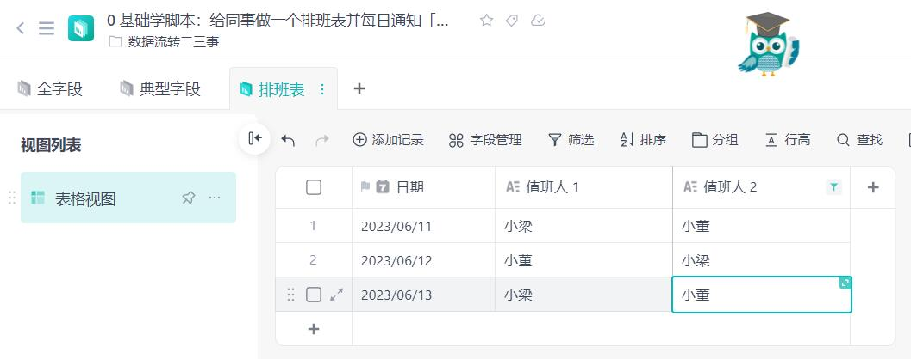

### 2.1 遍历数据

所谓遍历数据，我们举例遍历【数组】数据的方法来快速了解：

```js
// 遍历，我们通过 for 操作，它的公式是：
/*
for (let 自增变量 = 0; 自增变量 < 总数据; 自增变量++) {
  const 单条数据 = 所有数据[自增变量]
}
*/
// 下面代码，我们的总量是 3，从 0 开始，即 0/1/2
for (let i = 0; i < 3; i++) {
  console.log(i);
}
// 所以上面会依次输出 0/1/2

// 下面代码，我们遍历数组，然后输出里面的值
const 我的信息 = ['梁峻荣', 28, true];
for (let i = 0; i < 我的信息.length; i++) {
  // 这里【我的信息[i]】，就是逐个读取数组的信息
  // 注意：数组是从 0 开始喔~
  // 依次输出【'梁峻荣'】【28】【true】
  console.log(我的信息[i]);
}
```

然后我们实操一下。

```js
// 这里通过脚本自带能力，获取到所有表的信息
const 所有表 = Application.Sheet.GetSheets();

// 然后我们要对这些信息做筛选
const 所有表信息 = [];

// 这里我们定义一下排班表的 ID，因为下面我们要根据这个 ID 读取这张表的信息
let 排班表id;

// 遍历，我们通过 for 操作，它的公式是：
/*
for (let 自增变量 = 0; 自增变量 < 总数据; 自增变量++) {
  const 单条数据 = 所有数据[自增变量]
}
*/
// 在下面代码中，i 就是我们的自增遍历，然后【所有表.length】获取到了所有表这个数组的长度
// 然后我们要遍历这个所有表每条数据，而【所有数据[自增变量]】对应的就是单条数据
// 举例数组 [1, 2, 3]，那么【单条数据】对应的就 1 、 2 以及 3
for (let i = 0; i < 所有表.length; i++) {

  // 这个【单张表】，返回的是一个对象 {}
  const 单张表 = 所有表[i];

  // 然后我们可以往数组里面添加一个对象，这个对象对应的，就是要收集的数据
  所有表信息.push({
    "名称": 单张表.name,
    "id": 单张表.id
  });

  // 这个 if，就是如果 A 是 B 的意思，如果【true】，就进来里面，否则不进来
  // 这个 ===，就是判断 2 个值是否相等，这里就是判断这张表的名称，是不是叫【排班表】
  // 如果是的话，我们就收集它的 ID
  if (单张表.name === '排班表') {
    排班表id = 单张表.id;
  }
}

// 打印信息【所有表信息: [{"名称":"全字段","id":3},{"名称":"典型字段","id":4},{"名称":"排班表","id":6}]】
console.log('所有表信息: ', 所有表信息);
// 打印信息【排班表id: 6】
console.log('排班表id: ', 排班表id);
```

哎嘿，这里是不是说到 `if` 判断了，下面我们顺带学习一下！

### 2.2 条件判断

条件判断，在 JavaScript 有多重方式，这里我们只需要了解一种即可：

* `if...else if...else...`

它非常简单：

```js
const 我的姓名 = 'jsliang';

// if 就是如果的意思，如果【我的姓名】为【jsliang】，那么就进大括号 {} 里面的脚本
if (我的姓名 === 'jsliang') {
  // 所以这里会输出【1】
  console.log('1');
}

const 我的年龄 = 28;
// 这里先判断【我的年龄】是否为 27
if (我的年龄 === 27) {
  console.log('2');

  // 上面的条件肯定是假的，所以继续判断 else if 这里，就是 “如果上面不成立，那么我们继续往下走”
} else if ((我的年龄 + 1) === 29) {
  // 显而易见 28 + 1 肯定是 29，所以进来这里
  console.log('3');
} else {
  // else 就是上面条件都不走，必定会走这里，然后输出 '4'，这次不周这里
  console.log('4');
}
// 小结：上面代码输出 '3'

// 我写代码你来猜：这里代码会走到哪里？
const 我的金钱 = '1000';
if (我的金钱 === 1000) {
  console.log('5');
} else if ((我的金钱 + 1) === 1001) {
  console.log('6');

  // 注意，这个 else if 可以有多个喔
} else if (Number(我的金钱) === 1000) {
  console.log('7');
} else {
  console.log('8');
}
// 小结：上面代码输出 '7'，注意这里
// 1、字符串 '1000' 和数字 1000 并不相等，所以 `if` 的判断不成立
// 2、字符串 '1000' + 1，结果是 '10001'，字符串 + 数字，会用字符串拼接喔
// 3、Number(字符串)，就是将字符串强制转换成数字，所以会变成 1000 === 1000，就成立了
```

哎嘿，是不是又掌握了一个知识点！

### 2.3 值班表脚本

很棒！我们可以写值班表脚本了，假设我们有下面的信息，以及希望通知的脚本：

值班信息：


通知脚本信息：


那么我们是不是可以直接写代码：

```js
const 所有表 = Application.Sheet.GetSheets();
const 所有表信息 = [];
let 排班表id;
for (let i = 0; i < 所有表.length; i++) {
  const 单张表 = 所有表[i];
  所有表信息.push({
    "名称": 单张表.name,
    "id": 单张表.id
  });

  if (单张表.name === '排班表') {
    排班表id = 单张表.id;
  }
}

console.log('所有表信息: ', 所有表信息);
console.log('排班表id: ', 排班表id);

const 排班表信息 = Application.Record.GetRecords({ SheetId: 排班表id }).records;
console.log('排班表信息: ', 排班表信息);

// new Date() 可以获取时间，这个我们会在下一篇文章讲解
// 这里我们只需要知道可以通过下面代码，拼接出【今天的年月日时间】
const 时间 = new Date();
const 年 = 时间.getFullYear();
const 月 = String(时间.getMonth() + 1).padStart(2, '0');
const 日 = String(时间.getDate()).padStart(2, '0');
const 年月日 = 年 + '/' + 月 + '/' + 日;
console.log('年月日: ', 年月日);

let 本日值班信息;
for (let i = 0; i < 排班表信息.length; i++) {
  const 行信息 = 排班表信息[i].fields;
  const 本行日期 = 行信息.日期;
  console.log('本行日期: ', 本行日期);
  if (本行日期 === 年月日) {
    本日值班信息 = 行信息;
    break;
  }
}
console.log('本日值班信息: ', 本日值班信息);

if (本日值班信息) {
  const 值班人1 = 本日值班信息['值班人 1'];
  const 值班人2 = 本日值班信息['值班人 2'];
  let 发送的信息 = '📅 今日值班：' + '@' + 值班人1 + '、' + '@' + 值班人2 + '\n';
  发送的信息 += '💕 劳烦关注今日课程信息';

  // 这里的是发送的机器人地址，通过企业微信的【群机器人】可以创建并获取到地址
  const 机器人地址 = '这里改成你的机器人地址吧！';

  // 这里是发起网络请求，我们记住网络请求一般有 GET 和 POST 即可
  HTTP.fetch(机器人地址, {
    method: "POST",
    body: JSON.stringify({
      "msgtype": "markdown",
      "markdown": {
        "content": 发送的信息
      }
    }),
  });
}
```

很好，今天的作业：

1. 认真阅读上面的代码，理解这里的脚本意思，并自己创建文件创建脚本尝试几遍
2. 理解通透后，尝试不看上面代码，自己写一遍代码，看下是不是真的能写出来

然后，我们再通过「轻维表」的【自动化】能力，就可以设置每天 9:00 执行我们的脚本啦：

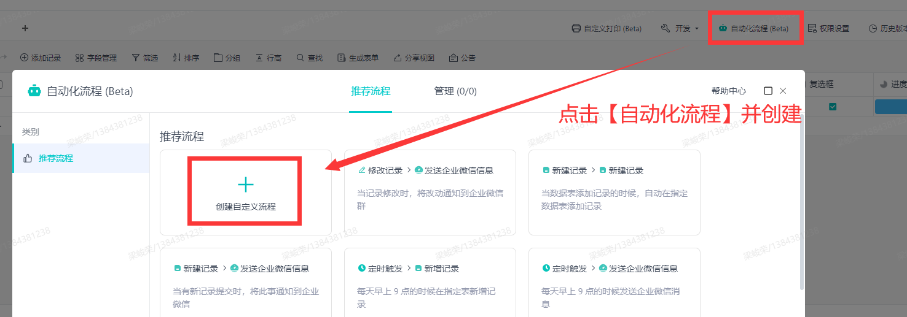

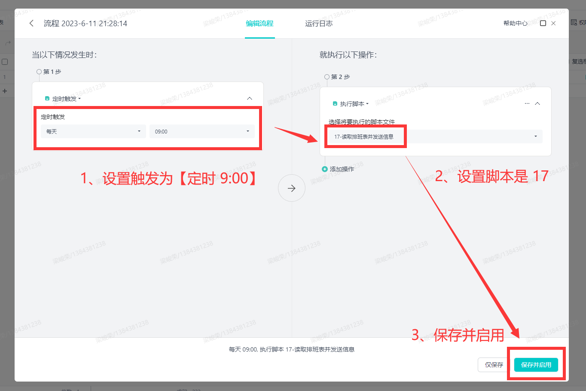

**当然**，【自动化】还没放量到的用户，可以联系 **jsliang** 开通，我的联系方式：

> WX: Liang123Gogo

## 三、总结

这篇文章 **jsliang** 写完整个人都麻了。

> 真的麻了，写一会不得不活动下，要不然感觉心脏受不了

1、耗费时间约 5~6 个小时：


2、里面写了 17 个脚本：

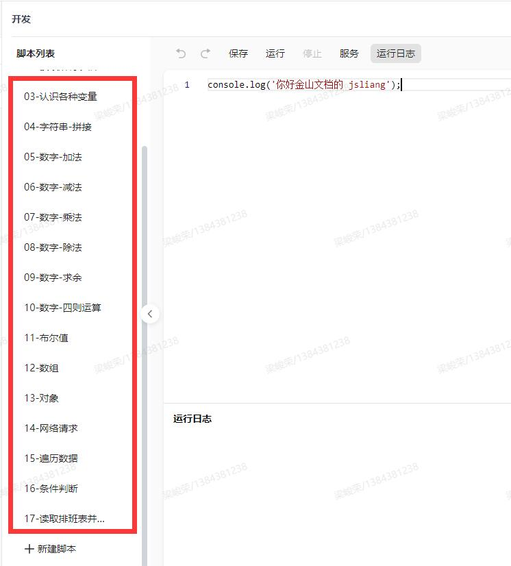

3、用了 22 张以上图片：

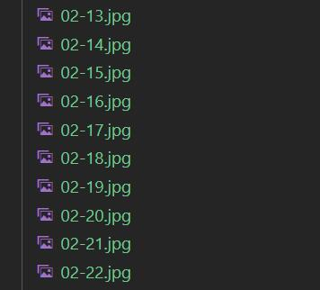

4、以及 1.9W + 字数：

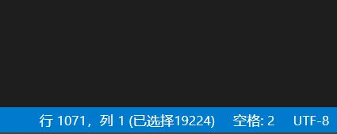

所以，可以不爱，请别伤害~

能点一下广告的点点广告，能点赞的点点赞（赞赏不奢求了，被白嫖麻了）

我们下一篇文章，将继续针对【方法-Function】，并举例一个实例，来讲解【脚本】和【自动化】能力。

OK，我们下期见~

---

**不折腾的前端，和咸鱼有什么区别！**

觉得文章不错的小伙伴欢迎点赞/点 Star。

如果小伙伴需要联系 **jsliang**：

* [Github](https://github.com/LiangJunrong/document-library)
* [掘金](https://juejin.im/user/3403743728515246)

个人联系方式存放在 Github 首页，欢迎一起折腾~

争取打造自己成为一个充满探索欲，喜欢折腾，乐于扩展自己知识面的终身学习斜杠程序员。

> jsliang 的文档库由 [梁峻荣](https://github.com/LiangJunrong) 采用 [知识共享 署名-非商业性使用-相同方式共享 4.0 国际 许可协议](http://creativecommons.org/licenses/by-nc-sa/4.0/) 进行许可。<br/>基于 [https://github.com/LiangJunrong/document-library](https://github.com/LiangJunrong/document-library) 上的作品创作。<br/>本许可协议授权之外的使用权限可以从 [https://creativecommons.org/licenses/by-nc-sa/2.5/cn/](https://creativecommons.org/licenses/by-nc-sa/2.5/cn/) 处获得。
