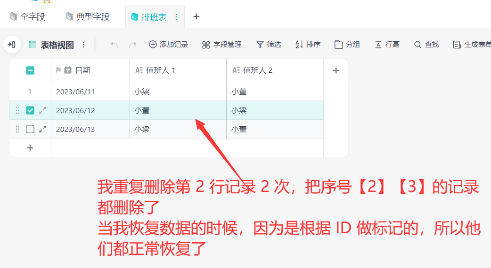
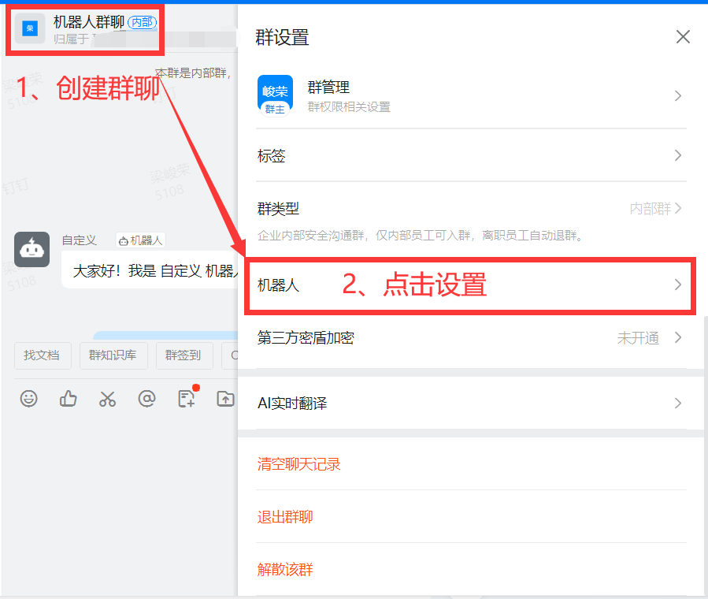
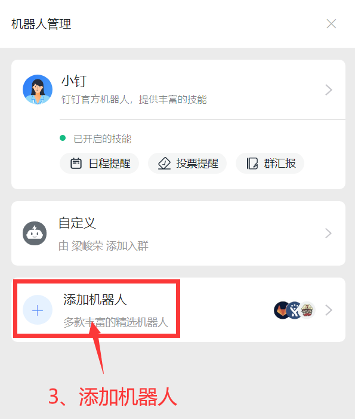
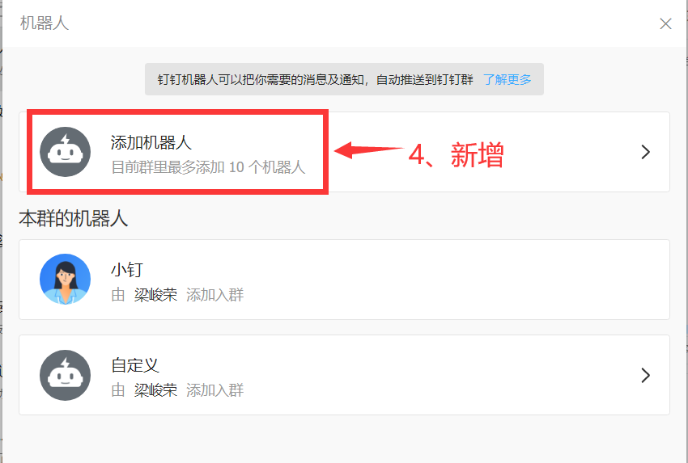
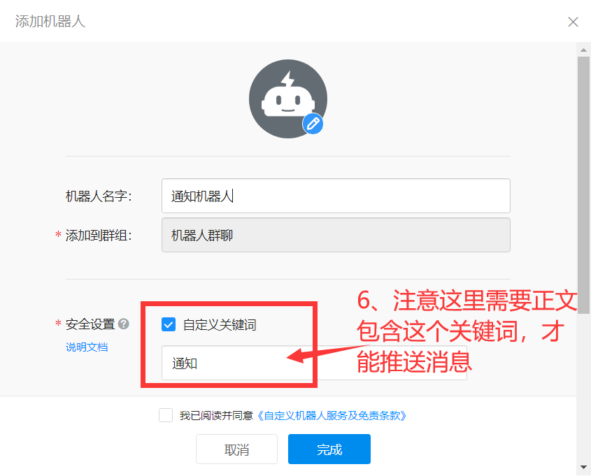
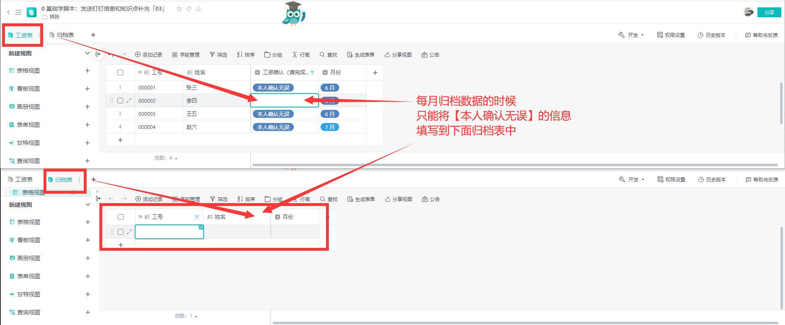

0 基础学脚本：工资归档和发送钉钉信息「03」
===

> Create by **jsliang** on **2023-06-12 21:52:39**  
> Recently revised in **2023-06-19 00:26:23**

Hello 小伙伴们早上、中午、下午、晚上、深夜好！

我是爱折腾的 **jsliang**~

本系列文章和配套视频，希望通过「轻维表」的【自动化】和【脚本】等能力，让里面数据相互流转起来，从而提升工作效率。

## 一、前言

> 感谢【超燕】【孤风月影】【战清】【番茄】【小太阳】等小伙伴的赞赏！  
> 你们的支持让我有持续更新的动力，非常感谢！

本篇文章为系列第 3 篇，将介绍下面内容：

1. 表 ID 和记录 ID 为什么是唯一的
2. 一个等号和三个等号的区别
3. `&&`、`||` 以及 `!` 和 `!!` 是什么
4. `for` 里面 `continue` 和 `break` 作用
5. 如何团队协作写代码
6. `undefined` 是什么
7. 如何发送钉钉信息
8. 如何进行工资归档，并且保证数据不重复写入

这些知识点，我们将在下面内容反复展示用法，让小伙伴们通过一个又一个的实例巩固起来，达到随手就可以写脚本的目的。

本篇文章对应的实例：

* 0 基础学脚本：发送钉钉信息和知识点补充「03」https://kdocs.cn/l/ckBAad1dxMZn

在这系列文章中：

* 如果对你有帮助，**欢迎点赞和关注**
* 如果对内容有感，**欢迎评论和私聊**
* 如果要介绍对象，**欢迎扫码加微信**

> WX: Liang123Gogo

## 二、为什么表 ID 和记录 ID 是唯一的？

为了确保表唯一和记录唯一，我们给每张表和记录定了一个特有的 ID。

就跟身份证是唯一的，哪怕双胞胎也能通过身份证区分一样，我们也可以通过唯一的 ID 来区分每张表和每条记录。

当我们删除表，或者删除记录的时候，对应的那个编号其实已然不复存在了，哪怕你看他们数据长得一模一样。



唯有这样，在【版本管理】的时候，你才不会因为数据绑定的是行号，导致恢复数据只恢复了行号对应的某一次改动记录，而是返回所有的数据。

## 三、一个等号和三个等号的区别

已知代码：

```js
const 姓名 = 'jsliang';

if (姓名 === 'jsliang') {
  console.log('进来了');
}
```

**首先**，我们看第一个 `=` 等式：

```js
const 姓名 = 'jsliang';
```

这里左边的「姓名」，在 JS 脚本中叫 “变量”；

而右边的 `'jsliang'`，在 JS 脚本中叫 “值”；

所以 `左边 = 右边`，即对一个变量赋值 `变量 = 值`，这样我们就赋予一个变量初始值了。

**然后**，我们看第二个 `===` 判断：

```js
if (姓名 === 'jsliang') {
  console.log('进来了');
}
```

在这 3 行代码中，我们判断 `姓名` 是否为 `'jsliang'`，即 `===`，就是判断左右两边是否相等的意思。

**最后**，我们总结下：

* `=`。只有 1 个等号，将右边的值赋值给左边的变量
* `===`。有 3 个等号，判断左右量表的值是否相等

## 四、条件判断 `&&`、`||`、`!` 以及 `!!`

### 4.1 `&&`

在第 2 篇文章中，我们讲解了 `if...else if...else` 的条件语句，于是有小伙伴就疑惑，如果我要同时判断多个条件呢？

```js
const 姓名 = 'jsliang';
const 年龄 = 28;

if (姓名 === 'jsliang' && 年龄 === 28) {
  console.log('111');
} else {
  console.log('222');
}
```

先不公开答案，小伙伴们可以猜测下这个打印的是 `111` 还是 `222`。

OK！

答案其实是 `111`。

我们通过 `&&` 判断的，其实就是 `A 并且 B` 的意思。

即 `A` 和 `B` 两个条件都要满足，它才能成立。

**练习题 1**：

```js
const 年龄 = 28;
const 单身 = true;

if (年龄 === 28 && !单身) {
  console.log('111');
} else if (年龄 === 28 && 单身) {
  console.log('222');
} else {
  console.log('333');
}
```

那么这道题答案是打印什么呢？

答案：`222`。

这里年龄是 `28` 没错，返回 `true`；

然后单身是布尔值，只有 `true` 才会进去，而第一个条件是 `!单身`，即 `false`，所以排除掉第一个 `if`，进入第二个条件。

**练习题 2**：

```js
const arr = [];
if (arr) {
  console.log('111');
} else {
  console.log('222');
}
```

答案：`111`。

这里需要注意的是，`arr` 是一个数组，它是有家室的。

它不像 String、Number 这些，只有赋值后才是 `true`，如果你感兴趣它的布尔状态，你应该：

```js
const arr = [];
console.log(!!arr);
```

通过两个 `!!`，我们可以强行装换这个变量为布尔值，可以看到它是打印 `true` 的。

所以我们需要修改为：

```js
const arr = [];
if (arr.length) {
  console.log('111');
} else {
  console.log('222');
}
```

这个时候，因为 `length` 变成了数字，所以条件会变成 `if (0)`，而 `0` 是 `false` 值，那肯定就进入 `222` 了。

> PS：关于 Number、String、Array、Object 判断是否为空，或者哪些情况为 true，你是否有过尝试呢？

```js
// 阶段 1
const arr = [1];
if (arr && arr[0]) {
  console.log('111');
} else {
  console.log('222');
}

// 阶段 2
const jsliang = {};
if (jsliang) {
  console.log('333');
} else {
  console.log('444');
}

// 阶段 3
const 数字 = 0;
if (!数字) {
  console.log('555');
} else {
  console.log('666');
}

// 阶段 4
const 字符串 = '';
if (!字符串) {
  console.log('777');
} else {
  console.log('888');
}
```

请判断上面 4 个阶段分别输出什么？

答案：

* 阶段 1：`111`
* 阶段 2：`333`
* 阶段 3：`555`
* 阶段 4：`777`

很多时候我们会迷惑怎么判空数据或者不了解怎么判断，通过这种尝试方式会进一步了解明白。

### 4.2 `||`

相对于 `&&`，需要所有条件都满足，那么 `||` 就是只要满足左右 2 边任意一个条件即可！

猜猜项目输出的答案：

```js
const 姓名 = 'jsliang';
const 性别 = '男';

if (姓名 === 'jsliang' || 性别 === '人妖') {
  console.log('111');
} else {
  console.log('222');
}
```

答案：输出 `111`。

就很明显，左边 `姓名 === 'jsliang'` 是满足的，所以它进来了 `111`。

练习题：

```js
const 姓名 = 'jsliang';
const 性别 = '男';
const 单身 = true;

if (姓名 === 'jsliang' && (!单身 || 性别 === '男')) {
  console.log('111');
} else {
  console.log('222');
}
```

答案：输出 `111`。

分析：运算中，碰到括号我们先看括号里面的，即 `(!单身 || 性别 === '男')`

这里的 `性别 === '男'` 是对的，所以为 `true`。

然后条件语句变成了：

```js
if (姓名 === 'jsliang' && true) {
  console.log('111');
} else {
  console.log('222');
}
```

那么很明显，`姓名 === 'jsliang' && true`，这个语句中，`&&` 左边是对的，右边是 `true`，直接进入 `111`。

### 4.3 `!` 与 `!!`

假设有下面数据：

```js
const 数字 = 0;
if (!数字) {
  console.log('111');
} else {
  console.log('222');
}
```

那么应该打印什么呢？对，就是 `111`。

`!` 读作「非」，即取变量的反，比如 `!0`，那首先 `0` 是 `false`，而 `!false` 就是 `true` 啦。

当然数字可能讲得你会迷惑，那么字符串呢？

```js
const 字符串 = 'jsliang';
if (!字符串) {
  console.log('111');
} else {
  console.log('222');
}
```

这里打印的值是 `222`，为什么？

我们看条件语句的转变：

* 步骤一：`if (!字符串)`，将 `字符串` 替换为值
* 步骤二：`if (!'jsliang')`，将 `'jsliang'` 替换为布尔值
* 步骤三：`if (!true)`，将 `true` 取反
* 步骤四：`if (false)`

可以看到，`jsliang` 是 `true` 的（如果你知道用 `!!` 来转换的话）

那么，`!true`，就是 `false` 咯，就是只有【字符串为空】的时候，才会进来 `111`，所以它才输出 `222` 了。

下面看看相反的情况：

```js
const 字符串 = '';
if (!字符串) {
  console.log('111');
} else {
  console.log('222');
}
```

这里的输出就是 `111` 了，你能理解吗？

OK！

上面说到了 `!!`，这个又是啥呢？

```js
const 姓名 = 'jsliang';
console.log(!!姓名);
// 打印 true

const 年龄 = 28;
console.log(!!年龄);
// 打印 true

const 单身 = true;
console.log(!!单身);
// 打印 true

const 女友备选 = ['小红', '小芳', '小绿'];
console.log(!!女友备选);
// 打印 true
console.log(!!女友备选.length);
// 打印 true

const jsliang = {
  "姓名": '',
  "年龄": 0,
};
console.log(!!jsliang);
// 打印 true
console.log(!!jsliang.姓名);
// 打印 false
```

看上面很容易理解：`!!` 即将一个变量的值，强行转换为布尔值。

为什么这么做呢？

因为很多小伙伴会直接判断空数组，空字符串，如果没有布尔值，我们很容易在数据判断中迷失！！！

```js
// 在数组中，如果某一项你未填写，那么它就是 undefined
// 下面数组的值相当于 [3, 2, undefined, 4]
// 这个 undefined 我们下面会反复讲
const 数组 = [3, 2, , 4];
for (let 行数 = 0; 行数 < 数组.length; 行数++) {
  console.log(数组[行数], !!数组[行数]);
  if (数组[行数]) {
    console.log('进来了');
  }
}
```

猜猜这里会打印几次 `进来了`？

答案：3 次。

这里的 `数组[2]` 是 `undefined`，然后 `!!undefined` 的布尔值是 `false`，所以不会进入打印。

假设我们改一下？

```js
// 注意看，下面的数据，是数组嵌套数组
const 数组 = [
  [1],
  [2],
  ,
  []
];

// 所以这里判断的时候，要换一下思路
for (let 行数 = 0; 行数 < 数组.length; 行数++) {
  if (
    // 这里先判断它是否没设置值，即 undefined
    数组[行数] === undefined
    // 这里再判断它是否为空数组，即长度为 0
    || 数组[行数].length === 0
  ) {
    continue;
  }

  console.log('进来了');
}
```

这里会执行 2 次 `进来了`。

## 五、梁工我差点因为删了别人代码打起来

对于代码维护，**jsliang** 应当教你们良好习惯，免得后面被吐槽：

当你需要改别人代码的时候，最好先跟别人打声招呼；

如果别人感觉不可以删，那你就先注释掉，快捷键 `Ctrl + /`，然后再写你自己的。

如果别人觉得可以删，但是你觉得有参考价值，那么还是快捷键 `Ctrl + /`，然后再写你自己的。

这样别人有异议，或者你回头想比对，就可以看 2 份代码差别。

## 六、for 循环的 `continue` 和 `break`

### 6.1 `continue`

先我们看 `continue`：

```js
// 下面函数会依次打印 0 1 3
for (let 行数 = 0; 行数 < 3; 行数++) {
  if (行数 === 2) {
    continue;
  } else {
    console.log(行数);
  }
}
```

OK，这里很容易理解，`continue` 就是跳过的意思。

它跳过了本次循环，在行数为 `2` 的时候跳过了，所以只依次打印了 `0 1 3`。

练习题：

```js
for (let 行数 = 0; 行数 < 3; 行数++) {
  let 是否判断 = false;
  if (行数 >= 1 && 行数 < 2 && !是否判断) {
    是否判断 = true;
    continue;
  } else {
    console.log(行数);
  }
}
```

答案：依次打印 `0 2`

分析：条件 `行数 >= 1 && 行数 < 2 && !是否判断`，在遍历到行数为 `1` 的时候进入。

然后将 `是否判断` 设置为 `true`，所以遍历到行数为 `2` 的时候，条件替换：

```
行数 >= 1 && 行数 < 2 && !是否判断
↓
true && true && false
```

注意此时 `!是否判断` 即 `!true`，再转换即 `false`，所以才不进入的！

### 6.2 `break`

再让我们看看 `break`，代码如下：

```js
for (let 行数 = 0; 行数 < 3; 行数++) {
  if (行数 === 1) {
    break;
  } else {
    console.log(行数);
  }
}
```

这里会依次输出 `0`。

对，因为 `行数 === 1` 的时候，我们进入了 `break`！

而 `break`，是中断的意思，即打印了 `0` 之后，到了 `1` 就被跳过了！

练习题：

```js
for (let 行数 = 0; 行数 < 4; 行数++) {
  let 是否判断 = false;
  if (行数 > 1 && 行数 < 3 && !是否判断) {
    是否判断 = true;
    break;
  } else {
    console.log(行数);
  }
}
```

答案：依次打印 `0 1`

分析：在 `if` 条件判断中，它的情况转变如下所示

```
行数为 2
↓
行数 > 1 && 行数 < 3 && !是否判断
↓
true && true && true
↓
进入 if 判断
```

在行数为 `2` 的时候，直接 `break`，导致后续不再打印

## 七、`undefined` 是什么

`undefined` 即未赋值的意思：

```js
let 姓名;
console.log(姓名);
```

在上面代码，我们只定义了变量，但是没有赋值，所以打印出来就是 `undefined`。

同样的，在数组中：

```js
const 数组 = [3, 2, , 4];
console.log(数组[2]);
```

这一个打印出来也是 `undefined`，因为数组规定没赋值的就是 `undefined`。

再同样的，在对象中：

```js
const 对象 = {
  "姓名": 'jsliang',
};
console.log(对象["年龄"]);
```

这里打印的还是 `undefined`，因为对象不存在【年龄】这个字段，而为赋值的字段，就是 `undefined`。

练习题：

```js
// 已知材料信息维护表 3 条数据：
// { 姓名: 'jsliang' }
// { }
// { 姓名: '梁峻荣' }
const 姓名表信息 = Application.Record.GetRecords({
  SheetId: 姓名表信息ID,
});
const 姓名表数据 = 姓名表信息.records;

// 请判断有姓名的时候，打印出姓名
// 否则通过 continue 跳过循环
```

答案：

```js
const 姓名表信息 = Application.Record.GetRecords({
  SheetId: 姓名表信息ID,
});
const 姓名表数据 = 姓名表信息.records;

for (let 行数 = 0; 行数 < 姓名表数据.length; 行数++) {
  const 姓名表单条数据 = 姓名表数据[行数];
  const 本条信息的姓名 = 姓名表单条数据.姓名;
  
  // 因为 undefined 是 false，所以 !false 就进入这里
  if (!本条信息的姓名) {
    continue;
  }

  console.log('姓名: ', 本条信息的姓名);
}
```

## 八、如何实现钉钉推送信息？

其实钉钉的操作和企业微信类似，通过下面步骤可以获取到钉钉的 webhook：

> Step 1：进入机器人界面



> Step 2：添加机器人





> Step 3：找到自定义机器人并获取到 webhook 地址





注意：在这时候就可以直接上脚本，操作方式和之前企业微信类似，但是需要加上相应关键词才能通知！

如上图所示我们的消息内容，只有带「通知」字样才能发送，所以我们填写信息的时候需要带「通知」：

```js
// 这里的地址，通过教程里面流程获取
const 钉钉机器人地址 = '这里是你的 Webhook 地址';

// 封装的方法：发送文本信息
const 发送文本信息 = function(文本) {
  HTTP.post(钉钉机器人地址, {
    "msgtype": "text",
    "text": {
      "content": 文本
    },
  });
};

发送文本信息('通知：你好 jsliang/梁峻荣');
```

OK，这样就可以给钉钉机器人发送信息了！

参考文献：

* 杨浩 - 轻微表+钉钉群 实现任务自动推送到期提醒等场景：https://home.wps.cn/topic/1032
* 钉钉开放平台：https://open.dingtalk.com/document/orgapp/robot-message-types-and-data-format

## 九、如何进行工资归档，并且保证数据不重复写入

有一位小伙伴咨询，如何确保工资确认的数据，不被重复写入到表中呢？

* 0 基础学脚本：工资归档和发送钉钉信息「03」https://kdocs.cn/l/ckBAad1dxMZn

它的表数据结构长这样：



OK，那么怎样才能让每次点击运行脚本，会把已确认数据填写进去，并且每次运行，只会填写 “之前尚未填入” 的数据。

注意：这里填写的数据，还要区分月份的！

```js
const 所有表数据 = Application.Sheet.GetSheets();

let 工资表ID;
let 归档表ID;

// 步骤一：遍历取到需要的信息
for (let i = 0; i < 所有表数据.length; i++) {
  const 本次查询表信息 = 所有表数据[i];
  
  const 表名称 = 本次查询表信息.name;
  const 表ID = 本次查询表信息.id;

  if (表名称 === '工资表') {
    工资表ID = 表ID;
  }
  if (表名称 === '归档表') {
    归档表ID = 表ID;
  }
}

console.log('工资表ID: ', 工资表ID);
console.log('归档表ID: ', 归档表ID);

// 步骤二：获取到【工资表】和【归档表】的数据
const 工资表信息 = Application.Record.GetRecords({
  SheetId: 工资表ID,
});
const 工资表数据 = 工资表信息.records;
// console.log('工资表数据: ', 工资表数据);

const 归档表信息 = Application.Record.GetRecords({
  SheetId: 归档表ID,
});
const 归档表数据 = 归档表信息.records;
// console.log('归档表数据: ', 归档表数据);

// 步骤三：获取本月时间
const 本月月份 = String(new Date().getMonth() + 1) + " 月";
// console.log('本月月份: ', 本月月份);

// 步骤四：获取到已归档的工号列表
const 归档表已有工号 = [];
for (let 行数 = 0; 行数 < 归档表数据.length; 行数++) {
  const 归档表单条数据 = 归档表数据[行数].fields;

  // 必须是本月的工资
  const 归档表月份 = 归档表单条数据["月份"];
  if (归档表月份 !== 本月月份) {
    continue;
  }

  归档表已有工号.push(归档表单条数据["工号"]);
}
console.log('归档表已有工号: ', 归档表已有工号);

// 步骤五：遍历所有员工的确认情况，写入信息到归档表
for (let i = 0; i < 工资表数据.length; i++) {
  const 工资表单条数据 = 工资表数据[i].fields;
  console.log('工资表单条数据: ', 工资表单条数据);
  
  // 必须是本月的工资
  const 工资表月份 = 工资表单条数据["月份"];
  if (工资表月份 !== 本月月份) {
    continue;
  }

  // 必须是未填写过的数据
  const 工资表工号 = 工资表单条数据["工号"];
  if (归档表已有工号.includes(工资表工号)) {
    continue;
  }

  // 只有打钩的才进行覆盖
  if (工资表单条数据["工资确认（请完成确认并打钩提交）"]) {
    Application.Record.CreateRecords({
      SheetId: 归档表ID,
      Records: [{
        fields: {
          "姓名": 工资表单条数据["姓名"],
          "工号": 工资表工号,
          "月份": 工资表月份,
        }
      }]
    })
  }

}
```

所以我们通过上面 5 个步骤即可解决问题，是不是非常简单~

## 十、总结

在这篇文章中，我们对前面的知识点进行了回顾加强，并且操作了发送钉钉信息和工资归档 2 个小实例。

小伙伴们千万记得：「正如读书破万卷一样，代码是用来敲的，多敲才有多理解」

我们碰到问题的时候，可以多进行打印：

```js
console.log('xxx: ', xxx);
```

然后逐步逐步看自己代码哪里有问题，怎么进行修改。

那么，本篇文章先到这里，如果你有更多问题，欢迎私聊我进一步沟通，欢迎你们的每一个实例~

本人 WX: Liang123Gogo

---

**不折腾的前端，和咸鱼有什么区别！**

觉得文章不错的小伙伴欢迎点赞/点 Star。

如果小伙伴需要联系 **jsliang**：

* [Github](https://github.com/LiangJunrong/document-library)
* [掘金](https://juejin.im/user/3403743728515246)

个人联系方式存放在 Github 首页，欢迎一起折腾~

争取打造自己成为一个充满探索欲，喜欢折腾，乐于扩展自己知识面的终身学习斜杠程序员。

> jsliang 的文档库由 [梁峻荣](https://github.com/LiangJunrong) 采用 [知识共享 署名-非商业性使用-相同方式共享 4.0 国际 许可协议](http://creativecommons.org/licenses/by-nc-sa/4.0/) 进行许可。<br/>基于 [https://github.com/LiangJunrong/document-library](https://github.com/LiangJunrong/document-library) 上的作品创作。<br/>本许可协议授权之外的使用权限可以从 [https://creativecommons.org/licenses/by-nc-sa/2.5/cn/](https://creativecommons.org/licenses/by-nc-sa/2.5/cn/) 处获得。
