0 基础学脚本：项目管理表的维护及通过脚本管理员工和物资「04」
===

> Create by **jsliang** on **2023-06-18 23:06:11**  
> Recently revised in **2023-06-18 23:06:11**

Hello 小伙伴们早上、中午、下午、晚上、深夜好！

我是爱折腾的 **jsliang**~

本系列文章和配套视频，希望通过「轻维表」的【自动化】和【脚本】等能力，让金山文档的数据相互流转起来，从而提升工作效率。

## 一、前言

> 上篇文章感谢【超燕】小伙伴的赞赏~  
> 你们的每一次赞赏、点赞和转发，都是我更新的动力，非常感谢！

本篇文章为系列第 4 篇，字数约 3.3w，将介绍下面内容：

1. 调整网页样式，修改脚本弹窗大小
2. 轻维表跨表操作
   1. 读取文件夹
   2. 读写表格
   3. 读写轻表格
3. 函数及轻维表增删改查
4. 实例：合并地址信息
5. 实例：维护项目管理表

这些知识点，我们将编写海量代码，让小伙伴们通过一个又一个的实例巩固起来，达到随手就可以写脚本的目的。

本篇文章涉及的案例文档：

1. 《0 基础学脚本：【表格】读取文件夹或者读取其他文件「04」》https://kdocs.cn/l/chaIIYuXVQYJ
2. 《0 基础学脚本：【轻表格】读取文件夹或者读取其他文件「04」》https://kdocs.cn/l/cg7ew4TliH7L
3. 《0 基础学脚本：读取文件夹或者读取其他文件「04」》https://kdocs.cn/l/cuWv5JjJty8y
4. 《0 基础学脚本：项目管理表的维护及通过脚本管理员工和物资「04」》https://kdocs.cn/l/cePlEOt65mIW
5. 《0 基础学脚本：合并地址信息「04」》https://kdocs.cn/l/crMOLbPMBREJ

在这系列文章中：

* 如果对你有帮助，**欢迎点赞和关注**
* 如果对内容有感，**欢迎评论和私聊**
* 如果要介绍妹子，**欢迎扫码加微信**

> WX: Liang123Gogo

## 二、网页小知识：如何调整界面


在【自动化】讨论群聊上，有小伙伴吐槽脚本弹窗太窄，并希望：

* 如何让脚本弹窗宽一点？

很简单啊！三个步骤教会你如何操作界面的样式（CSS）：

> 步骤一：通过 F12 或者更多菜单，打开【控制台】

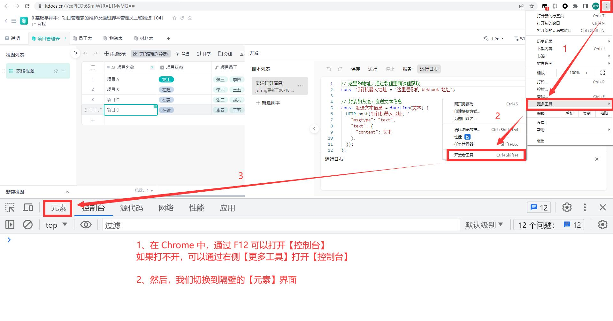

> 步骤二：通过 箭头按钮 来查找元素，这里操作要仔细

如果实在找不到，可以 Ctrl + F，然后输入 `command-bar-container` 去查找（不推荐，这样下次换一个你就不知道怎么找了）

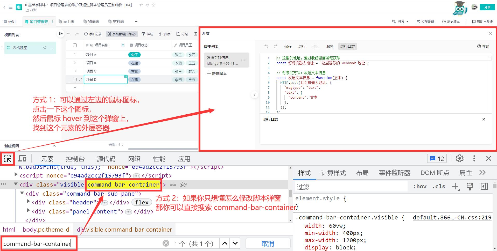

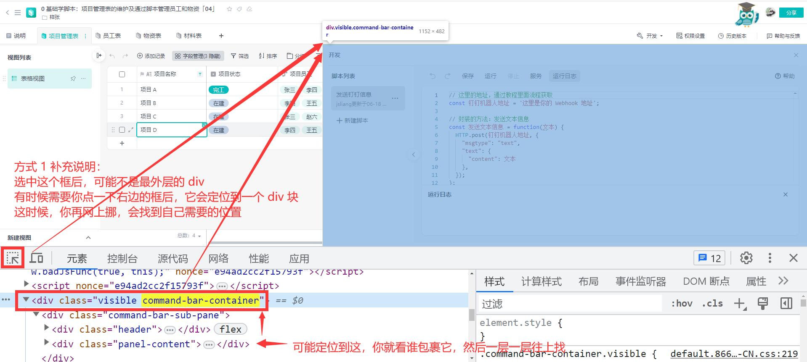

> 步骤三：将样式填写到 `element.style` 即可铺满全屏

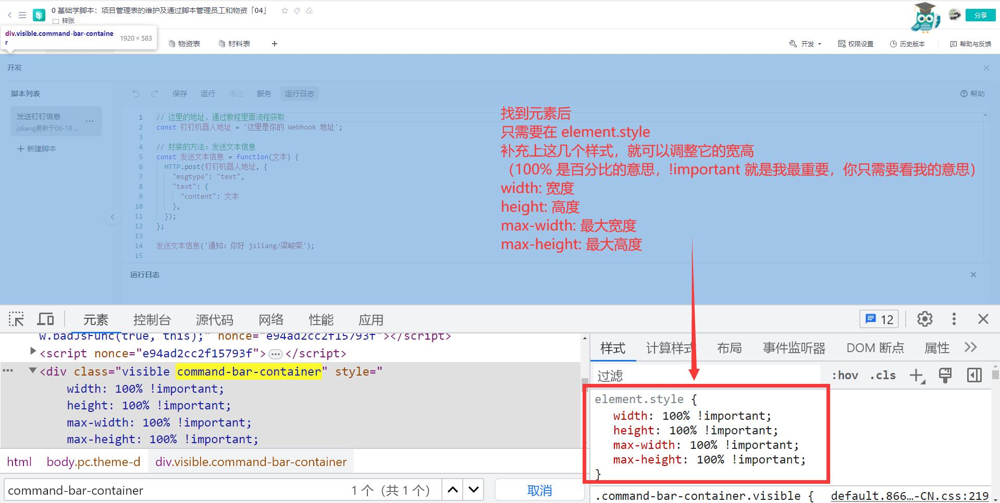

加上 `top` 和 `z-index` 的设置，可以铺满全屏

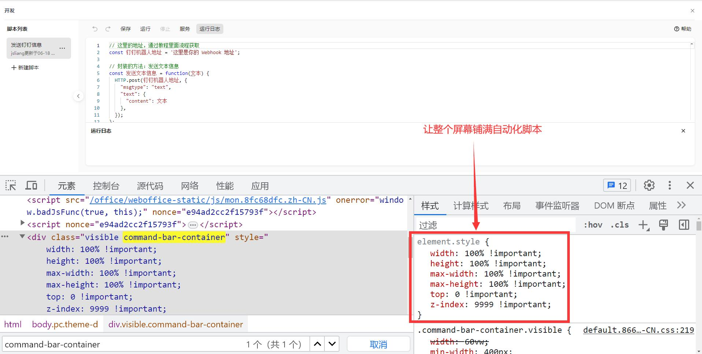

样式代码：

```css
element.style {
  width: 100% !important;
  height: 100% !important;
  max-width: 100% !important;
  max-height: 100% !important;
  top: 0 !important;
  z-index: 9999 !important;
}
```

掌握了这一套写法之后，如果后面碰到不如意的样式，可以定位过去，并通过 CSS 进行修改。

当然，如果小伙伴嫌麻烦，还可以在控制台输入下面脚本并回车：

> 【控制台】指上述中文版按 F12 出来的控制台，英文版叫【Console】

```js
document.querySelector('.command-bar-container').style.width = '100%';
document.querySelector('.command-bar-container').style.maxWidth = '100%';
document.querySelector('.command-bar-container').style.height = '100%';
document.querySelector('.command-bar-container').style.maxHeight = '100%';
document.querySelector('.command-bar-container').style.top = 0;
document.querySelector('.command-bar-container').style.zIndex = 9999;
```

## 三、轻维表跨表：操作其他轻维表、轻表格和表格

有没有小伙伴还记得，**jsliang** 说过：

* 数据是互通的，我们通过脚本可以跨表读取信息，或者读取整个文件夹的数据

现在，它来了！

让我们愉快的耍起来吧~

### 3.1 读取指定文件夹及当中某个轻维表

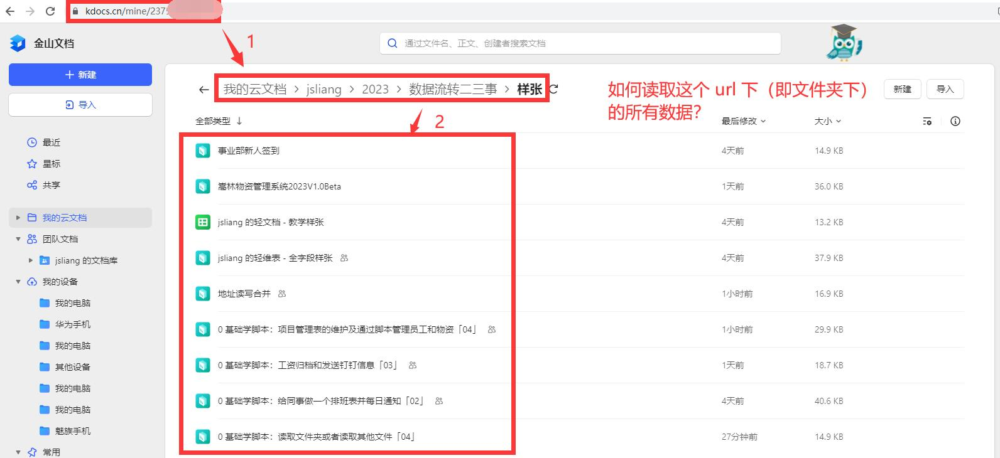

以 **jsliang** 编写教程常用的样张文档举例，一般我们打开这个文件夹，会看到有个指定的 `url`。

通过这个 `url`，我们就可以耍起来了！

在这之前，我们需要先了解：

* **跨表或者读取文件，是需要申请服务的**

所以需要按照下面步骤先给你的脚本申请服务。

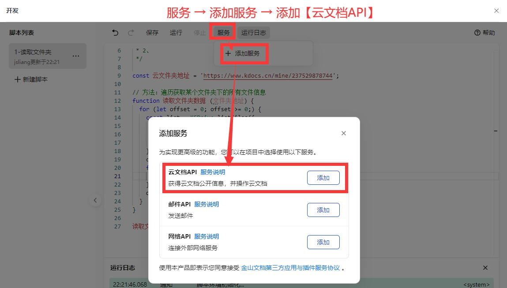

然后复制下面 JS 代码，修改里面的 `TODO`（搜索脚本中 TODO 字样并修改之），【运行】即可：

```js
/**
 * @author jsliang/liangjunrong
 * @description
 * 参考文献：https://airsheet.wps.cn/docs/api/advanced/KSDrive.html#filesinfo
 */

// 这里定义好我的云文件夹地址和需要获取的指定文件名及其信息
const 云文件夹地址 = 'https://www.kdocs.cn/mine/你的脚本地址'; // TODO:
const 指定文件名 = '0 基础学脚本：项目管理表的维护及通过脚本管理员工和物资「04」'; // TODO:
let 指定文件信息;

// 遍历获取某个文件夹下的所有文件信息
let 是否还有下一批数据 = 0; // 每 100 个文件为一批
while (是否还有下一批数据 >= 0) {
  const list = KSDrive.listFiles({
    dirUrl: 云文件夹地址,
    offset: 是否还有下一批数据,
    count: 100,
  });
  const 文件列表 = list.files;
  
  // 遍历，查找指定文件
  for (let 当前文件索引 = 0; 当前文件索引 < 文件列表.length; 当前文件索引++) {
    const 当前文件信息 = 文件列表[当前文件索引];
    const 当前文件名 = 当前文件信息.fileName;

    // includes 是 String（字符串）类型数据的一个方法
    // 用来判断这个字符串里面是否包含子串字符串，比如 nihao 里面包含了 hao
    // 就可以通过 'nihao'.includes('hao') 来判断，返回 true
    if (当前文件名.includes(指定文件名)) {
      指定文件信息 = 当前文件信息;

      // 找到了就退出循环，节省性能，提升脚本速度
      break;
    }
  }

  // 这个是用来判断是否还有下一批文件的（每次读取 100 个文件，超过就要循环读取）
  是否还有下一批数据 = list.nextOffset;
}

// 打开这个文件，因为 ta 是轻维表，所以我们用轻维表的脚本
const 指定文件 = KSDrive.openFile(指定文件信息);

// 一般来说，我们读取当前文件，是通过 Application 来开头
// 但是因为要读取指定文件的，所以在前面要通过【指定文件.Application】告诉脚本我们不是读取当前文件的
const 所有表数据 = Application.Sheet.GetSheets();
console.log('所有表数据: ', 所有表数据);

// 【谨记】最后要关闭文件，要不然它会一直打开，这样下次你就没法使用了
指定文件.close();
```

这样我们就可以成功读取信息：

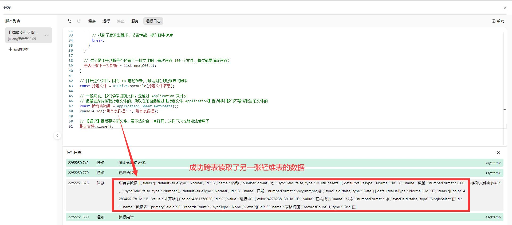

代码详细意图我就不一一解释了，毕竟里面没有新鲜知识点~

> 如果你对某一端代码不了解，你可以通过 `console.log` 直接将信息打印出来

### 3.2 读取指定文件

在上面，我们是通过文件夹信息，找到对应文件并读取。

那么，我们有办法直接读取用户发送过来的指定文件吗？

答案当然是可以的！

**首先**，我们需要和 3.1 一样，先获取到【云文档 API】服务。

**然后**，我们编写下述脚本：

```js
/**
 * @author jsliang/liangjunrong
 * @description
 * 参考文献：https://airsheet.wps.cn/docs/api/advanced/KSDrive.html#%E7%A4%BA%E4%BE%8B
 */

// 我们每天要操作指定的文件列表
const 指定文件列表 = [
  // 0 基础学脚本：工资归档和发送钉钉信息「03」
  'https://kdocs.cn/l/ckBAad1dxMZn',
  // 0 基础学脚本：给同事做一个排班表并每日通知「02」
  'https://kdocs.cn/l/cpPbvz32LSxB',
];

/* ------ 第一次读取 ------ */

const 工资归档和发送钉钉信息URL = 指定文件列表[0];

// 每个文件，都可以通过 KSDrive.openFile('文件地址') 打开
// 它返回一个对应的文件信息
const 文件1 = KSDrive.openFile(工资归档和发送钉钉信息URL);

// 这里的 1 是【工资表】的 ID，通过遍历所有表并获取到（详细操作看之前文章）
// 正常情况我们直接通过 Application.xxx 去操作，表示操作本文件
// 如果要操作其他文件，那就应该是 其他文件.Application，所以要通过 KSDrive.openFile 打开
const 工资表信息 = 文件1.Application.Record.GetRecords({ SheetId: 1 }).records;
console.log('工资表信息: ', 工资表信息);

// 使用结束之后调用 close 关闭文档，否则无法再次调用 KSDrive.openFile
// 这里如果不进行 close，下面读取另一张表就会失败
文件1.close();

/* ------ 第二次读取 ------ */

const 给同事做一个排班表并每日通知URL = 指定文件列表[1];
const 文件2 = KSDrive.openFile(给同事做一个排班表并每日通知URL);
const 排班表信息 = 文件2.Application.Record.GetRecords({ SheetId: 6 }).records;
console.log('排班表信息: ', 排班表信息);
文件2.close();
```

**最后**，我们【运行】一下脚本：

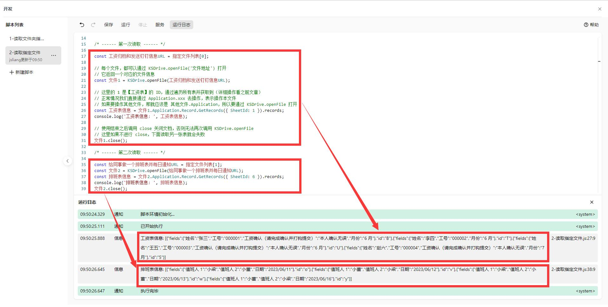

### 3.3 读写表格

工欲善其事，必先利其器。

在读取表格之前，我们需要先理解：

* 轻维表和表格的 JSAPI 是不同的！

这说明什么呢？

参考文档：https://airsheet.wps.cn/docs/api/excel/overview.html

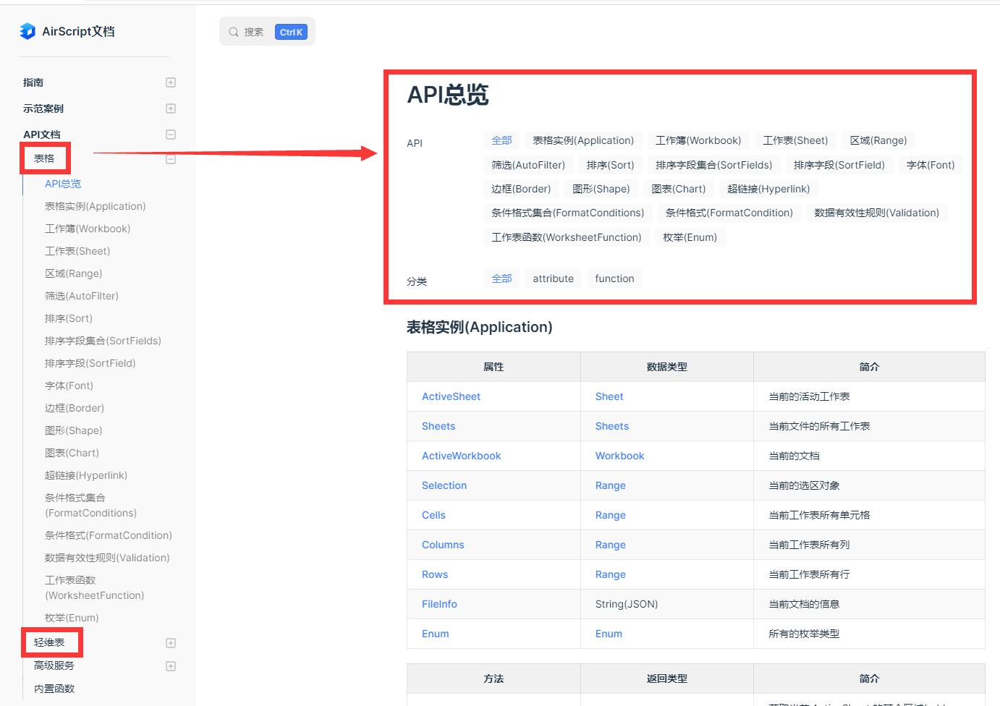

说明 2 者调用方式不一样了！

我们可以把表格想象成二维数据。

即需要通过 `X.Y` 的形式，获取到第 `X` 行，第 `Y` 列的数据。

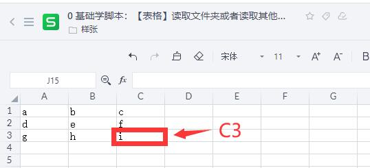

```js
// 打开【0 基础学脚本：表格-读取文件夹或者读取其他文件「04」】
const 文件 = KSDrive.openFile('https://kdocs.cn/l/chaIIYuXVQYJ');
const 单元格A1 = 文件.Application.Range('A1').Text;

// 单元格A1: a
console.log('单元格A1: ', 单元格A1);

// 使用结束之后调用 close 关闭文档，否则无法再次调用 KSDrive.openFile
文件.close();
```

在上面代码中，我们获取到了 `A1` 单元格的数据。

这很容易理解，即 `Application.Range('XY').Text` 形式，可以获取到某个单元格的值。

那，假设我们需要往 `D4` 单元格写入数据呢？

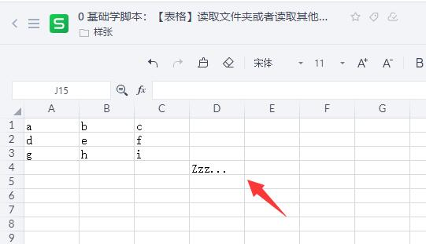

```js
// 打开【0 基础学脚本：表格-读取文件夹或者读取其他文件「04」】
const 文件 = KSDrive.openFile('https://kdocs.cn/l/chaIIYuXVQYJ');

// 注意，写入是通过 .Value = '' 来写
文件.Application.Range('D4').Value = 'Zzz...';

// 注意，读取是通过 .Text 来读取
const 单元格D4 = 文件.Application.Range('D4').Text;
console.log('单元格D4: ', 单元格D4);

// 使用结束之后调用 close 关闭文档，否则无法再次调用 KSDrive.openFile
文件.close();
```

看到这里小伙伴们会疑惑，为什么表格的单元格读写形式，和轻维表不一样。

这是因为先有表格后有轻维表，而表格的这一套 JSAPI 历史包袱比较重，所以才有这样的问题。

### 3.4 读写轻表格

众所周知，轻表格分【工作表】和【数据表】。

而当中的【工作表】，用的是【表格】的 JSAPI。

那假如我们要读取已知的被使用的数据：

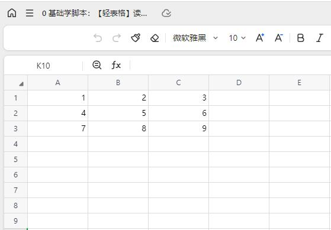

```js
// 打开【0 基础学脚本：轻表格-读取文件夹或者读取其他文件「04」】
const 文件 = KSDrive.openFile('https://kdocs.cn/l/cg7ew4TliH7L');

// 获取打开文件的所有表
let 所有表 = 文件.Application.Sheets;

// 找到对应的【工作表1】
const 查找表名 = '工作表1';
let 查找结果;
// 参考文献 1: https://airsheet.wps.cn/docs/api/excel/Application.html#sheets
// 参考文献 2: https://airsheet.wps.cn/docs/api/excel/Sheet.html
for (let i = 1; i <= 所有表.Count; i++) {
  const 当前表 = 所有表.Item(i);
  const 当前表名 = 所有表.Item(i).Name;
  if (当前表名 === 查找表名) {
    查找结果 = 当前表;
  }
}
const 读取的表 = 文件.Application.Sheets(查找结果.Index);

// 使用范围
const 使用范围 = 读取的表.UsedRange;
const 开始行 = 使用范围.Row;
const 结束行 = 使用范围.RowEnd;
const 开始列 = 使用范围.Column;
const 结束列 = 使用范围.ColumnEnd;

console.log('开始行: ', 开始行);
console.log('结束行: ', 结束行);
console.log('开始列: ', 开始列);
console.log('结束列: ', 结束列);

// 如何读取一个二维表格
// 从【开始行】到【结束行】进行遍历
for (let 行号 = 开始行; 行号 <= 结束行; 行号++) {
  const 行信息 = 文件.Application.ActiveSheet.Rows(行号);

  // 从【开始列】到【结束列】进行遍历
  for (let 列号 = 开始列; 列号 <= 结束列; 列号++) {
    const 列信息 = 行信息.Columns(列号);

    // 上面列信息，通过 ActiveSheet.Rows(行号).Columns(列号) 读取到了
    const 单元格信息 = 列信息.Text;
    console.log(行号 + '行-' + 列号 + '列: ' + 单元格信息);
  }
}
```

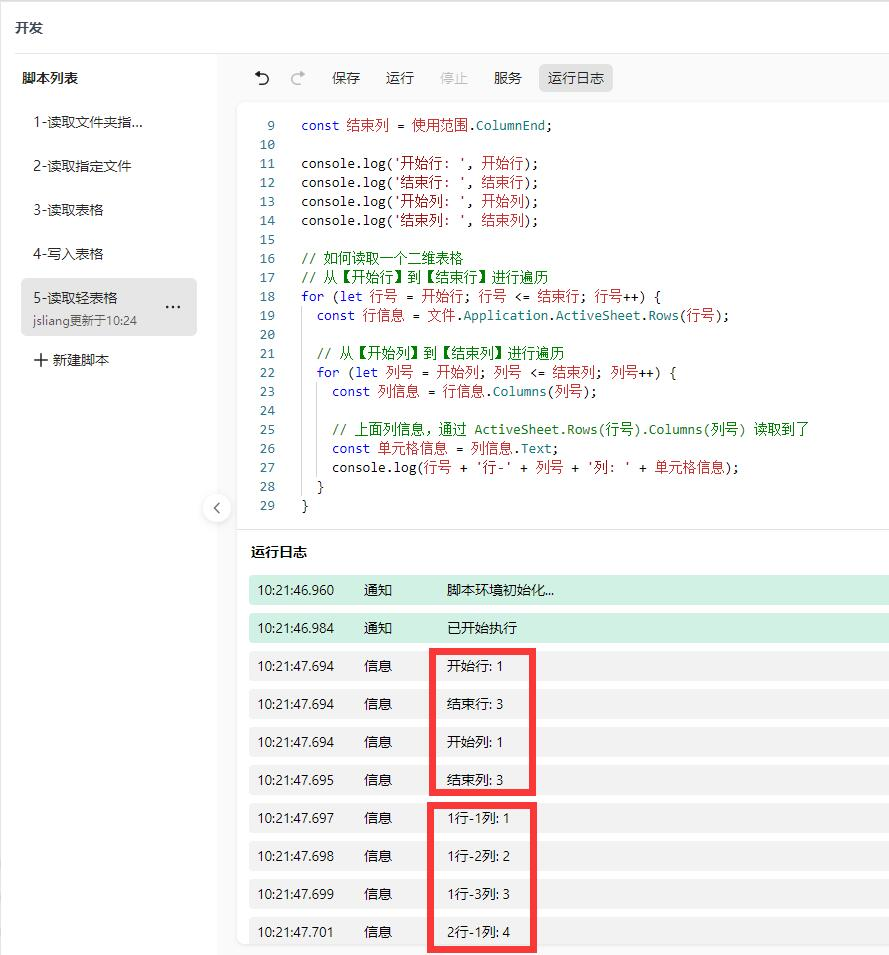

当然，上面我们演示了读取【工作表】的数据，写入方式和表格一样，也是通过 `单元格.Value = 'String'` 形式。

### 3.5 读写轻表格的数据表

在上面我们操作了【工作表】，那么怎么操作数据表呢？

思路很简单：

```js
// 打开【0 基础学脚本：轻表格-读取文件夹或者读取其他文件「04」】
const 文件 = KSDrive.openFile('https://kdocs.cn/l/cg7ew4TliH7L');

// 获取打开文件的所有表
let 所有表 = 文件.Application.Sheets;

// 找到对应的【数据表1】
const 查找表名 = '数据表1';
let 查找结果;
// 参考文献 1: https://airsheet.wps.cn/docs/api/excel/Application.html#sheets
// 参考文献 2: https://airsheet.wps.cn/docs/api/excel/Sheet.html
for (let i = 1; i <= 所有表.Count; i++) {
  const 当前表 = 所有表.Item(i);
  const 当前表名 = 所有表.Item(i).Name;
  if (当前表名 === 查找表名) {
    查找结果 = 当前表;
  }
}
const 读取的表 = 文件.Application.Sheets(查找结果.Index);

// 参考文献：https://kdocs.cn/l/ctzsgDlAGF0l?linkname=PpHAGnTCor
const 行信息 = 读取的表.Record.GetRecords();
console.log('行信息: ', 行信息);
```

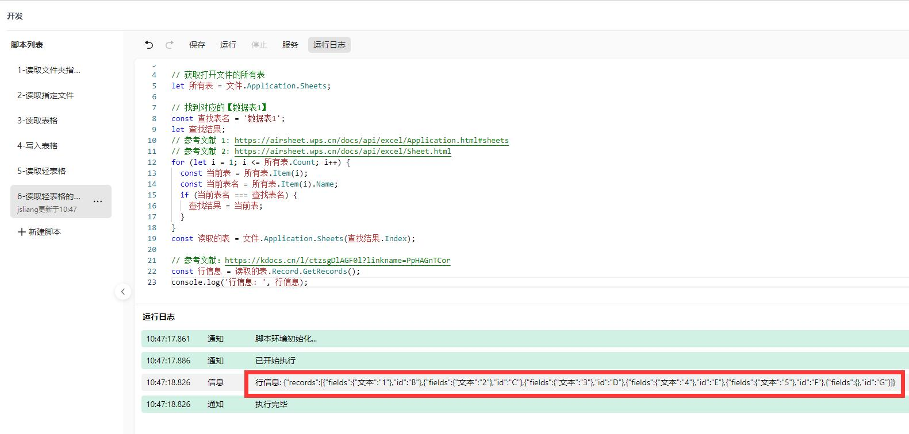

记住！现在操作的是【轻表格】，所以有一些【轻维表】的功能被限制了，例如：

* 获取所有表：`Application.Sheet.GetSheets()`

就相当于你通过 `Sheet(Index)` 取到了对应的这张表，然后进行操作。

> 注：轻表格中的数据表，具备哪些轻维表能力，你就可以用哪些 JSAPI，否则不能使用

## 四、新知识：函数及轻维表增删改查

在前面内容中，我们经常接触：

* `Application.Sheet.GetSheets()`
* `[1].includes(2)`
* `new Date()`
* ……

而这些操作，就叫**函数**（也叫**方法**）。

> MDN：https://developer.mozilla.org/zh-CN/docs/Web/JavaScript/Guide/Functions

### 4.1 定义和调用函数

在脚本（即 JavaScript）中，我们有 2 种定义函数的方式。

> 类型 1：箭头函数

在箭头函数中，一般以 `函数名 = (参数) => 函数体` 的形式存在：

```js
const jsliang = {
  "name": "jsliang",
  "age": 28,
};

// getName 即函数名
// (ojb) 小括号里面的是参数
// {} 包裹的是函数体
const getName = (obj) => {
  return obj.name;
};

// 通过 getName() 即可调用函数
// () 小括号里面的即需要传递的参数
const name = getName(jsliang);
// 输出 '姓名: jsliang'
console.log('姓名: ', name);
```

如果一个函数，里面有 `return`，那么它会把你需要的内容返回出来。

如上面代码，就返回了 `obj.name`。

我们调用的 `obj` 是 `const jsliang`，所以返回 `jsliang.name`，即输出：`'姓名: jsliang'`。

> 类型 2：普通函数

```js
const jsliang = {
  "name": "jsliang",
  "age": 28,
};

// 普通函数以 function 开头
// getName 即它的函数名
// () 小括号里面的是它的参数，需要和调用的时候保持一致
// {} 大括号里面的是函数体，即里面做的内容
funciton getName (obj) {
  const 明年岁数 = ojb.age + 1;
  console.log('明年岁数: ', 明年岁数);
}

// 通过 getName() 即可调用函数
// () 小括号里面的即需要传递的参数
// 这个函数没有 return，它会在里面打印
// 输出结果：【明年岁数: 29】
const name = getName(jsliang);
// 输出 '姓名: undefined'
console.log('姓名: ', name);
```

在上面这个普通函数上，就没有返回值，所以返回 `undefined`，就跟函数未定义时候的值一样。

这种没有返回值的，一切操作都在里面，不返回任何数据。

### 4.2 内置函数

在我们第 3 篇文章中，我们有用过 `new Date().getMonth() + 1` 来获取月份：

* 0 基础学脚本：工资归档和发送钉钉信息「03」https://kdocs.cn/l/ckBAad1dxMZn

这里的 `new Date()` 是一个叫内置函数的东西，它在 F12 出来的控制台输出长这样：

（含有 `[native code]` 字样）

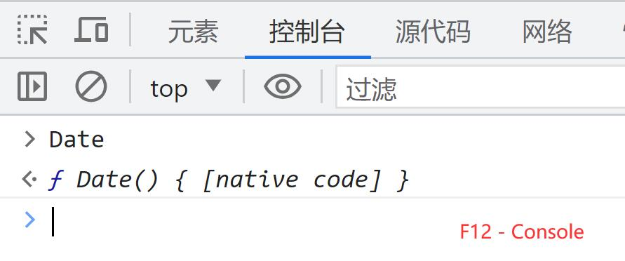

比如日期函数，它的内部结构大概样子：

```js
class Date {
  // 获取年份
  getFullYear() {

  }
  // 获取月份
  getMonth() {

  }
  // ......更多
}
```

上面提到了一个关键字，叫 `class`。

这里我们可以把它当成一个 **对象** 看待。

`class` 的调用方式就是 `new Class()`，所以就有了 `new Date()`。

> 注：你将 `class Date {}` 看做是 `const Date {}` 也是可以的，你可以理解为它们的调用方式不一样，后续不会讲解 `class`，所以不需要特别了解。

然后 `new Date()` 会返回这个 **对象** 里面包含的方法，比如获取年份的 `getFullYear`。

**当然**！

我们之前看到的 `[1].includes(2)`，这个 `includes` 也是一个内置函数：

```js
class Array {
  // 判断数组是否包含参数里面的内容
  includes(args) {

  }
  // ......更多
}
```

* 参考文献：https://developer.mozilla.org/zh-CN/docs/Web/JavaScript/Reference/Global_Objects/Array/includes

不仅仅【数组】有内置函数，其他的【字符串】【数字】等也有内置函数。

感兴趣的小伙伴可以参考：

* 数组： https://developer.mozilla.org/zh-CN/docs/Web/JavaScript/Reference/Global_Objects/Array
* 字符串： https://developer.mozilla.org/zh-CN/docs/Web/JavaScript/Reference/Global_Objects/String
* 数字： https://developer.mozilla.org/zh-CN/docs/Web/JavaScript/Reference/Global_Objects/Number
* 对象： https://developer.mozilla.org/zh-CN/docs/Web/JavaScript/Reference/Global_Objects/Object
* 布尔值： https://developer.mozilla.org/zh-CN/docs/Web/JavaScript/Reference/Global_Objects/Boolean

很好，理解到这里，下面我们封装一套时间相关的实用函数吧！

### 4.3 封装时间函数

**首先**，我们封装一个能获取年月日的方法：

```js
// 默认为当前时间
const 获取年月日时分秒 = (data = new Date()) => {
  return {
    "年": date.getFullYear(),
    "月": date.getMonth() + 1,
    "日": date.getDate(),
    "时": date.getHours(),
    "分": date.getMinutes(),
    "秒": date.getSeconds(),
    "星期": date.getDay() === 0 ? 7 : date.getDay(),
  };
};
```

这里注意一个叫做默认参数的东西：

* `(data = new Date())`

在这个小括号里面，我们给 `date` 设置了一个默认参数，它等于当前时间（即 `new Date()`）

当然，它可以理解为下面代码：

```js
const 获取年月日时分秒 = (data) => {
  let 时间;
  if (!date) {
    时间 = new Date();
  }
  // 这里的时间即没有进行 data = new Date() 的值
  // 所以有时候默认值比较好用
};
```

封装完毕之后，肯定要调用，比如我们需要获取 `yyyy/mm/dd HH:MM:SS` 格式：

```js
// 下面这一行代码，相当于几行代码的简写
// const { A, B } = { A, B, C }; 这种方式叫对象解构，即通过这种形式获取到对象中的一些字段（需要什么就获取什么）
// const [a, b] = [1, 2, 3]; 这种方式是数组结构，a 的值是 1，b 的值是 2
/*
const 时间 = 获取年月日时分秒();
const 年 = 时间.年;
const 月 = 时间.月;
const 日 = 时间.日;
const 时 = 时间.时;
const 分 = 时间.分;
const 秒 = 时间.秒;
*/
const { 年, 月, 日, 时, 分, 秒 } = 获取年月日时分秒();

// 这里的 年 其实是个 Number，我们需要转 String 才能进行字符串拼接
// 这里的 'String'.padStart(2, '0') 相当于月份为 1 的时候，我们补一个前置 0
// https://developer.mozilla.org/zh-CN/docs/Web/JavaScript/Reference/Global_Objects/String/padStart
// padStart 是字符串的一个内置函数
const 年月日 = String(年) + '/' + String(月).padStart(2, '0') + '/' + String(日).padStart(2, '0');
const 时分秒 = String(时).padStart(2, '0') + ':' + String(分).padStart(2, '0') + ':' + String(秒).padStart(2, '0');
console.log('年月日时分秒: ', 年月日 + ' ' + 时分秒);
```

**然后**，我们封装一个判断是否为 2023 法定节假日的方法：

```js
const 获取年月日时分秒 = (date = new Date()) => {
  return {
    "年": date.getFullYear(),
    "月": date.getMonth() + 1,
    "日": date.getDate(),
    "时": date.getHours(),
    "分": date.getMinutes(),
    "秒": date.getSeconds(),
    "星期": date.getDay() === 0 ? 7 : date.getDay(),
  };
};

const 国家法定日期 = {
  '2023': {
    // 法定节假日
    holiday: [
      '4/5',
      '4/29', '4/30', '5/1', '5/2', '5/3',
      '6/22', '6/23', '6/24',
      '9/29', '9/30', '10/1', '10/2', '10/3', '10/4', '10/5', '10/6',
    ],
    // 法定工作日
    workday: [
      '4/23', '5/6',
      '6/25',
      '10/7', '10/8',
    ],
  }
};

/**
 * 判断休息日（含周末和国家法定节假日）
 * @param {Date} date 时间。默认今天
 */
const 判断休息日 = (date = new Date()) => {
  const { 月, 日 } = 获取年月日时分秒(date);
  const 今天 = `${月}/${日}`;
  if (国家法定日期['2023'].holiday.includes(今天)) {
    return true;
  }
  if ([6, 0].includes(date.getDay()) && !国家法定日期['2023'].workday.includes(今天)) {
    return true;
  }
  return false;
};

/**
 * @name 获取指定格式数据
 * @param {Date} date 时间。默认今天
 * @param {String} type 类型。默认 xx年xx月xx日
 */
const 获取指定格式数据 = (date = new Date(), type = 1) => {
  const { 年, 月, 日 } = 获取年月日时分秒(date);
  switch (type) {
    // xx年xx月xx日
    case 1: return `${年}年${String(月).padStart(2, '0')}月${String(日).padStart(2, '0')}日`;
    // xx/xx/xx
    case 2: return `${年}/${String(月).padStart(2, '0')}/${String(日).padStart(2, '0')}`;
    // x/x/x
    case 3: return `${年}/${月}/${日}`;
    // xx月/xx日
    case 4: return `${String(月).padStart(2, '0')}月${String(日).padStart(2, '0')}日`;
    // xx/xx
    case 5: return `${String(月).padStart(2, '0')}/${String(日).padStart(2, '0')}`;
    // x/x
    case 6: return `${月}/${日}`;
    default: return '';
  }
};

/**
 * @name 获取法定工作日
 * @param {Date} date 指定日期。默认为今天
 * @param {Number} type 类型。默认 1
 * @param {Number} diff 距离指定日期的时间。默认为 0 ，即今天。为 + 则往后算，为 - 则往前算，例如 2022.02.28，填了 +1 就到 3 月
 */
const 获取法定工作日 = (date = new Date(), type = 1, diff = 0) => {
  const 收集结果 = [];
  
  // 剩余计算次数。i => [0, 1, 2, diff]
  let 当前次数 = 0;
  
  // 判断正负
  // 如果是 '正'，则时间每次 + 1 天
  // 否则每次 - 1 天
  let 往前还是往后判断;
  if (diff >= 0) {
    往前还是往后判断 = '正';
  } else {
    往前还是往后判断 = '负';
  }
  const 需计算次数 = Math.abs(diff);

  let 初始时间 = 往前还是往后判断 === '正' ? 0 : -1;

  // 从当天开始运行的时间差距。如果是负，则从上一天开始
  while (当前次数 < 需计算次数) {
    const 指定日期 = new Date(date);
    // 计算差值
    指定日期.setDate(date.getDate() + 初始时间);
    if (!判断休息日(指定日期)) {
      const 符合要求的时间 = 获取指定格式数据(指定日期, type);
      收集结果.push(符合要求的时间);
      当前次数++;
    }
    if (往前还是往后判断 === '正') {
      初始时间++;
    } else {
      初始时间--;
    }
  }

  return 收集结果;
};

const 自动跳过端午节 = 获取法定工作日(new Date('2023/06/21 11:11:11'), 1, 3);
// 判断结果: ["2023年06月21日","2023年06月25日","2023年06月26日"]
console.log('判断结果: ', 自动跳过端午节);
```

这里的代码需要这么理解：

**步骤一**：主要需求。


假设今天是 `2023.06.21`，我们需要判断 3 天工作日，所以需要：

```js
const 自动跳过端午节 = 获取法定工作日(new Date('2023/06/21 11:11:11'), +3);
console.log('判断结果: ', 自动跳过端午节);
```

于是，我们就定义了函数 `获取法定工作日`。

**步骤二**：完善函数。

在 `获取法定工作日` 这个函数中，我们需要往前推时间，或者往后推时间，并判断推进过程中的时间，是不是节假日。

所以它里面采用了 2 个函数：

```js
const 获取法定工作日 = (date = new Date(), type = 1, diff = 0) => {
  // 函数 1
  判断休息日(date);
  // 函数 2
  获取指定格式数据(date, type);
};
```

经过上面定义，就可以补充 2 个函数：

1. `判断休息日`
2. `获取指定格式数据`

并且我们通过对象定义 `国家法定日期` 即可！

这样，我们就很方便的可以判断指定日期及之后时间是否为节假日。

小作业：

* 调用函数，判断 2023.10.01 后 5 个工作日（含 10.1）

答案：

```js
const 国庆后工作时间 = 获取法定工作日(new Date('2023/10/01 11:11:11'), 1, 5);
// 判断结果: ["2023年10月07日","2023年10月08日","2023年10月09日","2023年10月10日","2023年10月11日"]
console.log('判断结果: ', 国庆后工作时间);
```

### 4.4 轻维表的函数

讲解完内置函数，并且封装了一个时间类型的内置函数。

下面我们开始了解轻维表的函数：

```js
const 所有表信息 = Application.Sheet.GetSheets();
console.log('所有表信息: ', 所有表信息);
```

这里的 `GetSheets` 就是一个函数，用来获取所有表信息。

更多内容可以参考：

* 轻维表：“开发”功能使用说明文档 https://www.kdocs.cn/l/ctzsgDlAGF0l

那么，如果我们需要对轻维表的信息进行增删改查，我们需要怎么封装呢？

### 4.5 封装查询数据函数

```js
function 获取指定表ID (指定表表名) {
  const 所有表数据 = Application.Sheet.GetSheets();

  let 指定表ID;
  for (let i = 0; i < 所有表数据.length; i++) {
    const 本次查询表信息 = 所有表数据[i];
    
    const 表名称 = 本次查询表信息.name;
    const 表ID = 本次查询表信息.id;

    if (表名称 === 指定表表名) {
      指定表ID = 表ID;
    }
  }

  return 指定表ID;
}

function 获取指定表的所有数据 (指定表ID) {
  let 所有信息 = [];

  let 下一条记录 = null;
  let start = 1;
  const 缓存JSAPI = Application.Record;
  while (start || 下一条记录) {
    start--;
    本次数据查询 = 缓存JSAPI.GetRecords({
      SheetId: 指定表ID,
      Offset: 下一条记录,
    });
    下一条记录 = 本次数据查询.offset;

    const 本次总数据 = 本次数据查询.records;
    // 这里的 ...数组，即解耦这个数组，拆分成一条又一条的对象数据
    所有信息 = [...所有信息, ...本次总数据];
  }

  return 所有信息;
}

// 获取到 jsliang 这张表的数据
const 指定表ID = 获取指定表ID('jsliang');
const 指定表数据 = 获取指定表的所有数据(指定表ID);
console.log('指定表数据', 指定表数据);
```

这里封装了 2 个函数：

* 根据对应表的名称，获取到它的 ID
* 根据对应表的 ID，获取到它的数据

详细代码也很简单，这里不详细介绍，小伙伴可以自行查看。

当然，在上面我们仅【粗略】获取了所有信息，如果我们要获取指定信息呢？

比如，通过 `字段名` 和 `字段值` 去获取信息：

```js
function 获取指定表ID(指定表表名) {
  const 所有表数据 = Application.Sheet.GetSheets();

  let 指定表ID;
  for (let i = 0; i < 所有表数据.length; i++) {
    const 本次查询表信息 = 所有表数据[i];

    const 表名称 = 本次查询表信息.name;
    const 表ID = 本次查询表信息.id;

    if (表名称 === 指定表表名) {
      指定表ID = 表ID;
    }
  }

  return 指定表ID;
}

function 根据表ID和指定数据查询该行数据(指定表ID, 查找字段, 查找内容) {
  let 下一条记录 = null;
  let start = 1;
  const 缓存JSAPI = Application.Record;
  while (start || 下一条记录) {
    start--;
    本次数据查询 = 缓存JSAPI.GetRecords({
      SheetId: 指定表ID,
      Offset: 下一条记录,
    });
    下一条记录 = 本次数据查询.offset;

    const 本次总数据 = 本次数据查询.records;
    for (let i = 0; i < 本次总数据.length; i++) {
      const 本次查询数据 = 本次总数据[i];
      if (查找字段 && 查找内容 && 本次查询数据.fields[查找字段] === 查找内容) {
        return 本次查询数据;
      }
    }
  }
}

function 根据表ID和指定数据修改该行数据(表ID, 行ID, 修改字段, 修改内容) {
  Application.Record.UpdateRecords({
    SheetId: 表ID,
    Records: [{
      id: 行ID,
      fields: {
        [修改字段]: 修改内容,
      }
    }],
  })
}

const 指定表ID = 获取指定表ID('jsliang');
const 查询结果 = 根据表ID和指定数据查询该行数据(指定表ID, '姓名', 'jsliang');
console.log('查询结果: ', 查询结果);

// 每次执行将更新【jsliang】这一行对应的年龄值
const 指定行ID = 查询结果.id;
根据表ID和指定数据修改该行数据(指定表ID, 指定行ID, '年龄', Math.floor(Math.random() * 100) + 1);
```

### 4.6 封装新增数据函数

```js
function 获取指定表ID (指定表表名) {
  const 所有表数据 = Application.Sheet.GetSheets();

  let 指定表ID;
  for (let i = 0; i < 所有表数据.length; i++) {
    const 本次查询表信息 = 所有表数据[i];
    
    const 表名称 = 本次查询表信息.name;
    const 表ID = 本次查询表信息.id;

    if (表名称 === 指定表表名) {
      指定表ID = 表ID;
    }
  }

  return 指定表ID;
}

function 根据指定表ID新增数据 (指定表ID, 新增内容) {
  const 类型 = Object.prototype.toString.call(新增内容);
  console.log('类型: ', 类型);

  // 新增一条
  if (类型 === '[object Object]') {
    Application.Record.CreateRecords({
      SheetId: 指定表ID,
      Records: [{
        fields: 新增内容,
      }]
    });
    return;
  }

  // 新增多条
  Application.Record.CreateRecords({
    SheetId: 指定表ID,
    Records: 新增内容,
  });
}

// 往 jsliang 这张表新增一条记录
const 指定表ID = 获取指定表ID('jsliang');
const 要新增的数据 = {
  "姓名": String(new Date()),
  "年龄": Math.floor(Math.random() * 100) + 1,
}
根据指定表ID新增数据(指定表ID, 要新增的数据);

// 往 梁峻荣 这张表新增多条记录
const 梁峻荣表ID = 获取指定表ID('梁峻荣');
const 本次新增的数据 = [
  {
    fields: {
      "文本": String(new Date()),
      "数字": Math.floor(Math.random() * 100) + 1,
    }
  }, {
    fields: {
      "文本": String(new Date()),
      "数字": Math.floor(Math.random() * 100) + 1,
    }
  }
];
根据指定表ID新增数据(梁峻荣表ID, 本次新增的数据);
```

在 `根据指定表ID新增数据` 这个脚本中，我们通过 `Object.prototype.toString.call()` 来判断新增的数据，是一条还是多条。

如果是 1 条，那么这个类型是 `[object Object]`；

如果是多条，则是 `[object Array]`。

这样我们就很方便的新增数据了！

### 4.7 封装修改数据函数

```js
function 获取指定表ID(指定表表名) {
  const 所有表数据 = Application.Sheet.GetSheets();

  let 指定表ID;
  for (let i = 0; i < 所有表数据.length; i++) {
    const 本次查询表信息 = 所有表数据[i];

    const 表名称 = 本次查询表信息.name;
    const 表ID = 本次查询表信息.id;

    if (表名称 === 指定表表名) {
      指定表ID = 表ID;
    }
  }

  return 指定表ID;
}

function 根据表ID和指定数据查询该行数据(指定表ID, 查找字段, 查找内容) {
  let 下一条记录 = null;
  let start = 1;
  const 缓存JSAPI = Application.Record;
  while (start || 下一条记录) {
    start--;
    本次数据查询 = 缓存JSAPI.GetRecords({
      SheetId: 指定表ID,
      Offset: 下一条记录,
    });
    下一条记录 = 本次数据查询.offset;

    const 本次总数据 = 本次数据查询.records;
    for (let i = 0; i < 本次总数据.length; i++) {
      const 本次查询数据 = 本次总数据[i];
      if (查找字段 && 查找内容 && 本次查询数据.fields[查找字段] === 查找内容) {
        return 本次查询数据;
      }
    }
  }
}

function 根据表ID和指定数据修改该行数据(表ID, 行ID, 修改字段, 修改内容) {
  Application.Record.UpdateRecords({
    SheetId: 表ID,
    Records: [{
      id: 行ID,
      fields: {
        [修改字段]: 修改内容,
      }
    }],
  })
}

const 指定表ID = 获取指定表ID('jsliang');
const 查询结果 = 根据表ID和指定数据查询该行数据(指定表ID, '姓名', 'jsliang');
console.log('查询结果: ', 查询结果);

// 每次执行将更新【jsliang】这一行对应的年龄值
const 指定行ID = 查询结果.id;
根据表ID和指定数据修改该行数据(指定表ID, 指定行ID, '年龄', Math.floor(Math.random() * 100) + 1);
```

修改数据的函数，相对于新增数据的函数，无非是增加了 `根据表ID和指定数据修改该行数据` 这个方法而已。

所以这里就不详细介绍了。

### 4.8 封装删除数据函数

```js
function 获取指定表ID(指定表表名) {
  const 所有表数据 = Application.Sheet.GetSheets();

  let 指定表ID;
  for (let i = 0; i < 所有表数据.length; i++) {
    const 本次查询表信息 = 所有表数据[i];

    const 表名称 = 本次查询表信息.name;
    const 表ID = 本次查询表信息.id;

    if (表名称 === 指定表表名) {
      指定表ID = 表ID;
    }
  }

  return 指定表ID;
}

function 根据表ID和指定数据查询该行数据(指定表ID, 查找字段, 查找内容) {
  let 下一条记录 = null;
  let start = 1;
  const 缓存JSAPI = Application.Record;
  while (start || 下一条记录) {
    start--;
    本次数据查询 = 缓存JSAPI.GetRecords({
      SheetId: 指定表ID,
      Offset: 下一条记录,
    });
    下一条记录 = 本次数据查询.offset;

    const 本次总数据 = 本次数据查询.records;
    for (let i = 0; i < 本次总数据.length; i++) {
      const 本次查询数据 = 本次总数据[i];
      if (查找字段 && 查找内容 && 本次查询数据.fields[查找字段] === 查找内容) {
        return 本次查询数据;
      }
    }
  }
}

function 根据表ID和指定数据删除该行数据(表ID, 行ID) {
  Application.Record.DeleteRecords({ 
    SheetId: 表ID, 
    RecordIds: [行ID],
  });
}

const 指定表ID = 获取指定表ID('jsliang');
const 查询结果 = 根据表ID和指定数据查询该行数据(指定表ID, '年龄', 90);
console.log('查询结果: ', 查询结果);

// 每次执行需要查看这个指定的年龄值是否存在
const 指定行ID = 查询结果.id;
根据表ID和指定数据删除该行数据(指定表ID, 指定行ID);
```

删除函数同样如此~

那么问题来了：

* 如果我要批量查找对应数据并删除呢？

请小伙伴们自行封装此函数，达到效果：

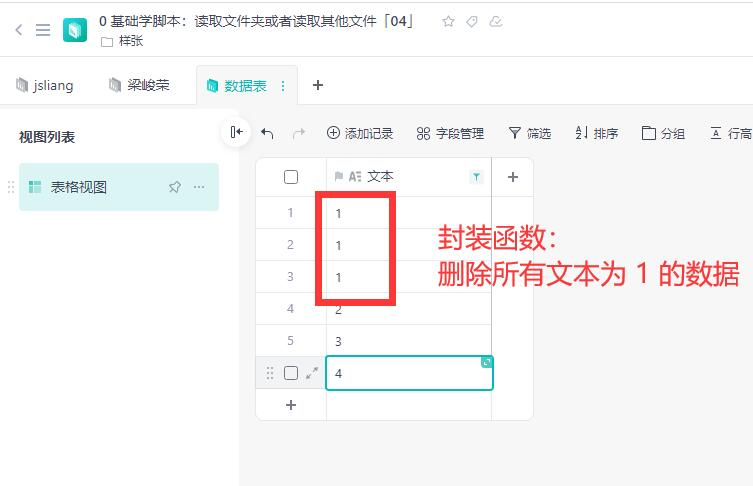

## 五、实例：合并地址信息

当我们 ~~吃喝piao赌~~ 增删改查样样精通之后，再看我们一些实例，你会发现它竟如此简单：

* 0 基础学脚本：合并地址信息「04」https://kdocs.cn/l/crMOLbPMBREJ

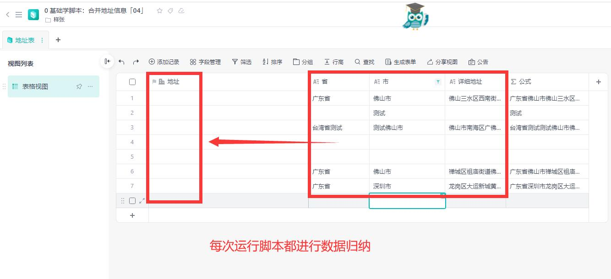

对于上面数据，用户不小心将【省】【市】以及【详细】信息进行了拆分。

而我们需要做的，就是点击脚本，将数据进行合并到【地址】字段上。

```js
function 获取指定表ID (指定表表名) {
  const 所有表数据 = Application.Sheet.GetSheets();

  let 指定表ID;
  for (let i = 0; i < 所有表数据.length; i++) {
    const 本次查询表信息 = 所有表数据[i];
    
    const 表名称 = 本次查询表信息.name;
    const 表ID = 本次查询表信息.id;

    if (表名称 === 指定表表名) {
      指定表ID = 表ID;
    }
  }

  return 指定表ID;
}

function 获取指定表的所有数据 (指定表ID) {
  let 所有信息 = [];

  let 下一条记录 = null;
  let start = 1;
  const 缓存JSAPI = Application.Record;
  while (start || 下一条记录) {
    start--;
    本次数据查询 = 缓存JSAPI.GetRecords({
      SheetId: 指定表ID,
      Offset: 下一条记录,
    });
    下一条记录 = 本次数据查询.offset;

    const 本次总数据 = 本次数据查询.records;
    所有信息 = [...所有信息, ...本次总数据];
  }

  return 所有信息;
}

const 地址表ID = 获取指定表ID('地址表');
const 地址表数据 = 获取指定表的所有数据(地址表ID);

// 遍历数据，读取数据并且将拼接的数据填写到【地址】字段
for (let 行数 = 0; 行数 < 地址表数据.length; 行数++) {
  const 当前行 = 地址表数据[行数];
  const 当前行信息 = 当前行.fields;
  
  const 当前行ID = 当前行.id;
  const 省 = 当前行信息["省"];
  const 市 = 当前行信息["市"];
  const 详细地址 = 当前行信息["详细地址"];

  // 逻辑 1：如果是空白行，跳过
  if (!省 || !市 || !详细地址) {
    continue;
  }

  // 逻辑 2：拼接数据
  const 地址字段数据 = {
    detail: 详细地址,
    districts: [省, 市],
  };

  // 逻辑 3：填写更新行数据
  Application.Record.UpdateRecords({
    SheetId: 地址表ID,
    Records: [{
      id: 当前行ID,
      fields: {
        地址: 地址字段数据,
      },
    }],
  })
}
```

## 六、实例：维护项目管理表

下面我们来到本篇文章的终极关卡：

* 项目管理表的维护及通过脚本管理员工和物资

它需要维护的逻辑如下所示：

> 【物资表】和【材料表】

规则 1：每天 17:00，将入库材料价格填写到当天入库材料中

（这里不能使用公式，因为材料表价格是波动的）

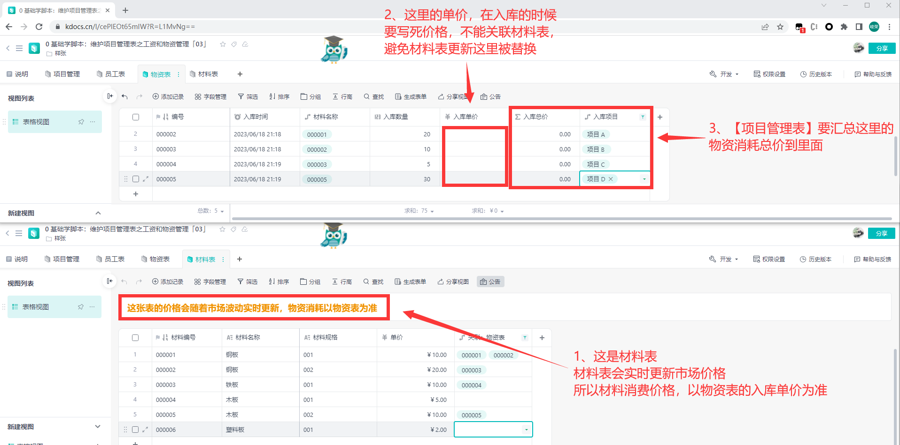

> 【项目管理表】和【员工表】

规则 2：需要根据【项目状态】，统计本次【物资损耗汇总】和【员工工资汇总】，并顺带更新【已结款】项目

（注意【项目状态】为完结推进员工表的【已结款】标记该项目）

规则 3：需要根据员工【关联：项目管理】和【已结款】字段，生成【未结款】字段

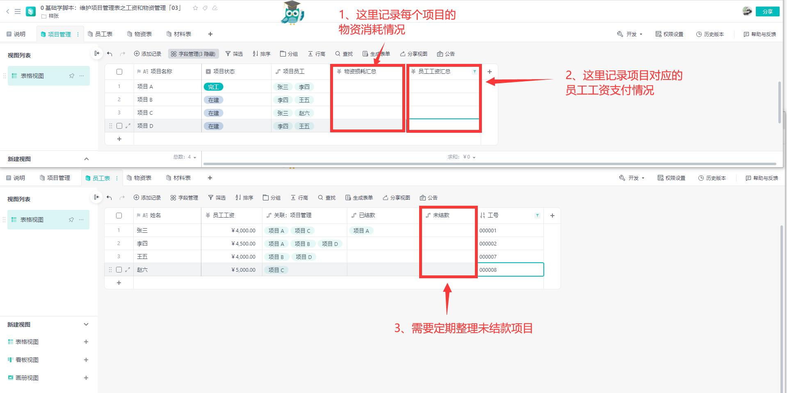

OK，下面我们开始操作脚本，实现这 3 条规则。

### 6.1 每天维护物资表信息

在我们的物资表中，我们的【入库单价】是需要根据当前价格，进行写死的。

所以，我们需要新增一个脚本，在每次执行的时候，将当天时间对应的【入库单价】进行填写，并汇总到【入库总价】上面。


因此，我们的代码应该是：

```js
function 获取年月日时分秒 (date = new Date()) {
  return {
    "年": date.getFullYear(),
    "月": date.getMonth() + 1,
    "日": date.getDate(),
    "时": date.getHours(),
    "分": date.getMinutes(),
    "秒": date.getSeconds(),
    "星期": date.getDay() === 0 ? 7 : date.getDay(),
  };
};

function 获取指定表ID (指定表表名) {
  const 所有表数据 = Application.Sheet.GetSheets();

  let 指定表ID;
  for (let i = 0; i < 所有表数据.length; i++) {
    const 本次查询表信息 = 所有表数据[i];
    
    const 表名称 = 本次查询表信息.name;
    const 表ID = 本次查询表信息.id;

    if (表名称 === 指定表表名) {
      指定表ID = 表ID;
    }
  }

  return 指定表ID;
}

function 获取指定表的所有数据 (指定表ID) {
  let 所有信息 = [];

  let 下一条记录 = null;
  let start = 1;
  const 缓存JSAPI = Application.Record;
  while (start || 下一条记录) {
    start--;
    本次数据查询 = 缓存JSAPI.GetRecords({
      SheetId: 指定表ID,
      Offset: 下一条记录,
    });
    下一条记录 = 本次数据查询.offset;

    const 本次总数据 = 本次数据查询.records;
    所有信息 = [...所有信息, ...本次总数据];
  }

  return 所有信息;
}

const 物资表ID = 获取指定表ID('物资表');
const 物资表数据 = 获取指定表的所有数据(物资表ID);

const 材料表ID = 获取指定表ID('材料表');
const 材料表数据 = 获取指定表的所有数据(材料表ID);

// 查找当天时间对应的数据
const { 年, 月, 日 } = 获取年月日时分秒();
const 当天时间 = String(年) + '/' + String(月).padStart(2, '0') + '/' + String(日).padStart(2, '0');

// 记录单价
for (let 行数 = 0; 行数 < 物资表数据.length; 行数++) {
  const 当前行信息 = 物资表数据[行数];
  const 当前行ID = 当前行信息.id;
  const 当前行数据 = 当前行信息.fields;

  // 如果不是当天入库，则不统计
  if (当前行数据['入库时间'] !== 当天时间) {
    continue;
  }

  // 如果当天已经更新【入库单价】，则不更新（避免重复更新）
  if (当前行数据['入库单价']) {
    continue;
  }

  // 材料名称关联是唯一的，所以取 [0] 即可
  const 材料名称对应的材料表行ID = 当前行数据['材料名称'][0];

  // 获取对应的材料信息
  const 材料信息 = Application.Record.GetRecord({ SheetId: 材料表ID, RecordId: 材料名称对应的材料表行ID });

  // 将材料表中的【单价】填写到物资表中的【入库单价】
  const 材料单价 = 材料信息.fields["单价"];
  Application.Record.UpdateRecords({
    SheetId: 物资表ID,
    Records: [{
      id: 当前行ID,
      fields: {
        "入库单价": 材料单价,
      }
    }],
  })
}
```

当然，如果你已经开通【自动化任务】，那么你可以定期执行次脚本，否则需要手动操作。

这个自动化的操作方式，我们下一期补充~

### 6.2 统计员工工资汇总和物料损耗汇总


在项目状态为【完工】的条件下，我们应该对【物资损耗汇总】和【员工工资汇总】进行统计，并顺带更新【员工表】中的【已结款】字段对应的项目：

```js
function 获取指定表ID(指定表表名) {
  const 所有表数据 = Application.Sheet.GetSheets();

  let 指定表ID;
  for (let i = 0; i < 所有表数据.length; i++) {
    const 本次查询表信息 = 所有表数据[i];

    const 表名称 = 本次查询表信息.name;
    const 表ID = 本次查询表信息.id;

    if (表名称 === 指定表表名) {
      指定表ID = 表ID;
    }
  }

  return 指定表ID;
}

function 获取指定表的所有数据(指定表ID) {
  let 所有信息 = [];

  let 下一条记录 = null;
  let start = 1;
  const 缓存JSAPI = Application.Record;
  while (start || 下一条记录) {
    start--;
    本次数据查询 = 缓存JSAPI.GetRecords({
      SheetId: 指定表ID,
      Offset: 下一条记录,
    });
    下一条记录 = 本次数据查询.offset;

    const 本次总数据 = 本次数据查询.records;
    所有信息 = [...所有信息, ...本次总数据];
  }

  return 所有信息;
}

const 项目管理表ID = 获取指定表ID('项目管理表');
const 项目管理表数据 = 获取指定表的所有数据(项目管理表ID);

const 员工表ID = 获取指定表ID('员工表');
const 员工表数据 = 获取指定表的所有数据(员工表ID);

const 物资表ID = 获取指定表ID('物资表');
const 物资表数据 = 获取指定表的所有数据(物资表ID);

// 步骤一：遍历项目管理表数据，查找完工状态数据
for (let 行数 = 0; 行数 < 项目管理表数据.length; 行数++) {
  const 当前行信息 = 项目管理表数据[行数];
  const 当前行数据 = 当前行信息.fields;
  const 当前行ID = 当前行信息.id;

  // 步骤二：只有完工的才进行统计
  const 项目状态 = 当前行数据["项目状态"];
  if (项目状态 === '完工') {
    
    // 步骤三：统计员工工资
    let 员工工资汇总 = 0;

    // 步骤四：查找员工表，更新【已结款】项目
    for (let 员工表行数 = 0; 员工表行数 < 员工表数据.length; 员工表行数++) {
      const 员工表行信息 = 员工表数据[员工表行数];
      const 员工表行数据 = 员工表行信息.fields;
      const 员工表行ID = 员工表行信息.id;
      const 员工项目关联 = 员工表行数据["关联：项目管理表"];

      // 步骤 4.1：如果包含关联信息，则进行更新【已结款】
      if (员工项目关联.includes(当前行ID)) {
        const 已结款项目 = 员工表行数据["已结款"];
        已结款项目.push(当前行ID);
        Application.Record.UpdateRecords({
          SheetId: 员工表ID,
          Records: [{
            id: 员工表行ID,
            fields: {
              "已结款": 已结款项目,
            }
          }],
        });

        // 步骤 3.1：统计本项目中员工工资
        const 当前员工工资 = 员工表行数据["员工工资"];
        员工工资汇总 += 当前员工工资;
      }
    }

    // 步骤 3.2：归纳员工总工资
    Application.Record.UpdateRecords({
      SheetId: 项目管理表ID,
      Records: [{
        id: 当前行ID,
        fields: {
          "员工工资汇总": 员工工资汇总
        }
      }],
    });

    // 步骤五：查找物资表，进行【物资损耗汇总】
    let 物资损耗汇总 = 0;
    for (let 物资表行数 = 0; 物资表行数 < 物资表数据.length; 物资表行数++) {
      const 物资表行信息 = 物资表数据[物资表行数];
      const 物资表行数据 = 物资表行信息.fields;
      const 入库项目关联 = 物资表行数据["入库项目"];

      // 步骤 5.1：如果包含关联信息，则获取入库总价
      if (入库项目关联.includes(当前行ID)) {
        const 入库总价 = 物资表行数据['入库总价'];
        物资损耗汇总 += Number(入库总价);
      }
    }

    // 步骤 5.2：归纳员工总工资
    Application.Record.UpdateRecords({
      SheetId: 项目管理表ID,
      Records: [{
        id: 当前行ID,
        fields: {
          "物资损耗汇总": 物资损耗汇总
        }
      }],
    });
  }
}
```

### 6.3 统计员工未结款项目


在上图的第 3 步中，我们的【未结款】字段，需要定期整理未结款项目，所以需要编写脚本：

> 注：这里的【已结款】在 6.2 中已自动统计

```js
function 获取指定表ID (指定表表名) {
  const 所有表数据 = Application.Sheet.GetSheets();

  let 指定表ID;
  for (let i = 0; i < 所有表数据.length; i++) {
    const 本次查询表信息 = 所有表数据[i];
    
    const 表名称 = 本次查询表信息.name;
    const 表ID = 本次查询表信息.id;

    if (表名称 === 指定表表名) {
      指定表ID = 表ID;
    }
  }

  return 指定表ID;
}

function 获取指定表的所有数据 (指定表ID) {
  let 所有信息 = [];

  let 下一条记录 = null;
  let start = 1;
  const 缓存JSAPI = Application.Record;
  while (start || 下一条记录) {
    start--;
    本次数据查询 = 缓存JSAPI.GetRecords({
      SheetId: 指定表ID,
      Offset: 下一条记录,
    });
    下一条记录 = 本次数据查询.offset;

    const 本次总数据 = 本次数据查询.records;
    所有信息 = [...所有信息, ...本次总数据];
  }

  return 所有信息;
}

const 员工表ID = 获取指定表ID('员工表');
const 员工表数据 = 获取指定表的所有数据(员工表ID);
// console.log('员工表数据: ', 员工表数据);

for (let 行数 = 0; 行数 < 员工表数据.length; 行数++) {
  const 当前行信息 = 员工表数据[行数];
  const 当前行数据 = 当前行信息.fields;
  const 当前行ID = 当前行信息.id;

  const 参与的项目 = 当前行数据['关联：项目管理表'];
  // 如果没有填写【已结款】，那么它是 undefiend，我们需要改成 [] 空数据
  // 从而保证数据的正确性（因为 undefined 没有 includes 内置函数）
  const 完结项目 = 当前行数据['已结款'] || [];
  const 未完结项目 = [];

  // 遍历数据，查找未完结项目的 ID 集合
  for (let 参与项目序号 = 0; 参与项目序号 < 参与的项目.length; 参与项目序号++) {
    const 当前项目编号 = 参与的项目[参与项目序号];
    if (!完结项目.includes(当前项目编号)) {
      未完结项目.push(当前项目编号);
    }
  }
  // console.log('未完结项目: ', 未完结项目);

  // 更新未完结项目
  Application.Record.UpdateRecords({
    SheetId: 员工表ID,
    Records: [{
      id: 当前行ID,
      fields: {
        "未结款": 未完结项目,
      }
    }],
  })
}
```

OK，到这里这个实例就大功告成啦！

## 七、总结

感谢小伙伴们每一次赞赏、点赞和转发，这都是我更新的动力，非常感谢！

* 【如果】你有更多的想法，可以帮助你完善你的项目/需求/业务。

但是，你担心自己写不出来。

那么，来找 **jsliang** 吧~

* 【如果】你对于学习脚本过程中，碰到一些问题。

然后，你无法解决。

那么，来找 **jsliang** 吧！

* 联系方式：

> WX: Liang123Gogo

我们，下期再见~

---

**不折腾的前端，和咸鱼有什么区别！**

觉得文章不错的小伙伴欢迎点赞/点 Star。

如果小伙伴需要联系 **jsliang**：

* [Github](https://github.com/LiangJunrong/document-library)
* [掘金](https://juejin.im/user/3403743728515246)

个人联系方式存放在 Github 首页，欢迎一起折腾~

争取打造自己成为一个充满探索欲，喜欢折腾，乐于扩展自己知识面的终身学习斜杠程序员。

> jsliang 的文档库由 [梁峻荣](https://github.com/LiangJunrong) 采用 [知识共享 署名-非商业性使用-相同方式共享 4.0 国际 许可协议](http://creativecommons.org/licenses/by-nc-sa/4.0/) 进行许可。<br/>基于 [https://github.com/LiangJunrong/document-library](https://github.com/LiangJunrong/document-library) 上的作品创作。<br/>本许可协议授权之外的使用权限可以从 [https://creativecommons.org/licenses/by-nc-sa/2.5/cn/](https://creativecommons.org/licenses/by-nc-sa/2.5/cn/) 处获得。
